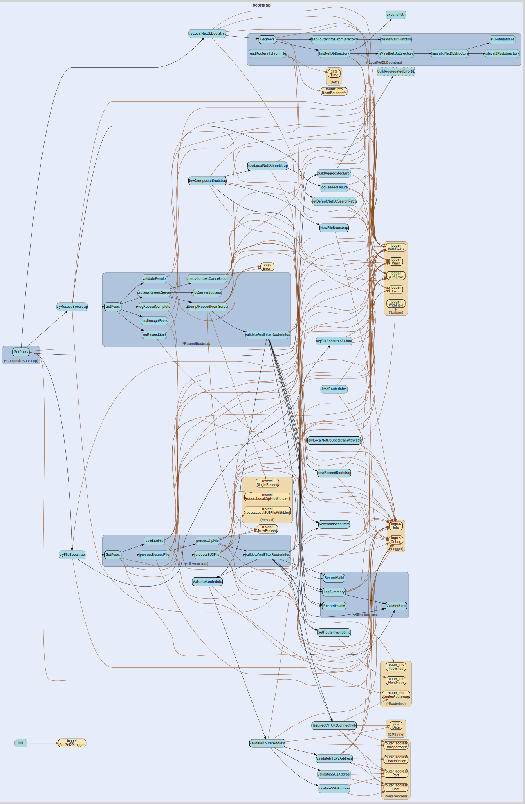

# bootstrap
--
    import "github.com/go-i2p/go-i2p/lib/bootstrap"



provides generic interfaces for initial bootstrap into network and network
### reseeding

## Usage

#### type Bootstrap

```go
type Bootstrap interface {
	// get more peers for bootstrap
	// try obtaining at most n router infos
	// if n is 0 then try obtaining as many router infos as possible
	// returns nil and error if we cannot fetch ANY router infos
	// returns a slice of router infos containing n or fewer router infos
	GetPeers(ctx context.Context, n int) ([]router_info.RouterInfo, error)
}
```

interface defining a way to bootstrap into the i2p network

#### type ReseedBootstrap

```go
type ReseedBootstrap struct {
}
```

ReseedBootstrap implements the Bootstrap interface using HTTP reseeding

#### func  NewReseedBootstrap

```go
func NewReseedBootstrap(config *config.BootstrapConfig) *ReseedBootstrap
```
NewReseedBootstrap creates a new reseeder with the provided configuration

#### func (*ReseedBootstrap) GetPeers

```go
func (rb *ReseedBootstrap) GetPeers(ctx context.Context, n int) ([]router_info.RouterInfo, error)
```
GetPeers implements the Bootstrap interface by obtaining RouterInfos from
configured reseed servers


bootstrap 

github.com/go-i2p/go-i2p/lib/bootstrap

[go-i2p template file](/template.md)
