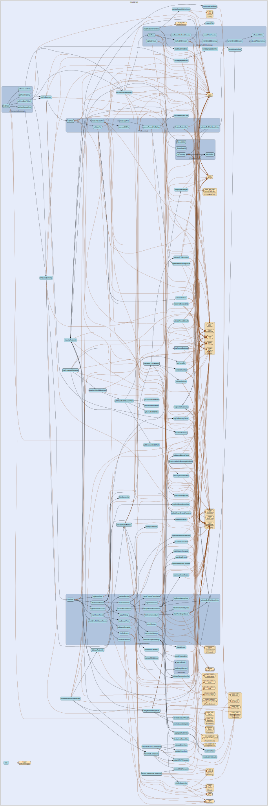

# bootstrap
--
    import "github.com/go-i2p/go-i2p/lib/bootstrap"



provides generic interfaces for initial bootstrap into network and network
### reseeding

# RouterInfo Validation

The bootstrap package performs comprehensive validation on all RouterInfo
entries obtained from reseed servers, local files, or netDb directories. This
validation ensures that only well-formed, usable peer information enters the
router's network database.

# Validation Checks Performed

RouterInfo Level:

    - At least one valid RouterAddress must be present
    - RouterInfo structure must be parseable

RouterAddress Level:

    - Transport style field must be non-empty and valid
    - Transport-specific validation applies based on style:
    - NTCP2: Requires host, port, s (static key), and v (protocol version) keys
    - SSU: Requires host, port, and key keys
    - SSU2: Requires host, port, s (static key), and i (intro key) keys
    - Host must be a valid IPv4 or IPv6 address
    - Port must be in valid range (1-65535)

# Validation Error Reporting

Validation functions return detailed error messages describing why a RouterInfo
or RouterAddress failed validation:

    - ValidateRouterInfo(): Returns "no valid router addresses found" with the last address validation error
    - ValidateRouterAddress(): Returns specific errors like "missing required NTCP2 key: s" or "invalid port number"
    - ValidateNTCP2Address(): Checks NTCP2-specific requirements (static key, version, host/port)

# Validation Statistics

The ValidationStats type tracks validation metrics during bootstrap:

    - Total RouterInfos processed
    - Valid vs invalid counts
    - Breakdown of invalid reasons (e.g., "missing NTCP2 static key", "introducer-only address")
    - Validity rate percentage

Use ValidationStats.LogSummary() to output validation statistics for debugging
reseed quality issues.

## Usage

#### func  GetRouterHashString

```go
func GetRouterHashString(ri router_info.RouterInfo) string
```
GetRouterHashString returns a hex string representation of the RouterInfo's
IdentHash This is a helper function to avoid duplication in logging

#### func  HasDirectConnectivity

```go
func HasDirectConnectivity(ri router_info.RouterInfo) bool
```
HasDirectConnectivity checks if a RouterInfo has at least one address (NTCP2 or
SSU2) with direct connectivity (host and port present, not introducer-only).
This is a broader check than HasDirectNTCP2Connectivity that also accepts
SSU2-only routers, which are valid directly connectable peers.

#### func  HasDirectNTCP2Connectivity

```go
func HasDirectNTCP2Connectivity(ri router_info.RouterInfo) bool
```
HasDirectNTCP2Connectivity checks if a RouterInfo has at least one NTCP2 address
with direct connectivity (host and port keys present, not introducer-only). This
pre-filtering function prevents ERROR logs from the common package when
attempting to extract host keys from introducer-only addresses.

CRITICAL FIX #1: Pre-filter bootstrap peers before validation to prevent
"RouterAddress missing required host key" errors for introducer-only addresses.

#### func  ValidateNTCP2Address

```go
func ValidateNTCP2Address(addr *router_address.RouterAddress) error
```
ValidateNTCP2Address validates NTCP2-specific requirements

#### func  ValidateRouterAddress

```go
func ValidateRouterAddress(addr *router_address.RouterAddress) error
```
ValidateRouterAddress validates a single RouterAddress Returns nil if valid,
otherwise returns an error describing the validation failure

#### func  ValidateRouterInfo

```go
func ValidateRouterInfo(ri router_info.RouterInfo) error
```
ValidateRouterInfo performs comprehensive validation on a RouterInfo Returns nil
if valid, otherwise returns an error describing the validation failure

#### func  VerifyRouterInfoSignature

```go
func VerifyRouterInfoSignature(ri router_info.RouterInfo) error
```
VerifyRouterInfoSignature cryptographically verifies that a RouterInfo's
signature is valid by checking it against the signing public key embedded in the
RouterIdentity.

The verification process:

    1. Serialize the RouterInfo to bytes (which includes the signature at the end)
    2. Determine the signature size from the RouterIdentity's key certificate
    3. Split the serialized bytes into data (without signature) and signature
    4. Create a verifier from the signing public key
    5. Verify the signature against the data

This prevents accepting RouterInfos with forged identity hashes from compromised
reseed servers, which is critical for bootstrap trust.

#### type Bootstrap

```go
type Bootstrap interface {
	// get more peers for bootstrap
	// try obtaining at most n router infos
	// if n is 0 then try obtaining as many router infos as possible
	// returns nil and error if we cannot fetch ANY router infos
	// returns a slice of router infos containing n or fewer router infos
	GetPeers(ctx context.Context, n int) ([]router_info.RouterInfo, error)
}
```

interface defining a way to bootstrap into the i2p network

#### type CompositeBootstrap

```go
type CompositeBootstrap struct {
}
```

CompositeBootstrap implements the Bootstrap interface by trying multiple
bootstrap methods in sequence: 1. Local reseed file (if specified) - highest
priority 2. Remote reseed servers 3. Local netDb directories - fallback

#### func  NewCompositeBootstrap

```go
func NewCompositeBootstrap(cfg *config.BootstrapConfig) *CompositeBootstrap
```
NewCompositeBootstrap creates a new composite bootstrap with file, reseed, and
local netDb fallback

#### func (*CompositeBootstrap) GetPeers

```go
func (cb *CompositeBootstrap) GetPeers(ctx context.Context, n int) ([]router_info.RouterInfo, error)
```
GetPeers implements the Bootstrap interface. When BootstrapType is "auto"
(default), it tries all methods in sequence: file → reseed → local netDb. When
set to a specific type ("file", "reseed", "local"), only that method is used.
This allows users in air-gapped environments to prevent remote reseed
connections, or to force a specific bootstrap strategy.

#### type FileBootstrap

```go
type FileBootstrap struct {
}
```

FileBootstrap implements the Bootstrap interface using a local zip or su3 file

#### func  NewFileBootstrap

```go
func NewFileBootstrap(filePath string) *FileBootstrap
```
NewFileBootstrap creates a new file bootstrap with the provided file path

#### func (*FileBootstrap) GetPeers

```go
func (fb *FileBootstrap) GetPeers(ctx context.Context, n int) ([]router_info.RouterInfo, error)
```
GetPeers implements the Bootstrap interface by reading RouterInfos from a local
file

#### type LocalNetDbBootstrap

```go
type LocalNetDbBootstrap struct {
}
```

LocalNetDbBootstrap implements the Bootstrap interface by reading RouterInfos
from a local netDb directory (Java I2P or i2pd compatible)

#### func  NewLocalNetDbBootstrap

```go
func NewLocalNetDbBootstrap(cfg *config.BootstrapConfig) *LocalNetDbBootstrap
```
NewLocalNetDbBootstrap creates a new local netDb bootstrap with default search
paths

#### func  NewLocalNetDbBootstrapWithPaths

```go
func NewLocalNetDbBootstrapWithPaths(paths []string) *LocalNetDbBootstrap
```
NewLocalNetDbBootstrapWithPaths creates a new local netDb bootstrap with custom
paths

#### func (*LocalNetDbBootstrap) GetPeers

```go
func (lb *LocalNetDbBootstrap) GetPeers(ctx context.Context, n int) ([]router_info.RouterInfo, error)
```
GetPeers implements the Bootstrap interface by reading RouterInfos from local
netDb

#### type ReseedBootstrap

```go
type ReseedBootstrap struct {
}
```

ReseedBootstrap implements the Bootstrap interface using HTTP reseeding

#### func  NewReseedBootstrap

```go
func NewReseedBootstrap(config *config.BootstrapConfig) *ReseedBootstrap
```
NewReseedBootstrap creates a new reseeder with the provided configuration

#### func (*ReseedBootstrap) GetPeers

```go
func (rb *ReseedBootstrap) GetPeers(ctx context.Context, n int) ([]router_info.RouterInfo, error)
```
GetPeers implements the Bootstrap interface by obtaining RouterInfos from
configured reseed servers.

When MinReseedServers > 1 and enough servers are configured, it uses
MultiServerReseed for concurrent fetching with strategy-based result
combination. This matches Java I2P's security model requiring multiple server
confirmation.

Falls back to sequential single-server mode if multi-server reseed fails or when
MinReseedServers == 1.

#### func (*ReseedBootstrap) MultiServerReseed

```go
func (rb *ReseedBootstrap) MultiServerReseed(ctx context.Context, n int) ([]router_info.RouterInfo, error)
```
MultiServerReseed fetches RouterInfos from multiple servers concurrently and
applies the configured strategy to combine results. It requires at least
MinReseedServers successful responses.

#### type ReseedResult

```go
type ReseedResult struct {
	// ServerURL is the URL of the reseed server
	ServerURL string
	// RouterInfos contains the successfully retrieved and validated RouterInfos
	RouterInfos []router_info.RouterInfo
	// Error contains any error that occurred during the fetch
	Error error
	// Duration is how long the fetch took
	Duration time.Duration
}
```

ReseedResult holds the result from a single reseed server fetch operation.

#### type ValidationStats

```go
type ValidationStats struct {
	TotalProcessed     int
	ValidRouterInfos   int
	InvalidRouterInfos int
	InvalidReasons     map[string]int
}
```

ValidationStats tracks statistics about RouterInfo validation during bootstrap

#### func  NewValidationStats

```go
func NewValidationStats() *ValidationStats
```
NewValidationStats creates a new ValidationStats instance

#### func (*ValidationStats) LogSummary

```go
func (vs *ValidationStats) LogSummary(phase string)
```
LogSummary logs a summary of the validation statistics

#### func (*ValidationStats) RecordInvalid

```go
func (vs *ValidationStats) RecordInvalid(reason string)
```
RecordInvalid increments the invalid RouterInfo count and tracks the reason

#### func (*ValidationStats) RecordValid

```go
func (vs *ValidationStats) RecordValid()
```
RecordValid increments the valid RouterInfo count

#### func (*ValidationStats) ValidityRate

```go
func (vs *ValidationStats) ValidityRate() float64
```
ValidityRate returns the percentage of valid RouterInfos


bootstrap 

github.com/go-i2p/go-i2p/lib/bootstrap

[go-i2p template file](/template.md)
