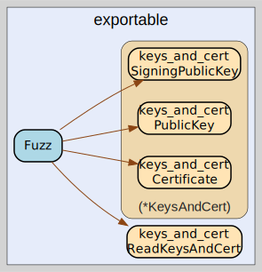

# exportable
--
    import "github.com/go-i2p/go-i2p/lib/common/fuzz/keys_and_cert"




## Usage

#### func  Fuzz

```go
func Fuzz(data []byte) int
```


exportable 

github.com/go-i2p/go-i2p/lib/common/fuzz/keys_and_cert

[go-i2p template file](/template.md)
