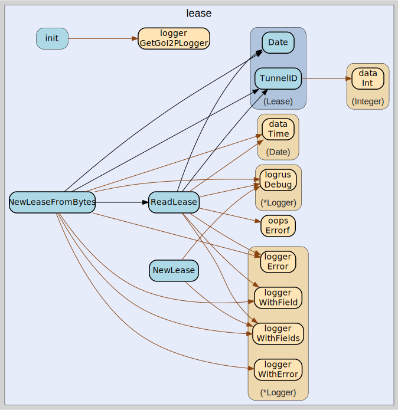

# lease
--
    import "github.com/go-i2p/go-i2p/lib/common/lease"



Package lease implements the I2P lease common data structure

## Usage

```go
const (
	LEASE_SIZE           = 44
	LEASE_TUNNEL_GW_SIZE = 32
	LEASE_TUNNEL_ID_SIZE = 4
)
```
Sizes in bytes of various components of a Lease

#### type Lease

```go
type Lease [LEASE_SIZE]byte
```


#### func  NewLease

```go
func NewLease(tunnelGateway Hash, tunnelID uint32, expirationTime time.Time) (*Lease, error)
```
NewLease creates a new Lease with the provided parameters.

#### func  NewLeaseFromBytes

```go
func NewLeaseFromBytes(data []byte) (lease *Lease, remainder []byte, err error)
```
NewLeaseFromBytes creates a new *Lease from []byte using ReadLease. Returns a
pointer to Lease unlike ReadLease.

#### func  ReadLease

```go
func ReadLease(data []byte) (lease Lease, remainder []byte, err error)
```
ReadLease returns Lease from a []byte. The remaining bytes after the specified
length are also returned. Returns a list of errors that occurred during parsing.

#### func (Lease) Date

```go
func (lease Lease) Date() (date Date)
```
Date returns the date as an I2P Date.

#### func (Lease) TunnelGateway

```go
func (lease Lease) TunnelGateway() (hash Hash)
```
TunnelGateway returns the tunnel gateway as a Hash.

#### func (Lease) TunnelID

```go
func (lease Lease) TunnelID() uint32
```
TunnelID returns the tunnel id as a uint23.


lease 

github.com/go-i2p/go-i2p/lib/common/lease
