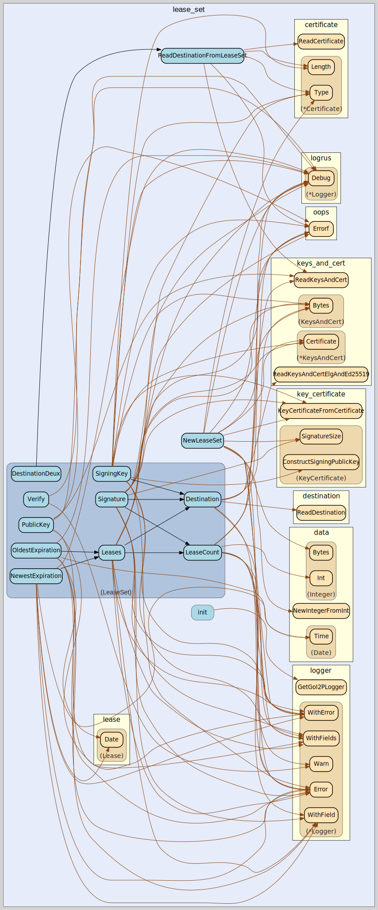

# lease_set
--
    import "github.com/go-i2p/go-i2p/lib/common/lease_set"



Package lease_set implements the I2P LeastSet common data structure

## Usage

```go
const (
	LEASE_SET_PUBKEY_SIZE = 256
	LEASE_SET_SPK_SIZE    = 128
	LEASE_SET_SIG_SIZE    = 40
)
```
Sizes of various structures in an I2P LeaseSet

#### func  ReadDestinationFromLeaseSet

```go
func ReadDestinationFromLeaseSet(data []byte) (dest destination.Destination, remainder []byte, err error)
```

#### type LeaseSet

```go
type LeaseSet []byte
```

LeaseSet is the represenation of an I2P LeaseSet.

https://geti2p.net/spec/common-structures#leaseset

#### func  NewLeaseSet

```go
func NewLeaseSet(
	dest destination.Destination,
	encryptionKey types.RecievingPublicKey,
	signingKey types.SigningPublicKey,
	leases []lease.Lease,
	signingPrivateKey types.SigningPrivateKey,
) (LeaseSet, error)
```

#### func (LeaseSet) Destination

```go
func (lease_set LeaseSet) Destination() (dest destination.Destination, err error)
```
Destination returns the Destination as []byte.

#### func (LeaseSet) DestinationDeux

```go
func (lease_set LeaseSet) DestinationDeux() (dest destination.Destination, err error)
```

#### func (LeaseSet) LeaseCount

```go
func (lease_set LeaseSet) LeaseCount() (count int, err error)
```
LeaseCount returns the numbert of leases specified by the LeaseCount value as
int. returns errors encountered during parsing.

#### func (LeaseSet) Leases

```go
func (lease_set LeaseSet) Leases() (leases []lease.Lease, err error)
```
Leases returns the leases as []Lease. returns errors encountered during parsing.

#### func (LeaseSet) NewestExpiration

```go
func (lease_set LeaseSet) NewestExpiration() (newest data.Date, err error)
```
NewestExpiration returns the newest lease expiration as an I2P Date. Returns
errors encountered during parsing.

#### func (LeaseSet) OldestExpiration

```go
func (lease_set LeaseSet) OldestExpiration() (earliest data.Date, err error)
```
OldestExpiration returns the oldest lease expiration as an I2P Date. Returns
errors encountered during parsing.

#### func (LeaseSet) PublicKey

```go
func (lease_set LeaseSet) PublicKey() (public_key elgamal.ElgPublicKey, err error)
```
PublicKey returns the public key as crypto.ElgPublicKey. Returns errors
encountered during parsing.

#### func (LeaseSet) Signature

```go
func (lease_set LeaseSet) Signature() (signature signature.Signature, err error)
```
Signature returns the signature as Signature. returns errors encountered during
parsing.

#### func (LeaseSet) SigningKey

```go
func (lease_set LeaseSet) SigningKey() (signing_public_key types.SigningPublicKey, err error)
```
SigningKey returns the signing public key as crypto.SigningPublicKey. returns
errors encountered during parsing.

#### func (LeaseSet) Verify

```go
func (lease_set LeaseSet) Verify() error
```
Verify returns nil


lease_set 

github.com/go-i2p/go-i2p/lib/common/lease_set
