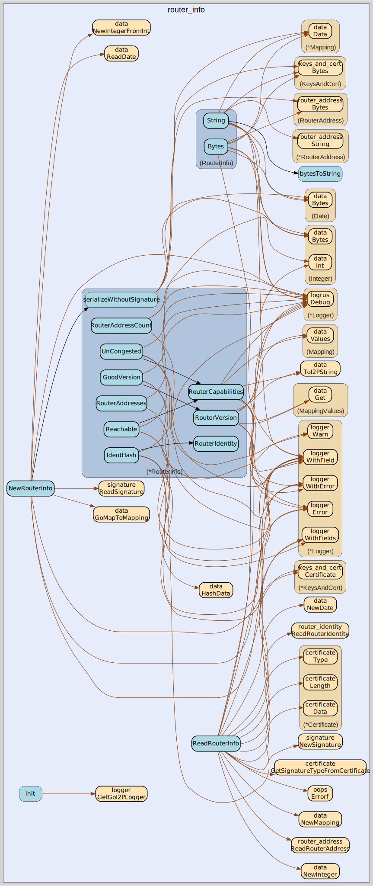

# router_info
--
    import "github.com/go-i2p/go-i2p/lib/common/router_info"



Package router_info implements the I2P RouterInfo common data structure

## Usage

```go
const (
	MIN_GOOD_VERSION = 58
	MAX_GOOD_VERSION = 99
)
```

```go
const ROUTER_INFO_MIN_SIZE = 439
```

#### type RouterInfo

```go
type RouterInfo struct {
}
```

RouterInfo is the represenation of an I2P RouterInfo.

https://geti2p.net/spec/common-structures#routerinfo

#### func  NewRouterInfo

```go
func NewRouterInfo(
	routerIdentity *RouterIdentity,
	publishedTime time.Time,
	addresses []*RouterAddress,
	options map[string]string,
	signingPrivateKey types.SigningPrivateKey,
	sigType int,
) (*RouterInfo, error)
```

#### func  OwnedRouterInfo

```go
func OwnedRouterInfo(keyCertificate key_certificate.KeyCertificate) *RouterInfo
```

#### func  ReadRouterInfo

```go
func ReadRouterInfo(bytes []byte) (info RouterInfo, remainder []byte, err error)
```
ReadRouterInfo returns RouterInfo from a []byte. The remaining bytes after the
specified length are also returned. Returns a list of errors that occurred
during parsing.

#### func (*RouterInfo) AddAddress

```go
func (router_info *RouterInfo) AddAddress(address *RouterAddress)
```

#### func (RouterInfo) Bytes

```go
func (router_info RouterInfo) Bytes() (bytes []byte, err error)
```
Bytes returns the RouterInfo as a []byte suitable for writing to a stream.

#### func (*RouterInfo) GoodVersion

```go
func (router_info *RouterInfo) GoodVersion() bool
```

#### func (*RouterInfo) IdentHash

```go
func (router_info *RouterInfo) IdentHash() Hash
```
IndentHash returns the identity hash (sha256 sum) for this RouterInfo.

#### func (RouterInfo) Network

```go
func (router_info RouterInfo) Network() string
```
Network implements net.Addr

#### func (RouterInfo) Options

```go
func (router_info RouterInfo) Options() (mapping Mapping)
```
Options returns the options for this RouterInfo as an I2P Mapping.

#### func (*RouterInfo) PeerSize

```go
func (router_info *RouterInfo) PeerSize() int
```
PeerSize returns the peer size as a Go integer.

#### func (*RouterInfo) Published

```go
func (router_info *RouterInfo) Published() *Date
```
Published returns the date this RouterInfo was published as an I2P Date.

#### func (*RouterInfo) Reachable

```go
func (router_info *RouterInfo) Reachable() bool
```

#### func (*RouterInfo) RouterAddressCount

```go
func (router_info *RouterInfo) RouterAddressCount() int
```
RouterAddressCount returns the count of RouterAddress in this RouterInfo as a Go
integer.

#### func (*RouterInfo) RouterAddresses

```go
func (router_info *RouterInfo) RouterAddresses() []*RouterAddress
```
RouterAddresses returns all RouterAddresses for this RouterInfo as
[]*RouterAddress.

#### func (*RouterInfo) RouterCapabilities

```go
func (router_info *RouterInfo) RouterCapabilities() string
```

#### func (*RouterInfo) RouterIdentity

```go
func (router_info *RouterInfo) RouterIdentity() *RouterIdentity
```
RouterIdentity returns the router identity as *RouterIdentity.

#### func (*RouterInfo) RouterVersion

```go
func (router_info *RouterInfo) RouterVersion() string
```

#### func (RouterInfo) Signature

```go
func (router_info RouterInfo) Signature() (signature Signature)
```
Signature returns the signature for this RouterInfo as an I2P Signature.

#### func (RouterInfo) String

```go
func (router_info RouterInfo) String() string
```

#### func (*RouterInfo) UnCongested

```go
func (router_info *RouterInfo) UnCongested() bool
```


router_info 

github.com/go-i2p/go-i2p/lib/common/router_info

[go-i2p template file](/template.md)
