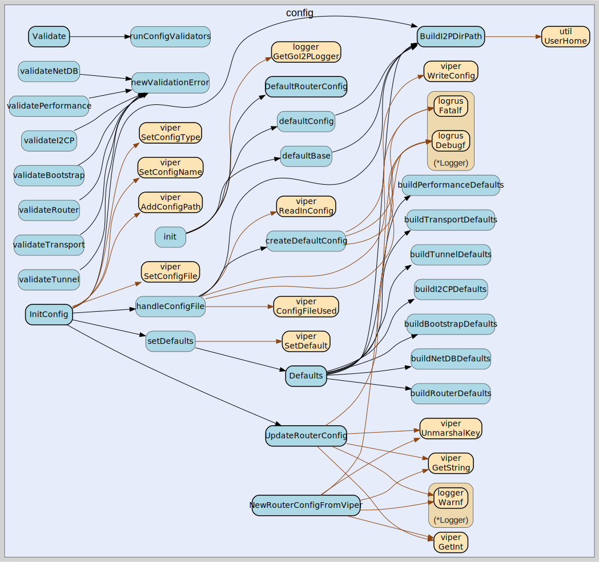

# config
--
    import "github.com/go-i2p/go-i2p/lib/config"




## Usage

### Configuration Directories

**BaseDir** vs **WorkingDir**: This router uses two separate directory paths to distinguish between read-only system defaults and mutable runtime state:

- **BaseDir**: Contains read-only default configuration files that ship with the system. These files provide fallback values and should not be modified during runtime. When you want to customize the configuration, copy the relevant files from BaseDir to WorkingDir and edit them there.
  - Default location: `$HOME/.go-i2p/base`
  - Purpose: System-wide defaults, pristine copies of configuration templates
  - Examples: Default router.config, reseed certificates, bootstrap RouterInfo

- **WorkingDir**: Contains runtime-modifiable configuration files and state. The router reads from WorkingDir first, falling back to BaseDir if a file doesn't exist. All runtime changes (e.g., adding peers, updating configuration) are written here.
  - Default location: `$HOME/.go-i2p/config`
  - Purpose: User customizations, runtime state, active NetDB
  - Examples: Custom router.config overrides, netDb directory, active LeaseSet cache

**Usage Pattern**: To customize a configuration option, copy the file from BaseDir to WorkingDir, then edit the copy in WorkingDir. The router will automatically prefer the WorkingDir version while preserving the BaseDir original.

```go
const DefaultI2CPPort = 7654
```
DefaultI2CPPort is the standard I2CP port

```go
const DefaultI2PControlPort = 7650
```
DefaultI2PControlPort is the standard I2PControl RPC port As defined in the
I2PControl specification

```go
const GOI2P_BASE_DIR = ".go-i2p"
```

```go
var CfgFile string
```

```go
var DefaultBootstrapConfig = BootstrapConfig{
	LowPeerThreshold: 10,
	BootstrapType:    "auto",
	ReseedFilePath:   "",

	ReseedServers: []*ReseedConfig{
		{
			Url:            "https://reseed.i2pgit.org/",
			SU3Fingerprint: "hankhill19580_at_gmail.com.crt",
		},
	},

	LocalNetDbPaths: []string{},
}
```
default configuration for network bootstrap Note: Reseed servers should be
configured via config file. Only reseed.i2pgit.org is included by default as it
is maintained by the go-i2p dev team. Additional reseed servers from the I2P
network can be added via configuration.

```go
var DefaultI2CPConfig = I2CPConfig{
	Enabled:     true,
	Address:     fmt.Sprintf("localhost:%d", DefaultI2CPPort),
	Network:     "tcp",
	MaxSessions: 100,
}
```
DefaultI2CPConfig provides default I2CP server configuration

```go
var DefaultI2PControlConfig = I2PControlConfig{
	Enabled:         true,
	Address:         "localhost:7650",
	Password:        "itoopie",
	UseHTTPS:        false,
	CertFile:        "",
	KeyFile:         "",
	TokenExpiration: 10 * time.Minute,
}
```
DefaultI2PControlConfig provides sensible defaults for I2PControl server. These
defaults prioritize development convenience: - Enabled by default for
development and monitoring - Localhost-only binding (not exposed to network) -
HTTP only (HTTPS requires explicit cert configuration) - Standard I2PControl
port (7650) - Standard default password (should be changed in production)

```go
var DefaultNetDbConfig = NetDbConfig{
	Path: filepath.Join(defaultConfig(), "netDb"),
}
```
default settings for netdb

```go
var RouterConfigProperties = DefaultRouterConfig()
```
RouterConfigProperties is a global mutable configuration object DEPRECATED: This
global variable is mutated by UpdateRouterConfig() creating hidden dependencies
and making testing difficult. Use NewRouterConfigFromViper() instead to get a
fresh config object without global state issues.

#### func  BuildI2PDirPath

```go
func BuildI2PDirPath() string
```

#### func  InitConfig

```go
func InitConfig()
```

#### func  UpdateRouterConfig

```go
func UpdateRouterConfig()
```
UpdateRouterConfig updates the global RouterConfigProperties from viper settings
DEPRECATED: Use NewRouterConfigFromViper() instead to avoid global state
mutation

#### func  Validate

```go
func Validate(cfg ConfigDefaults) error
```
Validate checks if the provided configuration values are reasonable. Returns an
error describing the first invalid value found.

#### type BootstrapConfig

```go
type BootstrapConfig struct {
	// LowPeerThreshold defines the minimum number of known peers before reseeding.
	// If the router has fewer peers than this threshold, it will attempt to reseed.
	LowPeerThreshold int
	// BootstrapType specifies which bootstrap method to use exclusively.
	// Valid values: "auto" (default, tries all methods), "file", "reseed", "local"
	// When set to a specific type, only that method will be used.
	BootstrapType string
	// ReseedFilePath specifies a local reseed file (zip or su3 format).
	// If set, this takes priority over remote reseed servers.
	ReseedFilePath string
	// ReseedServers is the list of remote reseed servers to contact.
	// Only one default server is included; additional servers should be configured via config file.
	ReseedServers []*ReseedConfig
	// LocalNetDbPaths lists directories to search for existing RouterInfo files.
	// Supports Java I2P and i2pd netDb directory formats.
	// These paths are populated at runtime based on the operating system.
	LocalNetDbPaths []string
}
```

BootstrapConfig configures how the router obtains initial peer information to
join the I2P network. It supports multiple bootstrap methods including remote
reseed servers, local reseed files, and existing netDb directories.

#### type BootstrapDefaults

```go
type BootstrapDefaults struct {
	// LowPeerThreshold triggers reseeding when peer count falls below this
	// Default: 10 peers
	LowPeerThreshold int

	// BootstrapType specifies which bootstrap method to use
	// Valid values: "auto", "file", "reseed", "local"
	// Default: "auto" (tries all methods)
	BootstrapType string

	// ReseedTimeout is maximum time to wait for reseed operations
	// Default: 60 seconds
	ReseedTimeout time.Duration

	// MinimumReseedPeers is minimum peers to get from reseed
	// Default: 50 peers
	MinimumReseedPeers int

	// ReseedRetryInterval is time between reseed attempts
	// Default: 5 minutes
	ReseedRetryInterval time.Duration

	// ReseedServers are the default reseed server configurations
	// Only reseed.i2pgit.org is included by default (maintained by go-i2p dev team)
	// Additional reseed servers should be configured via config file
	ReseedServers []*ReseedConfig
}
```

BootstrapDefaults contains default values for network bootstrap

#### type ConfigDefaults

```go
type ConfigDefaults struct {
	// Router defaults
	Router RouterDefaults

	// Network Database defaults
	NetDB NetDBDefaults

	// Bootstrap defaults
	Bootstrap BootstrapDefaults

	// I2CP server defaults
	I2CP I2CPDefaults

	// I2PControl RPC server defaults
	I2PControl I2PControlDefaults

	// Tunnel defaults
	Tunnel TunnelDefaults

	// Transport defaults
	Transport TransportDefaults

	// Performance tuning defaults
	Performance PerformanceDefaults
}
```

ConfigDefaults contains all default configuration values for go-i2p. This
centralizes default values to make them easy to discover, document, and modify.

Design Principles: - All defaults should be sensible for typical use cases -
Values should match I2P protocol standards where applicable - Performance
defaults balance resource usage with responsiveness - Security defaults favor
safety over convenience

#### func  Defaults

```go
func Defaults() ConfigDefaults
```
Defaults returns a ConfigDefaults instance with all default values set. This is
the single source of truth for all configuration defaults.

#### type I2CPConfig

```go
type I2CPConfig struct {
	// Enable I2CP server
	Enabled bool
	// Address to listen on (default: "localhost:7654")
	Address string
	// Network type: "tcp" or "unix"
	Network string
	// Maximum number of concurrent sessions
	MaxSessions int
}
```

I2CPConfig holds configuration for the I2CP server

#### type I2CPDefaults

```go
type I2CPDefaults struct {
	// Enabled determines if I2CP server starts automatically
	// Default: true
	Enabled bool

	// Address is the listen address for I2CP server
	// Default: "localhost:7654" (I2P protocol standard port)
	Address string

	// Network is the network type: "tcp" or "unix"
	// Default: "tcp"
	Network string

	// MaxSessions is maximum concurrent I2CP sessions
	// Default: 100 sessions
	MaxSessions int

	// MessageQueueSize is the buffer size for outbound messages per session
	// Default: 64 messages
	MessageQueueSize int

	// SessionTimeout is how long idle sessions stay alive
	// Default: 30 minutes
	SessionTimeout time.Duration

	// ReadTimeout is maximum time to wait for client reads
	// Default: 60 seconds
	ReadTimeout time.Duration

	// WriteTimeout is maximum time to wait for client writes
	// Default: 30 seconds
	WriteTimeout time.Duration
}
```

I2CPDefaults contains default values for I2CP server

#### type I2PControlConfig

```go
type I2PControlConfig struct {
	// Enabled determines if the I2PControl server should start
	// Default: true (enabled for development and monitoring)
	Enabled bool

	// Address is the listen address for the I2PControl server
	// Format: "host:port" (e.g., "localhost:7650", "0.0.0.0:7650")
	// Default: "localhost:7650"
	// Security: Binding to 0.0.0.0 exposes the server to all network interfaces
	Address string

	// Password is used for token-based authentication
	// Clients must authenticate with this password to receive an access token
	// Default: "itoopie" (I2PControl standard default)
	// IMPORTANT: Change this in production environments!
	Password string

	// UseHTTPS enables TLS/HTTPS for encrypted communication
	// Default: false (HTTP only)
	// Recommended: true for any non-localhost deployment
	UseHTTPS bool

	// CertFile is the path to the TLS certificate file
	// Required when UseHTTPS is true
	// Format: PEM-encoded X.509 certificate
	CertFile string

	// KeyFile is the path to the TLS private key file
	// Required when UseHTTPS is true
	// Format: PEM-encoded private key
	KeyFile string

	// TokenExpiration is how long authentication tokens remain valid
	// Default: 10 minutes
	// Expired tokens must re-authenticate to get a new token
	TokenExpiration time.Duration
}
```

I2PControlConfig holds configuration for the I2PControl JSON-RPC server.
I2PControl is a monitoring and control interface for I2P routers, providing a
standardized JSON-RPC 2.0 API for querying router statistics and status.

This implementation provides a minimal monitoring server for development use,
supporting basic statistics queries without write operations to router
configuration.

#### type I2PControlDefaults

```go
type I2PControlDefaults struct {
	// Enabled determines if I2PControl server starts automatically
	// Default: true (enabled for development and monitoring)
	Enabled bool

	// Address is the listen address for I2PControl server
	// Default: "localhost:7650" (I2PControl standard port)
	Address string

	// Password is used for token-based authentication
	// Default: "itoopie" (I2PControl standard default)
	// IMPORTANT: Change in production!
	Password string

	// UseHTTPS enables TLS/HTTPS for encrypted communication
	// Default: false (HTTP only)
	UseHTTPS bool

	// CertFile is the path to the TLS certificate file (PEM format)
	// Required when UseHTTPS is true
	CertFile string

	// KeyFile is the path to the TLS private key file (PEM format)
	// Required when UseHTTPS is true
	KeyFile string

	// TokenExpiration is how long authentication tokens remain valid
	// Default: 10 minutes
	TokenExpiration time.Duration
}
```

I2PControlDefaults contains default values for I2PControl JSON-RPC server

#### type NetDBDefaults

```go
type NetDBDefaults struct {
	// Path is the directory for storing network database files
	// Default: $HOME/.go-i2p/config/netDb
	Path string

	// MaxRouterInfos is maximum RouterInfos to store locally
	// Default: 5000
	MaxRouterInfos int

	// MaxLeaseSets is maximum LeaseSets to cache
	// Default: 1000
	MaxLeaseSets int

	// ExpirationCheckInterval is how often to check for expired entries
	// Default: 1 minute
	ExpirationCheckInterval time.Duration

	// LeaseSetRefreshThreshold is when to refresh before expiration
	// Default: 2 minutes before expiration
	LeaseSetRefreshThreshold time.Duration

	// ExplorationInterval is how often to explore the network
	// Default: 5 minutes
	ExplorationInterval time.Duration

	// FloodfillEnabled determines if this router acts as floodfill
	// Default: false (regular router mode)
	FloodfillEnabled bool
}
```

NetDBDefaults contains default values for network database configuration

#### type NetDbConfig

```go
type NetDbConfig struct {
	// path to network database directory
	Path string
}
```

local network database configuration

#### type PerformanceDefaults

```go
type PerformanceDefaults struct {
	// MessageQueueSize is the buffer for router message processing
	// Default: 256 messages
	MessageQueueSize int

	// WorkerPoolSize is concurrent message processing workers
	// Default: 8 workers (or GOMAXPROCS)
	WorkerPoolSize int

	// GarlicEncryptionCacheSize is cache size for garlic sessions
	// Default: 1000 sessions
	GarlicEncryptionCacheSize int

	// FragmentCacheSize is cache size for message fragment reassembly
	// Default: 500 fragments
	FragmentCacheSize int

	// CleanupInterval is how often to run cleanup tasks
	// Default: 5 minutes
	CleanupInterval time.Duration
}
```

PerformanceDefaults contains default values for performance tuning

#### type ReseedConfig

```go
type ReseedConfig struct {
	// Url is the HTTPS URL of the reseed server
	Url string
	// SU3Fingerprint is the fingerprint of the reseed server's SU3 signing key
	// used to verify the authenticity of downloaded reseed data
	SU3Fingerprint string
}
```

ReseedConfig holds configuration for a single reseed server. Reseed servers
provide initial peer RouterInfo files to bootstrap network connectivity.

#### type RouterConfig

```go
type RouterConfig struct {
	// the path to the base config directory where per-system defaults are stored
	BaseDir string
	// the path to the working config directory where files are changed
	WorkingDir string
	// netdb configuration
	NetDb *NetDbConfig
	// configuration for bootstrapping into the network
	Bootstrap *BootstrapConfig
	// I2CP server configuration
	I2CP *I2CPConfig
	// I2PControl RPC server configuration
	I2PControl *I2PControlConfig
}
```

router.config options

#### func  DefaultRouterConfig

```go
func DefaultRouterConfig() *RouterConfig
```

#### func  NewRouterConfigFromViper

```go
func NewRouterConfigFromViper() *RouterConfig
```
NewRouterConfigFromViper creates a new RouterConfig from current viper settings
This is the preferred way to get config instead of using the global
RouterConfigProperties

#### type RouterDefaults

```go
type RouterDefaults struct {
	// BaseDir is where per-system defaults are stored
	// Default: $HOME/.go-i2p/base
	BaseDir string

	// WorkingDir is where runtime files are modified
	// Default: $HOME/.go-i2p/config
	WorkingDir string

	// RouterInfoRefreshInterval is how often to update our RouterInfo
	// Default: 30 minutes
	RouterInfoRefreshInterval time.Duration

	// MessageExpirationTime is how long messages stay valid
	// Default: 60 seconds (I2P protocol standard)
	MessageExpirationTime time.Duration

	// MaxConcurrentSessions is maximum number of active transport sessions
	// Default: 200
	MaxConcurrentSessions int
}
```

RouterDefaults contains default values for router configuration

#### type TransportDefaults

```go
type TransportDefaults struct {
	// NTCP2Enabled determines if NTCP2 transport is active
	// Default: true
	NTCP2Enabled bool

	// NTCP2Port is the listen port for NTCP2
	// Default: 0 (random port assigned by OS)
	NTCP2Port int

	// NTCP2MaxConnections is maximum concurrent NTCP2 sessions
	// Default: 200
	NTCP2MaxConnections int

	// SSU2Enabled determines if SSU2 transport is active
	// Default: false (not yet implemented)
	SSU2Enabled bool

	// SSU2Port is the listen port for SSU2
	// Default: 0 (random port assigned by OS)
	SSU2Port int

	// ConnectionTimeout is maximum time to establish connection
	// Default: 30 seconds
	ConnectionTimeout time.Duration

	// IdleTimeout is when to close idle connections
	// Default: 5 minutes
	IdleTimeout time.Duration

	// MaxMessageSize is maximum I2NP message size
	// Default: 32768 bytes (32 KiB)
	MaxMessageSize int
}
```

TransportDefaults contains default values for transport layer

#### type TunnelDefaults

```go
type TunnelDefaults struct {
	// MinPoolSize is minimum tunnels to maintain per pool
	// Default: 4 tunnels
	MinPoolSize int

	// MaxPoolSize is maximum tunnels to maintain per pool
	// Default: 6 tunnels
	MaxPoolSize int

	// TunnelLength is hops per tunnel
	// Default: 3 hops (I2P protocol standard)
	TunnelLength int

	// TunnelLifetime is how long tunnels stay active
	// Default: 10 minutes (I2P protocol standard)
	TunnelLifetime time.Duration

	// TunnelTestInterval is how often to test tunnel health
	// Default: 60 seconds
	TunnelTestInterval time.Duration

	// TunnelTestTimeout is maximum time to wait for test response
	// Default: 5 seconds
	TunnelTestTimeout time.Duration

	// BuildTimeout is maximum time to wait for tunnel build
	// Default: 90 seconds (I2P protocol standard)
	BuildTimeout time.Duration

	// BuildRetries is maximum attempts to build a tunnel
	// Default: 3 attempts
	BuildRetries int

	// ReplaceBeforeExpiration is when to build replacement tunnel
	// Default: 2 minutes before expiration
	ReplaceBeforeExpiration time.Duration

	// MaintenanceInterval is how often to run pool maintenance
	// Default: 30 seconds
	MaintenanceInterval time.Duration
}
```

TunnelDefaults contains default values for tunnel management


config 

github.com/go-i2p/go-i2p/lib/config

[go-i2p template file](/template.md)
