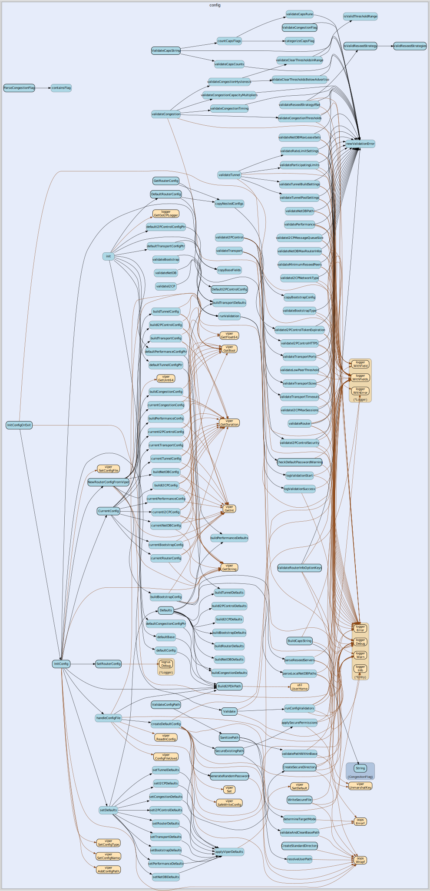

# config
--
    import "github.com/go-i2p/go-i2p/lib/config"



Package config provides configuration structures and defaults for go-i2p.

Package config provides configuration management for go-i2p router.

# Configuration Directories

BaseDir vs WorkingDir: This router uses two separate directory paths to
distinguish between read-only system defaults and mutable runtime state:

BaseDir: Contains read-only default configuration files that ship with the
system. These files provide fallback values and should not be modified during
runtime. When you want to customize the configuration, copy the relevant files
from BaseDir to WorkingDir and edit them there.

    - Default location: $HOME/.go-i2p/base
    - Purpose: System-wide defaults, pristine copies of configuration templates
    - Examples: Default router.config, reseed certificates, bootstrap RouterInfo

WorkingDir: Contains runtime-modifiable configuration files and state. The
router reads from WorkingDir first, falling back to BaseDir if a file doesn't
exist. All runtime changes (e.g., adding peers, updating configuration) are
written here.

    - Default location: $HOME/.go-i2p/config
    - Purpose: User customizations, runtime state, active NetDB
    - Examples: Custom router.config overrides, netDb directory, active LeaseSet cache

Usage Pattern: To customize a configuration option, copy the file from BaseDir
to WorkingDir, then edit the copy in WorkingDir. The router will automatically
prefer the WorkingDir version while preserving the BaseDir original.

## Usage

```go
const DefaultI2CPPort = 7654
```
DefaultI2CPPort is the standard I2CP port

```go
const DefaultI2PControlPort = 7650
```
DefaultI2PControlPort is the standard I2PControl RPC port As defined in the
I2PControl specification

```go
const DefaultMinReseedServers = 2
```
DefaultMinReseedServers is the minimum number of successful reseed servers
required. This matches Java I2P's MIN_RESEED_SERVERS = 2 for enhanced security
through multi-server confirmation. Using 2 servers helps detect compromised or
malicious reseed servers by requiring agreement from multiple independent
sources.

```go
const GoI2PBaseDir = ".go-i2p"
```

```go
const ReseedStrategyIntersection = "intersection"
```
ReseedStrategyIntersection only uses RouterInfos present in ALL successful
server responses. This provides stronger validation but may result in fewer
peers.

```go
const ReseedStrategyRandom = "random"
```
ReseedStrategyRandom randomly selects from the union, weighted by how many
servers returned each RouterInfo. RouterInfos returned by multiple servers are
more likely to be selected.

```go
const ReseedStrategyUnion = "union"
```
ReseedStrategyUnion combines all unique RouterInfos from any successful server
response. This is the default strategy and provides the largest peer set.

```go
const SecureDirPermissions os.FileMode = 0o700
```
SecureDirPermissions for directories containing sensitive files

```go
const SecureFilePermissions os.FileMode = 0o600
```
SecureFilePermissions for files containing sensitive data (e.g., passwords,
keys)

```go
const StandardDirPermissions os.FileMode = 0o755
```
StandardDirPermissions for non-sensitive directories

```go
const StandardFilePermissions os.FileMode = 0o644
```
StandardFilePermissions for non-sensitive configuration files

```go
var CfgFile string
```

```go
var DefaultBootstrapConfig = BootstrapConfig{
	LowPeerThreshold: 10,
	BootstrapType:    "auto",
	ReseedFilePath:   "",

	ReseedServers: KnownReseedServers,

	LocalNetDbPaths: []string{},

	MinReseedServers: DefaultMinReseedServers,

	ReseedStrategy: ReseedStrategyUnion,
}
```
default configuration for network bootstrap Uses all known reseed servers from
KnownReseedServers for maximum availability. MinReseedServers defaults to
DefaultMinReseedServers (2) matching Java I2P.

```go
var DefaultI2CPConfig = I2CPConfig{
	Enabled:          true,
	Address:          fmt.Sprintf("localhost:%d", DefaultI2CPPort),
	Network:          "tcp",
	MaxSessions:      100,
	MessageQueueSize: 64,
	SessionTimeout:   30 * time.Minute,
	ReadTimeout:      60 * time.Second,
	WriteTimeout:     30 * time.Second,
}
```
DefaultI2CPConfig provides default I2CP server configuration

```go
var DefaultNetDbConfig = NetDbConfig{
	Path:                     filepath.Join(defaultConfig(), "netDb"),
	MaxRouterInfos:           5000,
	MaxLeaseSets:             1000,
	ExpirationCheckInterval:  1 * time.Minute,
	LeaseSetRefreshThreshold: 2 * time.Minute,
	ExplorationInterval:      5 * time.Minute,
}
```
default settings for netdb

```go
var DeprecatedRouterInfoOptionKeys = map[string]string{
	"coreVersion": "Core library version (DEPRECATED: removed in 0.9.24, never used)",
	"stat_uptime": "Router uptime statistics (DEPRECATED: removed in 0.9.24, unused since 0.7.9)",
}
```
DeprecatedRouterInfoOptionKeys contains keys that were once valid but have been
removed from the I2P spec. They are accepted without error but should not be
emitted by new routers.

coreVersion: Never used, removed in release 0.9.24 stat_uptime: Unused since
0.7.9, removed in 0.9.24

```go
var KnownReseedServers = []*ReseedConfig{

	{Url: "https://reseed.i2pgit.org/", SU3Fingerprint: "hankhill19580_at_gmail.com.crt"},

	{Url: "https://reseed.sahil.world/", SU3Fingerprint: "sahil_at_mail.i2p.crt"},
	{Url: "https://i2p.diyarciftci.xyz/", SU3Fingerprint: "diyarciftci_at_protonmail.com.crt"},
	{Url: "https://coconut.incognet.io/", SU3Fingerprint: "rambler_at_mail.i2p.crt"},
	{Url: "https://reseed.stormycloud.org/", SU3Fingerprint: "admin_at_stormycloud.org.crt"},

	{Url: "https://reseed-pl.i2pd.xyz/", SU3Fingerprint: "r4sas-reseed_at_mail.i2p.crt"},
	{Url: "https://reseed-fr.i2pd.xyz/", SU3Fingerprint: "r4sas-reseed_at_mail.i2p.crt"},

	{Url: "https://www2.mk16.de/", SU3Fingerprint: "i2p-reseed_at_mk16.de.crt"},
	{Url: "https://reseed2.i2p.net/", SU3Fingerprint: "echelon3_at_mail.i2p.crt"},
	{Url: "https://reseed.diva.exchange/", SU3Fingerprint: "reseed_at_diva.exchange.crt"},
	{Url: "https://i2p.novg.net/", SU3Fingerprint: "igor_at_novg.net.crt"},
	{Url: "https://i2pseed.creativecowpat.net:8443/", SU3Fingerprint: "creativecowpat_at_mail.i2p.crt"},
	{Url: "https://reseed.onion.im/", SU3Fingerprint: "lazygravy_at_mail.i2p.crt"},
}
```
KnownReseedServers contains all verified I2P reseed servers. This list matches
the Java I2P DEFAULT_SSL_SEED_URL list of active servers. Each server has a
corresponding certificate in the embedded certificates/reseed/ directory.

Note: Some servers share certificates (e.g., r4sas operates multiple mirrors).

This list is compiled into the binary and serves as the baseline set of reseed
servers. Additional servers can be configured at runtime via the config file's
bootstrap.reseed_servers key, which supplements (rather than replaces) this list
when using the default "auto" bootstrap type.

```go
var SpecRouterInfoOptionKeys = map[string]string{
	"router.version":       "Router software version (e.g. 0.9.64)",
	"caps":                 "Capability flags string",
	"netId":                "Network ID (2 = production I2P network)",
	"netdb.knownRouters":   "Number of known routers in local NetDB",
	"netdb.knownLeaseSets": "Number of known LeaseSets in local NetDB",

	"family":     "Router family name",
	"family.key": "Router family signing public key (base64)",
	"family.sig": "Router family signature (base64)",
}
```
SpecRouterInfoOptionKeys is the set of option keys recognized by the I2P
specification for RouterInfo. Any key NOT in this set may cause the RouterInfo
to be rejected or ignored by other routers.

Spec: https://geti2p.net/spec/common-structures#routerinfo

#### func  BuildCapsString

```go
func BuildCapsString(bandwidth BandwidthClass, reachable, floodfill, hidden bool, congestion CongestionFlag) string
```
BuildCapsString constructs a valid RouterInfo caps string from the given
parameters. The flags are assembled in canonical order:

    bandwidth + reachability + [floodfill] + [hidden] + [congestion]

This ensures all caps strings produced by this router follow a consistent
ordering for easy comparison, even though the I2P spec does not mandate flag
ordering.

#### func  BuildI2PDirPath

```go
func BuildI2PDirPath() string
```

#### func  CheckDefaultPasswordWarning

```go
func CheckDefaultPasswordWarning(password string)
```
CheckDefaultPasswordWarning logs a warning if the I2PControl password is still
set to the default value in production environments.

#### func  CreateSecureDirectory

```go
func CreateSecureDirectory(path string) error
```
CreateSecureDirectory creates a directory with secure permissions. Use this for
directories that contain or will contain sensitive files.

#### func  CreateStandardDirectory

```go
func CreateStandardDirectory(path string) error
```
CreateStandardDirectory creates a directory with standard permissions. Use this
for directories containing non-sensitive configuration.

#### func  InitConfig

```go
func InitConfig() error
```
InitConfig initializes the configuration subsystem: loads or creates the config
file, sets defaults, and updates the router config. Returns an error if the
config file cannot be read or created.

#### func  InitConfigOrExit

```go
func InitConfigOrExit()
```
InitConfigOrExit initializes config and terminates the process on failure. This
is a convenience wrapper for CLI entry points that cannot handle errors. Library
code and tests should call InitConfig() instead.

#### func  IsPathSecure

```go
func IsPathSecure(path string, maxMode os.FileMode) (bool, error)
```
IsPathSecure checks if a file or directory has secure permissions. Returns true
if the path exists and has permissions <= maxMode.

#### func  IsValidReseedStrategy

```go
func IsValidReseedStrategy(strategy string) bool
```
IsValidReseedStrategy checks if the given strategy is valid.

#### func  LockRouterConfigForWrite

```go
func LockRouterConfigForWrite()
```
LockRouterConfigForWrite acquires an exclusive write lock on
RouterConfigProperties. This must be called before directly modifying
RouterConfigProperties. Always defer UnlockRouterConfigWrite() after acquiring
the lock.

#### func  SanitizePath

```go
func SanitizePath(basePath, userPath string) (string, error)
```
SanitizePath cleans and validates a path to prevent directory traversal attacks.
It ensures the path does not escape the specified base directory. Returns the
sanitized absolute path or an error if the path is invalid.

Platform support: This function uses filepath.Clean, filepath.Abs, and
filepath.EvalSymlinks which handle platform-specific path separators (both '/'
and '\\' on Windows). However, go-i2p is primarily developed and tested on
Linux. Windows-specific edge cases (UNC paths, drive letter traversal) have not
been tested. Use on Windows at your own risk.

#### func  SecureExistingPath

```go
func SecureExistingPath(path string, isDir bool) error
```
SecureExistingPath attempts to secure an existing path by setting appropriate
permissions. This is useful for paths that may have been created with insecure
defaults.

#### func  SetRouterConfig

```go
func SetRouterConfig(cfg *RouterConfig)
```
SetRouterConfig atomically replaces the global router configuration with cfg.
This is the preferred way to update the configuration after building it via
NewRouterConfigFromViper(). Thread-safe.

#### func  UnlockRouterConfigWrite

```go
func UnlockRouterConfigWrite()
```
UnlockRouterConfigWrite releases the write lock on RouterConfigProperties.

#### func  UpdateRouterConfig

```go
func UpdateRouterConfig()
```
UpdateRouterConfig updates the global routerConfigProperties from viper
settings. DEPRECATED: Use NewRouterConfigFromViper() + SetRouterConfig()
instead. This function is thread-safe and can be called during SIGHUP reloads.

#### func  ValidReseedStrategies

```go
func ValidReseedStrategies() []string
```
ValidReseedStrategies returns the list of valid reseed strategy values.

#### func  Validate

```go
func Validate(cfg ConfigDefaults) error
```
Validate checks if the provided configuration values are reasonable. Returns an
error describing the first invalid value found.

#### func  ValidateCapsString

```go
func ValidateCapsString(caps string) error
```
ValidateCapsString checks that a caps string contains only valid single-letter
capability flags per the I2P spec. It verifies:

    - All characters are recognized capability flags
    - At least one bandwidth class letter (K/L/M/N/O/P/X); multiple allowed for
      backward compatibility (spec: "a router may publish multiple bandwidth letters,
      for example 'PO'")
    - At most one reachability flag (R or U); zero allowed when reachability is
      unknown (spec: "unless the reachability state is currently unknown")
    - At most one congestion flag (D/E/G per Proposal 162)
    - No duplicate flags

#### func  ValidateConfigPath

```go
func ValidateConfigPath(userPath string) (string, error)
```
ValidateConfigPath validates a configuration path is safe to use. This is a
convenience wrapper around SanitizePath using the current base directory.

#### func  ValidateCongestionFlag

```go
func ValidateCongestionFlag(flag CongestionFlag) error
```
ValidateCongestionFlag checks that a CongestionFlag value is one of the
recognized values: "" (none), "D", "E", or "G".

#### func  ValidateRouterInfoOptionKeys

```go
func ValidateRouterInfoOptionKeys(options map[string]string) error
```
ValidateRouterInfoOptionKeys checks that the given option keys map contains only
spec-recognized keys. Returns an error listing any unrecognized keys.

Keys matching the "stat_" prefix are allowed per spec (various statistics).
Deprecated keys (coreVersion, stat_uptime) are accepted with a warning.

This helps prevent accidental inclusion of proprietary or debug keys that could
cause the RouterInfo to be rejected by other routers on the network.

#### func  WriteSecureFile

```go
func WriteSecureFile(path string, data []byte) error
```
WriteSecureFile writes data to a file with secure permissions. Use this for
files containing sensitive data like passwords or keys.

#### type BandwidthClass

```go
type BandwidthClass string
```

BandwidthClass represents a single-letter bandwidth capability flag per the I2P
common-structures specification.

The bandwidth class is determined by the router's shared bandwidth limit and
advertised in the RouterInfo caps string.

Spec: https://geti2p.net/spec/common-structures#router-info

```go
const (
	// BandwidthClassK indicates under 12 KB/s shared bandwidth.
	BandwidthClassK BandwidthClass = "K"

	// BandwidthClassL indicates 12–48 KB/s shared bandwidth.
	BandwidthClassL BandwidthClass = "L"

	// BandwidthClassM indicates 48–64 KB/s shared bandwidth.
	BandwidthClassM BandwidthClass = "M"

	// BandwidthClassN indicates 64–128 KB/s shared bandwidth.
	BandwidthClassN BandwidthClass = "N"

	// BandwidthClassO indicates 128–256 KB/s shared bandwidth.
	BandwidthClassO BandwidthClass = "O"

	// BandwidthClassP indicates 256–2000 KB/s shared bandwidth.
	BandwidthClassP BandwidthClass = "P"

	// BandwidthClassX indicates over 2000 KB/s shared bandwidth.
	BandwidthClassX BandwidthClass = "X"
)
```

#### func  BandwidthClassFromRate

```go
func BandwidthClassFromRate(bytesPerSec uint64) BandwidthClass
```
BandwidthClassFromRate returns the I2P bandwidth class letter for the given
shared bandwidth in bytes per second.

Per the I2P spec (common-structures.rst):

    - K: < 12 KBps (< 12288 bytes/s)
    - L: 12–48 KBps
    - M: 48–64 KBps
    - N: 64–128 KBps
    - O: 128–256 KBps
    - P: 256–2000 KBps
    - X: >= 2000 KBps (>= 2048000 bytes/s)

#### func (BandwidthClass) String

```go
func (b BandwidthClass) String() string
```
String returns the single-letter representation of the bandwidth class.

#### type BootstrapConfig

```go
type BootstrapConfig struct {
	// LowPeerThreshold defines the minimum number of known peers before reseeding.
	// If the router has fewer peers than this threshold, it will attempt to reseed.
	LowPeerThreshold int
	// BootstrapType specifies which bootstrap method to use exclusively.
	// Valid values: "auto" (default, tries all methods), "file", "reseed", "local"
	// When set to a specific type, only that method will be used.
	BootstrapType string
	// ReseedFilePath specifies a local reseed file (zip or su3 format).
	// If set, this takes priority over remote reseed servers.
	ReseedFilePath string
	// ReseedServers is the list of remote reseed servers to contact.
	// By default, uses KnownReseedServers which includes all verified I2P reseed servers.
	ReseedServers []*ReseedConfig
	// LocalNetDbPaths lists directories to search for existing RouterInfo files.
	// Supports Java I2P and i2pd netDb directory formats.
	// These paths are populated at runtime based on the operating system.
	LocalNetDbPaths []string
	// MinReseedServers is the minimum number of successful reseed servers required.
	// If fewer servers respond successfully, the reseed operation fails.
	// Default: DefaultMinReseedServers (2), matching Java I2P MIN_RESEED_SERVERS
	// for enhanced security through multi-server confirmation.
	MinReseedServers int
	// ReseedStrategy determines how RouterInfos from multiple servers are combined:
	// - "union": Use all unique RouterInfos from any successful server (default)
	// - "intersection": Only use RouterInfos present in ALL successful server responses
	// - "random": Randomly select from union, weighted by appearance count
	ReseedStrategy string
}
```

BootstrapConfig configures how the router obtains initial peer information to
join the I2P network. It supports multiple bootstrap methods including remote
reseed servers, local reseed files, and existing netDb directories.

#### type BootstrapDefaults

```go
type BootstrapDefaults struct {
	// LowPeerThreshold triggers reseeding when peer count falls below this
	// Default: 10 peers
	LowPeerThreshold int

	// BootstrapType specifies which bootstrap method to use
	// Valid values: "auto", "file", "reseed", "local"
	// Default: "auto" (tries all methods)
	BootstrapType string

	// ReseedTimeout is maximum time to wait for reseed operations
	// Default: 60 seconds
	ReseedTimeout time.Duration

	// MinimumReseedPeers is minimum peers to get from reseed
	// Default: 50 peers
	MinimumReseedPeers int

	// ReseedRetryInterval is time between reseed attempts
	// Default: 5 minutes
	ReseedRetryInterval time.Duration

	// ReseedServers are the default reseed server configurations
	// Only reseed.i2pgit.org is included by default (maintained by go-i2p dev team)
	// Additional reseed servers should be configured via config file
	ReseedServers []*ReseedConfig

	// ReseedStrategy determines how RouterInfos from multiple servers are combined.
	// Valid values: "union", "intersection", "random"
	// Default: "union"
	ReseedStrategy string
}
```

BootstrapDefaults contains default values for network bootstrap

#### type ConfigDefaults

```go
type ConfigDefaults struct {
	// Router defaults
	Router RouterDefaults

	// Network Database defaults
	NetDB NetDBDefaults

	// Bootstrap defaults
	Bootstrap BootstrapDefaults

	// I2CP server defaults
	I2CP I2CPDefaults

	// I2PControl RPC server defaults
	I2PControl I2PControlDefaults

	// Tunnel defaults
	Tunnel TunnelDefaults

	// Transport defaults
	Transport TransportDefaults

	// Performance tuning defaults
	Performance PerformanceDefaults

	// Congestion advertisement defaults (Prop 162)
	Congestion CongestionDefaults
}
```

ConfigDefaults contains all default configuration values for go-i2p. This
centralizes default values to make them easy to discover, document, and modify.

Design Principles: - All defaults should be sensible for typical use cases -
Values should match I2P protocol standards where applicable - Performance
defaults balance resource usage with responsiveness - Security defaults favor
safety over convenience

#### func  CurrentConfig

```go
func CurrentConfig() ConfigDefaults
```
CurrentConfig builds a ConfigDefaults from the current viper settings (which
reflect defaults + config file + flags). This is used for validation to catch
invalid user-provided values at startup, unlike Defaults() which only returns
the hardcoded defaults.

#### func  Defaults

```go
func Defaults() ConfigDefaults
```
Defaults returns a ConfigDefaults instance with all default values set. This is
the single source of truth for all configuration defaults.

#### type CongestionDefaults

```go
type CongestionDefaults struct {

	// DFlagThreshold is the participating tunnel ratio to advertise D flag.
	// When current/max ratio exceeds this, advertise medium congestion.
	// Default: 0.70 (70% of max participating tunnels)
	DFlagThreshold float64

	// EFlagThreshold is the participating tunnel ratio to advertise E flag.
	// When current/max ratio exceeds this, advertise high congestion.
	// Default: 0.85 (85% of max participating tunnels)
	EFlagThreshold float64

	// GFlagThreshold is the participating tunnel ratio to advertise G flag.
	// When current/max ratio exceeds this, advertise critical congestion.
	// Default: 1.00 (100% = at max participating tunnels)
	GFlagThreshold float64

	// ClearDFlagThreshold is the ratio to clear D flag and return to normal.
	// Default: 0.60 (60% of max)
	ClearDFlagThreshold float64

	// ClearEFlagThreshold is the ratio to clear E flag (downgrade to D or clear).
	// Default: 0.75 (75% of max)
	ClearEFlagThreshold float64

	// ClearGFlagThreshold is the ratio to clear G flag (downgrade to E).
	// Default: 0.95 (95% of max)
	ClearGFlagThreshold float64

	// AveragingWindow is the duration over which to average congestion metrics.
	// Per spec, congestion state should be based on an average over several minutes,
	// not instantaneous measurement, to prevent rapid flag changes.
	// Default: 5 minutes (per spec recommendation)
	AveragingWindow time.Duration

	// EFlagAgeThreshold is when E flag is treated as D due to stale RouterInfo.
	// If a remote peer's RouterInfo is older than this and has E flag,
	// treat it as D flag instead (assume congestion may have cleared).
	// Default: 15 minutes (per spec)
	EFlagAgeThreshold time.Duration

	// DFlagCapacityMultiplier is the capacity multiplier for D-flagged peers.
	// A value of 0.5 means D-flagged peers appear to have 50% of normal capacity.
	// Default: 0.5
	DFlagCapacityMultiplier float64

	// EFlagCapacityMultiplier is the capacity multiplier for E-flagged peers.
	// A value of 0.1 means E-flagged peers appear to have 10% of normal capacity.
	// Default: 0.1 (severely degraded)
	EFlagCapacityMultiplier float64

	// StaleEFlagCapacityMultiplier is the multiplier for E-flagged peers with old RouterInfo.
	// When RouterInfo is older than EFlagAgeThreshold, use this instead of EFlagCapacityMultiplier.
	// Per spec, stale E flags should be treated as D flags.
	// Default: 0.5 (same as D flag)
	StaleEFlagCapacityMultiplier float64
}
```

CongestionDefaults contains default values for congestion advertisement (Prop
162). These settings control when the router advertises D/E/G congestion flags
in its RouterInfo caps, and how to derate congested peers during tunnel
building.

The congestion cap system provides three levels:

    - D (Medium): Router is experiencing elevated load but still functional
    - E (High): Router is near capacity, rejecting most tunnel requests
    - G (Critical): Router is rejecting ALL tunnel requests (temporary or permanent)

Spec: https://geti2p.net/spec/proposals/162-congestion-caps

#### type CongestionFlag

```go
type CongestionFlag string
```

CongestionFlag represents a congestion level flag.

```go
const (
	// CongestionFlagNone indicates no congestion (normal operation).
	CongestionFlagNone CongestionFlag = ""

	// CongestionFlagD indicates medium congestion or low-performance router.
	// Tunnel creators should downgrade/limit apparent tunnel capacity in profile.
	CongestionFlagD CongestionFlag = "D"

	// CongestionFlagE indicates high congestion, near or at some limit.
	// Tunnel creators should severely downgrade capacity if RI < 15 min old,
	// or treat as D if RI > 15 min old.
	CongestionFlagE CongestionFlag = "E"

	// CongestionFlagG indicates rejecting ALL tunnels (temporary or permanent).
	// Tunnel creators should NOT build tunnels through this router.
	CongestionFlagG CongestionFlag = "G"
)
```

#### func  ParseCongestionFlag

```go
func ParseCongestionFlag(caps string) CongestionFlag
```
ParseCongestionFlag parses a caps string and extracts the congestion flag if
present. Returns CongestionFlagNone if no congestion flag is found. Checks for
D, E, G flags in priority order (G > E > D).

#### func (CongestionFlag) CongestionLevel

```go
func (f CongestionFlag) CongestionLevel() int
```
CongestionLevel returns the numeric level for the flag (0=none, 1=D, 2=E, 3=G).

#### func (CongestionFlag) String

```go
func (f CongestionFlag) String() string
```
String returns the string representation of the congestion flag.

#### type I2CPConfig

```go
type I2CPConfig struct {
	// Enable I2CP server
	Enabled bool
	// Address to listen on (default: "localhost:7654")
	Address string
	// Network type: "tcp" or "unix"
	Network string
	// Maximum number of concurrent sessions
	MaxSessions int

	// Username for optional I2CP authentication.
	// When both Username and Password are set, clients must provide
	// matching credentials via GetDate options (i2cp.username/i2cp.password)
	// before session-mutating operations are allowed.
	// Leave empty to disable authentication (default).
	Username string

	// Password for optional I2CP authentication.
	// See Username for details.
	Password string

	// MessageQueueSize is the buffer size for outbound messages per session.
	// Default: 64 messages.
	MessageQueueSize int

	// SessionTimeout is how long idle sessions stay alive.
	// Default: 30 minutes. Set to 0 to disable timeout enforcement.
	SessionTimeout time.Duration

	// ReadTimeout is the maximum time to wait for client reads.
	// Default: 60 seconds.
	ReadTimeout time.Duration

	// WriteTimeout is the maximum time to wait for client writes.
	// Default: 30 seconds.
	WriteTimeout time.Duration
}
```

I2CPConfig holds configuration for the I2CP server

#### type I2CPDefaults

```go
type I2CPDefaults struct {
	// Enabled determines if I2CP server starts automatically
	// Default: true
	Enabled bool

	// Address is the listen address for I2CP server
	// Default: "localhost:7654" (I2P protocol standard port)
	Address string

	// Network is the network type: "tcp" or "unix"
	// Default: "tcp"
	Network string

	// MaxSessions is maximum concurrent I2CP sessions
	// Default: 100 sessions
	MaxSessions int

	// MessageQueueSize is the buffer size for outbound messages per session
	// Default: 64 messages
	MessageQueueSize int

	// SessionTimeout is how long idle sessions stay alive
	// Default: 30 minutes
	// Set to 0 to disable timeout enforcement (sessions persist until explicit disconnect)
	SessionTimeout time.Duration

	// ReadTimeout is maximum time to wait for client reads
	// Default: 60 seconds
	ReadTimeout time.Duration

	// WriteTimeout is maximum time to wait for client writes
	// Default: 30 seconds
	WriteTimeout time.Duration
}
```

I2CPDefaults contains default values for I2CP server

#### type I2PControlConfig

```go
type I2PControlConfig struct {
	// Enabled determines if the I2PControl server should start
	// Default: false (disabled for security — must be explicitly enabled)
	Enabled bool

	// Address is the listen address for the I2PControl server
	// Format: "host:port" (e.g., "localhost:7650", "0.0.0.0:7650")
	// Default: "localhost:7650"
	// Security: Binding to 0.0.0.0 exposes the server to all network interfaces
	Address string

	// Password is used for token-based authentication
	// Clients must authenticate with this password to receive an access token
	// Default: "itoopie" (I2PControl standard default)
	// IMPORTANT: Change this in production environments!
	Password string

	// UseHTTPS enables TLS/HTTPS for encrypted communication
	// Default: false (HTTP only)
	// Recommended: true for any non-localhost deployment
	UseHTTPS bool

	// CertFile is the path to the TLS certificate file
	// Required when UseHTTPS is true
	// Format: PEM-encoded X.509 certificate
	CertFile string

	// KeyFile is the path to the TLS private key file
	// Required when UseHTTPS is true
	// Format: PEM-encoded private key
	KeyFile string

	// TokenExpiration is how long authentication tokens remain valid
	// Default: 10 minutes
	// Expired tokens must re-authenticate to get a new token
	TokenExpiration time.Duration
}
```

I2PControlConfig holds configuration for the I2PControl JSON-RPC server.
I2PControl is a monitoring and control interface for I2P routers, providing a
standardized JSON-RPC 2.0 API for querying router statistics and status.

This implementation provides a minimal monitoring server for development use,
supporting basic statistics queries without write operations to router
configuration.

#### func  DefaultI2PControlConfig

```go
func DefaultI2PControlConfig() I2PControlConfig
```
DefaultI2PControlConfig returns sensible defaults for I2PControl server. Returns
a fresh copy each time to prevent mutation of shared state. These defaults
prioritize security: - Disabled by default (must be explicitly enabled) -
Localhost-only binding (not exposed to network) - HTTP only (HTTPS requires
explicit cert configuration) - Standard I2PControl port (7650) - Standard
default password (should be changed before enabling)

#### type I2PControlDefaults

```go
type I2PControlDefaults struct {
	// Enabled determines if I2PControl server starts automatically
	// Default: false (disabled for security — default password over HTTP allows
	// any local process to control the router; must be explicitly enabled)
	Enabled bool

	// Address is the listen address for I2PControl server
	// Default: "localhost:7650" (I2PControl standard port)
	Address string

	// Password is used for token-based authentication
	// Default: "itoopie" (I2PControl standard default)
	// IMPORTANT: Change in production!
	Password string

	// UseHTTPS enables TLS/HTTPS for encrypted communication
	// Default: false (HTTP only)
	UseHTTPS bool

	// CertFile is the path to the TLS certificate file (PEM format)
	// Required when UseHTTPS is true
	CertFile string

	// KeyFile is the path to the TLS private key file (PEM format)
	// Required when UseHTTPS is true
	KeyFile string

	// TokenExpiration is how long authentication tokens remain valid
	// Default: 10 minutes
	TokenExpiration time.Duration
}
```

I2PControlDefaults contains default values for I2PControl JSON-RPC server

#### type NetDBDefaults

```go
type NetDBDefaults struct {
	// Path is the directory for storing network database files
	// Default: $HOME/.go-i2p/config/netDb
	Path string

	// MaxRouterInfos is maximum RouterInfos to store locally
	// Default: 5000
	MaxRouterInfos int

	// MaxLeaseSets is maximum LeaseSets to cache
	// Default: 1000
	MaxLeaseSets int

	// ExpirationCheckInterval is how often to check for expired entries
	// Default: 1 minute
	ExpirationCheckInterval time.Duration

	// LeaseSetRefreshThreshold is when to refresh before expiration
	// Default: 2 minutes before expiration
	LeaseSetRefreshThreshold time.Duration

	// ExplorationInterval is how often to explore the network
	// Default: 5 minutes
	ExplorationInterval time.Duration

	// FloodfillEnabled determines if this router acts as floodfill
	// Default: false (regular router mode)
	FloodfillEnabled bool
}
```

NetDBDefaults contains default values for network database configuration

#### type NetDbConfig

```go
type NetDbConfig struct {
	// path to network database directory
	Path string
	// MaxRouterInfos is the maximum number of RouterInfos to store locally.
	// When exceeded, oldest entries are evicted. Default: 5000.
	MaxRouterInfos int
	// MaxLeaseSets is the maximum number of LeaseSets to cache.
	// When exceeded, oldest entries are evicted. Default: 1000.
	MaxLeaseSets int
	// ExpirationCheckInterval is how often to check for and remove expired entries.
	// Default: 1 minute.
	ExpirationCheckInterval time.Duration
	// LeaseSetRefreshThreshold is how far before expiration a LeaseSet should be refreshed.
	// Default: 2 minutes.
	LeaseSetRefreshThreshold time.Duration
	// ExplorationInterval is how often to explore the network for new peers.
	// Default: 5 minutes.
	ExplorationInterval time.Duration
	// FloodfillEnabled determines if this router operates as a floodfill router
	FloodfillEnabled bool
}
```

local network database configuration

#### type PerformanceDefaults

```go
type PerformanceDefaults struct {
	// MessageQueueSize is the buffer for router message processing
	// Default: 256 messages
	MessageQueueSize int

	// WorkerPoolSize is concurrent message processing workers
	// Default: 8 workers (or GOMAXPROCS)
	WorkerPoolSize int

	// GarlicEncryptionCacheSize is cache size for garlic sessions
	// Default: 1000 sessions
	GarlicEncryptionCacheSize int

	// FragmentCacheSize is cache size for message fragment reassembly
	// Default: 500 fragments
	FragmentCacheSize int

	// CleanupInterval is how often to run cleanup tasks
	// Default: 5 minutes
	CleanupInterval time.Duration
}
```

PerformanceDefaults contains default values for performance tuning

#### type ReseedConfig

```go
type ReseedConfig struct {
	// Url is the HTTPS URL of the reseed server
	Url string
	// SU3Fingerprint is the fingerprint of the reseed server's SU3 signing key
	// used to verify the authenticity of downloaded reseed data
	SU3Fingerprint string
}
```

ReseedConfig holds configuration for a single reseed server. Reseed servers
provide initial peer RouterInfo files to bootstrap network connectivity.

#### type RouterConfig

```go
type RouterConfig struct {
	// the path to the base config directory where per-system defaults are stored
	BaseDir string
	// the path to the working config directory where files are changed
	WorkingDir string
	// netdb configuration
	NetDb *NetDbConfig
	// configuration for bootstrapping into the network
	Bootstrap *BootstrapConfig
	// I2CP server configuration
	I2CP *I2CPConfig
	// I2PControl RPC server configuration
	I2PControl *I2PControlConfig
	// MaxBandwidth is the maximum bandwidth limit in bytes per second.
	// Default: 1048576 (1 MB/s). Set to 0 for unlimited.
	MaxBandwidth uint64
	// MaxConnections is the maximum number of concurrent transport connections.
	// Default: 200.
	MaxConnections int
	// AcceptTunnels controls whether the router participates in transit tunnels.
	// Default: true.
	AcceptTunnels bool
	// Tunnel configuration for tunnel pool management and building.
	Tunnel *TunnelDefaults
	// Transport configuration for NTCP2/SSU2 transports.
	Transport *TransportDefaults
	// Performance tuning configuration.
	Performance *PerformanceDefaults
	// Congestion advertisement configuration per Proposal 162.
	Congestion *CongestionDefaults
}
```

router.config options

#### func  DefaultRouterConfig

```go
func DefaultRouterConfig() *RouterConfig
```

#### func  GetRouterConfig

```go
func GetRouterConfig() *RouterConfig
```
GetRouterConfig returns a copy of the current router configuration. This is the
thread-safe way to access routerConfigProperties. The returned copy is safe to
use without holding locks.

#### func  NewRouterConfigFromViper

```go
func NewRouterConfigFromViper() *RouterConfig
```
NewRouterConfigFromViper creates a new RouterConfig from current viper settings.
This is the preferred way to get config instead of using the global
RouterConfigProperties.

#### func  RouterConfigProperties

```go
func RouterConfigProperties() *RouterConfig
```
RouterConfigProperties returns a deep copy of the current router configuration
for backward compatibility. DEPRECATED: Use GetRouterConfig() instead.

Prior to this fix, this function returned the internal pointer under RLock,
which was released on return — callers could then race with
UpdateRouterConfig(). Now returns a deep copy (identical behavior to
GetRouterConfig()).

#### type RouterDefaults

```go
type RouterDefaults struct {
	// BaseDir is where per-system defaults are stored
	// Default: $HOME/.go-i2p/base
	BaseDir string

	// WorkingDir is where runtime files are modified
	// Default: $HOME/.go-i2p/config
	WorkingDir string

	// RouterInfoRefreshInterval is how often to update our RouterInfo
	// Default: 30 minutes
	RouterInfoRefreshInterval time.Duration

	// MessageExpirationTime is how long messages stay valid
	// Default: 60 seconds (I2P protocol standard)
	MessageExpirationTime time.Duration

	// MaxConcurrentSessions is maximum number of active transport sessions
	// Default: 200
	MaxConcurrentSessions int
}
```

RouterDefaults contains default values for router configuration

#### type TransportDefaults

```go
type TransportDefaults struct {
	// NTCP2Enabled determines if NTCP2 transport is active
	// Default: true
	NTCP2Enabled bool

	// NTCP2Port is the listen port for NTCP2
	// Default: 0 (random port assigned by OS)
	NTCP2Port int

	// NTCP2MaxConnections is maximum concurrent NTCP2 sessions
	// Default: 200
	NTCP2MaxConnections int

	// SSU2Enabled determines if SSU2 transport is active
	// Default: false (not yet implemented)
	SSU2Enabled bool

	// SSU2Port is the listen port for SSU2
	// Default: 0 (random port assigned by OS)
	SSU2Port int

	// ConnectionTimeout is maximum time to establish connection
	// Default: 30 seconds
	ConnectionTimeout time.Duration

	// IdleTimeout is when to close idle connections
	// Default: 5 minutes
	IdleTimeout time.Duration

	// MaxMessageSize is maximum I2NP message size
	// Default: 32768 bytes (32 KiB)
	MaxMessageSize int
}
```

TransportDefaults contains default values for transport layer

#### type TunnelDefaults

```go
type TunnelDefaults struct {
	// MinPoolSize is minimum tunnels to maintain per pool
	// Default: 4 tunnels
	MinPoolSize int

	// MaxPoolSize is maximum tunnels to maintain per pool
	// Default: 6 tunnels
	MaxPoolSize int

	// TunnelLength is hops per tunnel
	// Default: 3 hops (I2P protocol standard)
	TunnelLength int

	// TunnelLifetime is how long tunnels stay active
	// Default: 10 minutes (I2P protocol standard)
	TunnelLifetime time.Duration

	// TunnelTestInterval is how often to test tunnel health
	// Default: 60 seconds
	TunnelTestInterval time.Duration

	// TunnelTestTimeout is maximum time to wait for test response
	// Default: 5 seconds
	TunnelTestTimeout time.Duration

	// BuildTimeout is maximum time to wait for tunnel build
	// Default: 90 seconds (I2P protocol standard)
	BuildTimeout time.Duration

	// BuildRetries is maximum attempts to build a tunnel
	// Default: 3 attempts
	BuildRetries int

	// ReplaceBeforeExpiration is when to build replacement tunnel
	// Default: 2 minutes before expiration
	ReplaceBeforeExpiration time.Duration

	// MaintenanceInterval is how often to run pool maintenance
	// Default: 30 seconds
	MaintenanceInterval time.Duration

	// MaxParticipatingTunnels is the hard limit on tunnels where we act as intermediate hop
	// Default: 15000 (reasonable for typical hardware)
	MaxParticipatingTunnels int

	// ParticipatingLimitsEnabled enables global participating tunnel limits
	// Default: true
	ParticipatingLimitsEnabled bool

	// PerSourceRateLimitEnabled enables per-source tunnel build request rate limiting
	// Default: true
	PerSourceRateLimitEnabled bool

	// MaxBuildRequestsPerMinute is the maximum tunnel build requests per source per minute
	// Default: 10 (legitimate routers rarely request >5/min)
	MaxBuildRequestsPerMinute int

	// BuildRequestBurstSize is the burst allowance for tunnel build requests
	// Default: 3 (allows small bursts for tunnel rebuilds)
	BuildRequestBurstSize int

	// SourceBanDuration is how long to ban sources that exceed rate limits
	// Default: 5 minutes
	SourceBanDuration time.Duration
}
```

TunnelDefaults contains default values for tunnel management

#### func (TunnelDefaults) SoftLimitParticipatingTunnels

```go
func (t TunnelDefaults) SoftLimitParticipatingTunnels() int
```
SoftLimitParticipatingTunnels returns 50% of MaxParticipatingTunnels. The soft
limit is always derived, not independently configured. Probabilistic rejection
starts at the soft limit and increases toward 100% as we approach the hard
limit.


config 

github.com/go-i2p/go-i2p/lib/config

[go-i2p template file](/template.md)
