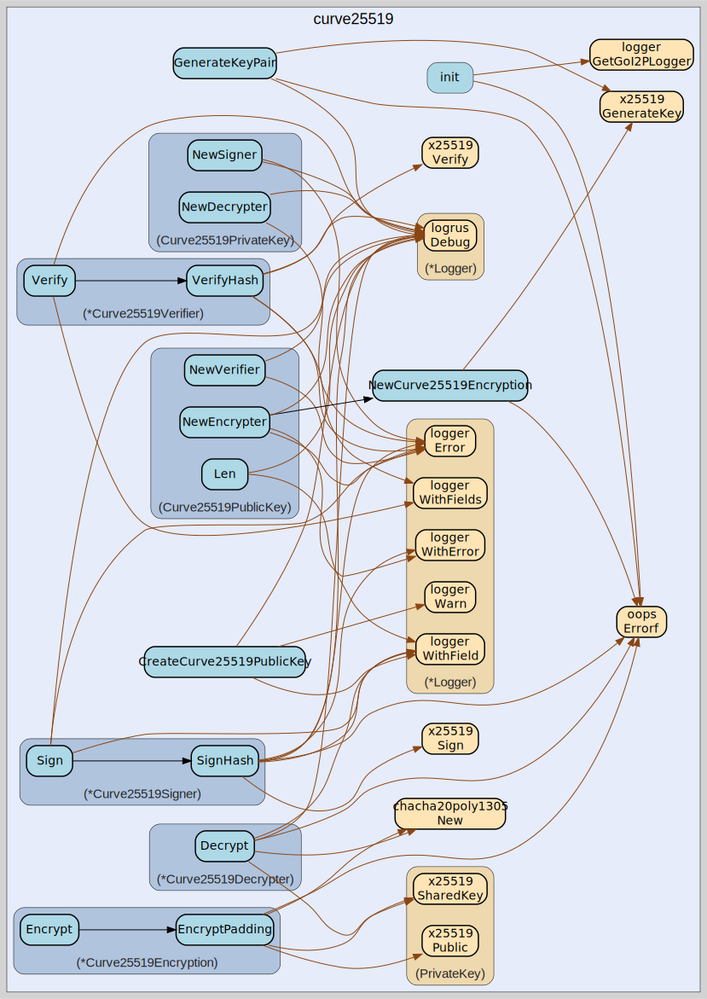

# curve25519
--
    import "github.com/go-i2p/go-i2p/lib/crypto/curve25519"




## Usage

```go
var (
	ErrDataTooBig        = oops.Errorf("data too big for Curve25519 encryption")
	ErrInvalidPublicKey  = oops.Errorf("invalid public key for Curve25519")
	ErrInvalidPrivateKey = oops.Errorf("invalid private key for Curve25519")
	ErrInvalidSignature  = oops.Errorf("invalid signature for Curve25519")
	ErrDecryptionFailed  = oops.Errorf("failed to decrypt data with Curve25519")
)
```

#### func  CreateCurve25519PublicKey

```go
func CreateCurve25519PublicKey(data []byte) (k *curve25519.PublicKey)
```

#### func  GenerateKeyPair

```go
func GenerateKeyPair() (types.PublicEncryptionKey, types.PrivateEncryptionKey, error)
```
GenerateKeyPair generates a new Curve25519 key pair

#### type Curve25519Decrypter

```go
type Curve25519Decrypter struct {
}
```

Curve25519Decrypter handles Curve25519-based decryption

#### func (*Curve25519Decrypter) Decrypt

```go
func (c *Curve25519Decrypter) Decrypt(data []byte) ([]byte, error)
```
Decrypt decrypts data encrypted with Curve25519 and ChaCha20-Poly1305

#### type Curve25519Encryption

```go
type Curve25519Encryption struct {
}
```


#### func  NewCurve25519Encryption

```go
func NewCurve25519Encryption(pub *curve25519.PublicKey, rand io.Reader) (*Curve25519Encryption, error)
```
NewCurve25519Encryption creates a new Curve25519 encryption instance

#### func (*Curve25519Encryption) Encrypt

```go
func (c *Curve25519Encryption) Encrypt(data []byte) ([]byte, error)
```
Encrypt encrypts data with zero padding uses ChaCha20-Poly1305 AEAD cipher

#### func (*Curve25519Encryption) EncryptPadding

```go
func (c *Curve25519Encryption) EncryptPadding(data []byte, zeroPadding bool) ([]byte, error)
```
EncryptPadding encrypts data with optional zero padding and returns the
encrypted data uses ChaCha20-Poly1305 AEAD cipher

#### type Curve25519PrivateKey

```go
type Curve25519PrivateKey []byte
```

Curve25519PrivateKey represents a Curve25519 private key

#### func (Curve25519PrivateKey) NewDecrypter

```go
func (k Curve25519PrivateKey) NewDecrypter() (types.Decrypter, error)
```
NewDecrypter creates a new Curve25519 decrypter

#### func (Curve25519PrivateKey) NewSigner

```go
func (k Curve25519PrivateKey) NewSigner() (types.Signer, error)
```
NewSigner creates a new Curve25519 signer

#### type Curve25519PublicKey

```go
type Curve25519PublicKey []byte
```

Curve25519PublicKey represents a Curve25519 public key

#### func (Curve25519PublicKey) Len

```go
func (k Curve25519PublicKey) Len() int
```
Len returns the length of the public key

#### func (Curve25519PublicKey) NewEncrypter

```go
func (k Curve25519PublicKey) NewEncrypter() (types.Encrypter, error)
```
NewEncrypter creates a new Curve25519 encrypter

#### func (Curve25519PublicKey) NewVerifier

```go
func (k Curve25519PublicKey) NewVerifier() (types.Verifier, error)
```
NewVerifier creates a Curve25519 verifier

#### type Curve25519Signer

```go
type Curve25519Signer struct {
}
```

Curve25519Signer handles Curve25519-based signing operations

#### func (*Curve25519Signer) Sign

```go
func (s *Curve25519Signer) Sign(data []byte) ([]byte, error)
```
Sign signs data using Curve25519

#### func (*Curve25519Signer) SignHash

```go
func (s *Curve25519Signer) SignHash(h []byte) ([]byte, error)
```
SignHash signs a pre-computed hash using Curve25519

#### type Curve25519Verifier

```go
type Curve25519Verifier struct {
}
```

Curve25519Verifier handles Curve25519-based verification operations

#### func (*Curve25519Verifier) Verify

```go
func (v *Curve25519Verifier) Verify(data, sig []byte) error
```
Verify verifies a signature against the provided data

#### func (*Curve25519Verifier) VerifyHash

```go
func (v *Curve25519Verifier) VerifyHash(h, sig []byte) error
```
VerifyHash verifies a signature against a pre-computed hash


curve25519 

github.com/go-i2p/go-i2p/lib/crypto/curve25519
