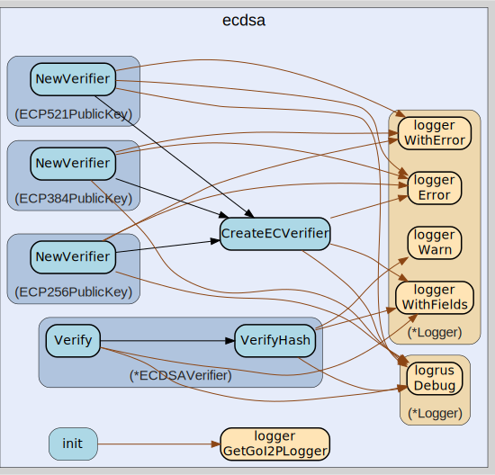

# ecdsa
--
    import "github.com/go-i2p/go-i2p/lib/crypto/ecdsa"




## Usage

#### type ECDSAVerifier

```go
type ECDSAVerifier struct {
}
```


#### func  CreateECVerifier

```go
func CreateECVerifier(c elliptic.Curve, h crypto.Hash, k []byte) (ev *ECDSAVerifier, err error)
```

#### func (*ECDSAVerifier) Verify

```go
func (v *ECDSAVerifier) Verify(data, sig []byte) (err error)
```
verify a block of data by hashing it and comparing the hash against the
signature

#### func (*ECDSAVerifier) VerifyHash

```go
func (v *ECDSAVerifier) VerifyHash(h, sig []byte) (err error)
```
verify a signature given the hash

#### type ECP256PrivateKey

```go
type ECP256PrivateKey [32]byte
```


#### func (*ECP256PrivateKey) Bytes

```go
func (e *ECP256PrivateKey) Bytes() []byte
```
Bytes implements types.PrivateKey.

#### func (*ECP256PrivateKey) Decrypt

```go
func (e *ECP256PrivateKey) Decrypt(data []byte) ([]byte, error)
```
Decrypt implements types.Decrypter.

#### func (*ECP256PrivateKey) Public

```go
func (e *ECP256PrivateKey) Public() (types.SigningPublicKey, error)
```
Public implements types.PrivateKey.

#### func (*ECP256PrivateKey) Sign

```go
func (e *ECP256PrivateKey) Sign(data []byte) (sig []byte, err error)
```
Sign implements types.Signer.

#### func (*ECP256PrivateKey) SignHash

```go
func (e *ECP256PrivateKey) SignHash(h []byte) (sig []byte, err error)
```
SignHash implements types.Signer.

#### func (*ECP256PrivateKey) Zero

```go
func (e *ECP256PrivateKey) Zero()
```
Zero implements types.PrivateKey.

#### type ECP256PublicKey

```go
type ECP256PublicKey [64]byte
```


#### func (ECP256PublicKey) Bytes

```go
func (k ECP256PublicKey) Bytes() []byte
```

#### func (*ECP256PublicKey) Encrypt

```go
func (k *ECP256PublicKey) Encrypt(data []byte) (enc []byte, err error)
```
Encrypt implements types.Encrypter.

#### func (ECP256PublicKey) Len

```go
func (k ECP256PublicKey) Len() int
```

#### func (ECP256PublicKey) NewVerifier

```go
func (k ECP256PublicKey) NewVerifier() (types.Verifier, error)
```

#### func (ECP256PublicKey) Verify

```go
func (k ECP256PublicKey) Verify(data []byte, sig []byte) error
```
Verify implements types.Verifier.

#### func (ECP256PublicKey) VerifyHash

```go
func (k ECP256PublicKey) VerifyHash(h []byte, sig []byte) error
```
VerifyHash implements types.Verifier.

#### type ECP384PrivateKey

```go
type ECP384PrivateKey [48]byte
```


#### func (*ECP384PrivateKey) Bytes

```go
func (e *ECP384PrivateKey) Bytes() []byte
```
Bytes implements types.PrivateKey.

#### func (*ECP384PrivateKey) Decrypt

```go
func (e *ECP384PrivateKey) Decrypt(data []byte) ([]byte, error)
```
Decrypt implements types.Decrypter.

#### func (*ECP384PrivateKey) Public

```go
func (e *ECP384PrivateKey) Public() (types.SigningPublicKey, error)
```
Public implements types.PrivateKey.

#### func (*ECP384PrivateKey) Sign

```go
func (e *ECP384PrivateKey) Sign(data []byte) (sig []byte, err error)
```
Sign implements types.Signer.

#### func (*ECP384PrivateKey) SignHash

```go
func (e *ECP384PrivateKey) SignHash(h []byte) (sig []byte, err error)
```
SignHash implements types.Signer.

#### func (*ECP384PrivateKey) Zero

```go
func (e *ECP384PrivateKey) Zero()
```
Zero implements types.PrivateKey.

#### type ECP384PublicKey

```go
type ECP384PublicKey [96]byte
```


#### func (ECP384PublicKey) Bytes

```go
func (k ECP384PublicKey) Bytes() []byte
```

#### func (ECP384PublicKey) Len

```go
func (k ECP384PublicKey) Len() int
```

#### func (ECP384PublicKey) NewVerifier

```go
func (k ECP384PublicKey) NewVerifier() (types.Verifier, error)
```

#### func (ECP384PublicKey) Verify

```go
func (k ECP384PublicKey) Verify(data []byte, sig []byte) error
```
Verify implements types.Verifier.

#### func (ECP384PublicKey) VerifyHash

```go
func (k ECP384PublicKey) VerifyHash(h []byte, sig []byte) error
```
VerifyHash implements types.Verifier.

#### type ECP521PrivateKey

```go
type ECP521PrivateKey [66]byte
```


#### func (*ECP521PrivateKey) Bytes

```go
func (e *ECP521PrivateKey) Bytes() []byte
```
Bytes implements types.PrivateKey.

#### func (*ECP521PrivateKey) Decrypt

```go
func (e *ECP521PrivateKey) Decrypt(data []byte) ([]byte, error)
```
Decrypt implements types.Decrypter.

#### func (*ECP521PrivateKey) Public

```go
func (e *ECP521PrivateKey) Public() (types.SigningPublicKey, error)
```
Public implements types.PrivateKey.

#### func (*ECP521PrivateKey) Sign

```go
func (e *ECP521PrivateKey) Sign(data []byte) (sig []byte, err error)
```
Sign implements types.Signer.

#### func (*ECP521PrivateKey) SignHash

```go
func (e *ECP521PrivateKey) SignHash(h []byte) (sig []byte, err error)
```
SignHash implements types.Signer.

#### func (*ECP521PrivateKey) Zero

```go
func (e *ECP521PrivateKey) Zero()
```
Zero implements types.PrivateKey.

#### type ECP521PublicKey

```go
type ECP521PublicKey [132]byte
```


#### func (ECP521PublicKey) Bytes

```go
func (k ECP521PublicKey) Bytes() []byte
```

#### func (ECP521PublicKey) Len

```go
func (k ECP521PublicKey) Len() int
```

#### func (ECP521PublicKey) NewVerifier

```go
func (k ECP521PublicKey) NewVerifier() (types.Verifier, error)
```

#### func (ECP521PublicKey) Verify

```go
func (k ECP521PublicKey) Verify(data []byte, sig []byte) error
```
Verify implements types.Verifier.

#### func (ECP521PublicKey) VerifyHash

```go
func (k ECP521PublicKey) VerifyHash(h []byte, sig []byte) error
```
VerifyHash implements types.Verifier.


ecdsa 

github.com/go-i2p/go-i2p/lib/crypto/ecdsa
