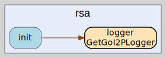

# rsa
--
    import "github.com/go-i2p/go-i2p/lib/crypto/rsa"




## Usage

#### type RSA2048PrivateKey

```go
type RSA2048PrivateKey [512]byte
```


#### func (RSA2048PrivateKey) Bytes

```go
func (r RSA2048PrivateKey) Bytes() []byte
```
Bytes implements types.PrivateKey. Returns the raw bytes of the private key

#### func (RSA2048PrivateKey) Public

```go
func (r RSA2048PrivateKey) Public() (types.SigningPublicKey, error)
```
Public implements types.PrivateKey. Extracts the public key from the private key

#### func (RSA2048PrivateKey) Sign

```go
func (r RSA2048PrivateKey) Sign(data []byte) (sig []byte, err error)
```
Sign implements types.Signer. Signs data by first hashing it with SHA-256

#### func (RSA2048PrivateKey) SignHash

```go
func (r RSA2048PrivateKey) SignHash(h []byte) (sig []byte, err error)
```
SignHash implements types.Signer. Signs a pre-computed hash

#### func (RSA2048PrivateKey) Zero

```go
func (r RSA2048PrivateKey) Zero()
```
Zero implements types.PrivateKey. Securely erases key material

#### type RSA2048PublicKey

```go
type RSA2048PublicKey [256]byte
```


#### func (RSA2048PublicKey) Bytes

```go
func (r RSA2048PublicKey) Bytes() []byte
```
Bytes implements SigningPublicKey. Returns the raw bytes of the public key

#### func (RSA2048PublicKey) Len

```go
func (r RSA2048PublicKey) Len() int
```
Len implements SigningPublicKey. Returns the length of the public key in bytes

#### func (RSA2048PublicKey) NewVerifier

```go
func (r RSA2048PublicKey) NewVerifier() (types.Verifier, error)
```
NewVerifier implements SigningPublicKey. Creates a new verifier object that can
be used to verify signatures

#### func (RSA2048PublicKey) Verify

```go
func (r RSA2048PublicKey) Verify(data []byte, sig []byte) error
```
Verify implements types.Verifier. This method hashes the data with SHA-256 and
verifies the signature

#### func (RSA2048PublicKey) VerifyHash

```go
func (r RSA2048PublicKey) VerifyHash(h []byte, sig []byte) error
```
VerifyHash implements types.Verifier. This method verifies a pre-computed hash
against the signature

#### type RSA3072PrivateKey

```go
type RSA3072PrivateKey [786]byte
```


#### func (RSA3072PrivateKey) Bytes

```go
func (r RSA3072PrivateKey) Bytes() []byte
```
Bytes implements types.PrivateKey - returns raw key bytes

#### func (*RSA3072PrivateKey) Generate

```go
func (r *RSA3072PrivateKey) Generate() (types.SigningPrivateKey, error)
```
Generate creates a new RSA-3072 private key

#### func (*RSA3072PrivateKey) Len

```go
func (r *RSA3072PrivateKey) Len() int
```
Len implements types.SigningPrivateKey.

#### func (*RSA3072PrivateKey) NewSigner

```go
func (r *RSA3072PrivateKey) NewSigner() (types.Signer, error)
```
NewSigner implements types.SigningPrivateKey.

#### func (RSA3072PrivateKey) Public

```go
func (r RSA3072PrivateKey) Public() (types.SigningPublicKey, error)
```
Public implements types.PrivateKey - derives public key from private key

#### func (RSA3072PrivateKey) Sign

```go
func (r RSA3072PrivateKey) Sign(data []byte) (sig []byte, err error)
```
Sign implements types.Signer - signs data with SHA512 hash

#### func (RSA3072PrivateKey) SignHash

```go
func (r RSA3072PrivateKey) SignHash(h []byte) (sig []byte, err error)
```
SignHash implements types.Signer - signs a pre-computed hash

#### func (RSA3072PrivateKey) Zero

```go
func (r RSA3072PrivateKey) Zero()
```
Zero implements types.PrivateKey - securely erases key material

#### type RSA3072PublicKey

```go
type RSA3072PublicKey [384]byte
```


#### func (RSA3072PublicKey) Bytes

```go
func (r RSA3072PublicKey) Bytes() []byte
```
Bytes implements SigningPublicKey.

#### func (RSA3072PublicKey) Len

```go
func (r RSA3072PublicKey) Len() int
```
Len implements SigningPublicKey.

#### func (RSA3072PublicKey) NewVerifier

```go
func (r RSA3072PublicKey) NewVerifier() (types.Verifier, error)
```
NewVerifier implements SigningPublicKey.

#### func (RSA3072PublicKey) Verify

```go
func (r RSA3072PublicKey) Verify(data []byte, sig []byte) error
```
Verify implements types.Verifier.

#### func (RSA3072PublicKey) VerifyHash

```go
func (r RSA3072PublicKey) VerifyHash(h []byte, sig []byte) error
```
VerifyHash implements types.Verifier.

#### type RSA4096PrivateKey

```go
type RSA4096PrivateKey [1024]byte
```


#### func (RSA4096PrivateKey) Bytes

```go
func (r RSA4096PrivateKey) Bytes() []byte
```
Bytes implements types.PrivateKey. Returns the raw bytes of the private key

#### func (RSA4096PrivateKey) Public

```go
func (r RSA4096PrivateKey) Public() (types.SigningPublicKey, error)
```
Public implements types.PrivateKey. Extracts the public key from the private key

#### func (RSA4096PrivateKey) Sign

```go
func (r RSA4096PrivateKey) Sign(data []byte) (sig []byte, err error)
```
Sign implements types.Signer. Signs data by first hashing it with SHA-512

#### func (RSA4096PrivateKey) SignHash

```go
func (r RSA4096PrivateKey) SignHash(h []byte) (sig []byte, err error)
```
SignHash implements types.Signer. Signs a pre-computed hash

#### func (RSA4096PrivateKey) Zero

```go
func (r RSA4096PrivateKey) Zero()
```
Zero implements types.PrivateKey. Securely clears the private key from memory

#### type RSA4096PublicKey

```go
type RSA4096PublicKey [512]byte
```


#### func (RSA4096PublicKey) Bytes

```go
func (r RSA4096PublicKey) Bytes() []byte
```
Bytes implements SigningPublicKey. Returns the raw bytes of the public key

#### func (RSA4096PublicKey) Len

```go
func (r RSA4096PublicKey) Len() int
```
Len implements SigningPublicKey. Returns the length of the public key in bytes

#### func (RSA4096PublicKey) NewVerifier

```go
func (r RSA4096PublicKey) NewVerifier() (types.Verifier, error)
```
NewVerifier implements SigningPublicKey. Creates a new verifier instance for
this public key

#### func (RSA4096PublicKey) Verify

```go
func (r RSA4096PublicKey) Verify(data []byte, sig []byte) error
```
Verify implements types.Verifier. This method hashes the data with SHA-512 and
verifies the signature

#### func (RSA4096PublicKey) VerifyHash

```go
func (r RSA4096PublicKey) VerifyHash(h []byte, sig []byte) error
```
VerifyHash implements types.Verifier. This method verifies a pre-computed hash
against the signature


rsa 

github.com/go-i2p/go-i2p/lib/crypto/rsa

[go-i2p template file](/template.md)
