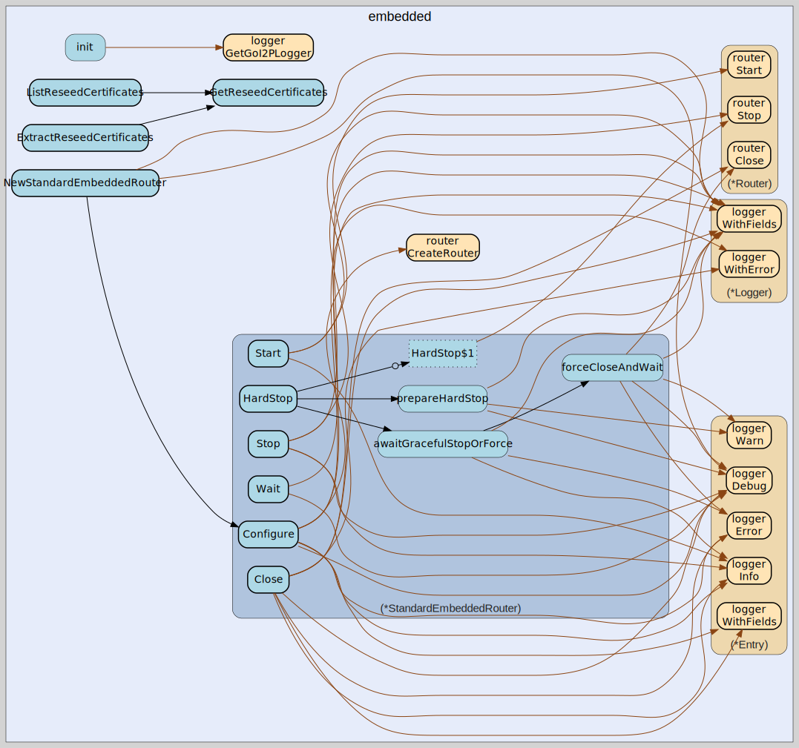

# embedded
--
    import "github.com/go-i2p/go-i2p/lib/embedded"



Package embedded provides a reusable interface for embedding I2P routers into Go
applications.

This package extracts router lifecycle management from the main application into
a library that can be used programmatically. It provides thread-safe, structured
lifecycle management for I2P router instances.

# Basic Usage

    cfg := config.DefaultRouterConfig()
    router, err := embedded.NewStandardEmbeddedRouter(cfg)
    if err != nil {
        log.Fatal(err)
    }

    if err := router.Configure(cfg); err != nil {
        log.Fatal(err)
    }

    if err := router.Start(); err != nil {
        log.Fatal(err)
    }
    defer router.Close()

    router.Wait()

# Lifecycle

The embedded router follows a strict lifecycle:

    1. Create with NewStandardEmbeddedRouter()
    2. Configure with Configure()
    3. Start with Start()
    4. Run with Wait()
    5. Stop with Stop()
    6. Cleanup with Close()

# Thread Safety

All methods are thread-safe and can be called concurrently. The implementation
uses sync.RWMutex to protect internal state.

# Error Handling

All lifecycle methods return errors that can be inspected. The package follows
the project's error handling conventions with structured logging.

# Graceful Shutdown

The Stop() method performs graceful shutdown, waiting for subsystems to complete
in-flight operations. For immediate termination, use HardStop().

## Usage

#### type EmbeddedRouter

```go
type EmbeddedRouter interface {
	// Configure initializes the router with the provided configuration.
	// Must be called before Start(). Returns error if configuration is invalid
	// or if router is already configured.
	Configure(cfg *config.RouterConfig) error

	// Start begins router operations, starting all subsystems (networking,
	// tunnels, netdb, etc.). Returns error if router fails to start or if
	// called before Configure().
	Start() error

	// Stop performs graceful shutdown of the router, allowing in-flight
	// operations to complete. Returns error if shutdown fails or times out.
	Stop() error

	// HardStop performs immediate termination of the router without waiting
	// for graceful cleanup. Use only when Stop() is insufficient.
	HardStop()
}
```

EmbeddedRouter defines the interface for an embeddable I2P router instance. This
interface allows programmatic control of router lifecycle for applications that
need to embed an I2P router rather than run it as a standalone process.

#### type StandardEmbeddedRouter

```go
type StandardEmbeddedRouter struct {
}
```

StandardEmbeddedRouter is the standard implementation of EmbeddedRouter. It
wraps a router.Router instance and manages its lifecycle with proper
thread-safety and error handling.

#### func  NewStandardEmbeddedRouter

```go
func NewStandardEmbeddedRouter(cfg *config.RouterConfig) (*StandardEmbeddedRouter, error)
```
NewStandardEmbeddedRouter creates a new embedded router instance. The router
must be configured with Configure() before calling Start().

Returns error if the configuration is nil or invalid.

#### func (*StandardEmbeddedRouter) Close

```go
func (e *StandardEmbeddedRouter) Close() error
```
Close releases all resources associated with the router. This should be called
after Stop() to ensure proper cleanup.

#### func (*StandardEmbeddedRouter) Configure

```go
func (e *StandardEmbeddedRouter) Configure(cfg *config.RouterConfig) error
```
Configure initializes the router with the provided configuration. This method
creates the underlying router instance but does not start it.

#### func (*StandardEmbeddedRouter) HardStop

```go
func (e *StandardEmbeddedRouter) HardStop()
```
HardStop performs immediate termination without graceful cleanup. Use this only
when Stop() fails or when immediate termination is required.

#### func (*StandardEmbeddedRouter) IsConfigured

```go
func (e *StandardEmbeddedRouter) IsConfigured() bool
```
IsConfigured returns true if the router has been configured.

#### func (*StandardEmbeddedRouter) IsRunning

```go
func (e *StandardEmbeddedRouter) IsRunning() bool
```
IsRunning returns true if the router is currently running.

#### func (*StandardEmbeddedRouter) Start

```go
func (e *StandardEmbeddedRouter) Start() error
```
Start begins router operations. The router must be configured before calling
Start(). This method starts all router subsystems and blocks until the router is
fully started.

#### func (*StandardEmbeddedRouter) Stop

```go
func (e *StandardEmbeddedRouter) Stop() error
```
Stop performs graceful shutdown of the router. This method stops all router
subsystems and waits for them to shut down cleanly.

#### func (*StandardEmbeddedRouter) Wait

```go
func (e *StandardEmbeddedRouter) Wait()
```
Wait blocks until the router shuts down. This method can be called after Start()
to keep the router running until Stop() is called.


embedded 

github.com/go-i2p/go-i2p/lib/embedded

[go-i2p template file](/template.md)
