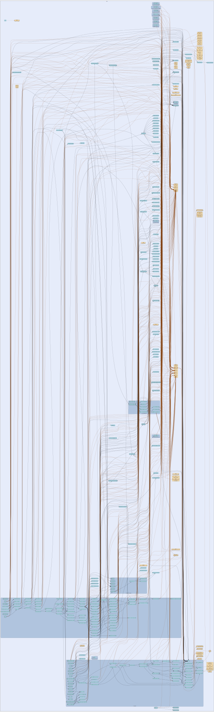

# i2cp
--
    import "github.com/go-i2p/go-i2p/lib/i2cp"



Package i2cp implements the I2P Client Protocol (I2CP) server.

I2CP allows client applications to communicate with the I2P network by:

    - Creating sessions with destination keypairs
    - Sending and receiving messages through tunnels
    - Managing LeaseSet publication

The server listens on localhost:7654 by default (configurable via
--i2cp.address). Protocol version: I2CP v2.10.0

Main components:

    - Server: Handles TCP/Unix socket connections
    - Session: Manages client sessions and tunnel pools
    - MessageRouter: Routes messages through tunnel system
    - Publisher: Publishes LeaseSets to NetDB

Package i2cp implements the I2P Client Protocol (I2CP) v2.10.0.

I2CP is the protocol used by client applications to communicate with the I2P
router. It allows clients to create sessions, send messages, and receive
messages through the I2P network.

Protocol Overview: - TCP-based client-server protocol (default port: 7654) -
Each message has: type (1 byte), session ID (2 bytes), length (4 bytes), payload
- Session IDs 0x0000 and 0xFFFF are reserved - Supports authentication, tunnel
management, and message delivery

## Usage

```go
const (
	HostLookupTypeHash     = 0 // Lookup by destination hash
	HostLookupTypeHostname = 1 // Lookup by hostname
)
```

```go
const (
	HostReplySuccess  = 0 // Destination found
	HostReplyNotFound = 1 // Destination not found
	HostReplyTimeout  = 2 // Lookup timed out
	HostReplyError    = 3 // Generic error
)
```

```go
const (
	// Session management
	MessageTypeCreateSession      = 1 // Client -> Router: Create new session
	MessageTypeSessionStatus      = 2 // Router -> Client: Session creation result
	MessageTypeReconfigureSession = 3 // Client -> Router: Update session config
	MessageTypeDestroySession     = 4 // Client -> Router: Terminate session

	// LeaseSet management
	MessageTypeCreateLeaseSet          = 5  // Client -> Router: Publish LeaseSet (deprecated)
	MessageTypeRequestLeaseSet         = 6  // Router -> Client: Request LeaseSet update
	MessageTypeRequestVariableLeaseSet = 37 // Router -> Client: Request LeaseSet (with lease data)
	MessageTypeCreateLeaseSet2         = 41 // Client -> Router: Publish LeaseSet2 (modern, v0.9.39+)

	// Message delivery
	MessageTypeSendMessage        = 7  // Client -> Router: Send message to destination
	MessageTypeMessagePayload     = 8  // Router -> Client: Received message
	MessageTypeMessageStatus      = 22 // Router -> Client: Message delivery status
	MessageTypeDisconnect         = 30 // Client -> Router: Graceful disconnect
	MessageTypeSendMessageExpires = 36 // Client -> Router: Send message with TTL

	// Status and information
	MessageTypeGetBandwidthLimits = 9  // Client -> Router: Query bandwidth
	MessageTypeBandwidthLimits    = 10 // Router -> Client: Bandwidth limits response
	MessageTypeGetDate            = 11 // Client -> Router: Query router time
	MessageTypeSetDate            = 12 // Router -> Client: Current router time

	// Naming service (modern types)
	MessageTypeHostLookup = 38 // Client -> Router: Destination lookup by hash or hostname
	MessageTypeHostReply  = 39 // Router -> Client: Destination lookup result

	// Advanced features
	MessageTypeBlindingInfo = 42 // Client -> Router: Blinded destination parameters

	// Deprecated/legacy message types
	MessageTypeHostLookupDeprecated = 13 // Deprecated in v2.10.0, use type 38
	MessageTypeHostReplyDeprecated  = 14 // Deprecated in v2.10.0, use type 39
)
```
Message type constants as defined in I2CP v2.10.0

```go
const (
	SessionIDReservedControl   = 0x0000 // Control messages (pre-session)
	SessionIDReservedBroadcast = 0xFFFF // Broadcast to all sessions
)
```
Reserved session IDs

```go
const (
	ProtocolVersionMajor = 2
	ProtocolVersionMinor = 10
	ProtocolVersionPatch = 0
)
```
Protocol version constants

```go
const (
	// MessageStatusAccepted indicates the message was accepted for delivery.
	// Sent immediately when SendMessage is received.
	MessageStatusAccepted = 1

	// MessageStatusSuccess indicates the message was successfully delivered.
	// Sent after routing completes successfully.
	MessageStatusSuccess = 4

	// MessageStatusFailure indicates the message delivery failed.
	// Generic failure status.
	MessageStatusFailure = 5

	// MessageStatusNoTunnels indicates delivery failed due to no available tunnels.
	// Sent when the session has no outbound tunnels.
	MessageStatusNoTunnels = 16

	// MessageStatusNoLeaseSet indicates delivery failed due to missing LeaseSet.
	// Sent when the destination's LeaseSet cannot be found.
	MessageStatusNoLeaseSet = 21
)
```
MessageStatus codes as defined in I2CP specification. These codes indicate the
delivery status of messages sent via SendMessage.

```go
const (
	// MaxPayloadSize is the maximum size for I2CP message payloads.
	// i2psnark compatibility: The I2CP wire format uses a 4-byte length field (uint32),
	// theoretically supporting up to 4 GB. Java I2P routers accept payloads larger than
	// 64 KB. i2psnark-standalone sends payloads exceeding 65535 bytes for file transfers.
	// Setting limit to 256 KB (262144 bytes) to match Java I2P behavior while preventing
	// memory exhaustion attacks. This allows i2psnark to function properly while maintaining
	// reasonable DoS protection.
	MaxPayloadSize = 262144 // 256 KB

	// MaxMessageSize is the maximum total I2CP message size including header.
	// Header: type(1) + sessionID(2) + length(4) = 7 bytes
	MaxMessageSize = 7 + MaxPayloadSize

	// DefaultPayloadSize is the typical payload size for most I2CP messages.
	// Payloads exceeding this threshold trigger warning logs.
	DefaultPayloadSize = 8192 // 8 KB

	// MessageReadTimeout is the maximum time allowed to read a complete message.
	// This prevents slow-send attacks where attackers claim large payloads
	// but drip-feed data slowly to exhaust connection resources.
	MessageReadTimeout = 30 // seconds
)
```
Protocol limits as per I2CP specification

#### func  MessageTypeName

```go
func MessageTypeName(msgType uint8) string
```
MessageTypeName returns a human-readable name for the message type

#### func  ValidateSessionConfig

```go
func ValidateSessionConfig(config *SessionConfig) error
```
ValidateSessionConfig validates session configuration values are within
acceptable ranges. Returns error if validation fails.

#### func  WriteMessage

```go
func WriteMessage(w io.Writer, msg *Message) error
```
WriteMessage writes a complete I2CP message to a writer

#### type DisconnectPayload

```go
type DisconnectPayload struct {
	Reason string // UTF-8 disconnect reason string
}
```

DisconnectPayload represents the payload structure of a Disconnect (type 30)
message. This message allows graceful connection termination with a reason
string.

Format per I2CP v2.10.0 specification:

    ReasonLength: uint16 (2 bytes) - length of reason string in bytes
    Reason: string (variable length) - UTF-8 encoded disconnect reason

Common disconnect reasons: - "client shutdown" - Normal client termination -
"timeout" - Connection timeout - "protocol error" - Invalid message received -
"version mismatch" - Incompatible protocol version

The server should clean up all session resources and close the connection after
receiving this message.

#### func  ParseDisconnectPayload

```go
func ParseDisconnectPayload(data []byte) (*DisconnectPayload, error)
```
ParseDisconnectPayload deserializes a Disconnect payload from wire format.
Returns an error if the payload is too short or malformed.

Wire format:

    bytes 0-1:  Reason length (uint16, big endian)
    bytes 2+:   Reason string (UTF-8, length specified by bytes 0-1)

#### func (*DisconnectPayload) MarshalBinary

```go
func (dp *DisconnectPayload) MarshalBinary() ([]byte, error)
```
MarshalBinary serializes the DisconnectPayload to wire format. Returns the
serialized bytes ready to be sent as an I2CP message payload.

#### type HostLookupPayload

```go
type HostLookupPayload struct {
	RequestID  uint32 // Unique request identifier
	LookupType uint16 // 0=hash, 1=hostname
	Query      string // Hash or hostname to lookup
}
```

HostLookupPayload represents the payload structure of a HostLookup (type 38)
message. This message allows clients to query for destination information by
hash or hostname.

Format per I2CP v2.10.0 specification:

    RequestID: uint32 (4 bytes) - unique request identifier for matching reply
    LookupType: uint16 (2 bytes) - 0=hash lookup, 1=hostname lookup
    QueryLength: uint16 (2 bytes) - length of query string in bytes
    Query: string (variable length) - hash or hostname to lookup

Lookup types: - 0: Hash lookup - Query is base32 destination hash - 1: Hostname
lookup - Query is .i2p hostname

The server will return a HostReply message with the same RequestID.

#### func  ParseHostLookupPayload

```go
func ParseHostLookupPayload(data []byte) (*HostLookupPayload, error)
```
ParseHostLookupPayload deserializes a HostLookup payload from wire format.
Returns an error if the payload is too short or malformed.

Wire format:

    bytes 0-3:   RequestID (uint32, big endian)
    bytes 4-5:   LookupType (uint16, big endian)
    bytes 6-7:   Query length (uint16, big endian)
    bytes 8+:    Query string (length specified by bytes 6-7)

#### func (*HostLookupPayload) MarshalBinary

```go
func (hlp *HostLookupPayload) MarshalBinary() ([]byte, error)
```
MarshalBinary serializes the HostLookupPayload to wire format. Returns the
serialized bytes ready to be sent as an I2CP message payload.

#### type HostReplyPayload

```go
type HostReplyPayload struct {
	RequestID   uint32 // Matches RequestID from HostLookup
	ResultCode  uint8  // 0=success, non-zero=error
	Destination []byte // Full destination (empty if error)
}
```

HostReplyPayload represents the payload structure of a HostReply (type 39)
message. This is the server's response to a HostLookup request.

Format per I2CP v2.10.0 specification:

    RequestID: uint32 (4 bytes) - matches the RequestID from HostLookup
    ResultCode: uint8 (1 byte) - 0=success, non-zero=error code
    Destination: []byte (variable, 387+ bytes if found) - full destination (optional)

Result codes: - 0: Success - destination found - 1: Not found - destination does
not exist - 2: Timeout - lookup timed out - 3: Error - generic error during
lookup

If ResultCode is 0 (success), Destination contains the full destination
structure. If ResultCode is non-zero, Destination is empty.

#### func  ParseHostReplyPayload

```go
func ParseHostReplyPayload(data []byte) (*HostReplyPayload, error)
```
ParseHostReplyPayload deserializes a HostReply payload from wire format. Returns
an error if the payload is too short or malformed.

Wire format:

    bytes 0-3:   RequestID (uint32, big endian)
    byte 4:      ResultCode (uint8)
    bytes 5+:    Destination (optional, only if ResultCode=0)

#### func (*HostReplyPayload) MarshalBinary

```go
func (hrp *HostReplyPayload) MarshalBinary() ([]byte, error)
```
MarshalBinary serializes the HostReplyPayload to wire format. Returns the
serialized bytes ready to be sent as an I2CP message payload.

#### type IncomingMessage

```go
type IncomingMessage struct {
	Payload   []byte    // Message data
	Timestamp time.Time // When the message was received
}
```

IncomingMessage represents a message received from the I2P network

#### type LeaseSetPublisher

```go
type LeaseSetPublisher interface {
	// PublishLeaseSet publishes a LeaseSet to the network database and distributed network.
	//
	// Parameters:
	//   - key: The destination hash (SHA256 of the destination)
	//   - leaseSetData: The serialized LeaseSet2 bytes
	//
	// Returns an error if publication fails at any stage (local storage or network distribution).
	PublishLeaseSet(key common.Hash, leaseSetData []byte) error
}
```

LeaseSetPublisher defines the interface for publishing LeaseSets to the network.
This interface allows I2CP sessions to publish their LeaseSets without depending
directly on the router or netdb implementations.

Implementations should: - Store the LeaseSet in the local NetDB - Send
DatabaseStore messages to floodfill routers for network distribution - Handle
any errors during the publication process

#### type Message

```go
type Message struct {
	Type      uint8  // Message type
	SessionID uint16 // Session identifier
	Payload   []byte // Message payload
}
```

Message represents a generic I2CP message

#### func  ReadMessage

```go
func ReadMessage(r io.Reader) (*Message, error)
```
ReadMessage reads a complete I2CP message from a reader

#### func (*Message) MarshalBinary

```go
func (m *Message) MarshalBinary() ([]byte, error)
```
MarshalBinary serializes the I2CP message to wire format Format: type(1) +
sessionID(2) + length(4) + payload(variable)

#### func (*Message) UnmarshalBinary

```go
func (m *Message) UnmarshalBinary(data []byte) error
```
UnmarshalBinary deserializes an I2CP message from wire format

#### type MessagePayloadPayload

```go
type MessagePayloadPayload struct {
	MessageID uint32 // Unique message identifier
	Payload   []byte // Decrypted message data (variable length, max 256 KB)
}
```

MessagePayloadPayload represents the payload structure of a MessagePayload (type
8) message. This structure follows the I2CP v2.10.0 specification for
router-to-client message delivery.

Format:

    SessionID: uint16 (already in Message header)
    MessageID: uint32 (4 bytes) - unique identifier for this message
    Payload: []byte (variable length) - decrypted message data

The router sends this to the client after receiving and decrypting a message
from the I2P network destined for the client's destination.

IMPORTANT: Per I2CP wire format, the total payload size is limited to
MaxPayloadSize (currently 256 KB for i2psnark compatibility). Messages larger
than this limit cannot be delivered via I2CP and must be fragmented at the
application layer by the sender.

#### func  ParseMessagePayloadPayload

```go
func ParseMessagePayloadPayload(data []byte) (*MessagePayloadPayload, error)
```
ParseMessagePayloadPayload deserializes a MessagePayload payload from wire
format. Returns an error if the payload is too short or malformed.

Wire format:

    bytes 0-3:   MessageID (4 bytes, big endian)
    bytes 4+:    Message payload (variable length)

#### func (*MessagePayloadPayload) MarshalBinary

```go
func (mpp *MessagePayloadPayload) MarshalBinary() ([]byte, error)
```
MarshalBinary serializes the MessagePayloadPayload to wire format. Returns the
serialized bytes ready to be sent as an I2CP message payload.

#### type MessageRouter

```go
type MessageRouter struct {
}
```

MessageRouter handles routing outbound I2CP messages through the I2P network. It
coordinates garlic encryption, tunnel selection, and message transmission.

Design: - Encapsulates the message routing logic in a dedicated component - Uses
existing garlic session manager for encryption - Integrates with tunnel pools
for outbound routing - Delegates actual transmission to transport layer

#### func  NewMessageRouter

```go
func NewMessageRouter(garlicMgr *i2np.GarlicSessionManager, transportSend TransportSendFunc) *MessageRouter
```
NewMessageRouter creates a new message router with the given garlic session
manager. The transportSend callback will be used to send encrypted messages to
the network.

#### func (*MessageRouter) RouteOutboundMessage

```go
func (mr *MessageRouter) RouteOutboundMessage(
	session *Session,
	messageID uint32,
	destinationHash common.Hash,
	destinationPubKey [32]byte,
	payload []byte,
	expirationMs uint64,
	statusCallback MessageStatusCallback,
) error
```
RouteOutboundMessage routes a message from an I2CP client through the I2P
network. This implements the complete outbound message flow: 1. Check message
expiration (if expirationMs > 0) 2. Create garlic message with Data clove
containing the payload 3. Encrypt garlic message for destination using
ECIES-X25519-AEAD 4. Select outbound tunnel from session's pool 5. Send
encrypted garlic through tunnel gateway 6. Invoke status callback with delivery
status

Parameters: - session: I2CP session sending the message - messageID: Unique
identifier for tracking this message - destinationHash: Hash of the target I2P
destination - destinationPubKey: X25519 public key of the destination (for
garlic encryption) - payload: Raw message data to send - expirationMs:
Expiration timestamp in milliseconds since epoch (0 = no expiration) -
statusCallback: Optional callback to notify about delivery status (nil allowed)

Returns an error if routing fails at any step.

#### func (*MessageRouter) SendThroughTunnel

```go
func (mr *MessageRouter) SendThroughTunnel(tunnel *tunnel.TunnelState, msg i2np.I2NPMessage) error
```
SendThroughTunnel sends an I2NP message through a specific tunnel. This is a
lower-level method that can be used when the tunnel is already selected.

Parameters: - tunnel: The tunnel to send through - msg: The I2NP message to send
(already encrypted if needed)

Returns an error if sending fails.

#### type MessageStatusCallback

```go
type MessageStatusCallback func(messageID uint32, statusCode uint8, messageSize, nonce uint32)
```

MessageStatusCallback is invoked to notify about message delivery status
changes. Implementations should handle the callback asynchronously to avoid
blocking the router.

Parameters: - messageID: Unique identifier for the message (client-provided or
generated) - statusCode: Status code indicating delivery outcome (see
MessageStatus* constants) - messageSize: Size of the original message payload in
bytes - nonce: Optional nonce value (0 if not applicable)

#### type SendMessageExpiresPayload

```go
type SendMessageExpiresPayload struct {
	Destination data.Hash // 32-byte SHA256 hash of target destination
	Payload     []byte    // Message data to send (variable length, max 256 KB)
	Nonce       uint32    // Random nonce for message identification
	Flags       uint16    // Delivery flags (reserved, set to 0)
	Expiration  uint64    // Expiration time in milliseconds since epoch (48-bit)
}
```

SendMessageExpiresPayload represents the payload structure of a
SendMessageExpires (type 36) message. This is an enhanced version of SendMessage
that includes expiration time and delivery flags.

Format per I2CP v2.10.0 specification:

    Destination: Hash (32 bytes) - SHA256 hash of target destination
    Payload: []byte (variable length) - actual message data to send
    Nonce: uint32 (4 bytes) - random nonce for message identification
    Flags: uint16 (2 bytes) - delivery flags (currently unused, set to 0)
    Expiration: uint64 (6 bytes) - expiration timestamp (milliseconds since epoch, only lower 48 bits used)

The Expiration field is a 48-bit timestamp (6 bytes) representing milliseconds
since Unix epoch. Messages that have passed their expiration time will not be
sent and will receive a failure status.

Flags field is reserved for future use (e.g., priority, encryption options).
Currently should be set to 0.

#### func  ParseSendMessageExpiresPayload

```go
func ParseSendMessageExpiresPayload(data []byte) (*SendMessageExpiresPayload, error)
```
ParseSendMessageExpiresPayload deserializes a SendMessageExpires payload from
wire format. Returns an error if the payload is too short or malformed.

Wire format:

    bytes 0-31:      Destination hash (32 bytes)
    bytes 32-(N-13): Message payload (variable length)
    bytes (N-12)-(N-9): Nonce (4 bytes, big endian)
    bytes (N-8)-(N-7):  Flags (2 bytes, big endian)
    bytes (N-6)-(N-1):  Expiration (6 bytes, big endian, 48-bit timestamp)

Where N is the total payload size.

#### func (*SendMessageExpiresPayload) MarshalBinary

```go
func (smp *SendMessageExpiresPayload) MarshalBinary() ([]byte, error)
```
MarshalBinary serializes the SendMessageExpiresPayload to wire format. Returns
the serialized bytes ready to be sent as an I2CP message payload.

#### type SendMessagePayload

```go
type SendMessagePayload struct {
	Destination data.Hash // 32-byte SHA256 hash of target destination
	Payload     []byte    // Message data to send (variable length, max 256 KB)
}
```

SendMessagePayload represents the payload structure of a SendMessage (type 7)
message. This structure follows the I2CP v2.10.0 specification for
client-to-router message delivery.

Format:

    SessionID: uint16 (already in Message header)
    Destination: Hash (32 bytes) - SHA256 hash of target destination
    Payload: []byte (variable length) - actual message data to send

The router will wrap this payload in garlic encryption and route it through the
outbound tunnel pool to the specified destination.

IMPORTANT: Per I2CP wire format, the total payload size is limited to
MaxPayloadSize (currently 256 KB for i2psnark compatibility). Client
applications like i2psnark may send payloads larger than the original 64 KB
limit. Applications requiring larger messages should fragment them at the
application layer, though i2psnark file transfers can use the full 256 KB limit.

#### func  ParseSendMessagePayload

```go
func ParseSendMessagePayload(data []byte) (*SendMessagePayload, error)
```
ParseSendMessagePayload deserializes a SendMessage payload from wire format.
Returns an error if the payload is too short or malformed.

Wire format:

    bytes 0-31:  Destination hash (32 bytes)
    bytes 32+:   Message payload (variable length)

#### func (*SendMessagePayload) MarshalBinary

```go
func (smp *SendMessagePayload) MarshalBinary() ([]byte, error)
```
MarshalBinary serializes the SendMessagePayload to wire format. Returns the
serialized bytes ready to be sent as an I2CP message payload.

#### type Server

```go
type Server struct {
}
```

Server is an I2CP protocol server that accepts client connections

#### func  NewServer

```go
func NewServer(config *ServerConfig) (*Server, error)
```
NewServer creates a new I2CP server

#### func (*Server) IsRunning

```go
func (s *Server) IsRunning() bool
```
IsRunning returns whether the server is currently running

#### func (*Server) SessionManager

```go
func (s *Server) SessionManager() *SessionManager
```
SessionManager returns the server's session manager

#### func (*Server) SetDestinationResolver

```go
func (s *Server) SetDestinationResolver(resolver interface {
	ResolveDestination(destHash common.Hash) ([32]byte, error)
},
)
```
SetDestinationResolver sets the destination resolver for looking up encryption
keys. This enables the server to resolve destination hashes to X25519 public
keys from the NetDB for garlic encryption.

#### func (*Server) SetMessageRouter

```go
func (s *Server) SetMessageRouter(router *MessageRouter)
```
SetMessageRouter sets the message router for outbound message handling. This
should be called after creating the server and before starting it.

#### func (*Server) Start

```go
func (s *Server) Start() error
```
Start begins listening for I2CP connections

#### func (*Server) Stop

```go
func (s *Server) Stop() error
```
Stop gracefully stops the server

#### type ServerConfig

```go
type ServerConfig struct {
	// Address to listen on (e.g., "localhost:7654" or "/tmp/i2cp.sock" for Unix socket)
	ListenAddr string

	// Network type: "tcp" or "unix"
	Network string

	// Maximum number of concurrent sessions
	MaxSessions int

	// LeaseSet publisher for distributing LeaseSets to the network (optional)
	// If nil, sessions will function but won't publish to the network
	LeaseSetPublisher LeaseSetPublisher
}
```

ServerConfig holds configuration for the I2CP server

#### func  DefaultServerConfig

```go
func DefaultServerConfig() *ServerConfig
```
DefaultServerConfig returns a ServerConfig with sensible defaults

#### type Session

```go
type Session struct {
}
```

Session represents an active I2CP client session

#### func  NewSession

```go
func NewSession(id uint16, dest *destination.Destination, config *SessionConfig) (*Session, error)
```
NewSession creates a new I2CP session with its own isolated in-memory NetDB. The
destination parameter can be nil, in which case a new destination will be
generated. Each session gets a completely separate in-memory StdNetDB instance
to prevent client linkability. Client NetDBs are ephemeral and not persisted to
disk.

#### func (*Session) Config

```go
func (s *Session) Config() *SessionConfig
```
Config returns the session configuration

#### func (*Session) CreateEncryptedLeaseSet

```go
func (s *Session) CreateEncryptedLeaseSet() ([]byte, error)
```
CreateEncryptedLeaseSet generates an EncryptedLeaseSet from the session's active
tunnels.

EncryptedLeaseSet provides enhanced privacy by: - Blinding the destination
(changes daily based on UTC date) - Encrypting the inner LeaseSet2 data - Using
a cookie-based authentication scheme

This method will: 1. Validate the destination supports EncryptedLeaseSet
(Ed25519 only) 2. Derive/update the blinded destination (rotates daily at UTC
midnight) 3. Collect active inbound tunnels 4. Build leases from tunnels 5.
Create inner LeaseSet2 6. Encrypt inner LeaseSet2 7. Sign EncryptedLeaseSet with
blinded signing key

Returns serialized EncryptedLeaseSet bytes or error.

#### func (*Session) CreateLeaseSet

```go
func (s *Session) CreateLeaseSet() ([]byte, error)
```
CreateLeaseSet generates a new LeaseSet2 for this session using active inbound
tunnels. The LeaseSet2 contains leases from the inbound tunnel pool and is
signed by the session's destination private signing key. Uses modern X25519
encryption keys. This method requires: - The session is active - The session has
private keys (generated during session creation) - The inbound tunnel pool is
set and contains at least one active tunnel

Returns the serialized LeaseSet2 ready for publishing to the network database.
The LeaseSet is also cached in the session for maintenance purposes.

#### func (*Session) CreatedAt

```go
func (s *Session) CreatedAt() time.Time
```
CreatedAt returns when the session was created

#### func (*Session) CurrentLeaseSet

```go
func (s *Session) CurrentLeaseSet() []byte
```
CurrentLeaseSet returns the currently cached LeaseSet, if any. Returns nil if no
LeaseSet has been generated yet.

#### func (*Session) Destination

```go
func (s *Session) Destination() *destination.Destination
```
Destination returns the session's destination

#### func (*Session) ID

```go
func (s *Session) ID() uint16
```
ID returns the session ID

#### func (*Session) InboundPool

```go
func (s *Session) InboundPool() *tunnel.Pool
```
InboundPool returns the inbound tunnel pool

#### func (*Session) IsActive

```go
func (s *Session) IsActive() bool
```
IsActive returns whether the session is active

#### func (*Session) LeaseSetAge

```go
func (s *Session) LeaseSetAge() time.Duration
```
LeaseSetAge returns how long ago the current LeaseSet was published. Returns 0
if no LeaseSet exists.

#### func (*Session) OutboundPool

```go
func (s *Session) OutboundPool() *tunnel.Pool
```
OutboundPool returns the outbound tunnel pool

#### func (*Session) QueueIncomingMessage

```go
func (s *Session) QueueIncomingMessage(payload []byte) error
```
QueueIncomingMessage queues a message for delivery to the client Returns an
error if the session is not active or the queue is full

#### func (*Session) QueueIncomingMessageWithID

```go
func (s *Session) QueueIncomingMessageWithID(messageID uint32, payload []byte) error
```
QueueIncomingMessageWithID queues a message for delivery to the client with a
message ID. This is a higher-level method that wraps the payload in a
MessagePayloadPayload structure before queuing it for delivery. The message ID
can be used for tracking and correlation. Returns an error if the session is not
active or the queue is full.

#### func (*Session) ReceiveMessage

```go
func (s *Session) ReceiveMessage() (*IncomingMessage, error)
```
ReceiveMessage blocks until a message is available or the session is stopped
Returns nil, nil if the session is stopped

#### func (*Session) Reconfigure

```go
func (s *Session) Reconfigure(newConfig *SessionConfig) error
```
Reconfigure updates the session configuration Note: This only updates config
values, tunnel pools need to be recreated separately

#### func (*Session) SetInboundPool

```go
func (s *Session) SetInboundPool(pool *tunnel.Pool)
```
SetInboundPool sets the inbound tunnel pool for this session

#### func (*Session) SetLeaseSetPublisher

```go
func (s *Session) SetLeaseSetPublisher(publisher LeaseSetPublisher)
```
SetLeaseSetPublisher configures the publisher for distributing LeaseSets to the
network. This should be called during session initialization before starting
LeaseSet maintenance. The publisher is responsible for storing LeaseSets in the
local NetDB and distributing them to floodfill routers on the I2P network.

#### func (*Session) SetOutboundPool

```go
func (s *Session) SetOutboundPool(pool *tunnel.Pool)
```
SetOutboundPool sets the outbound tunnel pool for this session

#### func (*Session) StartLeaseSetMaintenance

```go
func (s *Session) StartLeaseSetMaintenance() error
```
StartLeaseSetMaintenance begins automatic LeaseSet maintenance. This runs a
background goroutine that: - Regenerates the LeaseSet before it expires -
Publishes updated LeaseSets when tunnels change - Ensures the session remains
reachable on the network

The maintenance interval is calculated based on TunnelLifetime: - Check every
TunnelLifetime/4 (e.g., every 2.5 minutes for 10-minute tunnels) - Regenerate
when remaining lifetime < TunnelLifetime/2

Must be called after tunnel pools are started.

#### func (*Session) Stop

```go
func (s *Session) Stop()
```
Stop gracefully stops the session and cleans up resources

#### type SessionConfig

```go
type SessionConfig struct {
	// Tunnel parameters
	InboundTunnelLength  int           // Number of hops for inbound tunnels (default: 3)
	OutboundTunnelLength int           // Number of hops for outbound tunnels (default: 3)
	InboundTunnelCount   int           // Number of inbound tunnels (default: 5)
	OutboundTunnelCount  int           // Number of outbound tunnels (default: 5)
	TunnelLifetime       time.Duration // Tunnel lifetime before rotation (default: 10 minutes)

	// Network parameters
	MessageTimeout time.Duration // Message delivery timeout (default: 60 seconds)

	// Message queue configuration
	MessageQueueSize     int // Incoming message queue buffer size (default: 100)
	MessageRateLimit     int // Maximum messages per second (default: 100, 0 = unlimited)
	MessageRateBurstSize int // Maximum burst size for rate limiting (default: 200)

	// EncryptedLeaseSet configuration (requires Ed25519 destination)
	UseEncryptedLeaseSet bool   // Enable EncryptedLeaseSet generation (default: false)
	BlindingSecret       []byte // Secret for destination blinding (if empty, random generated)
	LeaseSetExpiration   uint16 // LeaseSet expiration in seconds (default: 600 = 10 minutes)

	// Session metadata
	Nickname string // Optional nickname for debugging
}
```

SessionConfig holds the configuration for an I2CP session

#### func  DefaultSessionConfig

```go
func DefaultSessionConfig() *SessionConfig
```
DefaultSessionConfig returns a SessionConfig with sensible defaults

#### func  ParseCreateSessionPayload

```go
func ParseCreateSessionPayload(payload []byte) (*destination.Destination, *SessionConfig, error)
```
ParseCreateSessionPayload parses a CreateSession message payload. Returns the
destination and session configuration.

Wire format:

    - Destination (variable length, typically ~387+ bytes)
    - Options Mapping (2-byte size + key=value; pairs)

#### func  ParseReconfigureSessionPayload

```go
func ParseReconfigureSessionPayload(payload []byte) (*SessionConfig, error)
```
ParseReconfigureSessionPayload parses a ReconfigureSession message payload.
Returns the updated session configuration.

Wire format:

    - Options Mapping (2-byte size + key=value; pairs)

Note: SessionID is in the message header, not the payload.

#### type SessionManager

```go
type SessionManager struct {
}
```

SessionManager manages all active I2CP sessions

#### func  NewSessionManager

```go
func NewSessionManager() *SessionManager
```
NewSessionManager creates a new session manager

#### func (*SessionManager) CreateSession

```go
func (sm *SessionManager) CreateSession(dest *destination.Destination, config *SessionConfig) (*Session, error)
```
CreateSession creates a new session with the given destination and config.

#### func (*SessionManager) DestroySession

```go
func (sm *SessionManager) DestroySession(sessionID uint16) error
```
DestroySession removes and stops a session

#### func (*SessionManager) GetSession

```go
func (sm *SessionManager) GetSession(sessionID uint16) (*Session, bool)
```
GetSession retrieves a session by ID

#### func (*SessionManager) SessionCount

```go
func (sm *SessionManager) SessionCount() int
```
SessionCount returns the number of active sessions

#### func (*SessionManager) StopAll

```go
func (sm *SessionManager) StopAll()
```
StopAll stops all active sessions

#### type TransportSendFunc

```go
type TransportSendFunc func(peerHash common.Hash, msg i2np.I2NPMessage) error
```

TransportSendFunc is a callback function for sending I2NP messages to peers. The
implementation should handle queueing the message to the appropriate transport
session (e.g., NTCP2).

Parameters: - peerHash: Hash of the destination router (gateway) - msg: I2NP
message to send

Returns an error if the message cannot be sent.


i2cp 

github.com/go-i2p/go-i2p/lib/i2cp

[go-i2p template file](/template.md)
