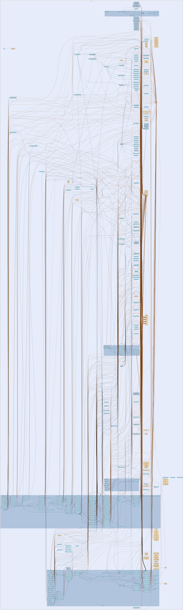

# i2cp
--
    import "github.com/go-i2p/go-i2p/lib/i2cp"



Package i2cp implements the I2P Client Protocol (I2CP) server.

I2CP allows client applications to communicate with the I2P network by:

    - Creating sessions with destination keypairs
    - Sending and receiving messages through tunnels
    - Managing LeaseSet publication

The server listens on localhost:7654 by default (configurable via
--i2cp.address). Protocol version: I2CP v0.9.67

Main components:

    - Server: Handles TCP/Unix socket connections
    - Session: Manages client sessions and tunnel pools
    - MessageRouter: Routes messages through tunnel system
    - Publisher: Publishes LeaseSets to NetDB

Package i2cp implements the I2P Client Protocol (I2CP) v0.9.67.

I2CP is the protocol used by client applications to communicate with the I2P
router. It allows clients to create sessions, send messages, and receive
messages through the I2P network.

Protocol Overview: - TCP-based client-server protocol (default port: 7654) -
Each message has: type (1 byte), session ID (2 bytes), length (4 bytes), payload
- Session IDs 0x0000 and 0xFFFF are reserved - Supports authentication, tunnel
management, and message delivery

## Usage

```go
const (
	HostLookupTypeHash     uint16 = 0 // Lookup by destination hash
	HostLookupTypeHostname uint16 = 1 // Lookup by hostname
)
```

```go
const (
	HostReplySuccess  uint8 = 0 // Destination found
	HostReplyNotFound uint8 = 1 // Destination not found
	HostReplyTimeout  uint8 = 2 // Lookup timed out
	HostReplyError    uint8 = 3 // Generic error
)
```

```go
const (
	// Session management - PER I2CP SPEC v0.9.67
	MessageTypeCreateSession      uint8 = 1  // Client -> Router: Create new session
	MessageTypeSessionStatus      uint8 = 20 // Router -> Client: Session creation result (SPEC: 20, was 2)
	MessageTypeReconfigureSession uint8 = 2  // Client -> Router: Update session config (SPEC: 2, was 3)
	MessageTypeDestroySession     uint8 = 3  // Client -> Router: Terminate session (SPEC: 3, was 4)

	// LeaseSet management
	MessageTypeCreateLeaseSet          uint8 = 4  // Client -> Router: Publish LeaseSet (SPEC: 4, was 5)
	MessageTypeRequestLeaseSet         uint8 = 21 // Router -> Client: Request LeaseSet update (SPEC: 21, was 6)
	MessageTypeRequestVariableLeaseSet uint8 = 37 // Router -> Client: Request LeaseSet (with lease data)
	MessageTypeCreateLeaseSet2         uint8 = 41 // Client -> Router: Publish LeaseSet2 (modern, v0.9.39+)

	// Message delivery
	MessageTypeSendMessage        uint8 = 5  // Client -> Router: Send message to destination (SPEC: 5, was 7)
	MessageTypeMessagePayload     uint8 = 31 // Router -> Client: Received message (SPEC: 31, was 8)
	MessageTypeMessageStatus      uint8 = 22 // Router -> Client: Message delivery status
	MessageTypeDisconnect         uint8 = 30 // Client -> Router: Graceful disconnect
	MessageTypeSendMessageExpires uint8 = 36 // Client -> Router: Send message with TTL

	// Status and information
	MessageTypeGetBandwidthLimits uint8 = 8  // Client -> Router: Query bandwidth (SPEC: 8, was 9)
	MessageTypeBandwidthLimits    uint8 = 23 // Router -> Client: Bandwidth limits response (SPEC: 23, was 10)
	MessageTypeGetDate            uint8 = 32 // Client -> Router: Query router time (SPEC: 32, was 11)
	MessageTypeSetDate            uint8 = 33 // Router -> Client: Current router time (SPEC: 33, was 12)

	// Naming service (modern types)
	MessageTypeHostLookup uint8 = 38 // Client -> Router: Destination lookup by hash or hostname
	MessageTypeHostReply  uint8 = 39 // Router -> Client: Destination lookup result

	// Advanced features
	MessageTypeBlindingInfo uint8 = 42 // Client -> Router: Blinded destination parameters

	// Deprecated/legacy message types
	MessageTypeDestLookup uint8 = 34 // Client -> Router: Deprecated in v0.9.67, use type 38 (SPEC: 34, was 13)
	MessageTypeDestReply  uint8 = 35 // Router -> Client: Deprecated in v0.9.67, use type 39 (SPEC: 35, was 14)

	// Deprecated receive messages (unused in fast receive mode)
	MessageTypeReceiveMessageBegin uint8 = 6 // Client -> Router: DEPRECATED, not supported
	MessageTypeReceiveMessageEnd   uint8 = 7 // Client -> Router: DEPRECATED, not supported
)
```
Message type constants as defined in I2CP v0.9.67

```go
const (
	SessionIDReservedControl   = 0x0000 // Control messages (pre-session)
	SessionIDReservedBroadcast = 0xFFFF // Broadcast to all sessions
)
```
Reserved session IDs

```go
const (
	SessionStatusDestroyed uint8 = 0 // Session has been destroyed
	SessionStatusCreated   uint8 = 1 // Session has been created successfully
	SessionStatusUpdated   uint8 = 2 // Session has been updated/reconfigured
	SessionStatusInvalid   uint8 = 3 // Session request was invalid
	SessionStatusRefused   uint8 = 4 // Session request was refused
)
```
SessionStatus status codes per I2CP spec v0.9.67

```go
const (
	ProtocolVersionMajor = 0
	ProtocolVersionMinor = 9
	ProtocolVersionPatch = 67
)
```
Protocol version constants

```go
const (
	ExpectedProtocolVersionMajor = 0
	ExpectedProtocolVersionMinor = 9
	ExpectedProtocolVersionPatch = 67
)
```
Expected protocol version values for testing and validation. These constants
define the expected I2CP API version that this implementation supports.

```go
const (
	// MessageStatusAccepted indicates the message was accepted for delivery.
	// Sent immediately when SendMessage is received.
	MessageStatusAccepted uint8 = 1

	// MessageStatusSuccess indicates the message was successfully delivered.
	// Sent after routing completes successfully.
	MessageStatusSuccess uint8 = 4

	// MessageStatusFailure indicates the message delivery failed.
	// Generic failure status.
	MessageStatusFailure uint8 = 5

	// MessageStatusNoTunnels indicates delivery failed due to no available tunnels.
	// Sent when the session has no outbound tunnels.
	MessageStatusNoTunnels uint8 = 16

	// MessageStatusNoLeaseSet indicates delivery failed due to missing LeaseSet.
	// Sent when the destination's LeaseSet cannot be found.
	MessageStatusNoLeaseSet uint8 = 21
)
```
MessageStatus codes as defined in I2CP specification. These codes indicate the
delivery status of messages sent via SendMessage.

```go
const (
	// MaxPayloadSize is the maximum size for I2CP message payloads.
	// i2psnark compatibility: The I2CP wire format uses a 4-byte length field (uint32),
	// theoretically supporting up to 4 GB. Java I2P routers accept payloads larger than
	// 64 KB. i2psnark-standalone sends payloads exceeding 65535 bytes for file transfers.
	// Setting limit to 256 KB (262144 bytes) to match Java I2P behavior while preventing
	// memory exhaustion attacks. This allows i2psnark to function properly while maintaining
	// reasonable DoS protection.
	MaxPayloadSize = 262144 // 256 KB

	// MaxMessageSize is the maximum total I2CP message size including header.
	// Header per I2CP spec: length(4) + type(1) = 5 bytes
	MaxMessageSize = 5 + MaxPayloadSize

	// DefaultPayloadSize is the typical payload size for most I2CP messages.
	// Payloads exceeding this threshold trigger warning logs.
	DefaultPayloadSize = 8192 // 8 KB

	// MessageReadTimeout is the maximum time allowed to read a complete message.
	// This prevents slow-send attacks where attackers claim large payloads
	// but drip-feed data slowly to exhaust connection resources.
	MessageReadTimeout = 30 // seconds
)
```
Protocol limits as per I2CP specification

```go
var ErrNoDestinationResolver = errors.New("no destination resolver configured: cannot resolve encryption key")
```
recoverFromAcceptPanic recovers from any panic in the accept loop to prevent
server crash. ErrNoDestinationResolver is returned when a message cannot be
routed because no destination resolver has been configured on the I2CP server.
Without a resolver, the server cannot look up the recipient's public key, so
encryption (and therefore routing) is impossible.

#### func  MessageTypeName

```go
func MessageTypeName(msgType uint8) string
```
MessageTypeName returns a human-readable name for the message type

#### func  ValidateSessionConfig

```go
func ValidateSessionConfig(config *SessionConfig) error
```
ValidateSessionConfig validates session configuration values are within
acceptable ranges. Returns error if validation fails.

#### func  WriteMessage

```go
func WriteMessage(w io.Writer, msg *Message) error
```
WriteMessage writes a complete I2CP message to a writer

#### type Authenticator

```go
type Authenticator interface {
	// Authenticate checks whether the provided username and password are valid.
	// Returns true if the credentials are accepted, false otherwise.
	Authenticate(username, password string) bool
}
```

Authenticator validates I2CP client credentials. Implementations must be safe
for concurrent use.

#### type BlindingInfoPayload

```go
type BlindingInfoPayload struct {
	Enabled bool   // Whether destination blinding is enabled
	Secret  []byte // Blinding secret (nil = generate random, empty = disabled)
}
```

BlindingInfoPayload represents the payload structure of a BlindingInfo (type 42)
message. This message allows clients to configure destination blinding
parameters.

Wire format:

    1 byte:  Blinding enabled flag (0x00 = disabled, 0x01 = enabled)
    N bytes: Blinding secret (optional, 32 bytes if provided; 0 bytes to use random)

If enabled flag is 0x00, no secret is expected and blinding will be disabled. If
enabled flag is 0x01 and no secret follows, a random secret will be generated.
If enabled flag is 0x01 and 32 bytes follow, that secret will be used.

#### func  ParseBlindingInfoPayload

```go
func ParseBlindingInfoPayload(data []byte) (*BlindingInfoPayload, error)
```
ParseBlindingInfoPayload deserializes a BlindingInfo payload from wire format.
Minimum size: 1 byte (enabled flag) Maximum size: 33 bytes (flag + 32-byte
secret)

#### func (*BlindingInfoPayload) MarshalBinary

```go
func (bip *BlindingInfoPayload) MarshalBinary() ([]byte, error)
```
MarshalBinary serializes the BlindingInfoPayload to wire format.

#### type DisconnectPayload

```go
type DisconnectPayload struct {
	Reason string // UTF-8 disconnect reason string
}
```

DisconnectPayload represents the payload structure of a Disconnect (type 30)
message. This message allows graceful connection termination with a reason
string.

Format per I2CP v0.9.67 specification:

    ReasonLength: uint16 (2 bytes) - length of reason string in bytes
    Reason: string (variable length) - UTF-8 encoded disconnect reason

Common disconnect reasons: - "client shutdown" - Normal client termination -
"timeout" - Connection timeout - "protocol error" - Invalid message received -
"version mismatch" - Incompatible protocol version

The server should clean up all session resources and close the connection after
receiving this message.

#### func  ParseDisconnectPayload

```go
func ParseDisconnectPayload(data []byte) (*DisconnectPayload, error)
```
ParseDisconnectPayload deserializes a Disconnect payload from wire format.
Returns an error if the payload is too short or malformed.

Wire format:

    bytes 0-1:  Reason length (uint16, big endian)
    bytes 2+:   Reason string (UTF-8, length specified by bytes 0-1)

#### func (*DisconnectPayload) MarshalBinary

```go
func (dp *DisconnectPayload) MarshalBinary() ([]byte, error)
```
MarshalBinary serializes the DisconnectPayload to wire format. Returns the
serialized bytes ready to be sent as an I2CP message payload.

#### type GarlicMessageEncryptor

```go
type GarlicMessageEncryptor interface {
	// EncryptGarlicMessage encrypts plaintext for a destination.
	// destinationHash: I2P hash identifying the session.
	// destinationPubKey: X25519 public key of the recipient.
	// plaintextGarlic: serialized garlic message bytes.
	// Returns encrypted bytes.
	EncryptGarlicMessage(destinationHash common.Hash, destinationPubKey [32]byte, plaintextGarlic []byte) ([]byte, error)
}
```

GarlicMessageEncryptor provides garlic message encryption for the message
router. This interface is satisfied by both *i2np.GarlicSessionManager (the
concrete adapter) and test mocks. It uses I2P-specific types (common.Hash) at
the boundary.

#### type HostLookupPayload

```go
type HostLookupPayload struct {
	RequestID  uint32 // Unique request identifier
	LookupType uint16 // 0=hash, 1=hostname
	Query      string // Hash or hostname to lookup
}
```

HostLookupPayload represents the payload structure of a HostLookup (type 38)
message. This message allows clients to query for destination information by
hash or hostname.

Format per I2CP v0.9.67 specification:

    RequestID: uint32 (4 bytes) - unique request identifier for matching reply
    LookupType: uint16 (2 bytes) - 0=hash lookup, 1=hostname lookup
    QueryLength: uint16 (2 bytes) - length of query string in bytes
    Query: string (variable length) - hash or hostname to lookup

Lookup types: - 0: Hash lookup - Query is base32 destination hash - 1: Hostname
lookup - Query is .i2p hostname

The server will return a HostReply message with the same RequestID.

#### func  ParseHostLookupPayload

```go
func ParseHostLookupPayload(data []byte) (*HostLookupPayload, error)
```
ParseHostLookupPayload deserializes a HostLookup payload from wire format.
Returns an error if the payload is too short or malformed.

Wire format:

    bytes 0-3:   RequestID (uint32, big endian)
    bytes 4-5:   LookupType (uint16, big endian)
    bytes 6-7:   Query length (uint16, big endian)
    bytes 8+:    Query string (length specified by bytes 6-7)

#### func (*HostLookupPayload) MarshalBinary

```go
func (hlp *HostLookupPayload) MarshalBinary() ([]byte, error)
```
MarshalBinary serializes the HostLookupPayload to wire format. Returns the
serialized bytes ready to be sent as an I2CP message payload.

#### type HostReplyPayload

```go
type HostReplyPayload struct {
	RequestID   uint32 // Matches RequestID from HostLookup
	ResultCode  uint8  // 0=success, non-zero=error
	Destination []byte // Full destination (empty if error)
}
```

HostReplyPayload represents the payload structure of a HostReply (type 39)
message. This is the server's response to a HostLookup request.

Format per I2CP v0.9.67 specification:

    RequestID: uint32 (4 bytes) - matches the RequestID from HostLookup
    ResultCode: uint8 (1 byte) - 0=success, non-zero=error code
    Destination: []byte (variable, 387+ bytes if found) - full destination (optional)

Result codes: - 0: Success - destination found - 1: Not found - destination does
not exist - 2: Timeout - lookup timed out - 3: Error - generic error during
lookup

If ResultCode is 0 (success), Destination contains the full destination
structure. If ResultCode is non-zero, Destination is empty.

#### func  ParseHostReplyPayload

```go
func ParseHostReplyPayload(data []byte) (*HostReplyPayload, error)
```
ParseHostReplyPayload deserializes a HostReply payload from wire format. Returns
an error if the payload is too short or malformed.

Wire format:

    bytes 0-3:   RequestID (uint32, big endian)
    byte 4:      ResultCode (uint8)
    bytes 5+:    Destination (optional, only if ResultCode=0)

#### func (*HostReplyPayload) MarshalBinary

```go
func (hrp *HostReplyPayload) MarshalBinary() ([]byte, error)
```
MarshalBinary serializes the HostReplyPayload to wire format. Returns the
serialized bytes ready to be sent as an I2CP message payload.

#### type HostnameResolver

```go
type HostnameResolver interface {
	// ResolveHostname resolves an I2P hostname (e.g., "forum.i2p") to the raw
	// Destination bytes. Returns the destination bytes and nil on success,
	// or nil and an error if the hostname cannot be resolved.
	ResolveHostname(hostname string) ([]byte, error)
}
```

HostnameResolver resolves .i2p hostnames to their binary Destination
representation. Implementations may use an address book file, naming service, or
subscription list.

#### type IncomingMessage

```go
type IncomingMessage struct {
	Payload   []byte    // Message data
	Timestamp time.Time // When the message was received
}
```

IncomingMessage represents a message received from the I2P network

#### type LeaseSetPublisher

```go
type LeaseSetPublisher interface {
	// PublishLeaseSet publishes a LeaseSet to the network database and distributed network.
	//
	// Parameters:
	//   - key: The destination hash (SHA256 of the destination)
	//   - leaseSetData: The serialized LeaseSet2 bytes
	//
	// Returns an error if publication fails at any stage (local storage or network distribution).
	PublishLeaseSet(key common.Hash, leaseSetData []byte) error
}
```

LeaseSetPublisher defines the interface for publishing LeaseSets to the network.
This interface allows I2CP sessions to publish their LeaseSets without depending
directly on the router or netdb implementations.

Implementations should: - Store the LeaseSet in the local NetDB - Send
DatabaseStore messages to floodfill routers for network distribution - Handle
any errors during the publication process

#### type LeaseSetStore

```go
type LeaseSetStore interface {
	// StoreLeaseSet stores a LeaseSet in the local network database.
	// dataType indicates the LeaseSet type: 1=LeaseSet, 3=LeaseSet2, 5=Encrypted, 7=Meta.
	StoreLeaseSet(key common.Hash, data []byte, dataType byte) error
}
```

LeaseSetStore defines the minimal interface needed for storing LeaseSets in the
NetDB. This is satisfied by *netdb.StdNetDB.

#### type Message

```go
type Message struct {
	Type      uint8  // Message type
	SessionID uint16 // Session identifier (application-level, not in wire format)
	Payload   []byte // Message payload
}
```

Message represents a generic I2CP message. Wire format per I2CP spec: length(4)
+ type(1) + payload(variable) SessionID is NOT in the wire format - it's managed
at the connection/session layer.

#### func  ReadMessage

```go
func ReadMessage(r io.Reader) (*Message, error)
```
ReadMessage reads a complete I2CP message from a reader.

#### func (*Message) MarshalBinary

```go
func (m *Message) MarshalBinary() ([]byte, error)
```
MarshalBinary serializes the I2CP message to wire format Format: type(1) +
sessionID(2) + length(4) + payload(variable)

#### func (*Message) UnmarshalBinary

```go
func (m *Message) UnmarshalBinary(data []byte) error
```
UnmarshalBinary deserializes an I2CP message from wire format Per I2CP spec:
wire format is length(4) + type(1) + payload

#### type MessagePayloadPayload

```go
type MessagePayloadPayload struct {
	SessionID uint16 // Session identifier (included in wire format)
	MessageID uint32 // Unique message identifier
	Payload   []byte // Decrypted message data (variable length, max 256 KB)
}
```

MessagePayloadPayload represents the payload structure of a MessagePayload (type
31) message. This structure follows the I2CP v0.9.67 specification for
router-to-client message delivery.

Format per I2CP spec:

    SessionID: uint16 (2 bytes) - session identifier (part of wire format, not common header)
    MessageID: uint32 (4 bytes) - unique identifier for this message
    Payload: []byte (variable length) - decrypted message data

The router sends this to the client after receiving and decrypting a message
from the I2P network destined for the client's destination.

IMPORTANT: Per I2CP wire format, the total payload size is limited to
MaxPayloadSize (currently 256 KB for i2psnark compatibility). Messages larger
than this limit cannot be delivered via I2CP and must be fragmented at the
application layer by the sender.

#### func  ParseMessagePayloadPayload

```go
func ParseMessagePayloadPayload(data []byte) (*MessagePayloadPayload, error)
```
ParseMessagePayloadPayload deserializes a MessagePayload payload from wire
format. Returns an error if the payload is too short or malformed.

Wire format per I2CP spec:

    bytes 0-1:   SessionID (2 bytes, big endian)
    bytes 2-5:   MessageID (4 bytes, big endian)
    bytes 6+:    Message payload (variable length)

#### func (*MessagePayloadPayload) MarshalBinary

```go
func (mpp *MessagePayloadPayload) MarshalBinary() ([]byte, error)
```
MarshalBinary serializes the MessagePayloadPayload to wire format. Returns the
serialized bytes ready to be sent as an I2CP message payload.

#### type MessageRouter

```go
type MessageRouter struct {
}
```

MessageRouter handles routing outbound I2CP messages through the I2P network. It
coordinates garlic encryption, tunnel selection, and message transmission.

Design: - Encapsulates the message routing logic in a dedicated component - Uses
existing garlic session manager for encryption - Integrates with tunnel pools
for outbound routing - Delegates actual transmission to transport layer

#### func  NewMessageRouter

```go
func NewMessageRouter(garlicMgr GarlicMessageEncryptor, transportSend TransportSendFunc) *MessageRouter
```
NewMessageRouter creates a new message router with the given garlic session
manager. The transportSend callback will be used to send encrypted messages to
the network. Accepts any implementation of GarlicMessageEncryptor, including
*i2np.GarlicSessionManager and test mocks.

#### func (*MessageRouter) RouteOutboundMessage

```go
func (mr *MessageRouter) RouteOutboundMessage(req RouteRequest) error
```
RouteOutboundMessage routes a message from an I2CP client through the I2P
network. This implements the complete outbound message flow: 1. Check message
expiration (if expirationMs > 0) 2. Create garlic message with Data clove
containing the payload 3. Encrypt garlic message for destination using
ECIES-X25519-AEAD 4. Select outbound tunnel from session's pool 5. Send
encrypted garlic through tunnel gateway 6. Invoke status callback with delivery
status

Returns an error if routing fails at any step.

#### func (*MessageRouter) SendThroughTunnel

```go
func (mr *MessageRouter) SendThroughTunnel(tunnel *tunnel.TunnelState, msg i2np.I2NPMessage) error
```
SendThroughTunnel sends an I2NP message through a specific tunnel. This is a
lower-level method that can be used when the tunnel is already selected.

Parameters: - tunnel: The tunnel to send through - msg: The I2NP message to send
(already encrypted if needed)

Returns an error if sending fails.

#### type MessageStatusCallback

```go
type MessageStatusCallback func(messageID uint32, statusCode uint8, messageSize, nonce uint32)
```

MessageStatusCallback is invoked to notify about message delivery status
changes. Implementations should handle the callback asynchronously to avoid
blocking the router.

Parameters: - messageID: Unique identifier for the message (client-provided or
generated) - statusCode: Status code indicating delivery outcome (see
MessageStatus* constants) - messageSize: Size of the original message payload in
bytes - nonce: Optional nonce value (0 if not applicable)

#### type NetDBLeaseSetPublisher

```go
type NetDBLeaseSetPublisher struct {
}
```

NetDBLeaseSetPublisher is a default implementation of LeaseSetPublisher that
stores LeaseSets in the local NetDB. This provides a concrete publisher for I2CP
sessions that need their LeaseSets to be discoverable locally.

For full network distribution (sending DatabaseStore messages to floodfill
routers), an extended implementation should also distribute via I2NP
DatabaseStore messages.

#### func  NewNetDBLeaseSetPublisher

```go
func NewNetDBLeaseSetPublisher(store LeaseSetStore) *NetDBLeaseSetPublisher
```
NewNetDBLeaseSetPublisher creates a new publisher that stores LeaseSets in the
given NetDB. Uses LeaseSet2 (type 3) by default.

#### func  NewNetDBLeaseSetPublisherWithType

```go
func NewNetDBLeaseSetPublisherWithType(store LeaseSetStore, dataType byte) *NetDBLeaseSetPublisher
```
NewNetDBLeaseSetPublisherWithType creates a new publisher with a specific
LeaseSet data type. Valid types: 1 (LeaseSet), 3 (LeaseSet2), 5
(EncryptedLeaseSet), 7 (MetaLeaseSet).

#### func (*NetDBLeaseSetPublisher) PublishLeaseSet

```go
func (p *NetDBLeaseSetPublisher) PublishLeaseSet(key common.Hash, leaseSetData []byte) error
```
PublishLeaseSet stores the LeaseSet in the local NetDB.

#### type PasswordAuthenticator

```go
type PasswordAuthenticator struct {
}
```

PasswordAuthenticator implements simple username/password authentication. It
uses constant-time comparison to prevent timing attacks.

#### func  NewPasswordAuthenticator

```go
func NewPasswordAuthenticator(username, password string) (*PasswordAuthenticator, error)
```
NewPasswordAuthenticator creates an authenticator that accepts a single
username/password pair. Both fields are required and must be non-empty. Returns
an error if username or password is empty.

#### func (*PasswordAuthenticator) Authenticate

```go
func (a *PasswordAuthenticator) Authenticate(username, password string) bool
```
Authenticate checks if the provided credentials match the configured pair. Uses
constant-time comparison to prevent timing side-channel attacks.

#### type RouteRequest

```go
type RouteRequest struct {
	Session           *Session              // I2CP session sending the message
	MessageID         uint32                // Unique identifier for tracking this message
	DestinationHash   common.Hash           // Hash of the target I2P destination
	DestinationPubKey [32]byte              // X25519 public key of the destination
	Payload           []byte                // Raw message data to send
	ExpirationMs      uint64                // Expiration timestamp in ms since epoch (0 = none)
	StatusCallback    MessageStatusCallback // Optional delivery status callback (nil allowed)
}
```

RouteRequest bundles the parameters for routing an outbound I2CP message.

#### type SendMessageExpiresPayload

```go
type SendMessageExpiresPayload struct {
	Destination data.Hash // 32-byte SHA256 hash of target destination
	Payload     []byte    // Message data to send (variable length, max 256 KB)
	Nonce       uint32    // Random nonce for message identification
	Flags       uint16    // Delivery flags (reserved, set to 0)
	Expiration  uint64    // Expiration time in milliseconds since epoch (48-bit)
}
```

SendMessageExpiresPayload represents the payload structure of a
SendMessageExpires (type 36) message. This is an enhanced version of SendMessage
that includes expiration time and delivery flags.

Format per I2CP v0.9.67 specification:

    Destination: Hash (32 bytes) - SHA256 hash of target destination
    Payload: []byte (variable length) - actual message data to send
    Nonce: uint32 (4 bytes) - random nonce for message identification
    Flags: uint16 (2 bytes) - delivery flags (currently unused, set to 0)
    Expiration: uint64 (6 bytes) - expiration timestamp (milliseconds since epoch, only lower 48 bits used)

The Expiration field is a 48-bit timestamp (6 bytes) representing milliseconds
since Unix epoch. Messages that have passed their expiration time will not be
sent and will receive a failure status.

Flags field is reserved for future use (e.g., priority, encryption options).
Currently should be set to 0.

#### func  ParseSendMessageExpiresPayload

```go
func ParseSendMessageExpiresPayload(data []byte) (*SendMessageExpiresPayload, error)
```
ParseSendMessageExpiresPayload deserializes a SendMessageExpires payload from
wire format. Returns an error if the payload is too short or malformed.

Wire format:

    bytes 0-31:      Destination hash (32 bytes)
    bytes 32-(N-13): Message payload (variable length)
    bytes (N-12)-(N-9): Nonce (4 bytes, big endian)
    bytes (N-8)-(N-7):  Flags (2 bytes, big endian)
    bytes (N-6)-(N-1):  Expiration (6 bytes, big endian, 48-bit timestamp)

Where N is the total payload size.

#### func (*SendMessageExpiresPayload) MarshalBinary

```go
func (smp *SendMessageExpiresPayload) MarshalBinary() ([]byte, error)
```
MarshalBinary serializes the SendMessageExpiresPayload to wire format. Returns
the serialized bytes ready to be sent as an I2CP message payload.

#### type SendMessagePayload

```go
type SendMessagePayload struct {
	Destination data.Hash // 32-byte SHA256 hash of target destination
	Payload     []byte    // Message data to send (variable length, max 256 KB)
}
```

SendMessagePayload represents the payload structure of a SendMessage (type 7)
message. This structure follows the I2CP v0.9.67 specification for
client-to-router message delivery.

Format:

    SessionID: uint16 (already in Message header)
    Destination: Hash (32 bytes) - SHA256 hash of target destination
    Payload: []byte (variable length) - actual message data to send

The router will wrap this payload in garlic encryption and route it through the
outbound tunnel pool to the specified destination.

IMPORTANT: Per I2CP wire format, the total payload size is limited to
MaxPayloadSize (currently 256 KB for i2psnark compatibility). Client
applications like i2psnark may send payloads larger than the original 64 KB
limit. Applications requiring larger messages should fragment them at the
application layer, though i2psnark file transfers can use the full 256 KB limit.

#### func  ParseSendMessagePayload

```go
func ParseSendMessagePayload(data []byte) (*SendMessagePayload, error)
```
ParseSendMessagePayload deserializes a SendMessage payload from wire format.
Returns an error if the payload is too short or malformed.

Wire format:

    bytes 0-31:  Destination hash (32 bytes)
    bytes 32+:   Message payload (variable length)

#### func (*SendMessagePayload) MarshalBinary

```go
func (smp *SendMessagePayload) MarshalBinary() ([]byte, error)
```
MarshalBinary serializes the SendMessagePayload to wire format. Returns the
serialized bytes ready to be sent as an I2CP message payload.

#### type Server

```go
type Server struct {
}
```

Server is an I2CP protocol server that accepts client connections

#### func  NewServer

```go
func NewServer(config *ServerConfig) (*Server, error)
```
NewServer creates a new I2CP server

#### func (*Server) GetSessionManager

```go
func (s *Server) GetSessionManager() *SessionManager
```
GetSessionManager returns the underlying SessionManager. This is used by the
Router to wire InboundMessageHandler for tunnel-to-session delivery.

#### func (*Server) IsRunning

```go
func (s *Server) IsRunning() bool
```
IsRunning returns whether the server is currently running

#### func (*Server) SessionManager

```go
func (s *Server) SessionManager() *SessionManager
```
SessionManager returns the server's session manager

#### func (*Server) SetAuthenticator

```go
func (s *Server) SetAuthenticator(auth Authenticator)
```
SetAuthenticator configures the optional authenticator for I2CP connections.
When set, clients must provide valid credentials before creating sessions. Pass
nil to disable authentication (all clients accepted).

This should be called before Start() and is not safe to call concurrently with
active connections.

#### func (*Server) SetBandwidthProvider

```go
func (s *Server) SetBandwidthProvider(bp interface {
	GetBandwidthLimits() (inbound, outbound uint32)
},
)
```
SetBandwidthProvider sets the provider used by handleGetBandwidthLimits to
return real configured bandwidth limits instead of hardcoded defaults.

#### func (*Server) SetDestinationResolver

```go
func (s *Server) SetDestinationResolver(resolver interface {
	ResolveDestination(destHash common.Hash) ([32]byte, error)
},
)
```
SetDestinationResolver sets the destination resolver for looking up encryption
keys. This enables the server to resolve destination hashes to X25519 public
keys from the NetDB for garlic encryption.

#### func (*Server) SetHostnameResolver

```go
func (s *Server) SetHostnameResolver(resolver HostnameResolver)
```
SetHostnameResolver sets the resolver used for hostname-based HostLookup
queries. When set, hostname lookups (type 1) will delegate to this resolver
instead of returning an error. If nil, hostname lookups return HostReplyError.

#### func (*Server) SetMessageRouter

```go
func (s *Server) SetMessageRouter(router *MessageRouter)
```
SetMessageRouter sets the message router for outbound message handling. This
should be called after creating the server and before starting it.

#### func (*Server) SetNetDB

```go
func (s *Server) SetNetDB(netdb interface {
	GetLeaseSetBytes(hash common.Hash) ([]byte, error)
},
)
```
SetNetDB sets the NetDB accessor for looking up LeaseSet data. This enables
HostLookup queries to retrieve full destination information.

#### func (*Server) SetPeerSelector

```go
func (s *Server) SetPeerSelector(selector tunnel.PeerSelector)
```
SetPeerSelector sets the peer selector for session tunnel pool initialization.
Must be called before sessions are created. Thread-safe.

#### func (*Server) SetTunnelBuilder

```go
func (s *Server) SetTunnelBuilder(builder tunnel.BuilderInterface)
```
SetTunnelBuilder sets the tunnel builder for session tunnel pool initialization.
Must be called before sessions are created. Thread-safe.

#### func (*Server) Start

```go
func (s *Server) Start() error
```
Start begins listening for I2CP connections

#### func (*Server) Stop

```go
func (s *Server) Stop() error
```
Stop gracefully stops the server

#### type ServerConfig

```go
type ServerConfig struct {
	// Address to listen on (e.g., "localhost:7654" or "/tmp/i2cp.sock" for Unix socket)
	ListenAddr string

	// Network type: "tcp" or "unix"
	Network string

	// Maximum number of concurrent sessions
	MaxSessions int

	// ReadTimeout is the maximum duration for reading requests from clients
	// Zero means no timeout. Default: 60 seconds
	ReadTimeout time.Duration

	// WriteTimeout is the maximum duration for writing responses to clients
	// Zero means no timeout. Default: 30 seconds
	WriteTimeout time.Duration

	// SessionTimeout is how long idle sessions stay alive before being closed
	// Zero means no timeout (sessions persist until explicit disconnect). Default: 30 minutes
	SessionTimeout time.Duration

	// LeaseSet publisher for distributing LeaseSets to the network (optional)
	// If nil, sessions will function but won't publish to the network
	LeaseSetPublisher LeaseSetPublisher
}
```

ServerConfig holds configuration for the I2CP server

#### func  DefaultServerConfig

```go
func DefaultServerConfig() *ServerConfig
```
DefaultServerConfig returns a ServerConfig with sensible defaults. This function
delegates to config.DefaultI2CPConfig for consistency, ensuring a single source
of truth for I2CP defaults.

#### type Session

```go
type Session struct {
}
```

Session represents an active I2CP client session

#### func  NewSession

```go
func NewSession(id uint16, dest *destination.Destination, config *SessionConfig, privKeys ...interface{}) (*Session, error)
```
NewSession creates a new I2CP session with its own isolated in-memory NetDB. The
destination parameter can be nil, in which case a new destination will be
generated. The signingPrivKey and encryptionPrivKey parameters allow clients to
provide their own key material for persistent identity across sessions. When
both private keys are provided, the destination is reconstructed from them
(honoring the client's identity per I2CP spec). When nil, fresh keys are
generated. Each session gets a completely separate in-memory StdNetDB instance
to prevent client linkability. Client NetDBs are ephemeral and not persisted to
disk.

#### func (*Session) Config

```go
func (s *Session) Config() *SessionConfig
```
Config returns the session configuration

#### func (*Session) CreateEncryptedLeaseSet

```go
func (s *Session) CreateEncryptedLeaseSet() ([]byte, error)
```
CreateEncryptedLeaseSet generates an EncryptedLeaseSet from the session's active
tunnels.

EncryptedLeaseSet provides enhanced privacy by: - Blinding the destination
(changes daily based on UTC date) - Encrypting the inner LeaseSet2 data - Using
a cookie-based authentication scheme

This method will: 1. Validate the destination supports EncryptedLeaseSet
(Ed25519 only) 2. Derive/update the blinded destination (rotates daily at UTC
midnight) 3. Collect active inbound tunnels 4. Build leases from tunnels 5.
Create inner LeaseSet2 6. Encrypt inner LeaseSet2 7. Sign EncryptedLeaseSet with
blinded signing key

Returns serialized EncryptedLeaseSet bytes or error.

#### func (*Session) CreateLeaseSet

```go
func (s *Session) CreateLeaseSet() ([]byte, error)
```
CreateLeaseSet generates a new LeaseSet2 for this session using active inbound
tunnels. The LeaseSet2 contains leases from the inbound tunnel pool and is
signed by the session's destination private signing key. Uses modern X25519
encryption keys. This method requires: - The session is active - The session has
private keys (generated during session creation) - The inbound tunnel pool is
set and contains at least one active tunnel

Returns the serialized LeaseSet2 ready for publishing to the network database.
The LeaseSet is also cached in the session for maintenance purposes.

#### func (*Session) CreatedAt

```go
func (s *Session) CreatedAt() time.Time
```
CreatedAt returns when the session was created

#### func (*Session) CurrentLeaseSet

```go
func (s *Session) CurrentLeaseSet() []byte
```
CurrentLeaseSet returns the currently cached LeaseSet, if any. Returns nil if no
LeaseSet has been generated yet.

#### func (*Session) Destination

```go
func (s *Session) Destination() *destination.Destination
```
Destination returns the session's destination

#### func (*Session) ID

```go
func (s *Session) ID() uint16
```
ID returns the session ID

#### func (*Session) InboundPool

```go
func (s *Session) InboundPool() *tunnel.Pool
```
InboundPool returns the inbound tunnel pool

#### func (*Session) IsActive

```go
func (s *Session) IsActive() bool
```
IsActive returns whether the session is active

#### func (*Session) LastActivity

```go
func (s *Session) LastActivity() time.Time
```
LastActivity returns when the session was last active

#### func (*Session) LeaseSetAge

```go
func (s *Session) LeaseSetAge() time.Duration
```
LeaseSetAge returns how long ago the current LeaseSet was published. Returns 0
if no LeaseSet exists.

#### func (*Session) OutboundPool

```go
func (s *Session) OutboundPool() *tunnel.Pool
```
OutboundPool returns the outbound tunnel pool

#### func (*Session) ProtocolVersion

```go
func (s *Session) ProtocolVersion() string
```
ProtocolVersion returns the client's I2CP protocol version. Returns empty string
if not yet set via GetDate exchange.

#### func (*Session) QueueIncomingMessage

```go
func (s *Session) QueueIncomingMessage(payload []byte) error
```
QueueIncomingMessage queues a message for delivery to the client Returns an
error if the session is not active or the queue is full

#### func (*Session) QueueIncomingMessageWithID

```go
func (s *Session) QueueIncomingMessageWithID(messageID uint32, payload []byte) error
```
QueueIncomingMessageWithID queues a message for delivery to the client with a
message ID. This is a higher-level method that wraps the payload in a
MessagePayloadPayload structure before queuing it for delivery. The message ID
can be used for tracking and correlation. Returns an error if the session is not
active, rate limited, or the queue is full.

#### func (*Session) ReceiveMessage

```go
func (s *Session) ReceiveMessage() (*IncomingMessage, error)
```
ReceiveMessage blocks until a message is available or the session is stopped
Returns nil, nil if the session is stopped

#### func (*Session) Reconfigure

```go
func (s *Session) Reconfigure(newConfig *SessionConfig) error
```
Reconfigure updates the session configuration by merging new values with
existing config. Only non-zero values from newConfig are applied, preserving
existing values for zero fields. Note: Tunnel pools need to be recreated
separately to apply tunnel configuration changes.

#### func (*Session) SetCurrentLeaseSet

```go
func (s *Session) SetCurrentLeaseSet(leaseSetBytes []byte)
```
SetCurrentLeaseSet caches externally-provided LeaseSet bytes (e.g. from
CreateLeaseSet2). Updates the currentLeaseSet and leaseSetPublishedAt timestamp.

#### func (*Session) SetInboundPool

```go
func (s *Session) SetInboundPool(pool *tunnel.Pool)
```
SetInboundPool sets the inbound tunnel pool for this session

#### func (*Session) SetLeaseSetPublisher

```go
func (s *Session) SetLeaseSetPublisher(publisher LeaseSetPublisher)
```
SetLeaseSetPublisher configures the publisher for distributing LeaseSets to the
network. This should be called during session initialization before starting
LeaseSet maintenance. The publisher is responsible for storing LeaseSets in the
local NetDB and distributing them to floodfill routers on the I2P network.

#### func (*Session) SetOutboundPool

```go
func (s *Session) SetOutboundPool(pool *tunnel.Pool)
```
SetOutboundPool sets the outbound tunnel pool for this session

#### func (*Session) SetProtocolVersion

```go
func (s *Session) SetProtocolVersion(version string)
```
SetProtocolVersion stores the client's I2CP protocol version from GetDate
message. This is called when the client sends GetDate with its version string.

#### func (*Session) StartLeaseSetMaintenance

```go
func (s *Session) StartLeaseSetMaintenance() error
```
StartLeaseSetMaintenance begins automatic LeaseSet maintenance. This runs a
background goroutine that: - Regenerates the LeaseSet before it expires -
Publishes updated LeaseSets when tunnels change - Ensures the session remains
reachable on the network

The maintenance interval is calculated based on TunnelLifetime: - Check every
TunnelLifetime/4 (e.g., every 2.5 minutes for 10-minute tunnels) - Regenerate
when remaining lifetime < TunnelLifetime/2

Must be called after tunnel pools are started.

#### func (*Session) Stop

```go
func (s *Session) Stop()
```
Stop gracefully stops the session and cleans up resources

#### func (*Session) StopTunnelPools

```go
func (s *Session) StopTunnelPools()
```
StopTunnelPools stops both inbound and outbound tunnel pools gracefully. This is
called before rebuilding pools during reconfiguration.

#### func (*Session) ValidateLeaseSet2Data

```go
func (s *Session) ValidateLeaseSet2Data(leaseSetBytes []byte) error
```
ValidateLeaseSet2Data parses and validates client-provided LeaseSet2 bytes.
Ensures the data is structurally valid and that the embedded destination matches
the session's destination. Returns an error if validation fails.

Checks performed:

    1. Structural parsing via ReadLeaseSet2 (validates all fields and signature)
    2. Destination match: the LeaseSet2's destination must match this session's destination
    3. Expiration: the LeaseSet2 must not already be expired

#### type SessionConfig

```go
type SessionConfig struct {
	// Tunnel parameters
	InboundTunnelLength  int           // Number of hops for inbound tunnels (default: 3)
	OutboundTunnelLength int           // Number of hops for outbound tunnels (default: 3)
	InboundTunnelCount   int           // Number of inbound tunnels (default: 5)
	OutboundTunnelCount  int           // Number of outbound tunnels (default: 5)
	TunnelLifetime       time.Duration // Tunnel lifetime before rotation (default: 10 minutes)

	// Backup tunnel parameters (per I2CP spec)
	InboundBackupQuantity  int // Extra standby inbound tunnels (default: 0)
	OutboundBackupQuantity int // Extra standby outbound tunnels (default: 0)

	// Tunnel length variance (per I2CP spec)
	// When non-zero, the actual tunnel length is randomized within
	// [length - |variance|, length + |variance|] (clamped to [0, 7]).
	// A negative variance means "subtract only" (shorter tunnels only).
	InboundLengthVariance  int // Variance for inbound tunnel length (default: 0)
	OutboundLengthVariance int // Variance for outbound tunnel length (default: 0)

	// Network parameters
	MessageTimeout time.Duration // Message delivery timeout (default: 60 seconds)

	// Message queue configuration
	MessageQueueSize     int // Incoming message queue buffer size (default: 100)
	MessageRateLimit     int // Maximum messages per second (default: 100, 0 = unlimited)
	MessageRateBurstSize int // Maximum burst size for rate limiting (default: 200)

	// Message delivery semantics (per I2CP spec)
	// Supported values: "BestEffort" (default), "Guaranteed", "None"
	MessageReliability string // Message reliability mode (default: "BestEffort")

	// LeaseSet configuration
	DontPublishLeaseSet bool // If true, the LeaseSet is created but not published to the NetDB (default: false)

	// EncryptedLeaseSet configuration (requires Ed25519 destination)
	UseEncryptedLeaseSet bool   // Enable EncryptedLeaseSet generation (default: false)
	BlindingSecret       []byte // Secret for destination blinding (if empty, random generated)

	// Gzip compression (per I2CP spec, compression is performed by the client library)
	GzipEnabled bool // If true, the I2CP client library compresses/decompresses payloads (default: true per spec)

	// ExplicitlySetFields tracks which fields were explicitly set by the client
	// during reconfiguration, allowing zero values (e.g., zero-hop tunnels) to
	// be distinguished from "not provided".
	ExplicitlySetFields map[string]bool
	LeaseSetExpiration  uint16 // LeaseSet expiration in seconds (default: 600 = 10 minutes)

	// Session metadata
	Nickname string // Optional nickname for debugging

	// UnsupportedOptions lists I2CP options that the client set but this
	// implementation does not support. Each entry maps option name → value.
	// Clients can inspect this after session creation to detect unsupported features.
	UnsupportedOptions map[string]string
}
```

SessionConfig holds the configuration for an I2CP session

#### func  DefaultSessionConfig

```go
func DefaultSessionConfig() *SessionConfig
```
DefaultSessionConfig returns a SessionConfig with sensible defaults

#### func  ParseCreateSessionPayload

```go
func ParseCreateSessionPayload(payload []byte) (*destination.Destination, *SessionConfig, error)
```
ParseCreateSessionPayload parses a CreateSession message payload. Returns the
destination and session configuration.

Wire format:

    - Destination (variable length, typically ~387+ bytes)
    - Options Mapping (2-byte size + key=value; pairs)

#### func  ParseReconfigureSessionPayload

```go
func ParseReconfigureSessionPayload(payload []byte) (*SessionConfig, error)
```
ParseReconfigureSessionPayload parses a ReconfigureSession message payload.
Returns the updated session configuration.

Wire format:

    - Options Mapping (2-byte size + key=value; pairs)

Note: The caller must strip the 2-byte SessionID prefix from the raw wire
payload before calling this function. The SessionID is included in the wire
payload but is extracted into msg.SessionID by ReadMessage.

#### type SessionManager

```go
type SessionManager struct {
}
```

SessionManager manages all active I2CP sessions

#### func  NewSessionManager

```go
func NewSessionManager() *SessionManager
```
NewSessionManager creates a new session manager

#### func (*SessionManager) CreateSession

```go
func (sm *SessionManager) CreateSession(dest *destination.Destination, config *SessionConfig, privKeys ...interface{}) (*Session, error)
```
CreateSession creates a new session with the given destination and config.
Optional private keys (signingPrivKey, encryptionPrivKey) can be provided to
preserve the client's persistent identity across sessions.

#### func (*SessionManager) DestroySession

```go
func (sm *SessionManager) DestroySession(sessionID uint16) error
```
DestroySession removes and stops a session

#### func (*SessionManager) GetAllSessions

```go
func (sm *SessionManager) GetAllSessions() []*Session
```
GetAllSessions returns a copy of all active sessions

#### func (*SessionManager) GetSession

```go
func (sm *SessionManager) GetSession(sessionID uint16) (*Session, bool)
```
GetSession retrieves a session by ID

#### func (*SessionManager) RemoveSession

```go
func (sm *SessionManager) RemoveSession(sessionID uint16)
```
RemoveSession removes a session from the manager without stopping it

#### func (*SessionManager) SessionCount

```go
func (sm *SessionManager) SessionCount() int
```
SessionCount returns the number of active sessions

#### func (*SessionManager) StopAll

```go
func (sm *SessionManager) StopAll()
```
StopAll stops all active sessions

#### type TransportSendFunc

```go
type TransportSendFunc func(peerHash common.Hash, msg i2np.I2NPMessage) error
```

TransportSendFunc is a callback function for sending I2NP messages to peers. The
implementation should handle queueing the message to the appropriate transport
session (e.g., NTCP2).

Parameters: - peerHash: Hash of the destination router (gateway) - msg: I2NP
message to send

Returns an error if the message cannot be sent.


i2cp 

github.com/go-i2p/go-i2p/lib/i2cp

[go-i2p template file](/template.md)
