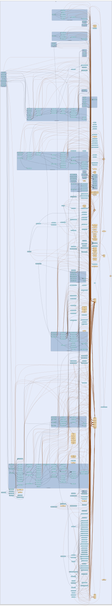

# i2np
--
    import "github.com/go-i2p/go-i2p/lib/i2np"




## Usage

```go
const (
	I2NP_MESSAGE_TYPE_DATABASE_STORE              = 1
	I2NP_MESSAGE_TYPE_DATABASE_LOOKUP             = 2
	I2NP_MESSAGE_TYPE_DATABASE_SEARCH_REPLY       = 3
	I2NP_MESSAGE_TYPE_DELIVERY_STATUS             = 10
	I2NP_MESSAGE_TYPE_GARLIC                      = 11
	I2NP_MESSAGE_TYPE_TUNNEL_DATA                 = 18
	I2NP_MESSAGE_TYPE_TUNNEL_GATEWAY              = 19
	I2NP_MESSAGE_TYPE_DATA                        = 20
	I2NP_MESSAGE_TYPE_TUNNEL_BUILD                = 21
	I2NP_MESSAGE_TYPE_TUNNEL_BUILD_REPLY          = 22
	I2NP_MESSAGE_TYPE_VARIABLE_TUNNEL_BUILD       = 23
	I2NP_MESSAGE_TYPE_VARIABLE_TUNNEL_BUILD_REPLY = 24
)
```
I2NP Message Type Constants Moved from: header.go

```go
var (
	ERR_I2NP_NOT_ENOUGH_DATA                  = oops.Errorf("not enough i2np header data")
	ERR_BUILD_REQUEST_RECORD_NOT_ENOUGH_DATA  = oops.Errorf("not enough i2np build request record data")
	ERR_BUILD_RESPONSE_RECORD_NOT_ENOUGH_DATA = errors.New("not enough i2np build request record data")
	ERR_DATABASE_LOOKUP_NOT_ENOUGH_DATA       = errors.New("not enough i2np database lookup data")
)
```
I2NP Error Constants Moved from: header.go, build_request_record.go,
build_response_record.go, database_lookup.go

#### func  ReadI2NPNTCPData

```go
func ReadI2NPNTCPData(data []byte, size int) ([]byte, error)
```
ReadI2NPNTCPData reads the message data from NTCP payload

#### func  ReadI2NPNTCPMessageChecksum

```go
func ReadI2NPNTCPMessageChecksum(data []byte) (int, error)
```
ReadI2NPNTCPMessageChecksum reads the message checksum from NTCP data

#### func  ReadI2NPNTCPMessageExpiration

```go
func ReadI2NPNTCPMessageExpiration(data []byte) (datalib.Date, error)
```
ReadI2NPNTCPMessageExpiration reads the expiration from NTCP data

#### func  ReadI2NPNTCPMessageID

```go
func ReadI2NPNTCPMessageID(data []byte) (int, error)
```
ReadI2NPNTCPMessageID reads the message ID from NTCP data

#### func  ReadI2NPNTCPMessageSize

```go
func ReadI2NPNTCPMessageSize(data []byte) (int, error)
```
ReadI2NPNTCPMessageSize reads the message size from NTCP data

#### func  ReadI2NPSSUMessageExpiration

```go
func ReadI2NPSSUMessageExpiration(data []byte) (datalib.Date, error)
```
ReadI2NPSSUMessageExpiration reads the expiration from SSU data

#### func  ReadI2NPType

```go
func ReadI2NPType(data []byte) (int, error)
```
ReadI2NPType reads the I2NP message type from data

#### type BaseI2NPMessage

```go
type BaseI2NPMessage struct {
}
```

BaseI2NPMessage provides a basic implementation of I2NPMessage

#### func  NewBaseI2NPMessage

```go
func NewBaseI2NPMessage(msgType int) *BaseI2NPMessage
```
NewBaseI2NPMessage creates a new base I2NP message

#### func (*BaseI2NPMessage) Expiration

```go
func (m *BaseI2NPMessage) Expiration() time.Time
```
Expiration returns the expiration time

#### func (*BaseI2NPMessage) GetData

```go
func (m *BaseI2NPMessage) GetData() []byte
```
GetData returns the message data

#### func (*BaseI2NPMessage) MarshalBinary

```go
func (m *BaseI2NPMessage) MarshalBinary() ([]byte, error)
```
MarshalBinary serializes the I2NP message according to NTCP format

#### func (*BaseI2NPMessage) MessageID

```go
func (m *BaseI2NPMessage) MessageID() int
```
MessageID returns the message ID

#### func (*BaseI2NPMessage) SetData

```go
func (m *BaseI2NPMessage) SetData(data []byte)
```
SetData sets the message data

#### func (*BaseI2NPMessage) SetExpiration

```go
func (m *BaseI2NPMessage) SetExpiration(exp time.Time)
```
SetExpiration sets the expiration time

#### func (*BaseI2NPMessage) SetMessageID

```go
func (m *BaseI2NPMessage) SetMessageID(id int)
```
SetMessageID sets the message ID

#### func (*BaseI2NPMessage) Type

```go
func (m *BaseI2NPMessage) Type() int
```
Type returns the message type

#### func (*BaseI2NPMessage) UnmarshalBinary

```go
func (m *BaseI2NPMessage) UnmarshalBinary(data []byte) error
```
UnmarshalBinary deserializes the I2NP message from NTCP format

#### type BuildRecordReader

```go
type BuildRecordReader interface {
	ReadBuildRequestRecord(data []byte) (BuildRequestRecord, error)
}
```

BuildRecordReader represents types that can parse build request records

#### type BuildRecordWriter

```go
type BuildRecordWriter interface {
	WriteBuildResponseRecord() ([]byte, error)
}
```

BuildRecordWriter represents types that can write build response records

#### type BuildRequestRecord

```go
type BuildRequestRecord struct {
	ReceiveTunnel tunnel.TunnelID
	OurIdent      common.Hash
	NextTunnel    tunnel.TunnelID
	NextIdent     common.Hash
	LayerKey      session_key.SessionKey
	IVKey         session_key.SessionKey
	ReplyKey      session_key.SessionKey
	ReplyIV       [16]byte
	Flag          int
	RequestTime   time.Time
	SendMessageID int
	Padding       [29]byte
}
```


#### func  ReadBuildRequestRecord

```go
func ReadBuildRequestRecord(data []byte) (BuildRequestRecord, error)
```

#### func (*BuildRequestRecord) GetIVKey

```go
func (b *BuildRequestRecord) GetIVKey() session_key.SessionKey
```
GetIVKey returns the IV session key

#### func (*BuildRequestRecord) GetLayerKey

```go
func (b *BuildRequestRecord) GetLayerKey() session_key.SessionKey
```
GetLayerKey returns the layer session key

#### func (*BuildRequestRecord) GetNextIdent

```go
func (b *BuildRequestRecord) GetNextIdent() common.Hash
```
GetNextIdent returns the next identity hash

#### func (*BuildRequestRecord) GetNextTunnel

```go
func (b *BuildRequestRecord) GetNextTunnel() tunnel.TunnelID
```
GetNextTunnel returns the next tunnel ID

#### func (*BuildRequestRecord) GetOurIdent

```go
func (b *BuildRequestRecord) GetOurIdent() common.Hash
```
GetOurIdent returns our identity hash

#### func (*BuildRequestRecord) GetReceiveTunnel

```go
func (b *BuildRequestRecord) GetReceiveTunnel() tunnel.TunnelID
```
GetReceiveTunnel returns the receive tunnel ID

#### func (*BuildRequestRecord) GetReplyKey

```go
func (b *BuildRequestRecord) GetReplyKey() session_key.SessionKey
```
GetReplyKey returns the reply session key

#### type BuildRequestRecordElGamal

```go
type BuildRequestRecordElGamal [528]byte
```


#### type BuildRequestRecordElGamalAES

```go
type BuildRequestRecordElGamalAES [528]byte
```


#### type BuildResponseRecord

```go
type BuildResponseRecord struct {
	Hash       common.Hash
	RandomData [495]byte
	Reply      byte
}
```

BuildResponseRecord struct contains a response to BuildRequestRecord concerning
the creation of one hop in the tunnel

#### func  ReadBuildResponseRecord

```go
func ReadBuildResponseRecord(data []byte) (BuildResponseRecord, error)
```

#### type BuildResponseRecordELGamal

```go
type BuildResponseRecordELGamal [528]byte
```


#### type BuildResponseRecordELGamalAES

```go
type BuildResponseRecordELGamalAES [528]byte
```


#### type Data

```go
type Data struct {
	Length int
	Data   []byte
}
```


#### type DataMessage

```go
type DataMessage struct {
	*BaseI2NPMessage
	PayloadLength int
	Payload       []byte
}
```

DataMessage represents an I2NP Data message Moved from: messages.go

#### func  NewDataMessage

```go
func NewDataMessage(payload []byte) *DataMessage
```
NewDataMessage creates a new Data message

#### func (*DataMessage) GetPayload

```go
func (d *DataMessage) GetPayload() []byte
```
GetPayload returns the actual payload data

#### func (*DataMessage) UnmarshalBinary

```go
func (d *DataMessage) UnmarshalBinary(data []byte) error
```
UnmarshalBinary deserializes a Data message

#### type DatabaseLookup

```go
type DatabaseLookup struct {
	Key           common.Hash
	From          common.Hash
	Flags         byte
	ReplyTunnelID [4]byte
	Size          int
	ExcludedPeers []common.Hash
	ReplyKey      session_key.SessionKey
	Tags          int
	ReplyTags     []session_tag.SessionTag
}
```


#### func  ReadDatabaseLookup

```go
func ReadDatabaseLookup(data []byte) (DatabaseLookup, error)
```

#### func (*DatabaseLookup) GetFlags

```go
func (d *DatabaseLookup) GetFlags() byte
```
GetFlags returns the lookup flags

#### func (*DatabaseLookup) GetFrom

```go
func (d *DatabaseLookup) GetFrom() common.Hash
```
GetFrom returns the from hash

#### func (*DatabaseLookup) GetKey

```go
func (d *DatabaseLookup) GetKey() common.Hash
```
GetKey returns the lookup key

#### func (*DatabaseLookup) GetReplyTags

```go
func (d *DatabaseLookup) GetReplyTags() []session_tag.SessionTag
```
GetReplyTags returns the reply tags

#### func (*DatabaseLookup) GetTagCount

```go
func (d *DatabaseLookup) GetTagCount() int
```
GetTagCount returns the number of tags

#### type DatabaseManager

```go
type DatabaseManager struct {
}
```

DatabaseManager demonstrates database-related interface usage

#### func  NewDatabaseManager

```go
func NewDatabaseManager(netdb NetDBStore) *DatabaseManager
```
NewDatabaseManager creates a new database manager with NetDB integration

#### func (*DatabaseManager) PerformLookup

```go
func (dm *DatabaseManager) PerformLookup(reader DatabaseReader) error
```
PerformLookup performs a database lookup using DatabaseReader interface and
generates appropriate responses

#### func (*DatabaseManager) SetRetriever

```go
func (dm *DatabaseManager) SetRetriever(retriever NetDBRetriever)
```
SetRetriever sets the NetDB retriever for database operations

#### func (*DatabaseManager) SetSessionProvider

```go
func (dm *DatabaseManager) SetSessionProvider(provider SessionProvider)
```
SetSessionProvider sets the session provider for sending responses

#### func (*DatabaseManager) StoreData

```go
func (dm *DatabaseManager) StoreData(writer DatabaseWriter) error
```
StoreData stores data using DatabaseWriter interface and NetDB integration

#### type DatabaseReader

```go
type DatabaseReader interface {
	GetKey() common.Hash
	GetFrom() common.Hash
	GetFlags() byte
}
```

DatabaseReader represents types that can perform database lookups

#### func  CreateDatabaseQuery

```go
func CreateDatabaseQuery(key, from common.Hash, flags byte) DatabaseReader
```
CreateDatabaseQuery creates a database lookup with interface methods

#### type DatabaseSearchReply

```go
type DatabaseSearchReply struct {
	Key        common.Hash
	Count      int
	PeerHashes []common.Hash
	From       common.Hash
}
```


#### func  NewDatabaseSearchReply

```go
func NewDatabaseSearchReply(key, from common.Hash, peerHashes []common.Hash) *DatabaseSearchReply
```
NewDatabaseSearchReply creates a new DatabaseSearchReply message

#### func (*DatabaseSearchReply) MarshalBinary

```go
func (d *DatabaseSearchReply) MarshalBinary() ([]byte, error)
```
MarshalBinary serializes the DatabaseSearchReply message

#### type DatabaseStore

```go
type DatabaseStore struct {
	Key           common.Hash
	Type          byte
	ReplyToken    [4]byte
	ReplyTunnelID [4]byte
	ReplyGateway  common.Hash
	Data          []byte
}
```


#### func  NewDatabaseStore

```go
func NewDatabaseStore(key common.Hash, data []byte, dataType byte) *DatabaseStore
```
NewDatabaseStore creates a new DatabaseStore message

#### func (*DatabaseStore) GetStoreData

```go
func (d *DatabaseStore) GetStoreData() []byte
```
GetStoreData returns the store data

#### func (*DatabaseStore) GetStoreKey

```go
func (d *DatabaseStore) GetStoreKey() common.Hash
```
GetStoreKey returns the store key

#### func (*DatabaseStore) GetStoreType

```go
func (d *DatabaseStore) GetStoreType() byte
```
GetStoreType returns the store type

#### func (*DatabaseStore) MarshalBinary

```go
func (d *DatabaseStore) MarshalBinary() ([]byte, error)
```
MarshalBinary serializes the DatabaseStore message

#### type DatabaseWriter

```go
type DatabaseWriter interface {
	GetStoreKey() common.Hash
	GetStoreData() []byte
	GetStoreType() byte
}
```

DatabaseWriter represents types that can store database entries

#### func  CreateDatabaseEntry

```go
func CreateDatabaseEntry(key common.Hash, data []byte, dataType byte) DatabaseWriter
```
CreateDatabaseEntry creates a database store with interface methods

#### type DeliveryStatus

```go
type DeliveryStatus struct {
	MessageID int
	Timestamp time.Time
}
```


#### type DeliveryStatusMessage

```go
type DeliveryStatusMessage struct {
	*BaseI2NPMessage
	StatusMessageID int
	Timestamp       time.Time
}
```

DeliveryStatusMessage represents an I2NP DeliveryStatus message Moved from:
messages.go

#### func  NewDeliveryStatusMessage

```go
func NewDeliveryStatusMessage(messageID int, timestamp time.Time) *DeliveryStatusMessage
```
NewDeliveryStatusMessage creates a new DeliveryStatus message

#### func (*DeliveryStatusMessage) GetStatusMessageID

```go
func (d *DeliveryStatusMessage) GetStatusMessageID() int
```
GetStatusMessageID returns the status message ID

#### func (*DeliveryStatusMessage) GetTimestamp

```go
func (d *DeliveryStatusMessage) GetTimestamp() time.Time
```
GetTimestamp returns the timestamp

#### func (*DeliveryStatusMessage) UnmarshalBinary

```go
func (d *DeliveryStatusMessage) UnmarshalBinary(data []byte) error
```
UnmarshalBinary deserializes a DeliveryStatus message

#### type Garlic

```go
type Garlic struct {
	Count       int
	Cloves      []GarlicClove
	Certificate certificate.Certificate
	MessageID   int
	Expiration  time.Time
}
```


#### func (*Garlic) GetCloveCount

```go
func (g *Garlic) GetCloveCount() int
```
GetCloveCount returns the number of cloves

#### func (*Garlic) GetCloves

```go
func (g *Garlic) GetCloves() []GarlicClove
```
GetCloves returns the garlic cloves

#### type GarlicClove

```go
type GarlicClove struct {
	DeliveryInstructions GarlicCloveDeliveryInstructions
	I2NPMessage          I2NPMessage
	CloveID              int
	Expiration           time.Time
	Certificate          certificate.Certificate
}
```


#### type GarlicCloveDeliveryInstructions

```go
type GarlicCloveDeliveryInstructions struct {
	Flag       byte
	SessionKey session_key.SessionKey
	Hash       common.Hash
	TunnelID   tunnel.TunnelID
	Delay      int
}
```


#### type GarlicElGamal

```go
type GarlicElGamal []byte
```


#### type GarlicProcessor

```go
type GarlicProcessor interface {
	GetCloves() []GarlicClove
	GetCloveCount() int
}
```

GarlicProcessor represents types that process garlic messages

#### type HashProvider

```go
type HashProvider interface {
	GetOurIdent() common.Hash
	GetNextIdent() common.Hash
}
```

HashProvider represents types that provide hash identification

#### type I2NPMessage

```go
type I2NPMessage interface {
	MessageSerializer
	MessageIdentifier
	MessageExpiration
}
```

I2NPMessage interface represents any I2NP message that can be
marshaled/unmarshaled This is the primary interface that combines all core
message behaviors

#### func  NewI2NPMessage

```go
func NewI2NPMessage(msgType int) I2NPMessage
```
NewI2NPMessage creates a new base I2NP message and returns it as I2NPMessage
interface

#### type I2NPMessageFactory

```go
type I2NPMessageFactory struct{}
```

I2NPMessageFactory provides methods to create I2NP messages as interfaces

#### func  NewI2NPMessageFactory

```go
func NewI2NPMessageFactory() *I2NPMessageFactory
```
NewI2NPMessageFactory creates a new message factory

#### func (*I2NPMessageFactory) CreateDataMessage

```go
func (f *I2NPMessageFactory) CreateDataMessage(payload []byte) I2NPMessage
```
CreateDataMessage creates a new data message

#### func (*I2NPMessageFactory) CreateDeliveryStatusMessage

```go
func (f *I2NPMessageFactory) CreateDeliveryStatusMessage(messageID int, timestamp time.Time) I2NPMessage
```
CreateDeliveryStatusMessage creates a new delivery status message

#### func (*I2NPMessageFactory) CreateTunnelDataMessage

```go
func (f *I2NPMessageFactory) CreateTunnelDataMessage(data [1024]byte) I2NPMessage
```
CreateTunnelDataMessage creates a new tunnel data message

#### type I2NPNTCPHeader

```go
type I2NPNTCPHeader struct {
	Type       int
	MessageID  int
	Expiration time.Time
	Size       int
	Checksum   int
	Data       []byte
}
```

I2NPNTCPHeader represents a parsed I2NP message header for NTCP transport

#### func  ReadI2NPNTCPHeader

```go
func ReadI2NPNTCPHeader(data []byte) (I2NPNTCPHeader, error)
```
ReadI2NPNTCPHeader reads an entire I2NP message and returns the parsed header
with embedded encrypted data

#### type I2NPSSUHeader

```go
type I2NPSSUHeader struct {
	Type       int
	Expiration time.Time
}
```

I2NPSSUHeader represents a parsed I2NP message header for SSU transport

#### func  ReadI2NPSSUHeader

```go
func ReadI2NPSSUHeader(data []byte) (I2NPSSUHeader, error)
```
ReadI2NPSSUHeader reads an I2NP SSU header

#### type I2NPSecondGenTransportHeader

```go
type I2NPSecondGenTransportHeader struct {
	Type       int
	MessageID  int
	Expiration time.Time
}
```

When transmitted over [NTCP2] or [SSU2], the 16-byte standard header is not
used. Only a 1-byte type, 4-byte message id, and a 4-byte expiration in seconds
are included. The size is incorporated in the NTCP2 and SSU2 data packet
formats. The checksum is not required since errors are caught in decryption.

#### func  ReadI2NPSecondGenTransportHeader

```go
func ReadI2NPSecondGenTransportHeader(dat []byte) (I2NPSecondGenTransportHeader, error)
```
ReadI2NPSecondGenTransportHeader reads an I2NP NTCP2 or SSU2 header When
transmitted over [NTCP2] or [SSU2], the 16-byte standard header is not used.
Only a 1-byte type, 4-byte message id, and a 4-byte expiration in seconds are
included. The size is incorporated in the NTCP2 and SSU2 data packet formats.
The checksum is not required since errors are caught in decryption.

#### type MessageExpiration

```go
type MessageExpiration interface {
	Expiration() time.Time
	SetExpiration(exp time.Time)
}
```

MessageExpiration represents types that have expiration management

#### type MessageIdentifier

```go
type MessageIdentifier interface {
	Type() int
	MessageID() int
	SetMessageID(id int)
}
```

MessageIdentifier represents types that have message identification

#### type MessageProcessor

```go
type MessageProcessor struct {
}
```

MessageProcessor demonstrates interface-based message processing

#### func  NewMessageProcessor

```go
func NewMessageProcessor() *MessageProcessor
```
NewMessageProcessor creates a new message processor

#### func (*MessageProcessor) ProcessMessage

```go
func (p *MessageProcessor) ProcessMessage(msg I2NPMessage) error
```
ProcessMessage processes any I2NP message using interfaces

#### type MessageRouter

```go
type MessageRouter struct {
}
```

MessageRouter demonstrates advanced interface-based routing

#### func  NewMessageRouter

```go
func NewMessageRouter(config MessageRouterConfig) *MessageRouter
```
NewMessageRouter creates a new message router

#### func (*MessageRouter) RouteDatabaseMessage

```go
func (mr *MessageRouter) RouteDatabaseMessage(msg interface{}) error
```
RouteDatabaseMessage routes database-related messages

#### func (*MessageRouter) RouteMessage

```go
func (mr *MessageRouter) RouteMessage(msg I2NPMessage) error
```
RouteMessage routes messages based on their interfaces

#### func (*MessageRouter) RouteTunnelMessage

```go
func (mr *MessageRouter) RouteTunnelMessage(msg interface{}) error
```
RouteTunnelMessage routes tunnel-related messages

#### func (*MessageRouter) SetNetDB

```go
func (mr *MessageRouter) SetNetDB(netdb NetDBStore)
```
SetNetDB sets the NetDB store for database operations

#### type MessageRouterConfig

```go
type MessageRouterConfig struct {
	MaxRetries     int
	DefaultTimeout time.Duration
	EnableLogging  bool
}
```

MessageRouterConfig represents configuration for message routing

#### type MessageSerializer

```go
type MessageSerializer interface {
	MarshalBinary() ([]byte, error)
	UnmarshalBinary(data []byte) error
}
```

MessageSerializer represents types that can be marshaled and unmarshaled

#### type NetDBRetriever

```go
type NetDBRetriever interface {
	GetRouterInfoBytes(hash common.Hash) ([]byte, error)
	GetRouterInfoCount() int
}
```

NetDBRetriever defines the interface for retrieving RouterInfo entries

#### type NetDBStore

```go
type NetDBStore interface {
	StoreRouterInfo(key common.Hash, data []byte, dataType byte) error
}
```

NetDBStore defines the interface for storing RouterInfo entries

#### type PayloadCarrier

```go
type PayloadCarrier interface {
	GetPayload() []byte
}
```

PayloadCarrier represents messages that carry payload data

#### func  NewDataMessageWithPayload

```go
func NewDataMessageWithPayload(payload []byte) PayloadCarrier
```
NewDataMessageWithPayload creates a new Data message and returns it as
PayloadCarrier interface

#### type SessionKeyProvider

```go
type SessionKeyProvider interface {
	GetReplyKey() session_key.SessionKey
	GetLayerKey() session_key.SessionKey
	GetIVKey() session_key.SessionKey
}
```

SessionKeyProvider represents types that provide session keys

#### type SessionManager

```go
type SessionManager struct{}
```

SessionManager demonstrates session-related interface usage

#### func  NewSessionManager

```go
func NewSessionManager() *SessionManager
```
NewSessionManager creates a new session manager

#### func (*SessionManager) ProcessKeys

```go
func (sm *SessionManager) ProcessKeys(provider SessionKeyProvider) error
```
ProcessKeys processes session keys using SessionKeyProvider interface

#### func (*SessionManager) ProcessTags

```go
func (sm *SessionManager) ProcessTags(provider SessionTagProvider) error
```
ProcessTags processes session tags using SessionTagProvider interface

#### type SessionProvider

```go
type SessionProvider interface {
	GetSessionByHash(hash common.Hash) (TransportSession, error)
}
```

SessionProvider defines the interface for obtaining transport sessions

#### type SessionTagProvider

```go
type SessionTagProvider interface {
	GetReplyTags() []session_tag.SessionTag
	GetTagCount() int
}
```

SessionTagProvider represents types that provide session tags

#### type StatusReporter

```go
type StatusReporter interface {
	GetStatusMessageID() int
	GetTimestamp() time.Time
}
```

StatusReporter represents types that report delivery status

#### func  NewDeliveryStatusReporter

```go
func NewDeliveryStatusReporter(messageID int, timestamp time.Time) StatusReporter
```
NewDeliveryStatusReporter creates a new DeliveryStatus message and returns it as
StatusReporter interface

#### type TransportSession

```go
type TransportSession interface {
	QueueSendI2NP(msg I2NPMessage)
	SendQueueSize() int
}
```

TransportSession defines the interface for sending I2NP messages back to
requesters

#### type TunnelBuild

```go
type TunnelBuild [8]BuildRequestRecord
```


#### func (*TunnelBuild) GetBuildRecords

```go
func (t *TunnelBuild) GetBuildRecords() []BuildRequestRecord
```
GetBuildRecords returns the build request records

#### func (*TunnelBuild) GetRecordCount

```go
func (t *TunnelBuild) GetRecordCount() int
```
GetRecordCount returns the number of build records

#### type TunnelBuildReply

```go
type TunnelBuildReply [8]BuildResponseRecord
```


#### func (*TunnelBuildReply) GetReplyRecords

```go
func (t *TunnelBuildReply) GetReplyRecords() []BuildResponseRecord
```
GetReplyRecords returns the build response records

#### func (*TunnelBuildReply) ProcessReply

```go
func (t *TunnelBuildReply) ProcessReply() error
```
ProcessReply processes the tunnel build reply

#### type TunnelBuilder

```go
type TunnelBuilder interface {
	GetBuildRecords() []BuildRequestRecord
	GetRecordCount() int
}
```

TunnelBuilder represents types that can build tunnels

#### func  NewTunnelBuilder

```go
func NewTunnelBuilder(records [8]BuildRequestRecord) TunnelBuilder
```
NewTunnelBuilder creates a new TunnelBuild and returns it as TunnelBuilder
interface

#### func  NewVariableTunnelBuilder

```go
func NewVariableTunnelBuilder(records []BuildRequestRecord) TunnelBuilder
```
NewVariableTunnelBuilder creates a new VariableTunnelBuild and returns it as
TunnelBuilder interface

#### type TunnelCarrier

```go
type TunnelCarrier interface {
	GetTunnelData() []byte
}
```

TunnelCarrier represents messages that carry tunnel-related data

#### func  NewTunnelCarrier

```go
func NewTunnelCarrier(data [1024]byte) TunnelCarrier
```
NewTunnelCarrier creates a new TunnelData message and returns it as
TunnelCarrier interface

#### type TunnelData

```go
type TunnelData [1028]byte
```


#### type TunnelDataMessage

```go
type TunnelDataMessage struct {
	*BaseI2NPMessage
	Data [1024]byte // Fixed size tunnel data
}
```

TunnelDataMessage represents an I2NP TunnelData message Moved from: messages.go

#### func  NewTunnelDataMessage

```go
func NewTunnelDataMessage(data [1024]byte) *TunnelDataMessage
```
NewTunnelDataMessage creates a new TunnelData message

#### func (*TunnelDataMessage) GetTunnelData

```go
func (t *TunnelDataMessage) GetTunnelData() []byte
```
GetTunnelData returns the tunnel data

#### func (*TunnelDataMessage) UnmarshalBinary

```go
func (t *TunnelDataMessage) UnmarshalBinary(data []byte) error
```
UnmarshalBinary deserializes a TunnelData message

#### type TunnelGatway

```go
type TunnelGatway struct {
	TunnelID tunnel.TunnelID
	Length   int
	Data     []byte
}
```


#### type TunnelIdentifier

```go
type TunnelIdentifier interface {
	GetReceiveTunnel() tunnel.TunnelID
	GetNextTunnel() tunnel.TunnelID
}
```

TunnelIdentifier represents types that identify tunnel endpoints

#### func  CreateTunnelRecord

```go
func CreateTunnelRecord(receiveTunnel, nextTunnel tunnel.TunnelID,
	ourIdent, nextIdent common.Hash,
) TunnelIdentifier
```
CreateTunnelRecord creates a build request record with interface methods

#### type TunnelManager

```go
type TunnelManager struct{}
```

TunnelManager demonstrates tunnel-related interface usage

#### func  NewTunnelManager

```go
func NewTunnelManager() *TunnelManager
```
NewTunnelManager creates a new tunnel manager

#### func (*TunnelManager) BuildTunnel

```go
func (tm *TunnelManager) BuildTunnel(builder TunnelBuilder) error
```
BuildTunnel builds a tunnel using TunnelBuilder interface

#### func (*TunnelManager) ProcessTunnelReply

```go
func (tm *TunnelManager) ProcessTunnelReply(handler TunnelReplyHandler) error
```
ProcessTunnelReply processes tunnel build replies using TunnelReplyHandler
interface

#### type TunnelReplyHandler

```go
type TunnelReplyHandler interface {
	GetReplyRecords() []BuildResponseRecord
	ProcessReply() error
}
```

TunnelReplyHandler represents types that handle tunnel build replies

#### type VariableTunnelBuild

```go
type VariableTunnelBuild struct {
	Count               int
	BuildRequestRecords []BuildRequestRecord
}
```


#### func (*VariableTunnelBuild) GetBuildRecords

```go
func (v *VariableTunnelBuild) GetBuildRecords() []BuildRequestRecord
```
GetBuildRecords returns the build request records

#### func (*VariableTunnelBuild) GetRecordCount

```go
func (v *VariableTunnelBuild) GetRecordCount() int
```
GetRecordCount returns the number of build records

#### type VariableTunnelBuildReply

```go
type VariableTunnelBuildReply struct {
	Count                int
	BuildResponseRecords []BuildResponseRecord
}
```


#### func (*VariableTunnelBuildReply) GetReplyRecords

```go
func (v *VariableTunnelBuildReply) GetReplyRecords() []BuildResponseRecord
```
GetReplyRecords returns the build response records

#### func (*VariableTunnelBuildReply) ProcessReply

```go
func (v *VariableTunnelBuildReply) ProcessReply() error
```
ProcessReply processes the variable tunnel build reply


i2np 

github.com/go-i2p/go-i2p/lib/i2np

[go-i2p template file](/template.md)
