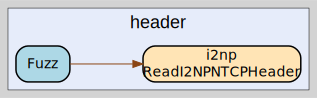

# header
--
    import "github.com/go-i2p/go-i2p/lib/i2np/fuzz/header"




## Usage

#### func  Fuzz

```go
func Fuzz(data []byte) int
```


header 

github.com/go-i2p/go-i2p/lib/i2np/fuzz/header

[go-i2p template file](/template.md)
