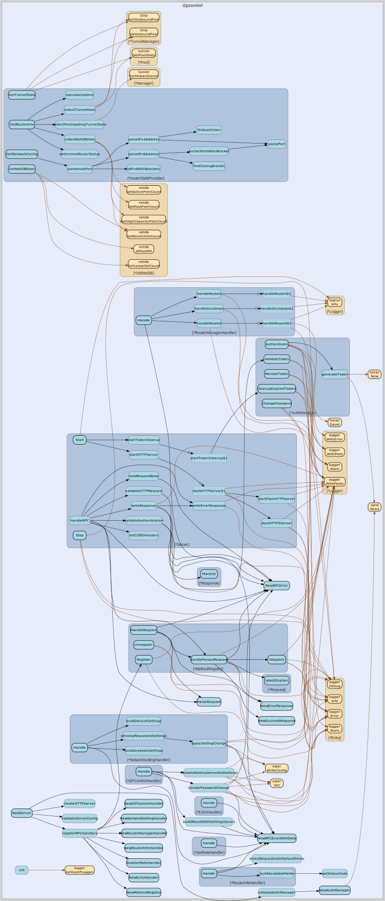

# i2pcontrol
--
    import "github.com/go-i2p/go-i2p/lib/i2pcontrol"



Package i2pcontrol implements a JSON-RPC 2.0 server for monitoring and
controlling go-i2p routers. It provides a standardized interface for querying
router statistics, network status, and operational metrics.

# Overview

I2PControl is a monitoring protocol originally designed for the Java I2P
implementation. This package provides a minimal, development-focused
implementation supporting read-only operations for router monitoring.

# Features

    - JSON-RPC 2.0 compliant API
    - Token-based authentication with HMAC-SHA256
    - HTTP and HTTPS transport
    - Thread-safe concurrent access
    - No external dependencies beyond stdlib

# Quick Start

Enable I2PControl in your config.yaml:

    i2pcontrol:
      enabled: true
      address: "localhost:7650"
      password: "your-secure-password"
      use_https: false
      token_expiration: 10m

Or use command-line flags:

    ./go-i2p --i2pcontrol.enabled=true --i2pcontrol.password="your-password"

The server integrates automatically with the router lifecycle and starts when
the router starts (if enabled).

# Usage Example

Programmatic usage:

    import (
        "github.com/go-i2p/go-i2p/lib/config"
        "github.com/go-i2p/go-i2p/lib/i2pcontrol"
        "time"
    )

    // Create configuration
    cfg := &config.I2PControlConfig{
        Enabled:         true,
        Address:         "localhost:7650",
        Password:        "my-password",
        UseHTTPS:        false,
        TokenExpiration: 10 * time.Minute,
    }

    // Create statistics provider (typically your Router instance)
    stats := i2pcontrol.NewRouterStatsProvider(router, "0.1.0-go")

    // Create and start server
    server, err := i2pcontrol.NewServer(cfg, stats)
    if err != nil {
        log.Fatal(err)
    }

    if err := server.Start(); err != nil {
        log.Fatal(err)
    }
    defer server.Stop()

# Authentication

Authentication uses a simple password-based token system:

    1. Client authenticates with configured password
    2. Server generates HMAC-SHA256 signed token
    3. Token valid for configurable duration (default 10 minutes)
    4. Client includes token in subsequent RPC requests

Example authentication flow:

    // Request
    {
      "jsonrpc": "2.0",
      "id": 1,
      "method": "Authenticate",
      "params": {"API": 1, "Password": "itoopie"}
    }

    // Response
    {
      "jsonrpc": "2.0",
      "id": 1,
      "result": {"API": 1, "Token": "abc123..."}
    }

# API Methods

Authenticate - Generate authentication token:

    curl -X POST http://localhost:7650/jsonrpc \
      -H "Content-Type: application/json" \
      -d '{"jsonrpc":"2.0","id":1,"method":"Authenticate",
           "params":{"API":1,"Password":"itoopie"}}'

Echo - Test connectivity (returns {"Result": value}):

    curl -X POST http://localhost:7650/jsonrpc \
      -H "Content-Type: application/json" \
      -d '{"jsonrpc":"2.0","id":2,"method":"Echo",
           "params":{"Token":"abc123","Echo":"test"}}'
    # Response: {"jsonrpc":"2.0","id":2,"result":{"Result":"test"}}

RouterInfo - Query router status:

    curl -X POST http://localhost:7650/jsonrpc \
      -H "Content-Type: application/json" \
      -d '{"jsonrpc":"2.0","id":3,"method":"RouterInfo",
           "params":{"Token":"abc123",
                     "i2p.router.uptime":null,
                     "i2p.router.version":null,
                     "i2p.router.net.tunnels.participating":null,
                     "i2p.router.netdb.knownpeers":null}}'

GetRate - Query bandwidth statistics:

    curl -X POST http://localhost:7650/jsonrpc \
      -H "Content-Type: application/json" \
      -d '{"jsonrpc":"2.0","id":4,"method":"GetRate",
           "params":{"Token":"abc123",
                     "i2p.router.net.bw.inbound.15s":null,
                     "i2p.router.net.bw.outbound.15s":null}}'

# Supported Methods

The following JSON-RPC methods are implemented:

    - Authenticate: Generate authentication token (no token required)
    - Echo: Connection test (returns input value)
    - GetRate: Bandwidth statistics (in/out rates)
    - RouterInfo: Router status (uptime, version, tunnels, peers)

Planned for future implementation:

    - RouterManager: Control operations (shutdown, restart)
    - NetworkSetting: Configuration queries and updates

# Available Router Metrics

RouterInfo method supports these metrics:

    - i2p.router.uptime: Router uptime in milliseconds
    - i2p.router.version: Router version string
    - i2p.router.net.tunnels.participating: Number of participating tunnels
    - i2p.router.netdb.knownpeers: Number of known routers in NetDB
    - i2p.router.netdb.activepeers: Number of active peers
    - i2p.router.netdb.fastpeers: Number of fast peers

GetRate method supports these metrics:

    - i2p.router.net.bw.inbound.15s: Inbound bandwidth (bytes/sec, 15s avg)
    - i2p.router.net.bw.outbound.15s: Outbound bandwidth (bytes/sec, 15s avg)

# Configuration

The server is configured via the I2PControlConfig struct in lib/config:

    type I2PControlConfig struct {
        Enabled         bool          // Enable I2PControl server
        Address         string        // Listen address (default: "localhost:7650")
        Password        string        // Authentication password (default: "itoopie")
        UseHTTPS        bool          // Enable HTTPS/TLS (default: false)
        CertFile        string        // TLS certificate path (if UseHTTPS)
        KeyFile         string        // TLS key path (if UseHTTPS)
        TokenExpiration time.Duration // Token validity (default: 10 minutes)
    }

Configuration can be set via:

    - config.yaml file
    - Command-line flags (--i2pcontrol.enabled, --i2pcontrol.address, etc.)
    - Environment variables (via Viper)

# Error Codes

JSON-RPC 2.0 error codes:

    - -32700: Parse error (invalid JSON)
    - -32600: Invalid Request (malformed JSON-RPC)
    - -32601: Method not found
    - -32602: Invalid params
    - -32603: Internal error
    - -32000: Authentication required (missing/invalid token)
    - -32001: Authentication failed (wrong password)
    - -32002: Not implemented (method planned but not yet available)

# Security Considerations

Default configuration (development-focused):

    - Binds to localhost only (not exposed to network)
    - HTTP only (no encryption)
    - Standard default password "itoopie"
    - 10-minute token expiration
    - No rate limiting
    - No audit logging

Production recommendations:

    - Change default password to strong, unique value
    - Enable HTTPS with valid TLS certificates
    - Use specific IP binding or firewall rules
    - Monitor logs for suspicious activity
    - Keep token expiration short (5-15 minutes)
    - Never expose HTTP endpoint to untrusted networks

Example HTTPS configuration:

    i2pcontrol:
      enabled: true
      address: "0.0.0.0:7650"  # Network accessible
      password: "strong-unique-password"
      use_https: true
      cert_file: "/etc/ssl/certs/i2pcontrol.pem"
      key_file: "/etc/ssl/private/i2pcontrol-key.pem"
      token_expiration: 5m

Generate self-signed certificate (testing only):

    openssl req -x509 -newkey rsa:4096 -keyout key.pem \
      -out cert.pem -days 365 -nodes -subj "/CN=localhost"

# Testing

Run unit tests:

    go test ./lib/i2pcontrol/...

Run with coverage:

    go test -cover ./lib/i2pcontrol

Run with race detector:

    go test -race ./lib/i2pcontrol

Run benchmarks:

    go test -bench=. -benchmem ./lib/i2pcontrol

# Development Status

This implementation prioritizes development convenience over production
robustness. Current status:

    - ✅ JSON-RPC 2.0 compliance
    - ✅ Token authentication
    - ✅ HTTP/HTTPS transport
    - ✅ Echo, GetRate, RouterInfo methods
    - ✅ Thread-safe concurrent access
    - ✅ Graceful shutdown
    - ✅ 87%+ test coverage
    - ⚠️  No rate limiting
    - ⚠️  No audit logging
    - 🚧 RouterManager method (planned)
    - 🚧 NetworkSetting method (planned)

# References

    - I2PControl Specification: https://geti2p.net/spec/i2pcontrol
    - JSON-RPC 2.0 Specification: https://www.jsonrpc.org/specification
    - User Guide: docs/i2pcontrol.md

# Thread Safety

All public types and methods are safe for concurrent access from multiple
goroutines. The Server, AuthManager, MethodRegistry, and RouterStatsProvider
implementations use appropriate synchronization primitives (mutexes, atomic
operations) to ensure thread safety.

## Usage

```go
const (
	// Standard JSON-RPC 2.0 error codes
	ErrCodeParseError     = -32700 // Invalid JSON received by server
	ErrCodeInvalidRequest = -32600 // JSON is not a valid Request object
	ErrCodeMethodNotFound = -32601 // Method does not exist
	ErrCodeInvalidParams  = -32602 // Invalid method parameters
	ErrCodeInternalError  = -32603 // Internal JSON-RPC error

	// I2PControl-specific error codes
	// Using -32000 to -32099 range (reserved for implementation-defined errors)
	ErrCodeAuthRequired = -32000 // Authentication token required
	ErrCodeAuthFailed   = -32001 // Authentication failed (invalid password)
	ErrCodeNotImpl      = -32002 // Method not yet implemented
)
```
JSON-RPC 2.0 specification error codes Reference:
https://www.jsonrpc.org/specification

#### type AuthManager

```go
type AuthManager struct {
}
```

AuthManager handles token-based authentication for I2PControl RPC. It generates
HMAC-SHA256 tokens for authenticated clients and validates tokens with
expiration checking. Thread-safe for concurrent access.

Authentication flow: 1. Client sends password via Authenticate method 2. Server
validates password and generates token 3. Token stored with expiration timestamp
4. Client includes token in subsequent RPC requests 5. Server validates token
before processing requests

#### func  NewAuthManager

```go
func NewAuthManager(password string) (*AuthManager, error)
```
NewAuthManager creates a new authentication manager. The password is used to
validate authentication requests. A random secret key is generated for HMAC
token signing.

Parameters:

    - password: The authentication password clients must provide

Returns:

    - *AuthManager: Initialized auth manager
    - error: If random secret generation fails

#### func (*AuthManager) Authenticate

```go
func (am *AuthManager) Authenticate(password string, expiration time.Duration) (string, error)
```
Authenticate validates a password and generates an access token. The token is a
base64-encoded HMAC-SHA256 signature of the current timestamp, ensuring
uniqueness and cryptographic security.

Parameters:

    - password: The password to authenticate
    - expiration: How long the token should remain valid

Returns:

    - token: Base64-encoded authentication token
    - error: If password is invalid or token generation fails

#### func (*AuthManager) CleanupExpiredTokens

```go
func (am *AuthManager) CleanupExpiredTokens() int
```
CleanupExpiredTokens removes all expired tokens from storage. Should be called
periodically (e.g., every 5 minutes) to prevent memory growth from expired
tokens.

Returns:

    - int: Number of tokens removed

#### func (*AuthManager) RevokeToken

```go
func (am *AuthManager) RevokeToken(token string)
```
RevokeToken removes a token from the valid token set. Used for explicit logout
or token invalidation.

Parameters:

    - token: The token to revoke

#### func (*AuthManager) TokenCount

```go
func (am *AuthManager) TokenCount() int
```
TokenCount returns the number of active tokens. Useful for monitoring and
testing.

Returns:

    - int: Number of valid tokens currently stored

#### func (*AuthManager) ValidateToken

```go
func (am *AuthManager) ValidateToken(token string) bool
```
ValidateToken checks if a token is valid and not expired. Invalid or expired
tokens are automatically removed from storage.

Parameters:

    - token: The token to validate

Returns:

    - bool: true if token is valid and not expired, false otherwise

#### type BandwidthStats

```go
type BandwidthStats struct {
	// InboundRate is the current inbound data rate (bytes/sec)
	// Currently returns 0.0 as bandwidth tracking is not yet implemented
	InboundRate float64

	// OutboundRate is the current outbound data rate (bytes/sec)
	// Currently returns 0.0 as bandwidth tracking is not yet implemented
	OutboundRate float64
}
```

BandwidthStats contains bandwidth usage statistics. Rates are measured in bytes
per second.

#### type EchoHandler

```go
type EchoHandler struct{}
```

EchoHandler implements the Echo RPC method. Simply returns whatever value is
sent in the "Echo" parameter. This is useful for testing RPC connectivity.

Request params:

    {
      "Echo": "any_value"
    }

Response:

    {
      "Echo": "any_value"
    }

#### func  NewEchoHandler

```go
func NewEchoHandler() *EchoHandler
```
NewEchoHandler creates a new Echo handler.

#### func (*EchoHandler) Handle

```go
func (h *EchoHandler) Handle(ctx context.Context, params json.RawMessage) (interface{}, error)
```
Handle processes the Echo request. Extracts the "Echo" parameter and returns it
unchanged. Note: Java I2P returns {"Result": value} not {"Echo": value}

#### type GetRateHandler

```go
type GetRateHandler struct {
}
```

GetRateHandler implements the GetRate RPC method. Returns bandwidth statistics
from the router.

Request params:

    {
      "i2p.router.net.bw.inbound.15s": null,
      "i2p.router.net.bw.outbound.15s": null
    }

Response:

    {
      "i2p.router.net.bw.inbound.15s": 12345.67,
      "i2p.router.net.bw.outbound.15s": 23456.78
    }

The request specifies which statistics are desired. Any field with a null value
will be populated in the response.

#### func  NewGetRateHandler

```go
func NewGetRateHandler(stats RouterStatsProvider) *GetRateHandler
```
NewGetRateHandler creates a new GetRate handler.

Parameters:

    - stats: Statistics provider for bandwidth data

#### func (*GetRateHandler) Handle

```go
func (h *GetRateHandler) Handle(ctx context.Context, params json.RawMessage) (interface{}, error)
```
Handle processes the GetRate request. Returns bandwidth statistics for requested
fields.

#### type MethodRegistry

```go
type MethodRegistry struct {
}
```

MethodRegistry manages the registration and dispatch of RPC methods. It maps
method names to their corresponding handlers. Thread-safe for concurrent
registration and dispatch.

Usage:

    registry := NewMethodRegistry()
    registry.Register("Echo", echoHandler)
    result, err := registry.Dispatch(ctx, "Echo", params)

#### func  NewMethodRegistry

```go
func NewMethodRegistry() *MethodRegistry
```
NewMethodRegistry creates a new method registry. The registry starts empty;
handlers must be registered via Register().

#### func (*MethodRegistry) Dispatch

```go
func (mr *MethodRegistry) Dispatch(ctx context.Context, method string, params json.RawMessage) (interface{}, error)
```
Dispatch invokes the handler for the given method with the provided parameters.
This is the main entry point for executing RPC methods.

Parameters:

    - ctx: Context for cancellation and deadlines
    - method: The method name to invoke
    - params: The method parameters as json.RawMessage

Returns:

    - result: The method result (nil if error occurred)
    - error: An error if method not found or handler failed

Error handling:

    - Returns RPCError with ErrCodeMethodNotFound if method not registered
    - Returns handler's error if invocation fails (should be *RPCError)
    - Wraps non-RPCError errors as ErrCodeInternalError

#### func (*MethodRegistry) HandleRequest

```go
func (mr *MethodRegistry) HandleRequest(ctx context.Context, requestData []byte) *Response
```
HandleRequest is a convenience method that processes a complete JSON-RPC
request. It parses the request, dispatches to the appropriate handler, and
returns a response.

Parameters:

    - ctx: Context for cancellation and deadlines
    - requestData: Raw JSON-RPC request bytes

Returns:

    - *Response: The JSON-RPC response (always non-nil)

This method never returns an error; all errors are encoded in the Response
object following JSON-RPC 2.0 specification. Parse errors, invalid requests, and
method errors are all returned as proper JSON-RPC error responses.

Note: Notifications (requests without ID) are handled but no response is
returned.

#### func (*MethodRegistry) IsRegistered

```go
func (mr *MethodRegistry) IsRegistered(method string) bool
```
IsRegistered checks if a handler exists for the given method.

Parameters:

    - method: The method name to check

Returns:

    - bool: true if a handler is registered, false otherwise

#### func (*MethodRegistry) ListMethods

```go
func (mr *MethodRegistry) ListMethods() []string
```
ListMethods returns a list of all registered method names. The order is not
guaranteed to be consistent.

Returns:

    - []string: List of registered method names

#### func (*MethodRegistry) MethodCount

```go
func (mr *MethodRegistry) MethodCount() int
```
MethodCount returns the number of registered methods.

Returns:

    - int: Number of registered methods

#### func (*MethodRegistry) Register

```go
func (mr *MethodRegistry) Register(method string, handler RPCHandler)
```
Register adds a handler for the given method name. If a handler already exists
for this method, it will be replaced.

Parameters:

    - method: The method name (e.g., "Echo", "RouterInfo")
    - handler: The handler implementation

Example:

    registry.Register("Echo", &EchoHandler{})
    registry.Register("Authenticate", RPCHandlerFunc(authFunc))

#### func (*MethodRegistry) Unregister

```go
func (mr *MethodRegistry) Unregister(method string)
```
Unregister removes a handler for the given method name. Does nothing if the
method is not registered.

Parameters:

    - method: The method name to unregister

#### type NetDBStats

```go
type NetDBStats struct {
	// RouterInfos is the count of RouterInfo entries in NetDB
	RouterInfos int

	// LeaseSets is the count of LeaseSet entries in NetDB
	// Currently returns 0 as LeaseSet counting is not implemented
	LeaseSets int

	// Floodfill indicates if we're operating as a floodfill router
	// Currently returns false as floodfill status is not exposed
	Floodfill bool
}
```

NetDBStats contains network database statistics. This provides information about
the local database size and role.

#### type NetworkConfig

```go
type NetworkConfig struct {
	// NTCP2Port is the port number the NTCP2 transport is listening on
	// Returns 0 if NTCP2 is not available
	NTCP2Port int

	// NTCP2Address is the full address string (IP:port) the NTCP2 transport is listening on
	// Returns empty string if NTCP2 is not available
	NTCP2Address string

	// NTCP2Hostname is the hostname/IP address (without port) that NTCP2 is listening on
	// Extracted from NTCP2Address
	NTCP2Hostname string

	// BandwidthLimitIn is the inbound bandwidth limit in KB/s
	// Returns 0 if no limit is configured (unlimited)
	BandwidthLimitIn int

	// BandwidthLimitOut is the outbound bandwidth limit in KB/s
	// Returns 0 if no limit is configured (unlimited)
	BandwidthLimitOut int
}
```

NetworkConfig contains network configuration settings. This maps to I2PControl
NetworkSetting method responses.

#### type NetworkSettingHandler

```go
type NetworkSettingHandler struct {
}
```

NetworkSettingHandler implements the NetworkSetting RPC method. Provides
read-only access to router configuration.

Request params:

    {
      "i2p.router.net.ntcp.port": null,
      "i2p.router.net.ntcp.hostname": null
    }

Response:

    {
      "i2p.router.net.ntcp.port": 12345,
      "i2p.router.net.ntcp.hostname": "localhost"
    }

Note: Only read operations are supported initially. Write operations (changing
config) will be added later.

#### func  NewNetworkSettingHandler

```go
func NewNetworkSettingHandler(stats RouterStatsProvider) *NetworkSettingHandler
```
NewNetworkSettingHandler creates a new NetworkSetting handler.

Parameters:

    - stats: Router statistics provider for accessing network configuration

#### func (*NetworkSettingHandler) Handle

```go
func (h *NetworkSettingHandler) Handle(ctx context.Context, params json.RawMessage) (interface{}, error)
```
Handle processes the NetworkSetting request. Returns requested configuration
values. Handle processes a NetworkSetting request and returns the requested
configuration values. Returns network settings from the router configuration, or
an error if parsing fails.

#### type RPCError

```go
type RPCError struct {
	// Code indicates the error type
	// Standard codes: -32700 to -32603
	// Implementation-defined: -32000 to -32099
	Code int `json:"code"`

	// Message provides a short description of the error
	// Should be a single sentence
	Message string `json:"message"`

	// Data provides additional error information (optional)
	// Can be omitted or contain any JSON value
	Data interface{} `json:"data,omitempty"`
}
```

RPCError represents a JSON-RPC 2.0 error object. An error object has three
properties:

    - code: A number that indicates the error type
    - message: A short description of the error
    - data: Additional information about the error (optional)

#### func  NewRPCError

```go
func NewRPCError(code int, message string) *RPCError
```
NewRPCError creates a new RPCError with the given code and message. This is a
convenience function for creating standard errors.

#### func  NewRPCErrorWithData

```go
func NewRPCErrorWithData(code int, message string, data interface{}) *RPCError
```
NewRPCErrorWithData creates a new RPCError with additional data. The data field
can contain any additional error context.

#### func (*RPCError) Error

```go
func (e *RPCError) Error() string
```
Error implements the error interface for RPCError Allows RPCError to be used as
a standard Go error

#### type RPCHandler

```go
type RPCHandler interface {
	Handle(ctx context.Context, params json.RawMessage) (interface{}, error)
}
```

RPCHandler is the interface that RPC method handlers must implement. Each
handler processes a specific JSON-RPC method.

The Handle method receives:

    - ctx: Context for cancellation and deadlines
    - params: The "params" field from the JSON-RPC request as json.RawMessage

The Handle method returns:

    - result: The method result (will be serialized as "result" in response)
    - error: An error if the method failed (should be *RPCError for proper JSON-RPC errors)

#### type RPCHandlerFunc

```go
type RPCHandlerFunc func(ctx context.Context, params json.RawMessage) (interface{}, error)
```

RPCHandlerFunc is a function adapter for RPCHandler interface. Allows using
simple functions as RPC handlers without creating a type.

#### func (RPCHandlerFunc) Handle

```go
func (f RPCHandlerFunc) Handle(ctx context.Context, params json.RawMessage) (interface{}, error)
```
Handle calls the underlying function. This makes RPCHandlerFunc satisfy the
RPCHandler interface.

#### type RealRouter

```go
type RealRouter struct {
	// Router is the actual router instance
	// Must be a pointer to avoid copying the router
	Router interface {
		GetNetDB() *netdb.StdNetDB
		GetTunnelManager() *i2np.TunnelManager
		GetParticipantManager() *tunnel.Manager
		GetConfig() *config.RouterConfig
		IsRunning() bool
	}
}
```

RealRouter is an adapter that makes *router.Router implement RouterAccess. This
bridges the gap between the stats provider's minimal interface and the actual
Router implementation.

Usage:

    import "github.com/go-i2p/go-i2p/lib/router"
    r, _ := router.CreateRouter(cfg)
    statsProvider := i2pcontrol.NewRouterStatsProvider(
        i2pcontrol.RealRouter{Router: r},
        "0.1.0-go",
    )

#### func (RealRouter) GetConfig

```go
func (rr RealRouter) GetConfig() *config.RouterConfig
```
GetConfig returns the router configuration (implements RouterAccess)

#### func (RealRouter) GetNetDB

```go
func (rr RealRouter) GetNetDB() *netdb.StdNetDB
```
GetNetDB returns the NetDB (implements RouterAccess)

#### func (RealRouter) GetParticipantManager

```go
func (rr RealRouter) GetParticipantManager() *tunnel.Manager
```
GetParticipantManager returns the participant manager (implements RouterAccess)

#### func (RealRouter) GetTunnelManager

```go
func (rr RealRouter) GetTunnelManager() *i2np.TunnelManager
```
GetTunnelManager returns the tunnel manager (implements RouterAccess)

#### func (RealRouter) IsRunning

```go
func (rr RealRouter) IsRunning() bool
```
IsRunning returns whether the router is running (implements RouterAccess)

#### type Request

```go
type Request struct {
	// JSONRPC specifies the version of the JSON-RPC protocol
	// MUST be exactly "2.0"
	JSONRPC string `json:"jsonrpc"`

	// ID is the request identifier established by the client
	// Can be string, number, or null
	// If omitted, the request is a notification (no response expected)
	ID interface{} `json:"id,omitempty"`

	// Method is the name of the method to be invoked
	// Method names that begin with "rpc." are reserved for system extensions
	Method string `json:"method"`

	// Params holds the parameter values to be used during method invocation
	// Can be omitted (treated as empty object) or provided as object/array
	// We use json.RawMessage to defer parsing until method handler needs it
	Params json.RawMessage `json:"params,omitempty"`
}
```

Request represents a JSON-RPC 2.0 request. Follows the specification at
https://www.jsonrpc.org/specification

A Request object has four properties:

    - jsonrpc: Must be exactly "2.0"
    - method: Name of the method to invoke
    - params: Parameters for the method (can be omitted)
    - id: Request identifier (string, number, or null)

#### func  ParseRequest

```go
func ParseRequest(data []byte) (*Request, error)
```
ParseRequest parses a JSON-RPC 2.0 request from raw bytes. Returns an error if
the JSON is invalid or the request is malformed.

Validation performed:

    - Valid JSON structure
    - "jsonrpc" field equals "2.0"
    - "method" field is present and non-empty

Note: ID field is optional (omitted for notifications) Note: Params field is
optional (treated as empty if omitted)

#### func (*Request) IsNotification

```go
func (r *Request) IsNotification() bool
```
IsNotification checks if this request is a notification. Notifications are
requests without an ID field. The server MUST NOT reply to notifications.

#### type Response

```go
type Response struct {
	// JSONRPC specifies the version of the JSON-RPC protocol
	// MUST be exactly "2.0"
	JSONRPC string `json:"jsonrpc"`

	// ID is the request identifier copied from the request
	// MUST be the same as the request ID
	// Can be null if the request ID was invalid or missing
	ID interface{} `json:"id"`

	// Result holds the method invocation result
	// MUST NOT exist if there was an error
	// Omitted from JSON if nil
	Result interface{} `json:"result,omitempty"`

	// Error holds the error object if method invocation failed
	// MUST NOT exist if the method succeeded
	// Omitted from JSON if nil
	Error *RPCError `json:"error,omitempty"`
}
```

Response represents a JSON-RPC 2.0 response. A Response object has four
properties:

    - jsonrpc: Must be exactly "2.0"
    - result: Result of the method invocation (success case)
    - error: Error object (failure case)
    - id: Request identifier (copied from request)

Note: Either result OR error MUST be present, never both.

#### func  NewErrorResponse

```go
func NewErrorResponse(id interface{}, err *RPCError) *Response
```
NewErrorResponse creates an error JSON-RPC response. The error will be included
in the "error" field.

#### func  NewSuccessResponse

```go
func NewSuccessResponse(id, result interface{}) *Response
```
NewSuccessResponse creates a successful JSON-RPC response. The result parameter
will be serialized as the "result" field.

#### func (*Response) Marshal

```go
func (r *Response) Marshal() ([]byte, error)
```
Marshal serializes the response to JSON. Returns JSON bytes ready to send to the
client.

#### type RouterAccess

```go
type RouterAccess interface {
	// GetNetDB returns the network database
	// In real Router, this is embedded so accessed directly via *netdb.StdNetDB methods
	GetNetDB() *netdb.StdNetDB

	// GetTunnelManager returns the tunnel manager for tunnel statistics
	GetTunnelManager() *i2np.TunnelManager

	// GetParticipantManager returns the participant manager for transit tunnel statistics
	GetParticipantManager() *tunnel.Manager

	// GetConfig returns the router configuration
	GetConfig() *config.RouterConfig

	// GetTransportAddr returns the listening address of the first available transport
	// Returns nil if no transports are available
	// This is used to extract NTCP2 port and address for NetworkSetting RPC method
	GetTransportAddr() interface{}

	// IsRunning returns whether the router is currently operational
	IsRunning() bool

	// IsReseeding returns whether the router is currently performing a NetDB reseed operation
	IsReseeding() bool

	// GetBandwidthRates returns the current 1-second and 15-second bandwidth rates in bytes per second
	GetBandwidthRates() (rate1s, rate15s uint64)

	// Stop initiates graceful shutdown of the router
	Stop()
}
```

RouterAccess defines the minimal interface needed to collect router statistics.
This allows the stats provider to work with the real Router or test mocks.

Design rationale:

    - Minimal interface (only what we actually need)
    - Read-only operations (stats collection doesn't modify router)
    - Allows easy mocking for tests

#### type RouterInfoHandler

```go
type RouterInfoHandler struct {
}
```

RouterInfoHandler implements the RouterInfo RPC method. Returns general router
status and statistics.

Request params:

    {
      "i2p.router.uptime": null,
      "i2p.router.version": null,
      "i2p.router.net.tunnels.participating": null,
      "i2p.router.netdb.knownpeers": null
    }

Response:

    {
      "i2p.router.uptime": 3600000,
      "i2p.router.version": "0.1.0-go",
      "i2p.router.net.tunnels.participating": 10,
      "i2p.router.netdb.knownpeers": 150,
      "i2p.router.net.tunnels.inbound": 5,
      "i2p.router.net.tunnels.outbound": 5
    }

The request specifies which statistics are desired. Any field with a null value
will be populated in the response.

#### func  NewRouterInfoHandler

```go
func NewRouterInfoHandler(stats RouterStatsProvider) *RouterInfoHandler
```
NewRouterInfoHandler creates a new RouterInfo handler.

Parameters:

    - stats: Statistics provider for router information

#### func (*RouterInfoHandler) Handle

```go
func (h *RouterInfoHandler) Handle(ctx context.Context, params json.RawMessage) (interface{}, error)
```
Handle processes the RouterInfo request. Returns router statistics for requested
fields.

#### type RouterInfoStats

```go
type RouterInfoStats struct {
	// Uptime is router uptime in milliseconds
	Uptime int64

	// Version is the router version string
	Version string

	// Status is the router status string (e.g., "OK", "TESTING", "ERROR")
	Status string

	// ActivePeers is the number of currently active transport connections
	// Currently returns 0 as session tracking is not yet exposed
	ActivePeers int

	// KnownPeers is the number of RouterInfos in the NetDB
	KnownPeers int

	// ActivePeers is the number of peers with successful connections in the last hour
	ActivePeersCount int

	// FastPeers is the number of peers with low latency (< 500ms average response time)
	FastPeersCount int

	// HighCapacityPeers is the number of reliable, high-performance peers
	HighCapacityPeersCount int

	// IsReseeding indicates if the router is currently performing a NetDB reseed operation
	IsReseeding bool

	// ParticipatingTunnels is the count of tunnels we're participating in
	ParticipatingTunnels int

	// InboundTunnels is the number of active inbound tunnels
	InboundTunnels int

	// OutboundTunnels is the number of active outbound tunnels
	OutboundTunnels int
}
```

RouterInfoStats contains general router status information. This maps to
I2PControl RouterInfo method responses.

#### type RouterManagerHandler

```go
type RouterManagerHandler struct {
	// RouterControl provides control operations
	RouterControl interface {
		// Stop initiates graceful router shutdown
		Stop()
	}
}
```

RouterManagerHandler implements the RouterManager RPC method. Provides router
control operations (shutdown, restart, reseed).

Request params:

    {
      "Shutdown": null,
      "Reseed": null
    }

Response:

    {
      "Shutdown": null,
      "Reseed": null
    }

Note: Restart is not implemented initially. Shutdown will stop the router
gracefully.

#### func  NewRouterManagerHandler

```go
func NewRouterManagerHandler(control interface{ Stop() }) *RouterManagerHandler
```
NewRouterManagerHandler creates a new RouterManager handler.

Parameters:

    - control: Router control interface (typically the Router itself)

#### func (*RouterManagerHandler) Handle

```go
func (h *RouterManagerHandler) Handle(ctx context.Context, params json.RawMessage) (interface{}, error)
```
Handle processes the RouterManager request. Executes requested control
operations.

#### type RouterStatsProvider

```go
type RouterStatsProvider interface {
	// GetBandwidthStats returns current bandwidth statistics
	// Returns inbound/outbound bytes per second
	GetBandwidthStats() BandwidthStats

	// GetRouterInfo returns general router status information
	// Includes uptime, version, peer counts, and tunnel counts
	GetRouterInfo() RouterInfoStats

	// GetTunnelStats returns detailed tunnel statistics
	// Includes participating, inbound, and outbound tunnel counts
	GetTunnelStats() TunnelStats

	// GetNetDBStats returns network database statistics
	// Includes RouterInfo count, LeaseSet count, and floodfill status
	GetNetDBStats() NetDBStats

	// GetNetworkConfig returns network configuration settings
	// Includes NTCP2 port and address information
	GetNetworkConfig() NetworkConfig

	// IsRunning returns whether the router is currently running
	IsRunning() bool

	// GetRouterControl returns the underlying router control interface
	// This is used by RouterManagerHandler to perform control operations (shutdown, restart, etc.)
	GetRouterControl() interface{ Stop() }
}
```

RouterStatsProvider provides access to router statistics for I2PControl RPC.
This interface abstracts router statistics collection, allowing for testing with
mock implementations while providing real router stats in production.

Design rationale:

    - Decouples I2PControl from router internals
    - Enables testing without full router initialization
    - Provides stable interface even if router structure changes

#### func  NewRouterStatsProvider

```go
func NewRouterStatsProvider(router RouterAccess, version string) RouterStatsProvider
```
NewRouterStatsProvider creates a new statistics provider for the given router.
The router parameter must implement the RouterAccess interface (or be a
*router.Router).

Parameters:

    - router: The router to collect statistics from (must implement RouterAccess)
    - version: The router version string (e.g., "0.1.0-go")

Returns:

    - RouterStatsProvider: The statistics provider

#### type Server

```go
type Server struct {
}
```

Server provides an HTTP/HTTPS endpoint for I2PControl JSON-RPC requests. It
integrates authentication, method dispatch, and graceful shutdown.

#### func  NewServer

```go
func NewServer(cfg *config.I2PControlConfig, stats RouterStatsProvider) (*Server, error)
```
NewServer creates a new I2PControl server with the given configuration and
statistics provider. It initializes authentication, registers all RPC method
handlers, and prepares the HTTP server.

#### func (*Server) Start

```go
func (s *Server) Start() error
```
Start begins listening for HTTP/HTTPS requests on the configured address. It
returns immediately after starting the server in a goroutine.

#### func (*Server) Stop

```go
func (s *Server) Stop()
```
Stop gracefully shuts down the server, waiting for active requests to complete.

#### type TunnelStats

```go
type TunnelStats struct {
	// Participating is the number of transit tunnels we're participating in
	// (tunnels where we're a hop but not the endpoint)
	Participating int

	// InboundActive is the number of our active inbound tunnels
	InboundActive int

	// OutboundActive is the number of our active outbound tunnels
	OutboundActive int

	// InboundBuilding is the number of inbound tunnels currently building
	InboundBuilding int

	// OutboundBuilding is the number of outbound tunnels currently building
	OutboundBuilding int
}
```

TunnelStats contains detailed tunnel statistics. This provides a breakdown of
tunnel states and types.


i2pcontrol 

github.com/go-i2p/go-i2p/lib/i2pcontrol

[go-i2p template file](/template.md)
