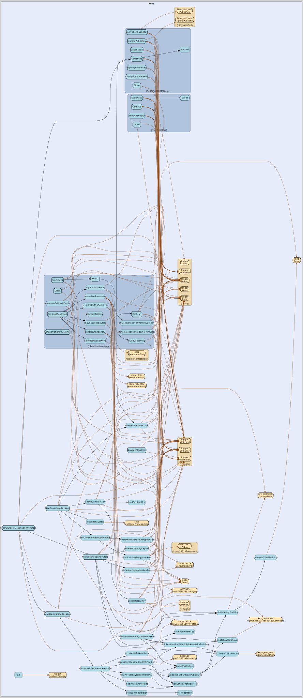

# keys
--
    import "github.com/go-i2p/go-i2p/lib/keys"




## Usage

#### type KeyStore

```go
type KeyStore interface {
	KeyID() string
	// GetKeys returns the public and private keys
	GetKeys() (publicKey types.PublicKey, privateKey types.PrivateKey, err error)
	// StoreKeys stores the keys
	StoreKeys() error
}
```

KeyStore is an interface for storing and retrieving keys

#### type KeyStoreImpl

```go
type KeyStoreImpl struct {
}
```


#### func  NewKeyStoreImpl

```go
func NewKeyStoreImpl(dir, name string, privateKey types.PrivateKey) *KeyStoreImpl
```

#### func (*KeyStoreImpl) GetKeys

```go
func (ks *KeyStoreImpl) GetKeys() (types.PublicKey, types.PrivateKey, error)
```

#### func (*KeyStoreImpl) KeyID

```go
func (ks *KeyStoreImpl) KeyID() string
```

#### func (*KeyStoreImpl) StoreKeys

```go
func (ks *KeyStoreImpl) StoreKeys() error
```

#### type RouterInfoKeystore

```go
type RouterInfoKeystore struct {
	*sntp.RouterTimestamper
}
```

RouterInfoKeystore is an implementation of KeyStore for storing and retrieving
RouterInfo private keys and exporting RouterInfos

#### func  NewRouterInfoKeystore

```go
func NewRouterInfoKeystore(dir, name string) (*RouterInfoKeystore, error)
```
NewRouterInfoKeystore creates a new RouterInfoKeystore with fresh and new
private keys it accepts a directory to store the keys in and a name for the keys
then it generates new private keys for the routerInfo if none exist

#### func (*RouterInfoKeystore) ConstructRouterInfo

```go
func (ks *RouterInfoKeystore) ConstructRouterInfo(addresses []*router_address.RouterAddress) (*router_info.RouterInfo, error)
```

#### func (*RouterInfoKeystore) GetKeys

```go
func (ks *RouterInfoKeystore) GetKeys() (types.PublicKey, types.PrivateKey, error)
```

#### func (*RouterInfoKeystore) KeyID

```go
func (ks *RouterInfoKeystore) KeyID() string
```

#### func (*RouterInfoKeystore) StoreKeys

```go
func (ks *RouterInfoKeystore) StoreKeys() error
```


keys 

github.com/go-i2p/go-i2p/lib/keys

[go-i2p template file](/template.md)
