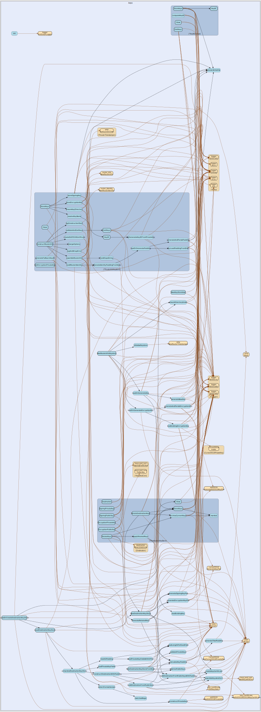

# keys
--
    import "github.com/go-i2p/go-i2p/lib/keys"



Package keys provides key management for I2P destinations, including key
generation, persistence, and DestinationKeyStore operations.

## Usage

#### type DestinationKeyStore

```go
type DestinationKeyStore struct {
}
```

DestinationKeyStore stores both encryption and signing private keys for an I2P
destination, enabling LeaseSet2 creation and message encryption. Uses modern
cryptography: Ed25519 for signing and X25519 for encryption.

#### func  LoadDestinationKeyStore

```go
func LoadDestinationKeyStore(dir, name string) (*DestinationKeyStore, error)
```
LoadDestinationKeyStore loads a previously persisted DestinationKeyStore from
disk. Returns the reconstructed key store with the same destination identity
(same .b32.i2p address).

#### func  LoadOrCreateDestinationKeyStore

```go
func LoadOrCreateDestinationKeyStore(dir, name string) (*DestinationKeyStore, error)
```
LoadOrCreateDestinationKeyStore attempts to load an existing key store from
disk. If no file exists, it creates a new key store with fresh keys and persists
it. If the file exists but is corrupted or unreadable, an error is returned
instead of silently generating a new identity (which would cause identity loss).
This is the primary entry point for services that need a stable destination
identity.

#### func  NewDestinationKeyStore

```go
func NewDestinationKeyStore() (*DestinationKeyStore, error)
```
NewDestinationKeyStore creates a new key store with generated Ed25519/X25519
keys. This generates a new destination with fresh keys suitable for creating
LeaseSet2s using modern I2P cryptography (ECIES-X25519-AEAD-Ratchet compatible).

#### func  NewDestinationKeyStoreFromKeys

```go
func NewDestinationKeyStoreFromKeys(signingPrivKey types.SigningPrivateKey, encryptionPrivKey types.PrivateEncryptionKey, existingPadding ...[]byte) (*DestinationKeyStore, error)
```
NewDestinationKeyStoreFromKeys creates a DestinationKeyStore from pre-existing
private keys. The destination (public keys + KeysAndCert) is reconstructed
deterministically from the provided private keys, producing the same .b32.i2p
address as the original identity.

An optional padding parameter can be provided to restore the exact identity
padding from a previous session. If nil, new padding is generated per Proposal
161, which will produce a different destination hash.

This enables I2CP clients to maintain persistent identities across sessions by
providing their own key material rather than having the router generate fresh
keys each time.

#### func (*DestinationKeyStore) Close

```go
func (dks *DestinationKeyStore) Close()
```
Close zeroes all private key material from memory. After calling Close, the key
store must not be used for signing or encryption operations. This implements
defense-in-depth key hygiene per cryptographic best practices.

#### func (*DestinationKeyStore) Destination

```go
func (dks *DestinationKeyStore) Destination() *destination.Destination
```
Destination returns the public destination

#### func (*DestinationKeyStore) EncryptionPrivateKey

```go
func (dks *DestinationKeyStore) EncryptionPrivateKey() types.PrivateEncryptionKey
```
EncryptionPrivateKey returns the encryption private key for decrypting messages

#### func (*DestinationKeyStore) EncryptionPublicKey

```go
func (dks *DestinationKeyStore) EncryptionPublicKey() (types.ReceivingPublicKey, error)
```
EncryptionPublicKey returns the encryption public key

#### func (*DestinationKeyStore) IdentityPadding

```go
func (dks *DestinationKeyStore) IdentityPadding() []byte
```
IdentityPadding returns the identity padding bytes used in the KeysAndCert. This
must be preserved across store/load cycles (and passed to
NewDestinationKeyStoreFromKeys) to maintain a stable .b32.i2p address.

#### func (*DestinationKeyStore) RotateDestinationKeys

```go
func (dks *DestinationKeyStore) RotateDestinationKeys(dir, name string) (*DestinationKeyStore, error)
```
RotateDestinationKeys generates new destination keys, archives the old keys, and
persists the new keys. The new keys will produce a different .b32.i2p address,
which is expected behavior for key rotation (forward secrecy).

Important: After rotation, the old destination address becomes invalid. Any
services or clients using the old address must be updated.

The old keys are archived to a timestamped file in the same directory, allowing
recovery of old keys if needed for decrypting previous messages.

Returns the new DestinationKeyStore with freshly generated keys.

#### func (*DestinationKeyStore) RotateKeys

```go
func (dks *DestinationKeyStore) RotateKeys(dir, name string) (*destination.Destination, error)
```
RotateKeys generates new encryption and signing keys, updating the destination
identity. The old keys are archived to disk with a timestamp suffix before being
replaced. This provides forward secrecy at the destination level.

NOTE: Key rotation changes the .b32.i2p address. Any peers holding the old
address will no longer be able to reach this destination. The old keys are
preserved in an archive file for potential recovery or decryption of old
messages.

Parameters:

    - dir: directory to store keys (and archive)
    - name: base name for key files

Returns the previous destination (for logging/notification) and any error.

#### func (*DestinationKeyStore) SigningPrivateKey

```go
func (dks *DestinationKeyStore) SigningPrivateKey() types.SigningPrivateKey
```
SigningPrivateKey returns the signing private key for creating LeaseSets

#### func (*DestinationKeyStore) SigningPublicKey

```go
func (dks *DestinationKeyStore) SigningPublicKey() (types.SigningPublicKey, error)
```
SigningPublicKey returns the signing public key

#### func (*DestinationKeyStore) StoreKeys

```go
func (dks *DestinationKeyStore) StoreKeys(dir, name string) error
```
StoreKeys persists the destination key store to disk at the given path. The file
contains the signing private key, encryption private key, and the full
serialized destination (KeysAndCert), allowing exact reconstruction on load —
preserving the same .b32.i2p address across restarts.

#### type KeyStore

```go
type KeyStore interface {
	KeyID() string
	// GetKeys returns the public and private keys
	GetKeys() (publicKey types.PublicKey, privateKey types.PrivateKey, err error)
	// StoreKeys stores the keys
	StoreKeys() error
}
```

KeyStore is an interface for storing and retrieving keys

#### type KeyStoreImpl

```go
type KeyStoreImpl struct {
}
```

KeyStoreImpl is a filesystem-backed implementation of the KeyStore interface
that manages a single private key and its derived public key.

#### func  NewKeyStoreImpl

```go
func NewKeyStoreImpl(dir, name string, privateKey types.PrivateKey) *KeyStoreImpl
```
NewKeyStoreImpl creates a new KeyStoreImpl that stores keys in the given
directory with the specified name prefix.

#### func (*KeyStoreImpl) Close

```go
func (ks *KeyStoreImpl) Close()
```
Close zeroes private key material from memory. After calling Close, the key
store must not be used. This implements defense-in-depth key hygiene per
cryptographic best practices.

#### func (*KeyStoreImpl) GetKeys

```go
func (ks *KeyStoreImpl) GetKeys() (types.PublicKey, types.PrivateKey, error)
```
GetKeys returns the public and private key pair managed by this KeyStoreImpl.

#### func (*KeyStoreImpl) KeyID

```go
func (ks *KeyStoreImpl) KeyID() string
```
KeyID returns a stable, filesystem-safe identifier for this keystore, using the
configured name or a hex-encoded prefix of the public key.

#### func (*KeyStoreImpl) StoreKeys

```go
func (ks *KeyStoreImpl) StoreKeys() error
```
StoreKeys persists the private key to the filesystem in the configured directory
with appropriate permissions.

#### type RouterInfoKeystore

```go
type RouterInfoKeystore struct {
	*sntp.RouterTimestamper
}
```

RouterInfoKeystore is an implementation of KeyStore for storing and retrieving
RouterInfo private keys and exporting RouterInfos

#### func  NewRouterInfoKeystore

```go
func NewRouterInfoKeystore(dir, name string) (*RouterInfoKeystore, error)
```
NewRouterInfoKeystore creates a new RouterInfoKeystore with fresh and new
private keys it accepts a directory to store the keys in and a name for the keys
then it generates new private keys for the routerInfo if none exist

#### func (*RouterInfoKeystore) Close

```go
func (ks *RouterInfoKeystore) Close()
```
Close zeroes all private key material from memory. After calling Close, the
keystore must not be used for signing or encryption operations. This implements
defense-in-depth key hygiene per cryptographic best practices.

#### func (*RouterInfoKeystore) ConstructRouterInfo

```go
func (ks *RouterInfoKeystore) ConstructRouterInfo(addresses []*router_address.RouterAddress, opts ...RouterInfoOptions) (*router_info.RouterInfo, error)
```
ConstructRouterInfo creates a complete RouterInfo structure with signing keys
and certificate. The opts parameter allows specifying optional parameters like
congestion flags.

#### func (*RouterInfoKeystore) GetEncryptionPrivateKey

```go
func (ks *RouterInfoKeystore) GetEncryptionPrivateKey() types.PrivateEncryptionKey
```
GetEncryptionPrivateKey returns the X25519 encryption private key used for
NTCP2. This key is used as the static key for NTCP2 transport sessions, ensuring
consistent peer identification across router restarts.

#### func (*RouterInfoKeystore) GetKeys

```go
func (ks *RouterInfoKeystore) GetKeys() (types.PublicKey, types.PrivateKey, error)
```
GetKeys returns the public and private signing key pair held by this
RouterInfoKeystore.

#### func (*RouterInfoKeystore) GetSigningPrivateKey

```go
func (ks *RouterInfoKeystore) GetSigningPrivateKey() types.PrivateKey
```
GetSigningPrivateKey returns the Ed25519 signing private key.

#### func (*RouterInfoKeystore) KeyID

```go
func (ks *RouterInfoKeystore) KeyID() string
```
KeyID returns a stable, filesystem-safe identifier for this keystore, derived
from the configured name or the public key.

#### func (*RouterInfoKeystore) StoreKeys

```go
func (ks *RouterInfoKeystore) StoreKeys() error
```
StoreKeys persists the signing and encryption private keys to disk in the
configured directory.

#### type RouterInfoOptions

```go
type RouterInfoOptions struct {
	// CongestionFlag is the congestion capability flag to advertise (D/E/G or empty).
	// Per PROP_162, this is appended after R/U in the caps string.
	CongestionFlag string
	// Reachable indicates whether the router has at least one active transport
	// address and can accept inbound connections. When true, the caps string
	// uses "R" (Reachable); when false, "U" (Unreachable).
	Reachable bool
	// Floodfill indicates whether the router should advertise the "f" (floodfill)
	// capability. When true, "f" replaces "N" (not floodfill) in the caps string.
	// Floodfills store and distribute netDB entries.
	Floodfill bool
	// NetID is the network identifier. Defaults to "2" (production I2P network).
	// Set to "3" for testnet or other values for experimental networks.
	NetID string
	// Version is the router.version string advertised in RouterInfo options.
	// Defaults to "0.9.63". Must be >= "0.9.58" to pass i2pd's NETDB_MIN_ALLOWED_VERSION check.
	Version string
	// Hidden indicates that the router operates in hidden mode (Java I2P
	// semantics). When true, the caps string includes "H" (hidden) and forces
	// "U" (unreachable) regardless of the Reachable flag, signalling to the
	// rest of the network that this router will not accept inbound connections
	// or transit tunnels.
	Hidden bool
}
```

RouterInfoOptions contains optional parameters for constructing RouterInfo. This
allows extending ConstructRouterInfo without breaking existing callers.


keys 

github.com/go-i2p/go-i2p/lib/keys

[go-i2p template file](template.md)
