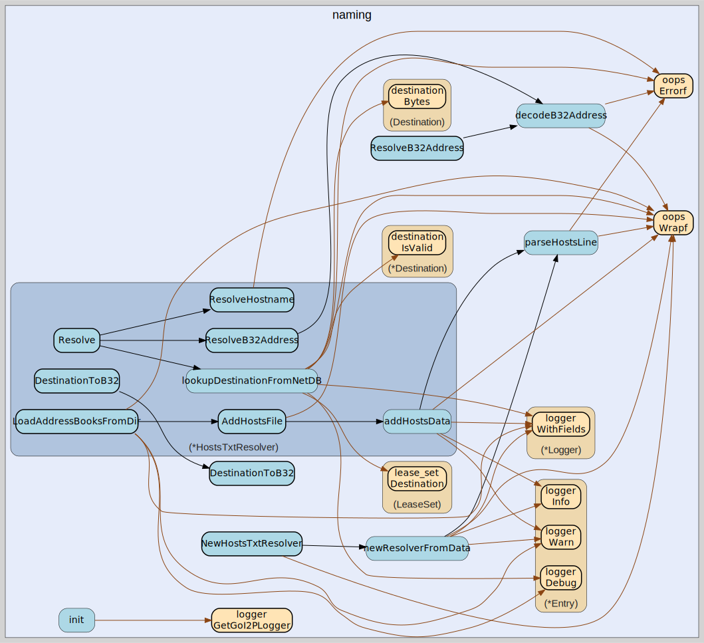

# naming
--
    import "github.com/go-i2p/go-i2p/lib/naming"



Package naming provides hostname resolution for I2P destinations.

The default implementation uses an embedded hosts.txt file from the Java I2P
router distribution, which maps .i2p hostnames to their base64-encoded
Destination representations.

## Usage

#### type HostsTxtResolver

```go
type HostsTxtResolver struct {
}
```

HostsTxtResolver resolves .i2p hostnames using an in-memory map loaded from a
hosts.txt file. The default embedded hosts.txt is from the Java I2P router
distribution.

#### func  NewHostsTxtResolver

```go
func NewHostsTxtResolver() (*HostsTxtResolver, error)
```
NewHostsTxtResolver creates a resolver preloaded with the embedded default
hosts.txt from the Java I2P router.

#### func (*HostsTxtResolver) ResolveHostname

```go
func (r *HostsTxtResolver) ResolveHostname(hostname string) ([]byte, error)
```
ResolveHostname resolves an I2P hostname to its raw Destination bytes. Returns
the destination bytes and nil on success, or nil and an error if the hostname is
not found.

#### func (*HostsTxtResolver) Size

```go
func (r *HostsTxtResolver) Size() int
```
Size returns the number of hostnames loaded in the resolver.


naming 

github.com/go-i2p/go-i2p/lib/naming

[go-i2p template file](/template.md)
