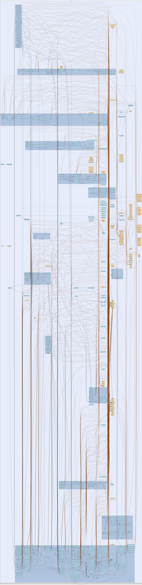

# netdb
--
    import "github.com/go-i2p/go-i2p/lib/netdb"




## Usage

```go
const CacheFileName = "sizecache.txt"
```
Moved from: std.go name of file to hold precomputed size of netdb

#### type Entry

```go
type Entry struct {
	*router_info.RouterInfo
	*lease_set.LeaseSet
}
```

netdb entry wraps a router info and provides serialization

#### func (*Entry) ReadFrom

```go
func (e *Entry) ReadFrom(r io.Reader) (err error)
```

#### func (*Entry) WriteTo

```go
func (e *Entry) WriteTo(w io.Writer) error
```
WriteTo writes the Entry to the provided writer.

#### type KademliaResolver

```go
type KademliaResolver struct {
	// netdb to store result into
	NetworkDatabase
}
```

resolves router infos with recursive kademlia lookup

#### func (*KademliaResolver) Lookup

```go
func (kr *KademliaResolver) Lookup(h common.Hash, timeout time.Duration) (*router_info.RouterInfo, error)
```

#### type NetworkDatabase

```go
type NetworkDatabase interface {
	// obtain a RouterInfo by its hash locally
	// return a RouterInfo if we found it locally
	// return nil if the RouterInfo cannot be found locally
	GetRouterInfo(hash common.Hash) router_info.RouterInfo

	// obtain all routerInfos, ordered by their hash
	// return a slice of routerInfos
	GetAllRouterInfos() []router_info.RouterInfo

	// store a router info locally
	StoreRouterInfo(ri router_info.RouterInfo)

	// try obtaining more peers with a bootstrap instance until we get minRouters number of router infos
	// returns error if bootstrap.GetPeers returns an error otherwise returns nil
	Reseed(b bootstrap.Bootstrap, minRouters int) error

	// return how many router infos we have
	Size() int

	// Recaculate size of netdb from backend
	RecalculateSize() error

	// ensure underlying resources exist , i.e. directories, files, configs
	Ensure() error
}
```

Moved from: netdb.go i2p network database, storage of i2p RouterInfos

#### type Resolver

```go
type Resolver interface {
	// resolve a router info by hash
	// return a chan that yields the found RouterInfo or nil if it could not be found after timeout
	Lookup(hash common.Hash, timeout time.Duration) (*router_info.RouterInfo, error)
}
```

Moved from: netdb.go resolves unknown RouterInfos given the hash of their
RouterIdentity

#### func  NewKademliaResolver

```go
func NewKademliaResolver(netDb NetworkDatabase, pool *tunnel.Pool) (r Resolver)
```
Moved from: kad.go NewKademliaResolver creates a new resolver that stores result
into a NetworkDatabase and uses a tunnel pool for the lookup

#### type StdNetDB

```go
type StdNetDB struct {
	DB          string
	RouterInfos map[common.Hash]Entry

	LeaseSets map[common.Hash]Entry
}
```

standard network database implementation using local filesystem skiplist

#### func  NewStdNetDB

```go
func NewStdNetDB(db string) *StdNetDB
```

#### func (*StdNetDB) CheckFilePathValid

```go
func (db *StdNetDB) CheckFilePathValid(fpath string) bool
```

#### func (*StdNetDB) Create

```go
func (db *StdNetDB) Create() (err error)
```
create base network database directory

#### func (*StdNetDB) Ensure

```go
func (db *StdNetDB) Ensure() (err error)
```
ensure that the network database exists

#### func (*StdNetDB) Exists

```go
func (db *StdNetDB) Exists() bool
```
return true if the network db directory exists and is writable

#### func (*StdNetDB) GetAllRouterInfos

```go
func (db *StdNetDB) GetAllRouterInfos() (ri []router_info.RouterInfo)
```

#### func (*StdNetDB) GetRouterInfo

```go
func (db *StdNetDB) GetRouterInfo(hash common.Hash) (chnl chan router_info.RouterInfo)
```

#### func (*StdNetDB) GetRouterInfoBytes

```go
func (db *StdNetDB) GetRouterInfoBytes(hash common.Hash) ([]byte, error)
```
GetRouterInfoBytes retrieves RouterInfo data as bytes from the database

#### func (*StdNetDB) GetRouterInfoCount

```go
func (db *StdNetDB) GetRouterInfoCount() int
```
GetRouterInfoCount returns the total number of RouterInfo entries in the
database

#### func (*StdNetDB) Path

```go
func (db *StdNetDB) Path() string
```
get netdb path

#### func (*StdNetDB) RecalculateSize

```go
func (db *StdNetDB) RecalculateSize() (err error)
```
recalculateSize recalculates cached size of netdb

#### func (*StdNetDB) Reseed

```go
func (db *StdNetDB) Reseed(b bootstrap.Bootstrap, minRouters int) (err error)
```
reseed if we have less than minRouters known routers returns error if reseed
failed

#### func (*StdNetDB) Save

```go
func (db *StdNetDB) Save() (err error)
```

#### func (*StdNetDB) SaveEntry

```go
func (db *StdNetDB) SaveEntry(e *Entry) (err error)
```

#### func (*StdNetDB) Size

```go
func (db *StdNetDB) Size() (routers int)
```
return how many routers we know about in our network database

#### func (*StdNetDB) SkiplistFile

```go
func (db *StdNetDB) SkiplistFile(hash common.Hash) (fpath string)
```
get the skiplist file that a RouterInfo with this hash would go in

#### func (*StdNetDB) StoreRouterInfo

```go
func (db *StdNetDB) StoreRouterInfo(key common.Hash, data []byte, dataType byte) error
```
StoreRouterInfo stores a RouterInfo entry in the database from I2NP
DatabaseStore message


netdb 

github.com/go-i2p/go-i2p/lib/netdb

[go-i2p template file](/template.md)
