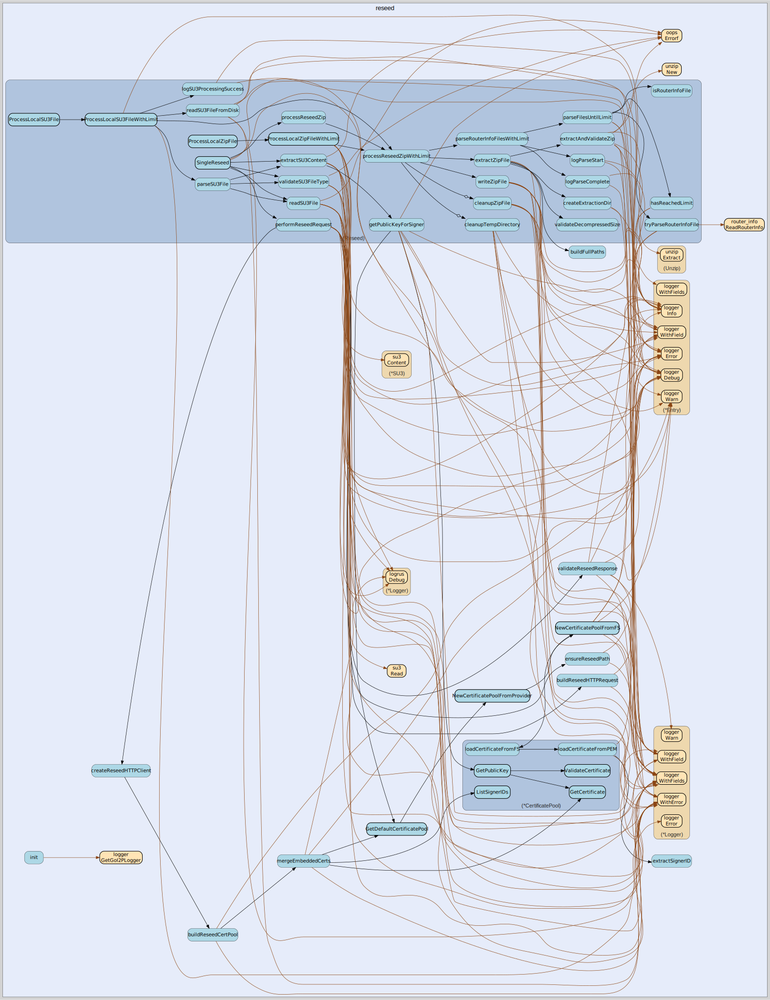

# reseed
--
    import "github.com/go-i2p/go-i2p/lib/netdb/reseed"




## Usage

```go
const (
	DefaultDialTimeout = 5 * 1000 // 5 seconds
	DefaultKeepAlive   = 5 * 1000 // 5 seconds
)
```

```go
const (
	I2pUserAgent = "Wget/1.11.4"
)
```

#### type Reseed

```go
type Reseed struct {
	net.Dialer
}
```


#### func  NewReseed

```go
func NewReseed() *Reseed
```

#### func (Reseed) SingleReseed

```go
func (r Reseed) SingleReseed(uri string) ([]router_info.RouterInfo, error)
```


reseed 

github.com/go-i2p/go-i2p/lib/netdb/reseed

[go-i2p template file](/template.md)
