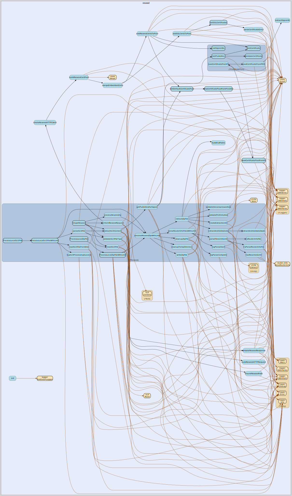

# reseed
--
    import "github.com/go-i2p/go-i2p/lib/netdb/reseed"



Package reseed provides SU3-based reseed certificate handling for bootstrapping
the I2P NetDB from trusted reseed servers.

## Usage

```go
const (
	DefaultDialTimeout = 30 * time.Second // 30 seconds for HTTP requests
	DefaultKeepAlive   = 30 * time.Second // 30 seconds keep-alive
)
```

```go
const (
	I2pUserAgent = "Wget/1.11.4"
	// ReseedSU3Path is the standard I2P reseed path for SU3 files.
	// Reseed servers expect clients to request the SU3 file at this path.
	ReseedSU3Path = "i2pseeds.su3"
)
```

#### func  SetCertificateProvider

```go
func SetCertificateProvider(provider CertificateFSProvider)
```
SetCertificateProvider sets the function that provides the reseed certificate
filesystem. This must be called before GetDefaultCertificatePool is called for
the first time. Typically called by the embedded package during initialization.

#### type CertificateFSProvider

```go
type CertificateFSProvider func() (fs.FS, error)
```

CertificateFSProvider is a function type that returns the reseed certificate
filesystem. This allows breaking the import cycle by injecting the filesystem at
runtime.

#### type CertificatePool

```go
type CertificatePool struct {
}
```

CertificatePool holds trusted reseed signing certificates loaded from embedded
files. It provides thread-safe access to certificates by signer ID (email
address).

#### func  GetDefaultCertificatePool

```go
func GetDefaultCertificatePool() (*CertificatePool, error)
```
GetDefaultCertificatePool returns the default certificate pool loaded from
embedded certificates. The pool is initialized on first successful call (lazy
initialization). Returns the cached pool on subsequent calls. If initialization
fails, subsequent calls will re-attempt initialization, allowing recovery from
transient errors or late SetCertificateProvider calls.

#### func  NewCertificatePoolFromFS

```go
func NewCertificatePoolFromFS(certFS fs.FS) (*CertificatePool, error)
```
NewCertificatePoolFromFS creates a new certificate pool from a filesystem
containing .crt files.

#### func  NewCertificatePoolFromProvider

```go
func NewCertificatePoolFromProvider(provider CertificateFSProvider) (*CertificatePool, error)
```
NewCertificatePoolFromProvider creates a new certificate pool using the provided
filesystem provider.

#### func (*CertificatePool) Count

```go
func (cp *CertificatePool) Count() int
```
Count returns the number of certificates in the pool.

#### func (*CertificatePool) GetCertificate

```go
func (cp *CertificatePool) GetCertificate(signerID string) (*x509.Certificate, bool)
```
GetCertificate returns the certificate for the given signer ID. Returns nil and
false if no certificate is found for the signer.

#### func (*CertificatePool) GetPublicKey

```go
func (cp *CertificatePool) GetPublicKey(signerID string) (interface{}, error)
```
GetPublicKey returns the public key for the given signer ID. Returns nil and an
error if no certificate is found or if the certificate is invalid.

#### func (*CertificatePool) HasSigner

```go
func (cp *CertificatePool) HasSigner(signerID string) bool
```
HasSigner returns true if the pool contains a certificate for the given signer
ID.

#### func (*CertificatePool) ListSignerIDs

```go
func (cp *CertificatePool) ListSignerIDs() []string
```
ListSignerIDs returns a list of all signer IDs in the pool.

#### func (*CertificatePool) Pool

```go
func (cp *CertificatePool) Pool() *x509.CertPool
```
Pool returns the underlying x509.CertPool for TLS verification.

#### func (*CertificatePool) ValidateCertificate

```go
func (cp *CertificatePool) ValidateCertificate(cert *x509.Certificate, signerID string) error
```
ValidateCertificate checks that a certificate is valid (not expired, not before
valid).

#### type Reseed

```go
type Reseed struct {
	net.Dialer
}
```


#### func  NewReseed

```go
func NewReseed() *Reseed
```

#### func (Reseed) ProcessLocalSU3File

```go
func (r Reseed) ProcessLocalSU3File(filePath string) ([]router_info.RouterInfo, error)
```
ProcessLocalSU3File reads and processes a local SU3 reseed file

#### func (Reseed) ProcessLocalSU3FileWithLimit

```go
func (r Reseed) ProcessLocalSU3FileWithLimit(filePath string, limit int) ([]router_info.RouterInfo, error)
```
ProcessLocalSU3FileWithLimit reads and processes a local SU3 reseed file with a
limit on RouterInfos parsed. If limit <= 0, all RouterInfos are parsed (same as
ProcessLocalSU3File). This prevents loading excessive RouterInfos into memory
when only a small number is needed.

#### func (Reseed) ProcessLocalZipFile

```go
func (r Reseed) ProcessLocalZipFile(filePath string) ([]router_info.RouterInfo, error)
```
ProcessLocalZipFile reads and processes a local zip reseed file

#### func (Reseed) ProcessLocalZipFileWithLimit

```go
func (r Reseed) ProcessLocalZipFileWithLimit(filePath string, limit int) ([]router_info.RouterInfo, error)
```
ProcessLocalZipFileWithLimit reads and processes a local zip reseed file with a
limit on RouterInfos parsed. If limit <= 0, all RouterInfos are parsed (same as
ProcessLocalZipFile). This prevents loading excessive RouterInfos into memory
when only a small number is needed.

#### func (Reseed) SingleReseed

```go
func (r Reseed) SingleReseed(uri string) ([]router_info.RouterInfo, error)
```


reseed 

github.com/go-i2p/go-i2p/lib/netdb/reseed

[go-i2p template file](/template.md)
