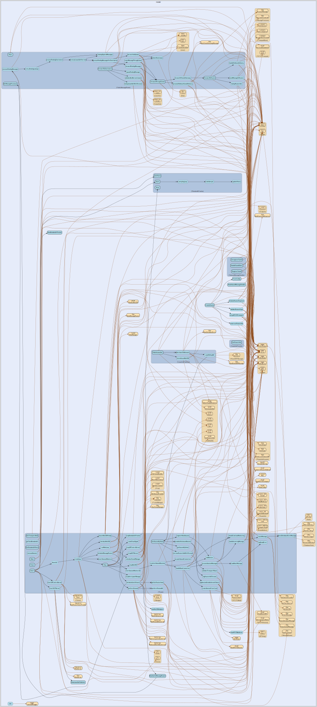

# router
--
    import "github.com/go-i2p/go-i2p/lib/router"




## Usage

#### type Router

```go
type Router struct {
	// keystore for router info
	*keys.RouterInfoKeystore
	// multi-transport manager
	*transport.TransportMuxer
}
```

i2p router type

#### func  CreateRouter

```go
func CreateRouter(cfg *config.RouterConfig) (*Router, error)
```
CreateRouter creates a router with the provided configuration

#### func  FromConfig

```go
func FromConfig(c *config.RouterConfig) (r *Router, err error)
```
create router from configuration

#### func (*Router) Close

```go
func (r *Router) Close() error
```
Close closes any internal state and finallizes router resources so that nothing
can start up again

#### func (*Router) Start

```go
func (r *Router) Start()
```
Start starts router mainloop

#### func (*Router) Stop

```go
func (r *Router) Stop()
```
Stop starts stopping internal state of router

#### func (*Router) Wait

```go
func (r *Router) Wait()
```
Wait blocks until router is fully stopped


router 

github.com/go-i2p/go-i2p/lib/router
