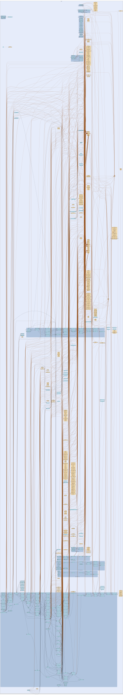

# router
--
    import "github.com/go-i2p/go-i2p/lib/router"



Package router coordinates I2P router subsystems including I2CP server, tunnel
management, NetDB, transport layer, and message routing.

# Router Architecture

The Router integrates multiple subsystems:

    - I2CP server for client applications (localhost:7654)
    - Tunnel pools for anonymized routing
    - NetDB for RouterInfo and LeaseSet storage
    - NTCP2 transport for router-to-router communication
    - Message routing with garlic encryption (ECIES-X25519-AEAD-Ratchet)

# Usage Example

    // Create router
    router, err := router.NewRouter(config)
    if err != nil {
        log.Fatal(err)
    }

    // Start router (non-blocking)
    if err := router.Start(); err != nil {
        log.Fatal(err)
    }

    // Router runs in background...

    // Graceful shutdown
    if err := router.Stop(); err != nil {
        log.Printf("Shutdown error: %v", err)
    }

# Current Status

Core routing functional, I2CP complete, LeaseSet2 supported.

## Usage

#### type BandwidthSample

```go
type BandwidthSample struct {
}
```

BandwidthSample represents a single bandwidth measurement at a point in time.

#### type BandwidthTracker

```go
type BandwidthTracker struct {
}
```

BandwidthTracker tracks bandwidth usage over time and calculates rolling
averages. It maintains samples for computing 1-second and 15-second rolling
averages.

#### func  NewBandwidthTracker

```go
func NewBandwidthTracker() *BandwidthTracker
```
NewBandwidthTracker creates a new bandwidth tracker with 1-second sampling.

#### func (*BandwidthTracker) GetRate15s

```go
func (bt *BandwidthTracker) GetRate15s() (inbound, outbound uint64)
```
GetRate15s returns the 15-second inbound and outbound bandwidth rates in bytes
per second.

#### func (*BandwidthTracker) GetRate1s

```go
func (bt *BandwidthTracker) GetRate1s() (inbound, outbound uint64)
```
GetRate1s returns the 1-second inbound and outbound bandwidth rates in bytes per
second.

#### func (*BandwidthTracker) GetRates

```go
func (bt *BandwidthTracker) GetRates() (inbound, outbound uint64)
```
GetRates returns the 15-second inbound and outbound bandwidth rates in bytes per
second.

#### func (*BandwidthTracker) Start

```go
func (bt *BandwidthTracker) Start(getBandwidth func() (sent, received uint64))
```
Start begins the bandwidth tracking goroutine. The getBandwidth function should
return current cumulative bytes sent/received.

#### func (*BandwidthTracker) Stop

```go
func (bt *BandwidthTracker) Stop()
```
Stop stops the bandwidth tracking goroutine. It is safe to call Stop multiple
times; only the first call closes the channel.

#### type CongestionMetricsCollector

```go
type CongestionMetricsCollector interface {
	// GetParticipatingTunnelRatio returns current/max participating tunnels ratio
	GetParticipatingTunnelRatio() float64

	// GetBandwidthUtilization returns current bandwidth usage ratio (0.0-1.0)
	GetBandwidthUtilization() float64

	// GetConnectionUtilization returns connection count / max connections ratio
	GetConnectionUtilization() float64

	// IsAcceptingTunnels returns false if router is configured to reject all tunnels
	IsAcceptingTunnels() bool
}
```

CongestionMetricsCollector gathers metrics used to determine congestion state.
Implementations collect data from tunnel manager, bandwidth tracker, and
transports.

#### type CongestionMonitor

```go
type CongestionMonitor struct {
}
```

CongestionMonitor tracks local router congestion and determines the appropriate
congestion flag (D/E/G) to advertise in RouterInfo caps.

Design decisions: - Uses rolling average over configurable window (default 5
minutes per spec) - Implements hysteresis to prevent flag flapping at threshold
boundaries - Thread-safe for concurrent access from RouterInfo publisher - State
machine: None → D → E → G with hysteresis thresholds for downgrades

#### func  NewCongestionMonitor

```go
func NewCongestionMonitor(cfg config.CongestionDefaults, collector CongestionMetricsCollector) *CongestionMonitor
```
NewCongestionMonitor creates a new congestion monitor with the given
configuration. The collector parameter provides metrics; if nil, a no-op
collector is used.

#### func (*CongestionMonitor) ClearForceFlag

```go
func (m *CongestionMonitor) ClearForceFlag()
```
ClearForceFlag clears a previously forced congestion flag, allowing the normal
state machine logic to resume determining the flag from samples.

#### func (*CongestionMonitor) ForceFlag

```go
func (m *CongestionMonitor) ForceFlag(flag config.CongestionFlag)
```
ForceFlag allows manually setting the congestion flag for testing or emergency
use. This bypasses the normal state machine logic. The forced flag persists
until ClearForceFlag() is called, preventing updateState() from overwriting it.

#### func (*CongestionMonitor) GetCongestionFlag

```go
func (m *CongestionMonitor) GetCongestionFlag() config.CongestionFlag
```
GetCongestionFlag returns the current congestion flag. Returns empty string
during startup grace period per spec (prevents restart detection).

#### func (*CongestionMonitor) GetCongestionLevel

```go
func (m *CongestionMonitor) GetCongestionLevel() int
```
GetCongestionLevel returns the numeric congestion level (0=none, 1=D, 2=E, 3=G).

#### func (*CongestionMonitor) GetCurrentRatio

```go
func (m *CongestionMonitor) GetCurrentRatio() float64
```
GetCurrentRatio returns the current rolling average congestion ratio. Useful for
debugging and monitoring.

#### func (*CongestionMonitor) GetSampleCount

```go
func (m *CongestionMonitor) GetSampleCount() int
```
GetSampleCount returns the current number of samples in the rolling window.

#### func (*CongestionMonitor) ShouldAdvertiseCongestion

```go
func (m *CongestionMonitor) ShouldAdvertiseCongestion() bool
```
ShouldAdvertiseCongestion returns true if any congestion flag should be
advertised.

#### func (*CongestionMonitor) Start

```go
func (m *CongestionMonitor) Start()
```
Start begins the background congestion sampling goroutine.

#### func (*CongestionMonitor) Stop

```go
func (m *CongestionMonitor) Stop()
```
Stop stops the background sampling goroutine. Safe to call multiple times; only
the first call has effect.

#### type CongestionSample

```go
type CongestionSample struct {
	Timestamp                time.Time
	ParticipatingTunnelRatio float64
	BandwidthUtilization     float64
	ConnectionUtilization    float64
}
```

CongestionSample represents a single congestion measurement at a point in time.

#### type CongestionStateProvider

```go
type CongestionStateProvider interface {
	// GetCongestionFlag returns the current congestion flag ("D", "E", "G", or "")
	GetCongestionFlag() config.CongestionFlag

	// GetCongestionLevel returns a numeric congestion level (0=none, 1=D, 2=E, 3=G)
	GetCongestionLevel() int

	// ShouldAdvertiseCongestion returns true if any congestion flag should be advertised
	ShouldAdvertiseCongestion() bool
}
```

CongestionStateProvider provides access to local router congestion state. This
interface is used by RouterInfo construction to determine which congestion flag
(D/E/G or none) should be advertised.

#### type GarlicMessageRouter

```go
type GarlicMessageRouter struct {
}
```

GarlicMessageRouter provides router-level garlic message forwarding. It bridges
the gap between message processing (lib/i2np) and router infrastructure (NetDB,
transport, tunnels) to enable delivery of garlic cloves to destinations,
routers, and tunnels beyond LOCAL processing.

This component implements the GarlicCloveForwarder interface and is designed to
be injected into the MessageProcessor via SetCloveForwarder().

Architecture:

    - Receives forwarding requests from MessageProcessor
    - Accesses NetDB for destination/router lookups
    - Uses transport layer for direct router-to-router messaging
    - Uses tunnel pools for destination and tunnel delivery

#### func  NewGarlicMessageRouter

```go
func NewGarlicMessageRouter(
	netdb GarlicNetDB,
	transportMgr *transport.TransportMuxer,
	tunnelPool *tunnel.Pool,
	routerIdentity common.Hash,
) *GarlicMessageRouter
```
NewGarlicMessageRouter creates a new garlic message router with required
dependencies. All parameters are required for full functionality:

    - netdb: For looking up destinations and routers
    - transportMgr: For sending messages to peer routers
    - tunnelPool: For routing messages through tunnels
    - routerIdentity: Our router's hash for reflexive delivery detection

#### func (*GarlicMessageRouter) ForwardThroughTunnel

```go
func (gr *GarlicMessageRouter) ForwardThroughTunnel(
	gatewayHash common.Hash,
	tunnelID tunnel.TunnelID,
	msg i2np.I2NPMessage,
) error
```
ForwardThroughTunnel implements GarlicCloveForwarder interface. Forwards a
message through a tunnel to a gateway (delivery type 0x03).

Process:

    1. Check if gateway_hash == our_router_hash (we are the gateway)
    2. If yes, inject message directly into our tunnel processing via processReflexiveTunnelDelivery()
    3. Otherwise, wrap message in TunnelGateway envelope
    4. Send TunnelGateway message to gateway router via ROUTER delivery

Tunnel delivery is the most common forwarding type in I2P, as most traffic flows
through tunnels for anonymity. The gateway router is responsible for injecting
messages into the tunnel's encryption layers.

#### func (*GarlicMessageRouter) ForwardToDestination

```go
func (gr *GarlicMessageRouter) ForwardToDestination(destHash common.Hash, msg i2np.I2NPMessage) error
```
ForwardToDestination implements GarlicCloveForwarder interface. Forwards a
message to a destination hash (delivery type 0x01).

Process:

    1. Look up destination in NetDB to get LeaseSet
    2. If found: Select a valid lease and route through the tunnel
    3. If not found: Queue message and trigger async LeaseSet lookup
    4. Background processor retries lookups and forwards messages when LeaseSets arrive

Per I2P spec, destinations are identified by their 32-byte hash and are reached
by sending messages through one of their published inbound tunnels.

#### func (*GarlicMessageRouter) ForwardToRouter

```go
func (gr *GarlicMessageRouter) ForwardToRouter(routerHash common.Hash, msg i2np.I2NPMessage) error
```
ForwardToRouter implements GarlicCloveForwarder interface. Forwards a message
directly to a router hash (delivery type 0x02).

Process:

    1. Check if router_hash == our_router_hash (reflexive delivery)
    2. If reflexive, process locally via MessageProcessor
    3. Otherwise, look up router in NetDB to get RouterInfo
    4. Send message via transport layer

Reflexive delivery occurs when a garlic message instructs us to send a clove to
ourselves - this is processed locally to avoid unnecessary network traffic.

#### func (*GarlicMessageRouter) SetMessageProcessor

```go
func (gr *GarlicMessageRouter) SetMessageProcessor(processor *i2np.MessageProcessor)
```
SetMessageProcessor sets a reference to the MessageProcessor for LOCAL delivery
recursion. This enables the router to process messages locally when needed
(e.g., reflexive ROUTER delivery).

#### func (*GarlicMessageRouter) Stop

```go
func (gr *GarlicMessageRouter) Stop()
```
Stop gracefully shuts down the garlic message router. This stops the background
message processing goroutine and waits for it to finish.

#### type GarlicNetDB

```go
type GarlicNetDB interface {
	GetRouterInfo(hash common.Hash) chan router_info.RouterInfo
	GetLeaseSet(hash common.Hash) chan lease_set.LeaseSet
	StoreRouterInfo(ri router_info.RouterInfo)
	Size() int
	SelectFloodfillRouters(targetHash common.Hash, count int) ([]router_info.RouterInfo, error)
}
```

GarlicNetDB defines the NetDB interface needed for garlic message routing. This
matches the actual StdNetDB implementation which returns channels for async
lookups.

#### type InboundMessageHandler

```go
type InboundMessageHandler struct {
}
```

InboundMessageHandler processes inbound tunnel messages and delivers them to
I2CP sessions. This component bridges tunnel endpoints with I2CP client
sessions, enabling end-to-end message delivery from the I2P network to local
applications.

Design: - Maps tunnel IDs to I2CP sessions for message routing - Uses tunnel
endpoints to decrypt incoming TunnelData messages - Delivers decrypted I2NP
messages to appropriate I2CP session queues - Thread-safe for concurrent message
processing

#### func  NewInboundMessageHandler

```go
func NewInboundMessageHandler(sessionManager *i2cp.SessionManager) *InboundMessageHandler
```
NewInboundMessageHandler creates a new inbound message handler

#### func (*InboundMessageHandler) CreateEndpointForSession

```go
func (h *InboundMessageHandler) CreateEndpointForSession(tunnelID tunnel.TunnelID, sessionID uint16, decryption cryptotunnel.TunnelEncryptor) (*tunnel.Endpoint, error)
```
CreateEndpointForSession creates a tunnel endpoint with the message handler
already wired to deliver decrypted messages to the specified I2CP session. The
returned endpoint is also registered with this handler.

This is the preferred way to create inbound tunnel endpoints, as it ensures the
decrypted message delivery pipeline (tunnel → I2CP) is complete.

Parameters: - tunnelID: the ID of the inbound tunnel - sessionID: the I2CP
session ID that owns this tunnel - decryption: the tunnel decryption object for
layered decryption

Returns the created endpoint or an error if creation or registration fails.

#### func (*InboundMessageHandler) GetTunnelCount

```go
func (h *InboundMessageHandler) GetTunnelCount() int
```
GetTunnelCount returns the number of registered inbound tunnels

#### func (*InboundMessageHandler) GetTunnelSession

```go
func (h *InboundMessageHandler) GetTunnelSession(tunnelID tunnel.TunnelID) (uint16, bool)
```
GetTunnelSession returns the session ID for a given tunnel ID, if registered

#### func (*InboundMessageHandler) HandleTunnelData

```go
func (h *InboundMessageHandler) HandleTunnelData(msg i2np.I2NPMessage) error
```
HandleTunnelData processes an incoming TunnelData message. This is the main
entry point for inbound message delivery.

Process: 1. Extract tunnel ID from the TunnelCarrier interface 2. Find the
corresponding session and endpoint 3. Decrypt the tunnel message using the
endpoint 4. Deliver the decrypted I2NP message to the session

Parameters: - msg: the I2NP TunnelData message to process

Returns an error if processing fails at any step.

The wire format for TunnelData is 1028 bytes:

    [Tunnel ID (4 bytes)] + [Encrypted Data (1024 bytes)]

HandleTunnelData processes an inbound TunnelData I2NP message by validating,
looking up the owning session, decrypting, and delivering to the I2CP client.

#### func (*InboundMessageHandler) RegisterTunnel

```go
func (h *InboundMessageHandler) RegisterTunnel(tunnelID tunnel.TunnelID, sessionID uint16, endpoint *tunnel.Endpoint) error
```
RegisterTunnel registers an inbound tunnel for a specific I2CP session. This
must be called when a new inbound tunnel is created so that incoming messages
can be routed to the correct session.

Parameters: - tunnelID: the ID of the inbound tunnel - sessionID: the I2CP
session ID that owns this tunnel - endpoint: the tunnel endpoint for decrypting
messages

Returns an error if the tunnel is already registered.

#### func (*InboundMessageHandler) UnregisterTunnel

```go
func (h *InboundMessageHandler) UnregisterTunnel(tunnelID tunnel.TunnelID)
```
UnregisterTunnel removes an inbound tunnel from the handler. This should be
called when a tunnel expires or is destroyed.

#### type LeaseSetPublisher

```go
type LeaseSetPublisher struct {
}
```

LeaseSetPublisher implements i2cp.LeaseSetPublisher interface. It handles
publishing LeaseSets to the local NetDB and distributing them to the I2P network
via DatabaseStore messages.

#### func  NewLeaseSetPublisher

```go
func NewLeaseSetPublisher(r *Router) *LeaseSetPublisher
```
NewLeaseSetPublisher creates a new LeaseSetPublisher for the given router.

#### func (*LeaseSetPublisher) PublishLeaseSet

```go
func (p *LeaseSetPublisher) PublishLeaseSet(key common.Hash, leaseSetData []byte) error
```
PublishLeaseSet publishes a LeaseSet to the network database and I2P network.
This method: 1. Stores the LeaseSet in the local NetDB for local lookups 2.
Creates a DatabaseStore I2NP message 3. Distributes the message to floodfill
routers (future enhancement)

Parameters:

    - key: The destination hash (SHA256 of the destination)
    - leaseSetData: The serialized LeaseSet2 bytes

Returns an error if local storage fails. Network distribution errors are logged
but don't cause failure (the LeaseSet is still available locally).

#### func (*LeaseSetPublisher) Wait

```go
func (p *LeaseSetPublisher) Wait()
```
Wait blocks until all background distributeToNetwork goroutines have completed.
This should be called during router shutdown to ensure no goroutines outlive the
router's lifecycle and access closed transport sessions or NetDB.

#### func (*LeaseSetPublisher) WaitWithContext

```go
func (p *LeaseSetPublisher) WaitWithContext(ctx context.Context) error
```
WaitWithContext blocks until all background goroutines have completed or the
context is cancelled/expired. Returns nil if all goroutines completed, or the
context's error if the context was done first.

#### func (*LeaseSetPublisher) WaitWithTimeout

```go
func (p *LeaseSetPublisher) WaitWithTimeout(timeout time.Duration) error
```
WaitWithTimeout blocks until all background goroutines have completed or the
timeout expires, whichever comes first. Returns nil if all goroutines completed,
or context.DeadlineExceeded if the timeout was reached.

This is the preferred shutdown method: it prevents indefinite hangs when a
network call to a floodfill router is stuck (e.g., unreachable peer, network
partition). Typical timeout: 30 seconds.

#### type Router

```go
type Router struct {
	// keystore for router info
	*keys.RouterInfoKeystore
	// multi-transport manager
	*transport.TransportMuxer
	// netdb
	*netdb.StdNetDB
}
```


#### func  CreateRouter

```go
func CreateRouter(cfg *config.RouterConfig) (*Router, error)
```
CreateRouter creates a router with the provided configuration

#### func  FromConfig

```go
func FromConfig(c *config.RouterConfig) (r *Router, err error)
```
FromConfig creates a minimal Router stub from config. This is a low-level
internal function used by CreateRouter. It only initializes cfg and closeChnl.

WARNING: Do not use FromConfig directly unless you intend to manually initialize
the keystore, transport, and other subsystems afterward. Use CreateRouter
instead, which fully initializes the router. Calling Start() on a router created
solely via FromConfig will return an error because required subsystems
(keystore, transport) are nil.

#### func (*Router) Close

```go
func (r *Router) Close() error
```
Close closes any internal state and finalizes router resources so that nothing
can start up again. This method performs final cleanup after Stop() to ensure
all resources are released and the router cannot be restarted. Call Stop()
before Close() for graceful shutdown; Close() will call Stop() if the router is
still running.

Resources released by Close():

    - Transport layer connections (via TransportMuxer.Close())
    - Active NTCP2 sessions
    - Message router references
    - Garlic router references
    - Tunnel manager references
    - Close channel

#### func (*Router) GetActiveSessionCount

```go
func (r *Router) GetActiveSessionCount() int
```
GetActiveSessionCount returns the number of active transport sessions.
Thread-safe access to the activeSessions map.

#### func (*Router) GetBandwidthRates

```go
func (r *Router) GetBandwidthRates() (inbound, outbound uint64)
```
GetBandwidthRates returns the current 15-second inbound and outbound bandwidth
rates. Returns rates in bytes per second.

#### func (*Router) GetConfig

```go
func (r *Router) GetConfig() *config.RouterConfig
```
GetConfig returns the router configuration for I2PControl.

#### func (*Router) GetCongestionMonitor

```go
func (r *Router) GetCongestionMonitor() CongestionStateProvider
```
GetCongestionMonitor returns the congestion monitor for PROP_162 congestion cap
tracking. Returns nil if the congestion monitor has not been initialized yet.

#### func (*Router) GetGarlicRouter

```go
func (r *Router) GetGarlicRouter() *GarlicMessageRouter
```
GetGarlicRouter returns the garlic router in a thread-safe manner. Returns nil
if the garlic router has not been initialized yet.

#### func (*Router) GetNetDB

```go
func (r *Router) GetNetDB() *netdb.StdNetDB
```

#### func (*Router) GetParticipantManager

```go
func (r *Router) GetParticipantManager() *tunnel.Manager
```
GetParticipantManager returns the participant manager for transit tunnel
tracking. Returns nil if not initialized.

#### func (*Router) GetSessionByHash

```go
func (r *Router) GetSessionByHash(hash common.Hash) (i2np.I2NPTransportSession, error)
```
GetSessionByHash implements SessionProvider interface for DatabaseManager. This
enables the I2NP message processing layer to send responses back through the
router's active transport sessions. NTCP2Session already implements the
i2np.TransportSession interface. If no active session exists, it attempts to
establish an outbound connection.

#### func (*Router) GetTransportAddr

```go
func (r *Router) GetTransportAddr() interface{}
```
GetTransportAddr returns the listening address of the first available transport.
This is used by I2PControl to expose NTCP2 port and address information. Returns
nil if no transports are available.

#### func (*Router) GetTunnelManager

```go
func (r *Router) GetTunnelManager() *i2np.TunnelManager
```
GetTunnelManager returns the tunnel manager in a thread-safe manner. Returns nil
if the tunnel manager has not been initialized yet.

#### func (*Router) IsReseeding

```go
func (r *Router) IsReseeding() bool
```
IsReseeding returns whether the router is currently performing a NetDB reseed
operation. Thread-safe access to reseeding state.

#### func (*Router) IsRunning

```go
func (r *Router) IsRunning() bool
```
IsRunning returns whether the router is currently operational. Thread-safe
access to running state.

#### func (*Router) Reseed

```go
func (r *Router) Reseed() error
```
Reseed triggers an explicit NetDB reseed operation. This can be called via
I2PControl to manually repopulate the network database. It runs in the current
goroutine and returns any error encountered.

#### func (*Router) Start

```go
func (r *Router) Start() error
```
Start starts router mainloop and returns an error if startup-critical subsystems
(NetDB, I2CP, I2PControl) fail to initialize. The router must be created via
CreateRouter (not bare FromConfig) so that the keystore and transport are
properly initialized before Start is called. Start initializes all subsystems
and starts the router's main loop. It acquires runMux for the duration of
pre-launch setup, then releases it before blocking on the mainloop's
startup-error channel.

#### func (*Router) Stop

```go
func (r *Router) Stop()
```
Stop initiates router shutdown and waits for all goroutines to complete. This
method blocks until the router is fully stopped.

#### func (*Router) Wait

```go
func (r *Router) Wait()
```
Wait blocks until router is fully stopped

#### type RouterMetricsCollector

```go
type RouterMetricsCollector struct {
}
```

RouterMetricsCollector collects congestion metrics from router subsystems. This
is the production implementation of CongestionMetricsCollector.

#### func  NewRouterMetricsCollector

```go
func NewRouterMetricsCollector(opts ...RouterMetricsOption) *RouterMetricsCollector
```
NewRouterMetricsCollector creates a RouterMetricsCollector with the provided
functions. Any nil function will use a safe default that returns zero or true.

#### func (*RouterMetricsCollector) GetBandwidthUtilization

```go
func (c *RouterMetricsCollector) GetBandwidthUtilization() float64
```
GetBandwidthUtilization returns current bandwidth usage ratio.

#### func (*RouterMetricsCollector) GetConnectionUtilization

```go
func (c *RouterMetricsCollector) GetConnectionUtilization() float64
```
GetConnectionUtilization returns connection count / max connections ratio.

#### func (*RouterMetricsCollector) GetParticipatingTunnelRatio

```go
func (c *RouterMetricsCollector) GetParticipatingTunnelRatio() float64
```
GetParticipatingTunnelRatio returns current/max participating tunnels ratio.

#### func (*RouterMetricsCollector) IsAcceptingTunnels

```go
func (c *RouterMetricsCollector) IsAcceptingTunnels() bool
```
IsAcceptingTunnels returns whether the router is accepting tunnel participation.

#### type RouterMetricsOption

```go
type RouterMetricsOption func(*RouterMetricsCollector)
```

RouterMetricsOption configures a RouterMetricsCollector.

#### func  WithAcceptingTunnels

```go
func WithAcceptingTunnels(f func() bool) RouterMetricsOption
```
WithAcceptingTunnels sets the function to check if accepting tunnels.

#### func  WithBandwidthRates

```go
func WithBandwidthRates(f func() (inbound, outbound uint64)) RouterMetricsOption
```
WithBandwidthRates sets the function to get bandwidth rates.

#### func  WithConnectionCount

```go
func WithConnectionCount(f func() int) RouterMetricsOption
```
WithConnectionCount sets the function to get connection count.

#### func  WithMaxBandwidth

```go
func WithMaxBandwidth(f func() uint64) RouterMetricsOption
```
WithMaxBandwidth sets the function to get max bandwidth.

#### func  WithMaxConnections

```go
func WithMaxConnections(f func() int) RouterMetricsOption
```
WithMaxConnections sets the function to get max connections.

#### func  WithMaxParticipants

```go
func WithMaxParticipants(f func() int) RouterMetricsOption
```
WithMaxParticipants sets the function to get max participants.

#### func  WithParticipantCount

```go
func WithParticipantCount(f func() int) RouterMetricsOption
```
WithParticipantCount sets the function to get current participant count.


router 

github.com/go-i2p/go-i2p/lib/router

[go-i2p template file](/template.md)
