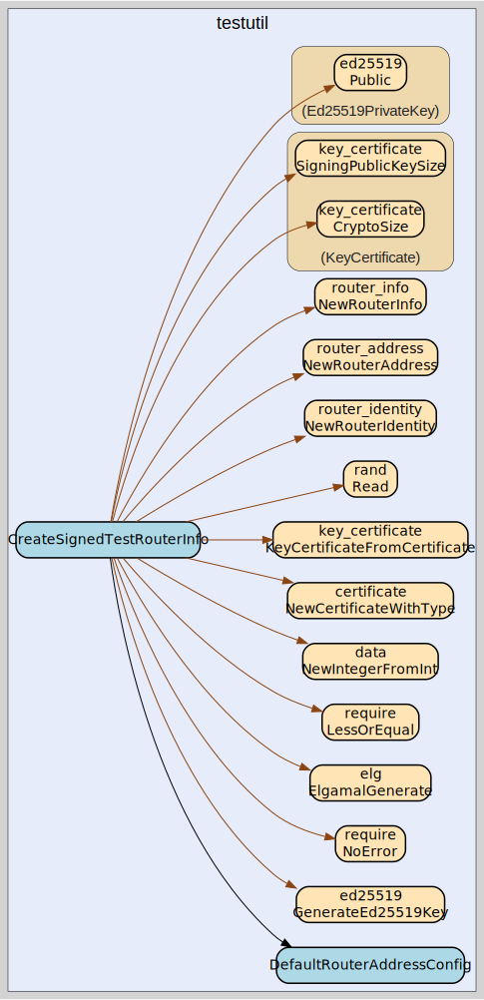

# testutil
--
    import "github.com/go-i2p/go-i2p/lib/testutil"



Package testutil provides shared test helpers used across multiple packages.

## Usage

#### func  CreateSignedTestRouterInfo

```go
func CreateSignedTestRouterInfo(tb testing.TB, options map[string]string, addrCfg *RouterAddressConfig) *router_info.RouterInfo
```
CreateSignedTestRouterInfo creates a properly signed RouterInfo for testing.
Uses Ed25519 signing keys and ElGamal encryption keys, matching the I2P
standard. addrCfg controls the router address parameters; pass nil to use
defaults.

#### func  PostJSON

```go
func PostJSON(t *testing.T, url string, jsonBody []byte) []byte
```
PostJSON sends an HTTP POST with the given JSON body to url and returns the raw
response bytes. It fails the test on any transport or I/O error.

#### type RouterAddressConfig

```go
type RouterAddressConfig struct {
	Cost       uint8
	Expiration time.Time
	Transport  string
	Options    map[string]string
}
```

RouterAddressConfig controls how the router address is created in
CreateSignedTestRouterInfo.

#### func  DefaultRouterAddressConfig

```go
func DefaultRouterAddressConfig() RouterAddressConfig
```
DefaultRouterAddressConfig returns an NTCP2 address with no host/port.


testutil 

github.com/go-i2p/go-i2p/lib/testutil

[go-i2p template file](/template.md)
