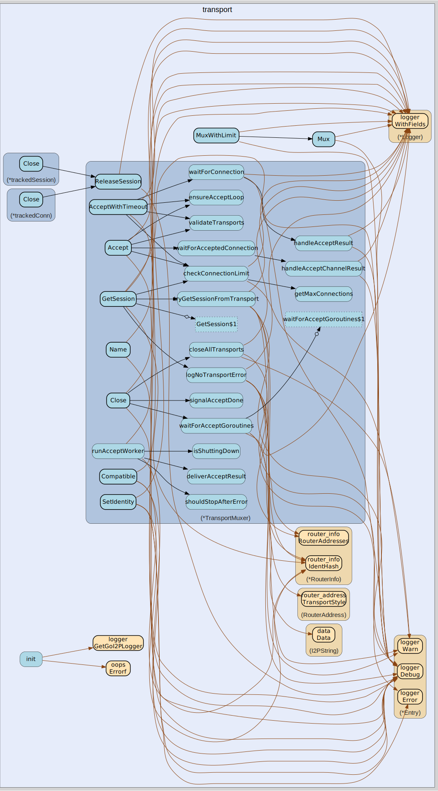

# transport
--
    import "github.com/go-i2p/go-i2p/lib/transport"



*

    i2np messages transports

## Usage

```go
var ErrNoTransportAvailable = oops.Errorf("no transports available")
```
error for when we have no transports available to use

#### type Transport

```go
type Transport interface {
	// Accept accepts an incoming session.
	Accept() (net.Conn, error)

	// Addr returns an
	Addr() net.Addr

	// Set the router identity for this transport.
	// will bind if the underlying socket is not already
	// if the underlying socket is already bound update the RouterIdentity
	// returns any errors that happen if they do
	SetIdentity(ident router_info.RouterInfo) error

	// Obtain a transport session with a router given its RouterInfo.
	// If a session with this router is NOT already made attempt to create one and block until made or until an error happens
	// returns an established TransportSession and nil on success
	// returns nil and an error on error
	GetSession(routerInfo router_info.RouterInfo) (TransportSession, error)

	// return true if a routerInfo is compatible with this transport
	Compatible(routerInfo router_info.RouterInfo) bool

	// close the transport cleanly
	// blocks until done
	// returns an error if one happens
	Close() error

	// get the name of this tranport as a string
	Name() string
}
```


#### type TransportMuxer

```go
type TransportMuxer struct {
}
```

muxes multiple transports into 1 Transport implements transport.Transport

#### func  Mux

```go
func Mux(t ...Transport) (tmux *TransportMuxer)
```
mux a bunch of transports together

#### func (*TransportMuxer) Close

```go
func (tmux *TransportMuxer) Close() (err error)
```
close every transport that this transport muxer has

#### func (*TransportMuxer) Compatible

```go
func (tmux *TransportMuxer) Compatible(routerInfo router_info.RouterInfo) (compat bool)
```
is there a transport that we mux that is compatable with this router info?

#### func (*TransportMuxer) GetSession

```go
func (tmux *TransportMuxer) GetSession(routerInfo router_info.RouterInfo) (s TransportSession, err error)
```
get a transport session given a router info return session and nil if successful
return nil and ErrNoTransportAvailable if we failed to get a session

#### func (*TransportMuxer) Name

```go
func (tmux *TransportMuxer) Name() string
```
the name of this transport with the names of all the ones that we mux

#### func (*TransportMuxer) SetIdentity

```go
func (tmux *TransportMuxer) SetIdentity(ident router_info.RouterInfo) (err error)
```
set the identity for every transport

#### type TransportSession

```go
type TransportSession interface {
	// queue an i2np message to be sent over the session
	// will block as long as the send queue is full
	// does not block if the queue is not full
	QueueSendI2NP(msg i2np.I2NPMessage)
	// return how many i2np messages are not completely sent yet
	SendQueueSize() int
	// blocking read the next fully recv'd i2np message from this session
	ReadNextI2NP() (i2np.I2NPMessage, error)
	// close the session cleanly
	// returns any errors that happen while closing the session
	Close() error
}
```

a session between 2 routers for tranmitting i2np messages securly


transport 

github.com/go-i2p/go-i2p/lib/transport

[go-i2p template file](/template.md)
