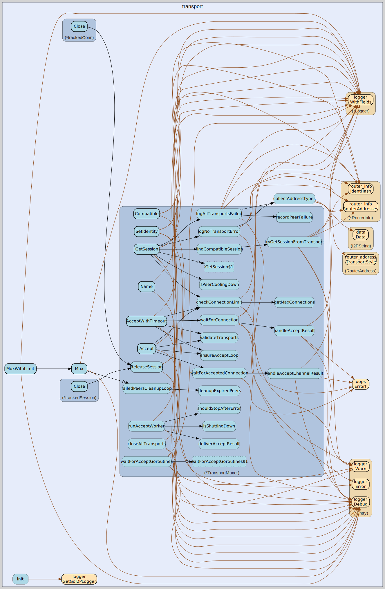

# transport
--
    import "github.com/go-i2p/go-i2p/lib/transport"



Package transport implements I2P transport layer protocols for router-to-router
communication.

# Overview

The transport layer handles encrypted, authenticated connections between I2P
routers. Supported transports:

    - NTCP2: TCP-based transport with Noise protocol encryption
    - SSU2: UDP-based transport with NAT traversal and introducer support

# TransportMuxer

The TransportMuxer multiplexes multiple transports into a single Transport
interface:

    - Combines multiple transports in priority order
    - Accepts connections from all registered transports concurrently
    - Dials peers using the first compatible transport
    - Enforces connection limits across all transports

# NTCP2 Transport

NTCP2 uses Noise_XK_25519_ChaChaPoly_SHA256:

    - X25519 key exchange
    - ChaCha20-Poly1305 AEAD encryption
    - Session state management
    - I2NP message framing

See lib/transport/ntcp2 for implementation details.

# Thread Safety

TransportMuxer is safe for concurrent access:

    - Connection counting uses atomic operations
    - Each transport manages its own connections
    - Accept listens on all transports concurrently

# Usage Example

    // Create individual transports
    ntcp2Transport := ntcp2.NewTransport(config)

    // Multiplex transports together
    tmux := transport.Mux(ntcp2Transport)
    // Or with a connection limit:
    tmux := transport.MuxWithLimit(1024, ntcp2Transport)

    // Set identity for all transports
    tmux.SetIdentity(ourRouterInfo)

    // Accept connections from any transport
    conn, err := tmux.Accept()

    // Dial a peer
    conn, err := tmux.Dial(peerRouterInfo)

# Connection Management

Connections are automatically managed:

    - Connection limits enforced via MaxConnections
    - Session counting with atomic operations
    - ReleaseSession() frees capacity when connections close

## Usage

```go
const DefaultMaxConnections = 1024
```
DefaultMaxConnections is the default maximum number of concurrent connections
across all muxed transports. This prevents resource exhaustion under heavy load.

```go
var ErrConnectionPoolFull = errors.New("connection pool full")
```
ErrConnectionPoolFull is returned when a connection pool has reached its maximum
capacity and cannot accept new connections.

```go
var ErrNoTransportAvailable = errors.New("no transports available")
```
ErrNoTransportAvailable is returned when no transports are available to use.

#### type PeerConnNotifier

```go
type PeerConnNotifier interface {
	// RecordAttempt is called just before a dial attempt begins.
	RecordAttempt(hash common.Hash)
	// RecordSuccess is called when a handshake completes successfully.
	// responseTimeMs is the round-trip to fully-established session in ms.
	RecordSuccess(hash common.Hash, responseTimeMs int64)
	// RecordFailure is called when a dial or handshake fails.
	RecordFailure(hash common.Hash, reason string)
	// RecordPermanentFailure is called when a peer is structurally unreachable
	// (e.g. IPv6-only peer with no local IPv6 connectivity, or a malformed
	// RouterInfo with no valid address).  It immediately advances the peer's
	// consecutive-failure counter to the staleness threshold so that
	// IsLikelyStale() returns true on the very next hop-selection pass,
	// preventing repeated wasted dial attempts.
	RecordPermanentFailure(hash common.Hash, reason string)
}
```

PeerConnNotifier receives transport-layer connection feedback so that
higher-level routing components (e.g. PeerTracker) can update peer reputation
without coupling the transport packages to netdb.

#### type RouterInfoRefresher

```go
type RouterInfoRefresher interface {
	// RequestRouterInfoRefresh marks a peer's RouterInfo as stale and removes
	// it from the in-memory cache. The implementation must honour a per-peer
	// cooldown (e.g. one eviction per 5 minutes).
	RequestRouterInfoRefresh(hash common.Hash)
}
```

RouterInfoRefresher allows transport layers to request a stale RouterInfo be
evicted from the local NetDB cache. Implementations should enforce a per-peer
cooldown to prevent thundering-herd on popular peers.

#### type RouterInfoStorer

```go
type RouterInfoStorer interface {
	// StoreRouterInfo inserts or replaces the RouterInfo record in the NetDB.
	StoreRouterInfo(ri router_info.RouterInfo)
}
```

RouterInfoStorer persists a peer RouterInfo learned during an inbound NTCP2
handshake into the local network database. Implementations must be safe for
concurrent use.

#### type Transport

```go
type Transport interface {
	// Accept accepts an incoming session.
	Accept() (net.Conn, error)

	// Addr returns an
	Addr() net.Addr

	// Set the router identity for this transport.
	// will bind if the underlying socket is not already
	// if the underlying socket is already bound update the RouterIdentity
	// returns any errors that happen if they do
	SetIdentity(ident router_info.RouterInfo) error

	// Obtain a transport session with a router given its RouterInfo.
	// If a session with this router is NOT already made attempt to create one and block until made or until an error happens
	// returns an established TransportSession and nil on success
	// returns nil and an error on error
	GetSession(routerInfo router_info.RouterInfo) (TransportSession, error)

	// return true if a routerInfo is compatible with this transport
	Compatible(routerInfo router_info.RouterInfo) bool

	// close the transport cleanly
	// blocks until done
	// returns an error if one happens
	Close() error

	// get the name of this tranport as a string
	Name() string
}
```

Transport defines the interface for an I2P transport layer capable of accepting
connections, managing sessions, and binding to a router identity.

#### type TransportMuxer

```go
type TransportMuxer struct {

	// MaxConnections is the maximum number of concurrent sessions allowed
	// across all transports in this muxer. 0 means use DefaultMaxConnections.
	MaxConnections int
}
```

TransportMuxer muxes multiple transports into one Transport. It implements
transport.Transport.

#### func  Mux

```go
func Mux(t ...Transport) (tmux *TransportMuxer)
```
Mux combines a set of transports together.

#### func  MuxWithLimit

```go
func MuxWithLimit(maxConnections int, t ...Transport) (tmux *TransportMuxer)
```
MuxWithLimit creates a TransportMuxer with a specified maximum connection limit.

#### func (*TransportMuxer) Accept

```go
func (tmux *TransportMuxer) Accept() (net.Conn, error)
```
Accept accepts an incoming connection from any available transport. This
implements the Transport interface requirement. It listens on ALL transports via
a persistent accept loop and returns the first connection. Returns the
connection and nil on success. Returns nil and ErrNoTransportAvailable if no
transports are configured. Returns nil and ErrConnectionPoolFull if the
connection limit has been reached.

#### func (*TransportMuxer) AcceptWithTimeout

```go
func (tmux *TransportMuxer) AcceptWithTimeout(timeout time.Duration) (net.Conn, error)
```
AcceptWithTimeout accepts an incoming connection with a timeout. This method
listens on ALL transports via a persistent accept loop with a timeout, enabling
graceful shutdown of session monitoring loops. Returns the connection and nil on
success. Returns nil and context.DeadlineExceeded if the timeout expires.
Returns nil and any other error from the underlying transport Accept().

#### func (*TransportMuxer) ActiveSessionCount

```go
func (tmux *TransportMuxer) ActiveSessionCount() int
```
ActiveSessionCount returns the current number of active sessions tracked by the
muxer.

#### func (*TransportMuxer) Addr

```go
func (tmux *TransportMuxer) Addr() net.Addr
```
Addr returns the address of the first transport's listener. This implements the
Transport interface requirement. Returns nil if no transports are configured.

#### func (*TransportMuxer) Close

```go
func (tmux *TransportMuxer) Close() (err error)
```
Close closes every transport that this transport muxer has.

#### func (*TransportMuxer) Compatible

```go
func (tmux *TransportMuxer) Compatible(routerInfo router_info.RouterInfo) bool
```
Compatible returns true if there is a transport that we mux that is compatible
with this router info.

#### func (*TransportMuxer) GetSession

```go
func (tmux *TransportMuxer) GetSession(routerInfo router_info.RouterInfo) (s TransportSession, err error)
```
GetSession returns nil and ErrNoTransportAvailable if we failed to get a
session, or nil and ErrConnectionPoolFull if the connection limit has been
reached.

#### func (*TransportMuxer) GetTransports

```go
func (tmux *TransportMuxer) GetTransports() []Transport
```
GetTransports returns a copy of the slice of transports in this muxer. This
allows external code to iterate over transports without exposing internal state.

#### func (*TransportMuxer) Name

```go
func (tmux *TransportMuxer) Name() string
```
Name returns the name of this transport combined with the names of all the ones
that we mux.

#### func (*TransportMuxer) ReleaseSession

```go
func (tmux *TransportMuxer) ReleaseSession()
```
ReleaseSession decrements the active session counter. This should be called when
a session is closed to free up capacity. Uses CompareAndSwap loop to prevent
TOCTOU race when concurrent ReleaseSession calls would both see a negative
value.

#### func (*TransportMuxer) SetIdentity

```go
func (tmux *TransportMuxer) SetIdentity(ident router_info.RouterInfo) (err error)
```
SetIdentity sets the identity for every transport.

#### type TransportSession

```go
type TransportSession interface {
	// queue an i2np message to be sent over the session
	// returns an error if the session is closed or the send queue is full
	QueueSendI2NP(msg i2np.I2NPMessage) error
	// return how many i2np messages are not completely sent yet
	SendQueueSize() int
	// blocking read the next fully recv'd i2np message from this session
	ReadNextI2NP() (i2np.I2NPMessage, error)
	// close the session cleanly
	// returns any errors that happen while closing the session
	Close() error
}
```

TransportSession is a session between 2 routers for transmitting i2np messages
securely.


transport 

github.com/go-i2p/go-i2p/lib/transport

[go-i2p template file](template.md)
