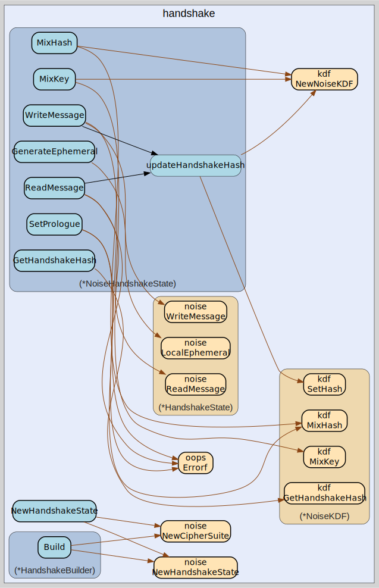

# handshake
--
    import "github.com/go-i2p/go-i2p/lib/transport/noise/handshake"




## Usage

#### type HandshakeBuilder

```go
type HandshakeBuilder struct {
}
```

HandshakeBuilder constructs customized HandshakeState instances

#### func  NewHandshakeBuilder

```go
func NewHandshakeBuilder() *HandshakeBuilder
```
NewHandshakeBuilder creates a new HandshakeBuilder with default values

#### func (*HandshakeBuilder) AsInitiator

```go
func (b *HandshakeBuilder) AsInitiator(isInitiator bool) *HandshakeBuilder
```
AsInitiator sets this handshake as the initiator

#### func (*HandshakeBuilder) Build

```go
func (b *HandshakeBuilder) Build() (handshake.HandshakeState, error)
```
Build creates a configured HandshakeState

#### func (*HandshakeBuilder) WithKeyTransformer

```go
func (b *HandshakeBuilder) WithKeyTransformer(transformer handshake.KeyTransformer) *HandshakeBuilder
```
WithKeyTransformer sets a custom key transformer

#### func (*HandshakeBuilder) WithPattern

```go
func (b *HandshakeBuilder) WithPattern(pattern noise.HandshakePattern) *HandshakeBuilder
```
WithPattern sets the handshake pattern

#### func (*HandshakeBuilder) WithPeerStaticKey

```go
func (b *HandshakeBuilder) WithPeerStaticKey(key []byte) *HandshakeBuilder
```
WithPeerStaticKey sets the peer's static key

#### func (*HandshakeBuilder) WithPrologue

```go
func (b *HandshakeBuilder) WithPrologue(prologue []byte) *HandshakeBuilder
```
WithPrologue sets the prologue data

#### func (*HandshakeBuilder) WithStaticKey

```go
func (b *HandshakeBuilder) WithStaticKey(key noise.DHKey) *HandshakeBuilder
```
WithStaticKey sets the local static key

#### type NoiseHandshakeState

```go
type NoiseHandshakeState struct {
	noise.HandshakePattern
	*noise.HandshakeState
	handshake.KeyTransformer
	*kdf.NoiseKDF
}
```

HandshakeState wraps noise.HandshakeState with additional functionality

#### func  NewHandshakeState

```go
func NewHandshakeState(staticKey noise.DHKey, isInitiator bool) (*NoiseHandshakeState, error)
```

#### func (*NoiseHandshakeState) CompleteHandshake

```go
func (hs *NoiseHandshakeState) CompleteHandshake() error
```
CompleteHandshake implements handshake.HandshakeState

#### func (*NoiseHandshakeState) GenerateEphemeral

```go
func (hs *NoiseHandshakeState) GenerateEphemeral() (*noise.DHKey, error)
```
GenerateEphemeral implements handshake.HandshakeState

#### func (*NoiseHandshakeState) GetHandshakeHash

```go
func (hs *NoiseHandshakeState) GetHandshakeHash() []byte
```
GetHandshakeHash implements handshake.HandshakeState

#### func (*NoiseHandshakeState) HandshakeComplete

```go
func (hs *NoiseHandshakeState) HandshakeComplete() bool
```
HandshakeComplete implements handshake.HandshakeState

#### func (*NoiseHandshakeState) MixHash

```go
func (hs *NoiseHandshakeState) MixHash(data []byte) error
```
MixHash implements handshake.HandshakeState

#### func (*NoiseHandshakeState) MixKey

```go
func (hs *NoiseHandshakeState) MixKey(input []byte) ([]byte, error)
```
MixKey implements handshake.HandshakeState

#### func (*NoiseHandshakeState) ReadMessage

```go
func (hs *NoiseHandshakeState) ReadMessage(message []byte) ([]byte, *noise.CipherState, *noise.CipherState, error)
```
ReadMessage implements handshake.HandshakeState

#### func (*NoiseHandshakeState) SetEphemeral

```go
func (h *NoiseHandshakeState) SetEphemeral(key *noise.DHKey) error
```
SetEphemeral allows setting a potentially modified ephemeral key This is needed
for NTCP2's obfuscation layer

#### func (*NoiseHandshakeState) SetEphemeralTransformer

```go
func (hs *NoiseHandshakeState) SetEphemeralTransformer(transformer handshake.KeyTransformer)
```
SetEphemeralTransformer implements handshake.HandshakeState

#### func (*NoiseHandshakeState) SetPrologue

```go
func (hs *NoiseHandshakeState) SetPrologue(prologue []byte) error
```
SetPrologue implements handshake.HandshakeState

#### func (*NoiseHandshakeState) WriteMessage

```go
func (hs *NoiseHandshakeState) WriteMessage(payload []byte) ([]byte, *noise.CipherState, *noise.CipherState, error)
```
WriteMessage implements handshake.HandshakeState


handshake 

github.com/go-i2p/go-i2p/lib/transport/noise/handshake

[go-i2p template file](/template.md)
