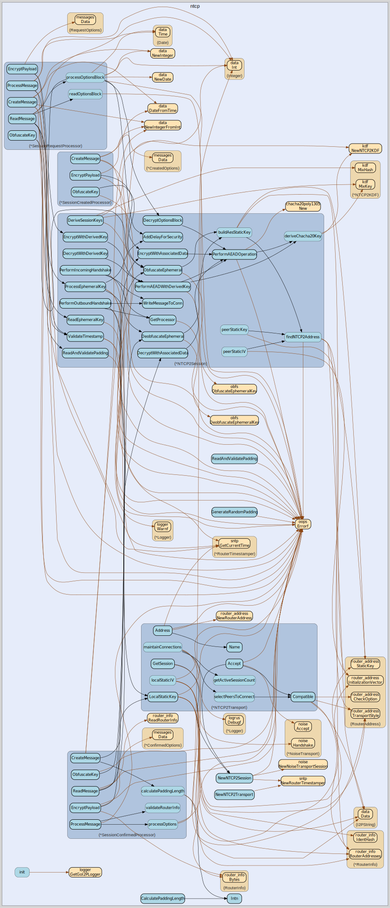

# ntcp
--
    import "github.com/go-i2p/go-i2p/lib/transport/ntcp"




## Usage

```go
const (
	NOISE_DH_CURVE25519 = 1

	NOISE_CIPHER_CHACHAPOLY = 1
	NOISE_CIPHER_AESGCM     = 2

	NOISE_HASH_SHA256 = 3

	NOISE_PATTERN_XK = 11

	MaxPayloadSize = math.MaxUint16 - 16 - uint16Size /*data len*/
)
```

```go
const (
	// Message 1 - SessionRequest
	NTCP2_MSG1_SIZE   = 64
	NTCP2_MSG1_HEADER = 0x00

	// Message 2 - SessionCreated
	NTCP2_MSG2_SIZE   = 64
	NTCP2_MSG2_HEADER = 0x01

	// Message 3 - SessionConfirmed
	NTCP2_MSG3_HEADER = 0x02

	// Timeout for handshake operations
	NTCP2_HANDSHAKE_TIMEOUT = 15 * time.Second
)
```
Constants for NTCP2 handshake

```go
const (
	MaxPaddingSize    = 64
	MinPaddingSize    = 1
	DefaultMinSize    = 128
	DefaultMinPadding = 1
	DefaultMaxExtra   = 30
)
```

```go
const (
	NTCP_PROTOCOL_VERSION = 2
	NTCP_PROTOCOL_NAME    = "NTCP2"
	NTCP_MESSAGE_MAX_SIZE = 65537
)
```

#### func  CalculatePaddingLength

```go
func CalculatePaddingLength(contentSize int, minSize int, minPadding int, maxExtraPadding int) int
```
CalculatePaddingLength determines padding length based on content size and
randomness

#### func  GenerateRandomPadding

```go
func GenerateRandomPadding(length int) ([]byte, error)
```
GenerateRandomPadding creates a byte slice of random data with the given length

#### func  Intn

```go
func Intn(n int) int
```
Intn generates a random integer in the range [0, n) This is a secure alternative
to math/rand.Intn It uses crypto/rand to generate a cryptographically secure
random number Which might be dumb and or pointless for padding.

#### func  ReadAndValidatePadding

```go
func ReadAndValidatePadding(conn net.Conn, paddingLen int) error
```
ReadAndValidatePadding reads padding from a connection and validates its length

#### type AEADOperator

```go
type AEADOperator interface {
	// EncryptWithAssociatedData encrypts data using the provided key and associated data
	EncryptWithAssociatedData(key, data, associatedData []byte, nonceCounter uint64) ([]byte, error)

	// DecryptWithAssociatedData decrypts data using the provided key and associated data
	DecryptWithAssociatedData(key, data, associatedData []byte, nonceCounter uint64) ([]byte, error)

	// EncryptWithDerivedKey encrypts data, deriving the key from raw key material first
	EncryptWithDerivedKey(keyMaterial, data, associatedData []byte, nonceCounter uint64) ([]byte, error)

	// DecryptWithDerivedKey decrypts data, deriving the key from raw key material first
	DecryptWithDerivedKey(keyMaterial, data, associatedData []byte, nonceCounter uint64) ([]byte, error)
}
```

AEADOperator defines the interface for AEAD operations in the NTCP2 protocol

#### type NTCP2Session

```go
type NTCP2Session struct {
	*noise.NoiseSession
	*NTCP2Transport

	// Processors for handling handshake messages
	Processors map[messages.MessageType]handshake.HandshakeMessageProcessor
}
```

NTCP2Session extends the base noise.NoiseSession with NTCP2-specific
functionality

#### func  NewNTCP2Session

```go
func NewNTCP2Session(routerInfo router_info.RouterInfo) (*NTCP2Session, error)
```
NewNTCP2Session creates a new NTCP2 session using the existing noise
implementation

#### func (*NTCP2Session) CreateHandshakeProcessors

```go
func (s *NTCP2Session) CreateHandshakeProcessors()
```
CreateHandshakeProcessors initializes all the handshake message processors

#### func (*NTCP2Session) DecryptOptionsBlock

```go
func (c *NTCP2Session) DecryptOptionsBlock(encryptedOptions []byte, obfuscatedX []byte, deobfuscatedX []byte) ([]byte, error)
```
DecryptOptionsBlock decrypts the options block from a SessionRequest message

#### func (*NTCP2Session) DecryptWithAssociatedData

```go
func (c *NTCP2Session) DecryptWithAssociatedData(
	key []byte,
	data []byte,
	associatedData []byte,
	nonceCounter uint64,
) ([]byte, error)
```
DecryptWithAssociatedData decrypts data using ChaCha20-Poly1305 with the
provided key and associated data

#### func (*NTCP2Session) DecryptWithDerivedKey

```go
func (c *NTCP2Session) DecryptWithDerivedKey(
	keyMaterial []byte,
	data []byte,
	associatedData []byte,
	nonceCounter uint64,
) ([]byte, error)
```
DecryptWithDerivedKey decrypts data, deriving the key from raw key material
first

#### func (*NTCP2Session) DeobfuscateEphemeral

```go
func (s *NTCP2Session) DeobfuscateEphemeral(obfuscatedEphemeralKey []byte) ([]byte, error)
```
DeobfuscateEphemeral reverses the key obfuscation

#### func (*NTCP2Session) DeriveSessionKeys

```go
func (c *NTCP2Session) DeriveSessionKeys(sharedSecret []byte, ephemeralKey []byte) error
```
DeriveSessionKeys derives all required keys for a session using existing X25519
shared secret This replaces scattered key derivation across session files

#### func (*NTCP2Session) EncryptWithAssociatedData

```go
func (c *NTCP2Session) EncryptWithAssociatedData(
	key []byte,
	data []byte,
	associatedData []byte,
	nonceCounter uint64,
) ([]byte, error)
```
EncryptWithAssociatedData encrypts data using ChaCha20-Poly1305 with the
provided key and associated data

#### func (*NTCP2Session) EncryptWithDerivedKey

```go
func (c *NTCP2Session) EncryptWithDerivedKey(
	keyMaterial []byte,
	data []byte,
	associatedData []byte,
	nonceCounter uint64,
) ([]byte, error)
```
EncryptWithDerivedKey encrypts data, deriving the key from raw key material
first

#### func (*NTCP2Session) GetProcessor

```go
func (s *NTCP2Session) GetProcessor(messageType messages.MessageType) (handshake.HandshakeMessageProcessor, error)
```
GetProcessor returns the appropriate processor for a message type

#### func (*NTCP2Session) ObfuscateEphemeral

```go
func (s *NTCP2Session) ObfuscateEphemeral(ephemeralKey []byte) ([]byte, error)
```
ObfuscateEphemeral implements NTCP2's key obfuscation using AES-256-CBC

#### func (*NTCP2Session) PerformAEADOperation

```go
func (c *NTCP2Session) PerformAEADOperation(
	keyMaterial []byte,
	data []byte,
	associatedData []byte,
	nonceCounter uint64,
	encrypt bool,
) ([]byte, error)
```
PerformAEADOperation handles both encryption and decryption using
ChaCha20-Poly1305

#### func (*NTCP2Session) PerformAEADWithDerivedKey

```go
func (c *NTCP2Session) PerformAEADWithDerivedKey(
	keyMaterial []byte,
	data []byte,
	associatedData []byte,
	nonceCounter uint64,
	encrypt bool,
) ([]byte, error)
```
PerformAEADWithDerivedKey performs AEAD operation, deriving the key from raw key
material first

#### func (*NTCP2Session) PerformIncomingHandshake

```go
func (s *NTCP2Session) PerformIncomingHandshake(conn net.Conn) error
```
PerformIncomingHandshake conducts the NTCP2 handshake as the responder (server).
It performs the server side of the 3-message handshake sequence: 1. Receives and
processes SessionRequest (Message 1) 2. Creates and sends SessionCreated
(Message 2) 3. Receives and processes SessionConfirmed (Message 3) After
successful completion, the session is established and ready for data exchange.

#### func (*NTCP2Session) PerformOutboundHandshake

```go
func (s *NTCP2Session) PerformOutboundHandshake(conn net.Conn) error
```
PerformOutboundHandshake conducts the NTCP2 handshake as the initiator (client).
It performs the full 3-message handshake sequence: 1. Creates and sends
SessionRequest (Message 1) 2. Receives and processes SessionCreated (Message 2)
3. Creates and sends SessionConfirmed (Message 3) After successful completion,
the session is established and ready for data exchange.

#### type NTCP2Transport

```go
type NTCP2Transport struct {
	*noise.NoiseTransport
	*sntp.RouterTimestamper
}
```

NTCP2Transport is an ntcp2 transport implementing transport.NTCP2Transport
interface

#### func  NewNTCP2Transport

```go
func NewNTCP2Transport(routerInfo *router_info.RouterInfo) (*NTCP2Transport, error)
```

#### func (*NTCP2Transport) Accept

```go
func (t *NTCP2Transport) Accept() (net.Conn, error)
```

#### func (*NTCP2Transport) Address

```go
func (t *NTCP2Transport) Address() (*router_address.RouterAddress, error)
```

#### func (*NTCP2Transport) Compatible

```go
func (t *NTCP2Transport) Compatible(routerInfo router_info.RouterInfo) bool
```

#### func (*NTCP2Transport) GetSession

```go
func (t *NTCP2Transport) GetSession(routerInfo router_info.RouterInfo) (transport.TransportSession, error)
```

#### func (*NTCP2Transport) Name

```go
func (t *NTCP2Transport) Name() string
```

#### type SessionConfirmedProcessor

```go
type SessionConfirmedProcessor struct {
	*NTCP2Session
}
```


#### func (*SessionConfirmedProcessor) CreateMessage

```go
func (s *SessionConfirmedProcessor) CreateMessage(hs *handshake.HandshakeState) (messages.Message, error)
```
CreateMessage implements handshake.HandshakeMessageProcessor.

#### func (*SessionConfirmedProcessor) EncryptPayload

```go
func (s *SessionConfirmedProcessor) EncryptPayload(msg messages.Message, obfuscatedKey []byte, hs *handshake.HandshakeState) ([]byte, error)
```
EncryptPayload implements handshake.HandshakeMessageProcessor.

#### func (*SessionConfirmedProcessor) GetPadding

```go
func (s *SessionConfirmedProcessor) GetPadding(msg messages.Message) []byte
```
GetPadding implements handshake.HandshakeMessageProcessor.

#### func (*SessionConfirmedProcessor) MessageType

```go
func (s *SessionConfirmedProcessor) MessageType() messages.MessageType
```
MessageType implements handshake.HandshakeMessageProcessor.

#### func (*SessionConfirmedProcessor) ObfuscateKey

```go
func (s *SessionConfirmedProcessor) ObfuscateKey(msg messages.Message, hs *handshake.HandshakeState) ([]byte, error)
```
ObfuscateKey implements handshake.HandshakeMessageProcessor.

#### func (*SessionConfirmedProcessor) ProcessMessage

```go
func (s *SessionConfirmedProcessor) ProcessMessage(message messages.Message, hs *handshake.HandshakeState) error
```
ProcessMessage implements handshake.HandshakeMessageProcessor.

#### func (*SessionConfirmedProcessor) ReadMessage

```go
func (s *SessionConfirmedProcessor) ReadMessage(conn net.Conn, hs *handshake.HandshakeState) (messages.Message, error)
```
ReadMessage implements handshake.HandshakeMessageProcessor.

#### type SessionCreatedProcessor

```go
type SessionCreatedProcessor struct {
	*NTCP2Session
}
```


#### func (*SessionCreatedProcessor) CreateMessage

```go
func (s *SessionCreatedProcessor) CreateMessage(hs *handshake.HandshakeState) (messages.Message, error)
```
CreateMessage implements handshake.HandshakeMessageProcessor.

#### func (*SessionCreatedProcessor) EncryptPayload

```go
func (s *SessionCreatedProcessor) EncryptPayload(
	msg messages.Message,
	obfuscatedKey []byte,
	hs *handshake.HandshakeState,
) ([]byte, error)
```
EncryptPayload implements handshake.HandshakeMessageProcessor.

#### func (*SessionCreatedProcessor) GetPadding

```go
func (s *SessionCreatedProcessor) GetPadding(msg messages.Message) []byte
```
GetPadding retrieves padding from a message

#### func (*SessionCreatedProcessor) MessageType

```go
func (s *SessionCreatedProcessor) MessageType() messages.MessageType
```
MessageType implements handshake.HandshakeMessageProcessor.

#### func (*SessionCreatedProcessor) ObfuscateKey

```go
func (s *SessionCreatedProcessor) ObfuscateKey(msg messages.Message, hs *handshake.HandshakeState) ([]byte, error)
```
ObfuscateKey should follow the same pattern as in SessionRequestProcessor

#### func (*SessionCreatedProcessor) ProcessMessage

```go
func (s *SessionCreatedProcessor) ProcessMessage(message messages.Message, hs *handshake.HandshakeState) error
```
ProcessMessage implements handshake.HandshakeMessageProcessor.

#### func (*SessionCreatedProcessor) ReadMessage

```go
func (s *SessionCreatedProcessor) ReadMessage(conn net.Conn, hs *handshake.HandshakeState) (messages.Message, error)
```
ReadMessage implements handshake.HandshakeMessageProcessor.

#### type SessionRequestProcessor

```go
type SessionRequestProcessor struct {
	*NTCP2Session
}
```

SessionRequestProcessor implements NTCP2 Message 1 (SessionRequest): 1. Create
session request message with options block (version, padding length, etc.) 2.
Set timeout deadline for the connection 3. Obfuscate ephemeral key (X) using AES
with Bob's router hash as key 4. Encrypt options block using ChaCha20-Poly1305
5. Assemble final message: obfuscated X + encrypted options + padding 6. Write
complete message to connection

SessionRequestProcessor processes incoming NTCP2 Message 1 (SessionRequest): 1.
Read and buffer the fixed-length ephemeral key portion (X) 2. Deobfuscate X
using AES with local router hash as key 3. Validate the ephemeral key (X) is a
valid Curve25519 point 4. Read the ChaCha20-Poly1305 encrypted options block 5.
Derive KDF for handshake message 1 using X and local static key 6. Decrypt and
authenticate the options block 7. Extract and validate handshake parameters
(timestamp, version, padding length) 8. Read and validate any padding bytes 9.
Check timestamp for acceptable clock skew (±60 seconds?)

#### func (*SessionRequestProcessor) CreateMessage

```go
func (s *SessionRequestProcessor) CreateMessage(hs *handshake.HandshakeState) (messages.Message, error)
```
CreateMessage implements HandshakeMessageProcessor.

#### func (*SessionRequestProcessor) EncryptPayload

```go
func (p *SessionRequestProcessor) EncryptPayload(
	message messages.Message,
	obfuscatedKey []byte,
	hs *handshake.HandshakeState,
) ([]byte, error)
```
EncryptPayload encrypts the payload portion of the message

#### func (*SessionRequestProcessor) GetPadding

```go
func (p *SessionRequestProcessor) GetPadding(message messages.Message) []byte
```
GetPadding retrieves padding from a message

#### func (*SessionRequestProcessor) MessageType

```go
func (s *SessionRequestProcessor) MessageType() messages.MessageType
```
MessageType implements handshake.HandshakeMessageProcessor.

#### func (*SessionRequestProcessor) ObfuscateKey

```go
func (p *SessionRequestProcessor) ObfuscateKey(message messages.Message, hs *handshake.HandshakeState) ([]byte, error)
```
ObfuscateKey obfuscates the ephemeral key for transmission

#### func (*SessionRequestProcessor) ProcessMessage

```go
func (s *SessionRequestProcessor) ProcessMessage(message messages.Message, hs *handshake.HandshakeState) error
```
ProcessMessage implements handshake.HandshakeMessageProcessor.

#### func (*SessionRequestProcessor) ReadMessage

```go
func (p *SessionRequestProcessor) ReadMessage(conn net.Conn, hs *handshake.HandshakeState) (messages.Message, error)
```
ReadMessage reads a SessionRequest message from the connection


ntcp 

github.com/go-i2p/go-i2p/lib/transport/ntcp

[go-i2p template file](/template.md)
