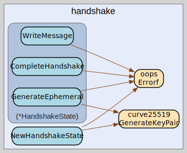

# handshake
--
    import "github.com/go-i2p/go-i2p/lib/transport/ntcp/handshake"




## Usage

#### type HandshakeMessageProcessor

```go
type HandshakeMessageProcessor interface {
	CreateMessage(hs *HandshakeState) (messages.Message, error)
	ReadMessage(conn net.Conn, hs *HandshakeState) (messages.Message, error)
	ProcessMessage(message messages.Message, hs *HandshakeState) error
	ObfuscateKey(msg messages.Message, hs *HandshakeState) ([]byte, error)
	EncryptPayload(msg messages.Message, obfuscatedKey []byte, hs *HandshakeState) ([]byte, error)
	GetPadding(msg messages.Message) []byte
	MessageType() messages.MessageType
}
```


#### type HandshakeState

```go
type HandshakeState struct {
	// isInitiator indicates whether this side initiated the handshake
	IsInitiator bool
	// localStaticKey is this router's long-term private key
	LocalStaticKey types.PrivateKey
	// remoteStaticKey is the remote router's long-term public key
	RemoteStaticKey types.PublicKey
	// localEphemeral is the temporary private key generated for this handshake
	LocalEphemeral types.PrivateKey
	// remoteEphemeral is the temporary public key received from remote party
	RemoteEphemeral types.PublicKey
	// localPaddingLen is the length of padding bytes we send
	LocalPaddingLen int
	// remotePaddingLen is the length of padding bytes we received
	RemotePaddingLen int
	// chachaKey is the derived ChaCha20 symmetric key for the session
	ChachaKey []byte
	// HandshakeHash is the cumulative hash of the handshake
	HandshakeHash []byte
	// sharedSecret is the Diffie-Hellman shared secret computed during handshake
	SharedSecret []byte
	// timestamp is the Unix timestamp when handshake was initiated
	Timestamp uint32
	// routerInfo contains the local router's information
	RouterInfo *router_info.RouterInfo
	// Message3Part1 is the first part of the message 3
	Message3Part1 []byte
	// Message3Part2 is the second part of the message 3
	Message3Part2 []byte
	// Message3Length is the length of message 3
	Message3Length int
}
```

HandshakeState maintains the state for an in-progress handshake

#### func  NewHandshakeState

```go
func NewHandshakeState(localKey types.PrivateKey, remoteKey types.PublicKey, ri *router_info.RouterInfo) (*HandshakeState, error)
```
NewHandshakeState creates a new handshake state for initiating a connection

#### func (*HandshakeState) CompleteHandshake

```go
func (h *HandshakeState) CompleteHandshake() error
```
CompleteHandshake implements handshake.HandshakeState.

#### func (*HandshakeState) GenerateEphemeral

```go
func (h *HandshakeState) GenerateEphemeral() (*noise.DHKey, error)
```
GenerateEphemeral implements handshake.HandshakeState.

#### func (*HandshakeState) HandshakeComplete

```go
func (h *HandshakeState) HandshakeComplete() bool
```
HandshakeComplete implements handshake.HandshakeState.

#### func (*HandshakeState) WriteMessage

```go
func (h *HandshakeState) WriteMessage(payload []byte) ([]byte, *noise.CipherState, *noise.CipherState, error)
```
WriteMessage implements handshake.HandshakeState.


handshake 

github.com/go-i2p/go-i2p/lib/transport/ntcp/handshake

[go-i2p template file](/template.md)
