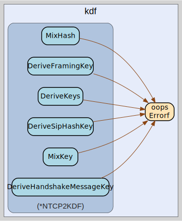

# kdf
--
    import "github.com/go-i2p/go-i2p/lib/transport/ntcp/kdf"




## Usage

#### type NTCP2KDF

```go
type NTCP2KDF struct {
	// ChainingKey is used in the key derivation chain
	ChainingKey []byte
	// HandshakeHash is the cumulative hash of handshake data
	HandshakeHash []byte
}
```

NTCP2KDF handles key derivation functions for the NTCP2 protocol according to
the Noise_XK_25519_ChaChaPoly_SHA256 specification with I2P-specific
customizations.

#### func  NewNTCP2KDF

```go
func NewNTCP2KDF() *NTCP2KDF
```
NewNTCP2KDF creates a new KDF context for NTCP2 with initial protocol name as
defined in the I2P spec.

#### func (*NTCP2KDF) DeriveFramingKey

```go
func (k *NTCP2KDF) DeriveFramingKey() ([]byte, error)
```
DeriveFramingKey derives the key used for frame obfuscation in the data phase of
NTCP2.

#### func (*NTCP2KDF) DeriveHandshakeMessageKey

```go
func (k *NTCP2KDF) DeriveHandshakeMessageKey(messageNum uint8) ([]byte, error)
```
DeriveHandshakeMessageKey derives a key for a specific handshake message used
during the different phases of the NTCP2 handshake.

#### func (*NTCP2KDF) DeriveKeys

```go
func (k *NTCP2KDF) DeriveKeys() (keyAB, keyBA []byte, err error)
```
DeriveKeys performs Split() operation to derive final session keys for
bidirectional communication.

#### func (*NTCP2KDF) DeriveSipHashKey

```go
func (k *NTCP2KDF) DeriveSipHashKey() ([]byte, error)
```
DeriveSipHashKey derives a key for SipHash length obfuscation used specifically
in NTCP2 for frame length obfuscation.

#### func (*NTCP2KDF) MixHash

```go
func (k *NTCP2KDF) MixHash(data []byte) error
```
MixHash updates the handshake hash with new data according to the Noise protocol
pattern.

#### func (*NTCP2KDF) MixKey

```go
func (k *NTCP2KDF) MixKey(dhOutput []byte) (encryptionKey []byte, err error)
```
MixKey derives a new chaining key and encryption key from DH output following
the Noise protocol specification.


kdf 

github.com/go-i2p/go-i2p/lib/transport/ntcp/kdf

[go-i2p template file](/template.md)
