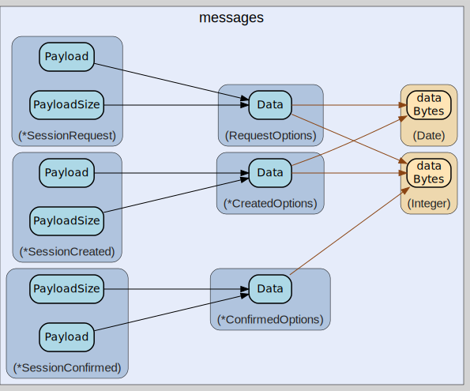

# messages
--
    import "github.com/go-i2p/go-i2p/lib/transport/ntcp/messages"




## Usage

```go
const (
	MessageTypeSessionRequest   = 0x00
	MessageTypeSessionCreated   = 0x01
	MessageTypeSessionConfirmed = 0x02
	MessageTypeData             = 0x03
)
```

#### type ConfirmedOptions

```go
type ConfirmedOptions struct {
	PaddingLength *data.Integer
}
```

ConfirmedOptions is the interface for SessionConfirmed options. It is 16 bytes
long. It contains the following fields: - 1 byte: padding length - 15 bytes:
reserved

#### func (*ConfirmedOptions) Data

```go
func (c *ConfirmedOptions) Data() []byte
```
Data implements Options.

#### type CreatedOptions

```go
type CreatedOptions struct {
	PaddingLength *data.Integer
	Timestamp     *data.Date
}
```

CreatedOptions is the options block for SessionCreated. It is 16 bytes long. It
contains the following fields: - 2 bytes padding length - 4 bytes timestamp - 10
bytes reserved

#### func (*CreatedOptions) Data

```go
func (c *CreatedOptions) Data() []byte
```
Data implements Options.

#### type Message

```go
type Message interface {
	// Type returns the message type
	Type() MessageType
	// Payload returns the message payload
	Payload() []byte
	// PayloadSize returns the message payload size
	PayloadSize() int
}
```


#### type MessageType

```go
type MessageType uint8
```


#### type Options

```go
type Options interface {
	Data() []byte
}
```


#### type RequestOptions

```go
type RequestOptions struct {
	// NetworkID is the network ID (currently 2, except for test networks)
	NetworkID *data.Integer
	// ProtocolVersion is the protocol version (currently 2)
	ProtocolVersion *data.Integer
	// PaddingLength is the length of the padding, 0 or more
	PaddingLength *data.Integer
	// Message3Part2Length is the length of the the second AEAD frame in SessionConfirmed
	Message3Part2Length *data.Integer
	// Timestamp is the Unix timestamp, unsigned seconds
	Timestamp *data.Date
}
```

RequestOptions implements the Options block for a SessionRequest

#### func (RequestOptions) Data

```go
func (r RequestOptions) Data() []byte
```
Data implements Options for RequestOptions

#### type SessionConfirmed

```go
type SessionConfirmed struct {
	// ChaChaPoly encrypted Alice's X25519 static key
	StaticKey [32]byte
	// Alice RouterInfo block
	RouterInfo *router_info.RouterInfo
	// Alice Options (optional)
	Options *ConfirmedOptions
	// Arbitrary padding (optional)
	Padding []byte
}
```


#### func (*SessionConfirmed) Payload

```go
func (s *SessionConfirmed) Payload() []byte
```
Payload implements Message.

#### func (*SessionConfirmed) PayloadSize

```go
func (s *SessionConfirmed) PayloadSize() int
```
PayloadSize implements Message.

#### func (*SessionConfirmed) Type

```go
func (s *SessionConfirmed) Type() MessageType
```
Type implements Message.

#### type SessionCreated

```go
type SessionCreated struct {
	YContent [32]byte        // 32 bytes ephemeral key Y
	Options  *CreatedOptions // Options block
	Padding  []byte          // Random padding
}
```


#### func (*SessionCreated) Payload

```go
func (s *SessionCreated) Payload() []byte
```
Payload implements Message.

#### func (*SessionCreated) PayloadSize

```go
func (s *SessionCreated) PayloadSize() int
```
PayloadSize implements Message.

#### func (*SessionCreated) Type

```go
func (s *SessionCreated) Type() MessageType
```
Type implements Message.

#### type SessionRequest

```go
type SessionRequest struct {
	XContent [32]byte // 32-byte X value
	Options  RequestOptions
	Padding  []byte // padding of message 1
}
```


#### func (*SessionRequest) Payload

```go
func (sr *SessionRequest) Payload() []byte
```
Payload returns the message payload

#### func (*SessionRequest) PayloadSize

```go
func (sr *SessionRequest) PayloadSize() int
```
PayloadSize returns the message payload size

#### func (*SessionRequest) Type

```go
func (sr *SessionRequest) Type() MessageType
```
Type returns the message type


messages 

github.com/go-i2p/go-i2p/lib/transport/ntcp/messages

[go-i2p template file](/template.md)
