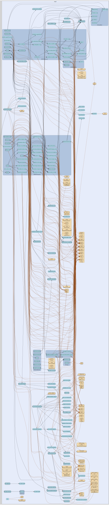

# ntcp2
--
    import "github.com/go-i2p/go-i2p/lib/transport/ntcp2"




## Usage

```go
var (
	ErrNTCP2NotSupported      = oops.New("router does not support NTCP2")
	ErrSessionClosed          = oops.New("NTCP2 session is closed")
	ErrHandshakeFailed        = oops.New("NTCP2 handshake failed")
	ErrInvalidRouterInfo      = oops.New("invalid router info for NTCP2")
	ErrConnectionPoolFull     = oops.New("NTCP2 connection pool full")
	ErrFramingError           = oops.New("I2NP message framing error")
	ErrInvalidListenerAddress = oops.New("invalid listener address for NTCP2")
)
```

#### func  ExtractNTCP2Addr

```go
func ExtractNTCP2Addr(routerInfo router_info.RouterInfo) (net.Addr, error)
```
Extract NTCP2 address from RouterInfo

#### func  FrameI2NPMessage

```go
func FrameI2NPMessage(msg i2np.I2NPMessage) ([]byte, error)
```
Frame an I2NP message for transmission over NTCP2

#### func  SupportsNTCP2

```go
func SupportsNTCP2(routerInfo *router_info.RouterInfo) bool
```
Check if RouterInfo supports NTCP2 TODO: This should be moved to router_info
package

#### func  UnframeI2NPMessage

```go
func UnframeI2NPMessage(conn net.Conn) (i2np.I2NPMessage, error)
```
Unframe I2NP messages from NTCP2 data stream

#### func  WrapNTCP2Addr

```go
func WrapNTCP2Addr(addr net.Addr, routerHash []byte) (*ntcp2.NTCP2Addr, error)
```
Convert net.Addr to NTCP2Addr

#### func  WrapNTCP2Error

```go
func WrapNTCP2Error(err error, operation string) error
```
Wrap go-noise errors with context

#### type Config

```go
type Config struct {
	ListenerAddress string // Address to listen on, e.g., ":42069"
	*ntcp2.NTCP2Config
}
```


#### func  NewConfig

```go
func NewConfig(listenerAddress string) (*Config, error)
```

#### func (*Config) Validate

```go
func (c *Config) Validate() error
```

#### type I2NPUnframer

```go
type I2NPUnframer struct {
}
```

Stream-based unframing for continuous reading

#### func  NewI2NPUnframer

```go
func NewI2NPUnframer(conn net.Conn) *I2NPUnframer
```

#### func (*I2NPUnframer) ReadNextMessage

```go
func (u *I2NPUnframer) ReadNextMessage() (i2np.I2NPMessage, error)
```

#### type NTCP2Session

```go
type NTCP2Session struct {
}
```


#### func  NewNTCP2Session

```go
func NewNTCP2Session(conn net.Conn, ctx context.Context, logger *logrus.Entry) *NTCP2Session
```

#### func (*NTCP2Session) Close

```go
func (s *NTCP2Session) Close() error
```
Close closes the session cleanly.

#### func (*NTCP2Session) QueueSendI2NP

```go
func (s *NTCP2Session) QueueSendI2NP(msg i2np.I2NPMessage)
```
QueueSendI2NP queues an I2NP message to be sent over the session. Will block as
long as the send queue is full.

#### func (*NTCP2Session) ReadNextI2NP

```go
func (s *NTCP2Session) ReadNextI2NP() (i2np.I2NPMessage, error)
```
ReadNextI2NP blocking reads the next fully received I2NP message from this
session.

#### func (*NTCP2Session) SendQueueSize

```go
func (s *NTCP2Session) SendQueueSize() int
```
SendQueueSize returns how many I2NP messages are not completely sent yet.

#### func (*NTCP2Session) SetCleanupCallback

```go
func (s *NTCP2Session) SetCleanupCallback(callback func())
```
SetCleanupCallback sets a callback function that will be called when the session
closes

#### type NTCP2Transport

```go
type NTCP2Transport struct {
}
```


#### func  NewNTCP2Transport

```go
func NewNTCP2Transport(identity router_info.RouterInfo, config *Config) (*NTCP2Transport, error)
```

#### func (*NTCP2Transport) Accept

```go
func (t *NTCP2Transport) Accept() (net.Conn, error)
```
Accept accepts an incoming session.

#### func (*NTCP2Transport) Addr

```go
func (t *NTCP2Transport) Addr() net.Addr
```
Addr returns the network address the transport is bound to.

#### func (*NTCP2Transport) Close

```go
func (t *NTCP2Transport) Close() error
```
Close closes the transport cleanly.

#### func (*NTCP2Transport) Compatible

```go
func (t *NTCP2Transport) Compatible(routerInfo router_info.RouterInfo) bool
```

#### func (*NTCP2Transport) GetSession

```go
func (t *NTCP2Transport) GetSession(routerInfo router_info.RouterInfo) (transport.TransportSession, error)
```
GetSession obtains a transport session with a router given its RouterInfo.

#### func (*NTCP2Transport) Name

```go
func (t *NTCP2Transport) Name() string
```
Name returns the name of this transport.

#### func (*NTCP2Transport) SetIdentity

```go
func (t *NTCP2Transport) SetIdentity(ident router_info.RouterInfo) error
```
SetIdentity sets the router identity for this transport.


ntcp2 

github.com/go-i2p/go-i2p/lib/transport/ntcp2

[go-i2p template file](/template.md)
