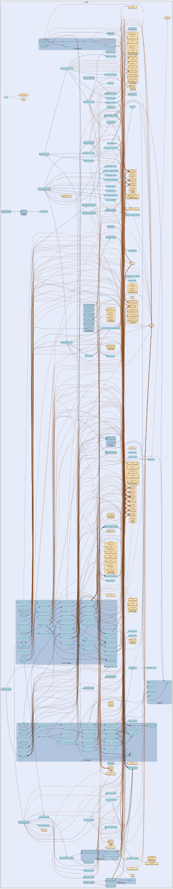

# ntcp2
--
    import "github.com/go-i2p/go-i2p/lib/transport/ntcp2"



Package ntcp2 implements the NTCP2 transport protocol for the I2P network. NTCP2
is a TCP-based transport that uses the Noise protocol framework (XK pattern) for
authenticated key agreement, providing forward secrecy and identity hiding.

## Usage

```go
const (
	// BlockTypeDateTime is a DateTime block (type 0).
	// Payload: 4 bytes, unsigned big-endian Unix epoch seconds.
	BlockTypeDateTime byte = 0

	// BlockTypeOptions is an Options block (type 1).
	// Payload: variable length, contains padding/traffic negotiation params.
	BlockTypeOptions byte = 1

	// BlockTypeRouterInfo is a RouterInfo block (type 2).
	// Payload: 1-byte flag + gzip-compressed or raw RouterInfo.
	BlockTypeRouterInfo byte = 2

	// BlockTypeI2NP is an I2NP message block (type 3).
	// Payload: 9-byte short I2NP header + message body.
	BlockTypeI2NP byte = 3

	// BlockTypeTermination is a Termination block (type 4).
	// Payload: version(4) + networkID(1) + time(4) + reason(1) = 10 bytes.
	BlockTypeTermination byte = 4

	// BlockTypePadding is a Padding block (type 254).
	// Payload: arbitrary bytes, ignored by the receiver.
	BlockTypePadding byte = 254
)
```
NTCP2 data-phase block types per the specification.

Spec reference: https://geti2p.net/spec/ntcp2#data-phase

After the Noise XK handshake completes, both peers exchange AEAD-encrypted
frames. Each decrypted frame payload consists of one or more concatenated
blocks. Every block begins with a 3-byte header: [type:1][size:2].

```go
const (
	// TerminationNormalClose indicates a graceful session shutdown.
	TerminationNormalClose byte = 0

	// TerminationRouterUpdated indicates the router's RouterInfo has been updated
	// and the peer should re-fetch it.
	TerminationRouterUpdated byte = 1

	// TerminationAEADFrameError indicates an AEAD decryption failure in the data phase.
	// When this is the reason, the termination block MUST NOT be sent if the cipher
	// state may be corrupted — only probing-resistance junk-read should be performed.
	TerminationAEADFrameError byte = 4

	// TerminationOptionsError indicates an error in the session options negotiation.
	TerminationOptionsError byte = 5

	// TerminationSignatureError indicates a signature verification failure.
	TerminationSignatureError byte = 6

	// TerminationFrameTimeout indicates the peer did not send a frame within
	// the expected time.
	TerminationFrameTimeout byte = 11

	// TerminationPayloadFormatError indicates the payload format was invalid.
	TerminationPayloadFormatError byte = 12

	// TerminationMessage1Error indicates an error during Noise handshake message 1.
	TerminationMessage1Error byte = 13

	// TerminationMessage2Error indicates an error during Noise handshake message 2.
	TerminationMessage2Error byte = 14

	// TerminationMessage3Error indicates an error during Noise handshake message 3.
	TerminationMessage3Error byte = 15

	// TerminationFrameLengthOutOfRange indicates the frame length was outside
	// the allowed range.
	TerminationFrameLengthOutOfRange byte = 16

	// TerminationPaddingViolation indicates padding rules were violated.
	TerminationPaddingViolation byte = 17
)
```
Termination reason codes per the NTCP2 specification. These are used in the
termination block (block type 0x04) to indicate why the session is being closed.

Spec reference: https://geti2p.net/spec/ntcp2#termination

```go
const ClockSkewTolerance = gonoise.ClockSkewTolerance
```
ClockSkewTolerance is the maximum allowed difference between local and peer
timestamps. Per the NTCP2 spec, connections with a clock skew exceeding this
value should be terminated with reason code 6.

This is defined in go-noise/ntcp2 as the single source of truth and re-exported
here for backward compatibility within go-i2p.

```go
const DefaultMaxSessions = 512
```
DefaultMaxSessions is the default maximum number of concurrent NTCP2 sessions.
This prevents resource exhaustion under heavy load.

```go
const RekeyThreshold uint64 = 65535
```
RekeyThreshold is the number of messages (sent + received) after which a session
should be rekeyed for forward secrecy. Per the NTCP2 specification, rekeying
should occur periodically. 65535 messages is a conservative threshold (just
under 2^16) that balances forward secrecy with performance.

```go
var (
	ErrNTCP2NotSupported      = oops.New("router does not support NTCP2")
	ErrSessionClosed          = oops.New("NTCP2 session is closed")
	ErrHandshakeFailed        = oops.New("NTCP2 handshake failed")
	ErrInvalidRouterInfo      = oops.New("invalid router info for NTCP2")
	ErrConnectionPoolFull     = oops.New("NTCP2 connection pool full")
	ErrFramingError           = oops.New("I2NP message framing error")
	ErrInvalidListenerAddress = oops.New("invalid listener address for NTCP2")
	ErrInvalidConfig          = oops.New("invalid NTCP2 configuration")
)
```

#### func  BlockTypeString

```go
func BlockTypeString(blockType byte) string
```
BlockTypeString returns a human-readable name for a block type.

#### func  BuildTerminationBlock

```go
func BuildTerminationBlock(reason byte) []byte
```
BuildTerminationBlock constructs a termination block payload suitable for
sending through NTCP2Conn.Write, which will encrypt it with the session's Noise
cipher state and apply SipHash length obfuscation.

The termination block format is:

    [type:1=0x04][size:2][version:4][networkID:1][time:4][reason:1]

Total: 13 bytes (3 header + 10 payload).

#### func  ConfigureDialConfig

```go
func ConfigureDialConfig(config *ntcp2.NTCP2Config, peerInfo router_info.RouterInfo) error
```
ConfigureDialConfig sets the peer's static key and obfuscation IV on an
NTCP2Config for outbound connections. This is required for the Noise XK
handshake pattern where the initiator must know the responder's static key.

Spec reference: https://geti2p.net/spec/ntcp2 — Noise XK pattern requires the
initiator to pre-know the responder's static public key.

#### func  ConvertToRouterAddress

```go
func ConvertToRouterAddress(transport *NTCP2Transport) (*router_address.RouterAddress, error)
```
ConvertToRouterAddress converts an NTCP2Transport's listening address to a
RouterAddress suitable for publishing in RouterInfo. This enables other routers
to connect to this transport.

The function extracts: - Host IP address from the transport's listener - Port
number from the transport's listener - Static public key from the NTCP2
configuration - Initialization vector (IV) for AES obfuscation

Returns a RouterAddress with transport style "ntcp2" and all required options,
or an error if address extraction or conversion fails.

#### func  ExtractNTCP2Addr

```go
func ExtractNTCP2Addr(routerInfo router_info.RouterInfo) (net.Addr, error)
```
ExtractNTCP2Addr extracts the NTCP2 network address from a RouterInfo structure.
It validates NTCP2 support and returns a properly wrapped NTCP2 address with
router hash metadata.

#### func  ExtractPeerIV

```go
func ExtractPeerIV(routerInfo router_info.RouterInfo) ([]byte, error)
```
ExtractPeerIV extracts the NTCP2 AES obfuscation IV ("i=" option) from a peer's
RouterInfo. This IV is used for AES-CBC obfuscation of the ephemeral key in
message 1.

Returns the 16-byte IV or an error if not found.

#### func  ExtractPeerStaticKey

```go
func ExtractPeerStaticKey(routerInfo router_info.RouterInfo) ([]byte, error)
```
ExtractPeerStaticKey extracts the NTCP2 static public key ("s=" option) from a
peer's RouterInfo. This key is required by the Noise XK pattern because the
initiator must know the responder's static key before the handshake begins.

The static key is published in the peer's RouterInfo as a base64-encoded 32-byte
Curve25519 public key in the "s=" option of the NTCP2 address.

Returns the 32-byte static key or an error if:

    - The RouterInfo has no NTCP2 addresses
    - No NTCP2 address has a valid "s=" option
    - The "s=" value cannot be decoded or is not 32 bytes

#### func  FrameI2NPMessage

```go
func FrameI2NPMessage(msg i2np.I2NPMessage) ([]byte, error)
```
Frame an I2NP message for transmission over NTCP2

#### func  GetStaticKeyFromRouter

```go
func GetStaticKeyFromRouter(encryptionKey types.PrivateEncryptionKey) []byte
```
GetStaticKeyFromRouter extracts the X25519 encryption private key from the
router keystore. This key serves as the NTCP2 static key, ensuring consistent
peer identification across router restarts. The key is already persisted by the
RouterInfoKeystore.

Parameters:

    - encryptionKey: The router's X25519 encryption private key

Returns:

    - 32-byte static key suitable for NTCP2 configuration

#### func  HasDialableNTCP2Address

```go
func HasDialableNTCP2Address(routerInfo *router_info.RouterInfo) bool
```
HasDialableNTCP2Address checks if a RouterInfo has at least one directly
dialable NTCP2 address (i.e., an NTCP2 address with a valid host and port).
Introducer-only addresses are not dialable and will return false.

#### func  HasDirectConnectivity

```go
func HasDirectConnectivity(addr *router_address.RouterAddress) bool
```
HasDirectConnectivity checks if a RouterAddress has direct NTCP2 connectivity.
Returns true if the address has both host and port keys (directly dialable).
Returns false if the address is introducer-only (requires NAT traversal).
Returns false for nil addresses. CRITICAL FIX #1: Pre-filtering utility for peer
selection.

#### func  IsAEADFailureReason

```go
func IsAEADFailureReason(reason byte) bool
```
IsAEADFailureReason returns true if the given reason code indicates an AEAD
decryption failure, in which case the cipher state may be corrupted and the
termination block MUST NOT be sent encrypted (only junk-read for probing
resistance).

#### func  MeasureClockSkew

```go
func MeasureClockSkew(peerTime uint32) time.Duration
```
MeasureClockSkew returns the observed clock skew between a peer's timestamp and
the local time. Positive skew means the peer's clock is ahead of ours. This can
be used for diagnostic logging without enforcing the tolerance.

#### func  ParseDateTimeBlock

```go
func ParseDateTimeBlock(data []byte) (time.Time, error)
```
ParseDateTimeBlock extracts the Unix epoch timestamp from a DateTime block's
data. Returns an error if the data is not exactly 4 bytes.

#### func  SerializeBlocks

```go
func SerializeBlocks(blocks ...Block) []byte
```
SerializeBlocks serializes one or more blocks into a single data-phase frame
payload suitable for writing via NTCP2Conn.Write().

#### func  SupportsDirectNTCP2

```go
func SupportsDirectNTCP2(routerInfo *router_info.RouterInfo) bool
```
SupportsDirectNTCP2 checks if a RouterInfo has at least one directly dialable
NTCP2 address. This is a convenience function for peer selection - filters out
introducer-only routers. CRITICAL FIX #1: Exported function for use in peer
selection/filtering.

#### func  SupportsNTCP2

```go
func SupportsNTCP2(routerInfo *router_info.RouterInfo) bool
```
SupportsNTCP2 checks if RouterInfo has an NTCP2 transport address.

#### func  TerminationReasonString

```go
func TerminationReasonString(reason byte) string
```
TerminationReasonString returns a human-readable string for a termination reason
code.

#### func  UnframeI2NPMessage

```go
func UnframeI2NPMessage(conn net.Conn) (i2np.I2NPMessage, error)
```
Unframe I2NP messages from NTCP2 data stream

#### func  ValidateTimestamp

```go
func ValidateTimestamp(peerTime uint32) error
```
ValidateTimestamp checks whether a peer's timestamp is within the allowed clock
skew tolerance relative to the current time.

Returns nil if the timestamp is acceptable, or a *ClockSkewError if the skew
exceeds ClockSkewTolerance.

A peerTime of 0 is treated as "timestamp not provided" and is accepted without
validation, since some peers may not include timestamps during early protocol
negotiation.

#### func  WrapNTCP2Addr

```go
func WrapNTCP2Addr(addr net.Addr, routerHash []byte) (*ntcp2.NTCP2Addr, error)
```
Convert net.Addr to NTCP2Addr

#### func  WrapNTCP2Error

```go
func WrapNTCP2Error(err error, operation string) error
```
WrapNTCP2Error wraps an error with NTCP2 operation context. Uses oops.Wrapf
which preserves the original error in the chain.

#### type Block

```go
type Block struct {
	// Type is the block type identifier (0–4, 254).
	Type byte

	// Data is the block payload (excluding the 3-byte header).
	Data []byte
}
```

Block represents a single parsed NTCP2 data-phase block.

#### func  NewDateTimeBlock

```go
func NewDateTimeBlock() Block
```
NewDateTimeBlock creates a DateTime block (type 0) containing the current Unix
epoch timestamp as 4 big-endian bytes.

#### func  NewI2NPBlock

```go
func NewI2NPBlock(i2npData []byte) Block
```
NewI2NPBlock creates an I2NP message block (type 3) from raw I2NP message bytes.
The caller is responsible for providing the short I2NP header + message body.

#### func  NewOptionsBlock

```go
func NewOptionsBlock(opts *Options) Block
```
NewOptionsBlock creates an Options block (type 1) from an Options struct.

#### func  NewPaddingBlock

```go
func NewPaddingBlock(size int) Block
```
NewPaddingBlock creates a Padding block (type 254) with the specified number of
zero bytes. The receiver ignores the content.

#### func  NewRouterInfoBlock

```go
func NewRouterInfoBlock(routerInfoBytes []byte, flag byte) Block
```
NewRouterInfoBlock creates a RouterInfo block (type 2) with a flag byte
prepended. Per the spec, the flag byte indicates how the RouterInfo is encoded:

    0x00 = uncompressed
    0x01 = gzip compressed
    bit 1 (0x02) = flood request (peer should flood this RouterInfo)

#### func  ParseBlocks

```go
func ParseBlocks(payload []byte) ([]Block, error)
```
ParseBlocks parses a decrypted data-phase frame payload into individual blocks.
The payload consists of zero or more concatenated [type:1][size:2][data:size]
blocks. Unknown block types are preserved (returned with their raw data) so the
caller can decide how to handle them. Returns an error if the payload is
truncated.

#### type ClockSkewError

```go
type ClockSkewError struct {
	// PeerTime is the peer's reported Unix timestamp.
	PeerTime uint32
	// LocalTime is the local Unix timestamp at the time of validation.
	LocalTime uint32
	// Skew is the observed clock difference (peer - local).
	Skew time.Duration
}
```

ClockSkewError is returned when a peer's timestamp exceeds the allowed skew.

#### func (*ClockSkewError) Error

```go
func (e *ClockSkewError) Error() string
```

#### type Config

```go
type Config struct {
	ListenerAddress string // Address to listen on, e.g., ":42069"
	WorkingDir      string // Working directory for persistent storage (e.g., ~/.go-i2p/config)
	MaxSessions     int    // Maximum number of concurrent sessions (0 = use DefaultMaxSessions)
	*ntcp2.NTCP2Config
}
```


#### func  NewConfig

```go
func NewConfig(listenerAddress string) (*Config, error)
```

#### func (*Config) GetMaxSessions

```go
func (c *Config) GetMaxSessions() int
```
GetMaxSessions returns the effective maximum session limit. Returns
DefaultMaxSessions if MaxSessions is not set (0 or negative).

#### func (*Config) Validate

```go
func (c *Config) Validate() error
```

#### type DefaultHandler

```go
type DefaultHandler struct {
}
```

DefaultHandler implements NTCP2Handler using the existing functions in this
package. It is wired into the NTCP2Transport at construction time.

#### func  NewDefaultHandler

```go
func NewDefaultHandler() *DefaultHandler
```
NewDefaultHandler creates a new DefaultHandler with a fresh replay cache. Call
Close() on the handler when it is no longer needed to stop the background cache
cleanup goroutine.

#### func (*DefaultHandler) CheckReplay

```go
func (h *DefaultHandler) CheckReplay(ephemeralKey [32]byte) bool
```
CheckReplay checks whether an ephemeral key has been seen before using the
shared replay cache. Returns true if the key is a duplicate (replay attack).

#### func (*DefaultHandler) Close

```go
func (h *DefaultHandler) Close()
```
Close releases resources held by the handler (stops replay cache cleanup).

#### func (*DefaultHandler) OnHandshakeError

```go
func (h *DefaultHandler) OnHandshakeError(rawConn net.Conn, err error)
```
OnHandshakeError applies probing resistance (random delay + junk read) on the
raw TCP connection. This makes handshake failures indistinguishable from a
random TCP service to an active prober.

#### func (*DefaultHandler) ReplayCacheSize

```go
func (h *DefaultHandler) ReplayCacheSize() int
```
ReplayCacheSize returns the current number of entries in the replay cache.
Useful for monitoring and diagnostics.

#### func (*DefaultHandler) SendTermination

```go
func (h *DefaultHandler) SendTermination(conn *gonoise.NTCP2Conn, reason byte) error
```
SendTermination constructs and sends an encrypted termination block through the
NTCP2 connection's Noise cipher. The block is written via conn.Write, which
applies AEAD encryption and SipHash length obfuscation.

#### func (*DefaultHandler) ValidateTimestamp

```go
func (h *DefaultHandler) ValidateTimestamp(peerTime uint32) error
```
ValidateTimestamp checks whether a peer's timestamp is within ±60 seconds of the
local clock. Returns a *ClockSkewError if the skew is excessive.

#### type I2NPUnframer

```go
type I2NPUnframer struct {
}
```

Stream-based unframing for continuous reading

#### func  NewI2NPUnframer

```go
func NewI2NPUnframer(conn net.Conn) *I2NPUnframer
```

#### func (*I2NPUnframer) BytesRead

```go
func (u *I2NPUnframer) BytesRead() int
```
BytesRead returns the number of bytes read during the last ReadNextMessage call

#### func (*I2NPUnframer) ReadNextMessage

```go
func (u *I2NPUnframer) ReadNextMessage() (i2np.I2NPMessage, error)
```

#### type KeystoreProvider

```go
type KeystoreProvider interface {
	GetEncryptionPrivateKey() types.PrivateEncryptionKey
}
```


#### type NTCP2Handler

```go
type NTCP2Handler interface {
	// OnHandshakeError is called when a Noise XK handshake fails (either as
	// initiator or responder). The implementation should apply probing
	// resistance (random delay + junk read) on the raw TCP connection before
	// the connection is closed.
	//
	// rawConn is the underlying TCP connection; it may be nil if extraction
	// failed. The error is the original handshake failure reason.
	OnHandshakeError(rawConn net.Conn, err error)

	// CheckReplay checks whether an ephemeral key (the first 32 bytes of
	// message 1) has been seen before. Returns true if the key is a replay
	// and the connection should be rejected.
	//
	// The replay cache must be shared across all listener goroutines within
	// a single router instance.
	CheckReplay(ephemeralKey [32]byte) bool

	// ValidateTimestamp checks whether a peer's timestamp (Unix epoch seconds)
	// is within the allowed clock skew tolerance. Returns a non-nil error if
	// the skew exceeds the tolerance.
	ValidateTimestamp(peerTime uint32) error

	// SendTermination sends an encrypted termination block through the NTCP2
	// connection's Noise cipher state. The block is encrypted and framed by
	// conn.Write, ensuring no plaintext termination data appears on the wire.
	//
	// For AEAD failure reasons (reason 4), this must NOT be called because
	// the cipher state may be corrupted. Use OnHandshakeError instead.
	SendTermination(conn *gonoise.NTCP2Conn, reason byte) error
}
```

NTCP2Handler defines callback hooks for injecting I2P-specific behaviour into
the NTCP2 transport layer. The go-noise library handles the low-level Noise
protocol mechanics; this interface allows the router transport to add
higher-level concerns: probing resistance, replay detection, timestamp
validation, and encrypted termination.

Implementations must be safe for concurrent use across multiple goroutines.

#### type NTCP2Session

```go
type NTCP2Session struct {
}
```


#### func  NewNTCP2Session

```go
func NewNTCP2Session(conn net.Conn, ctx context.Context, logger *logger.Entry) *NTCP2Session
```
NewNTCP2Session creates a new NTCP2 session and immediately starts background
send/receive workers. Use NewNTCP2SessionDeferred + StartWorkers for cases where
worker startup should be delayed (e.g., dedup via LoadOrStore).

#### func  NewNTCP2SessionDeferred

```go
func NewNTCP2SessionDeferred(conn net.Conn, ctx context.Context, logger *logger.Entry) *NTCP2Session
```
NewNTCP2SessionDeferred creates a new NTCP2 session without starting background
workers. Call StartWorkers() after confirming the session will be used (e.g.,
after winning a LoadOrStore race). This prevents spawning goroutines for
sessions that will be immediately discarded.

#### func (*NTCP2Session) Close

```go
func (s *NTCP2Session) Close() error
```
Close closes the session cleanly. It first waits briefly for the send queue to
drain (up to sendQueueDrainTimeout) before sending an encrypted termination
block (reason 0 = normal close) and closing the connection. This gives queued
messages a chance to be transmitted rather than being silently dropped.

#### func (*NTCP2Session) CloseWithReason

```go
func (s *NTCP2Session) CloseWithReason(reason byte) error
```
CloseWithReason closes the session with the specified termination reason code.
If the reason is an AEAD failure (reason 4), the termination block is NOT sent
because the cipher state may be corrupted — instead, only probing-resistance
junk-read is performed on the underlying connection.

For all other reasons, an encrypted termination block is sent through the NTCP2
connection's Noise cipher state (via conn.Write), which ensures it is encrypted
and has a SipHash-obfuscated length prefix like any other data-phase frame. No
plaintext termination blocks are ever sent.

Spec reference: https://geti2p.net/spec/ntcp2#termination

#### func (*NTCP2Session) DroppedMessages

```go
func (s *NTCP2Session) DroppedMessages() uint64
```
DroppedMessages returns the number of received messages that were dropped due to
the receive channel being full (backpressure). A non-zero value indicates the
consumer is not keeping up with inbound message rate.

#### func (*NTCP2Session) GetBandwidthStats

```go
func (s *NTCP2Session) GetBandwidthStats() (bytesSent, bytesReceived uint64)
```
GetBandwidthStats returns the total bytes sent and received by this session.
Each counter is read atomically, but the pair is not a consistent snapshot: a
concurrent send/receive between the two loads may cause slight skew. This is
acceptable for monitoring and rate estimation; use a mutex-guarded snapshot if
exact point-in-time consistency is ever required.

#### func (*NTCP2Session) GetRekeyStats

```go
func (s *NTCP2Session) GetRekeyStats() (messagesSinceRekey, rekeyCount uint64)
```
GetRekeyStats returns rekeying statistics for this session: messagesSinceRekey
is the count of messages since the last rekey (or session start), rekeyCount is
the total number of successful rekeys performed.

#### func (*NTCP2Session) QueueSendI2NP

```go
func (s *NTCP2Session) QueueSendI2NP(msg i2np.I2NPMessage) error
```
QueueSendI2NP queues an I2NP message to be sent over the session. Returns an
error if the session is closed or the send queue is full after a timeout.

#### func (*NTCP2Session) ReadNextI2NP

```go
func (s *NTCP2Session) ReadNextI2NP() (i2np.I2NPMessage, error)
```
ReadNextI2NP blocking reads the next fully received I2NP message from this
session.

#### func (*NTCP2Session) SendQueueSize

```go
func (s *NTCP2Session) SendQueueSize() int
```
SendQueueSize returns how many I2NP messages are not completely sent yet.

#### func (*NTCP2Session) SetCleanupCallback

```go
func (s *NTCP2Session) SetCleanupCallback(callback func())
```
SetCleanupCallback sets a callback function that will be called when the session
closes. Thread-safe: protected by callbackMu to prevent data race with
callCleanupCallback.

#### func (*NTCP2Session) StartWorkers

```go
func (s *NTCP2Session) StartWorkers()
```
StartWorkers launches the background send and receive goroutines. Must be called
exactly once after the session is confirmed as the active session.

#### type NTCP2Transport

```go
type NTCP2Transport struct {
}
```


#### func  NewNTCP2Transport

```go
func NewNTCP2Transport(identity router_info.RouterInfo, config *Config, keystore KeystoreProvider) (*NTCP2Transport, error)
```

#### func (*NTCP2Transport) Accept

```go
func (t *NTCP2Transport) Accept() (net.Conn, error)
```
Accept accepts an incoming session. The accepted connection is tracked in the
transport's session map so that GetSessionCount() and checkSessionLimit()
accurately reflect both inbound and outbound sessions. A cleanup callback is
registered to remove the tracking entry when the connection is closed.

Unlike using AcceptWithHandshake directly, this method performs the Noise XK
handshake manually so that handshake-phase AEAD failures trigger probing
resistance (random delay + junk read) before closing the connection. This
prevents active probers from distinguishing an NTCP2 listener from a random TCP
service by timing how quickly the connection closes.

Spec reference: https://geti2p.net/spec/ntcp2#probing-resistance

#### func (*NTCP2Transport) Addr

```go
func (t *NTCP2Transport) Addr() net.Addr
```
Addr returns the network address the transport is bound to.

#### func (*NTCP2Transport) Close

```go
func (t *NTCP2Transport) Close() error
```
Close closes the transport cleanly.

#### func (*NTCP2Transport) Compatible

```go
func (t *NTCP2Transport) Compatible(routerInfo router_info.RouterInfo) bool
```
Compatible returns true if a routerInfo is compatible with this transport. It
checks that the RouterInfo has at least one directly dialable NTCP2 address
(i.e., one with a valid host and port), not just any NTCP2 address listing.

#### func (*NTCP2Transport) GetSession

```go
func (t *NTCP2Transport) GetSession(routerInfo router_info.RouterInfo) (transport.TransportSession, error)
```
GetSession obtains a transport session with a router given its RouterInfo.

#### func (*NTCP2Transport) GetSessionCount

```go
func (t *NTCP2Transport) GetSessionCount() int
```
GetSessionCount returns the number of active sessions managed by this transport.
Uses an atomic counter for O(1) performance instead of iterating the session
map.

#### func (*NTCP2Transport) GetTotalBandwidth

```go
func (t *NTCP2Transport) GetTotalBandwidth() (totalBytesSent, totalBytesReceived uint64)
```
GetTotalBandwidth returns the total bytes sent and received across all active
sessions. This aggregates bandwidth statistics from all sessions managed by this
transport.

#### func (*NTCP2Transport) Name

```go
func (t *NTCP2Transport) Name() string
```
Name returns the name of this transport.

#### func (*NTCP2Transport) SetIdentity

```go
func (t *NTCP2Transport) SetIdentity(ident router_info.RouterInfo) error
```
SetIdentity sets the router identity for this transport. Protected by identityMu
to prevent races with GetSession/Accept/Compatible.

#### type Options

```go
type Options struct {
	// Version is the NTCP2 protocol version. Currently 0.
	Version uint8

	// PaddingMin is the minimum padding length for data-phase frames.
	// Encoded as a 4.4 fixed-point ratio of the frame payload size.
	PaddingMin float64

	// PaddingMax is the maximum padding length for data-phase frames.
	// Encoded as a 4.4 fixed-point ratio of the frame payload size.
	PaddingMax float64

	// DummyMin is the minimum interval (in seconds) between dummy traffic frames.
	// 0 means no dummy traffic.
	DummyMin uint16

	// DummyMax is the maximum interval (in seconds) between dummy traffic frames.
	// 0 means no dummy traffic.
	DummyMax uint16

	// DelayMin is the minimum intra-message delay (in milliseconds).
	// 0 means no artificial delay.
	DelayMin uint16

	// DelayMax is the maximum intra-message delay (in milliseconds).
	// 0 means no artificial delay.
	DelayMax uint16
}
```

Options represents the NTCP2 options block parameters used for negotiating
padding and traffic shaping between peers.

Spec reference: https://geti2p.net/spec/ntcp2#options-block

The options block is sent in message 3 part 2 (first post-handshake payload from
the initiator) and can be resent during the data phase to renegotiate
parameters.

#### func  DefaultOptions

```go
func DefaultOptions() *Options
```
DefaultOptions returns the default NTCP2 options with no padding limits, no
dummy traffic, and no delay. This is the most permissive configuration.

#### func  ParseOptions

```go
func ParseOptions(data []byte) (*Options, error)
```
ParseOptions parses an options block payload (the data portion, without the
3-byte block header) into an Options struct.

#### func (*Options) Serialize

```go
func (o *Options) Serialize() []byte
```
Serialize encodes the Options into a byte slice suitable for use as the data
portion of an Options block (type 1).

#### type PersistentConfig

```go
type PersistentConfig struct {
}
```

PersistentConfig manages persistent NTCP2 configuration data. It handles loading
and storing the obfuscation IV which must remain consistent across router
restarts to maintain session continuity.

#### func  NewPersistentConfig

```go
func NewPersistentConfig(workingDir string) *PersistentConfig
```
NewPersistentConfig creates a new persistent configuration manager. workingDir
is the router's working directory (typically ~/.go-i2p/config).

#### func (*PersistentConfig) LoadOrGenerateObfuscationIV

```go
func (pc *PersistentConfig) LoadOrGenerateObfuscationIV() ([]byte, error)
```
LoadOrGenerateObfuscationIV loads the obfuscation IV from persistent storage. If
the file doesn't exist, generates a new random IV and saves it. Returns an error
if the file exists but contains invalid data. Returns the 16-byte obfuscation IV
or an error if loading/generation fails.

#### type Rekeyer

```go
type Rekeyer interface {
	// Rekey replaces the session's encryption key using the Noise protocol's
	// rekeying mechanism (encrypt 32 zero bytes with nonce 2^64-1, use first
	// 32 bytes as new key). Both send and receive cipher states should be rekeyed.
	Rekey() error
}
```

Rekeyer is an interface for connections that support cryptographic rekeying. The
go-noise library's NTCP2Conn and NoiseConn both implement this interface (since
go-noise v0.1.4), so rekeying is fully functional for NTCP2 sessions.

Implementations must be safe for concurrent use.


ntcp2 

github.com/go-i2p/go-i2p/lib/transport/ntcp2

[go-i2p template file](/template.md)
