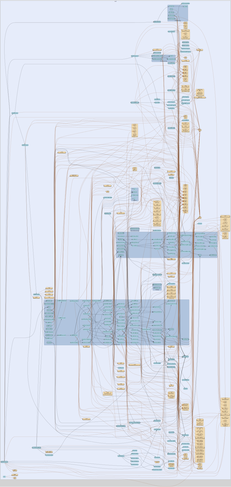

# ssu2
--
    import "github.com/go-i2p/go-i2p/lib/transport/ssu2"



Package ssu2 implements the SSU2 (Secure Semireliable UDP 2) transport protocol
for I2P router-to-router communication.

SSU2 is a UDP-based transport that uses the Noise protocol framework (XK
pattern) for authenticated key agreement, providing forward secrecy, identity
hiding, and NAT traversal capabilities.

This package wraps the go-noise/ssu2 library (which provides the Noise state
machine and UDP protocol primitives) behind the transport.Transport and
transport.TransportSession interfaces used by the go-i2p router.

# Features

    - UDP-based transport with lower latency than NTCP2
    - Session handshake using Noise XK pattern
    - Peer testing for NAT detection
    - Introducer support for NAT traversal
    - Connection migration for roaming clients
    - Congestion control and reliable delivery

# I2P Specification

SSU2 is defined in the I2P specification at: https://geti2p.net/spec/ssu2

# Configuration

The router configuration supports SSU2 settings:

    transport:
      ssu2_enabled: true
      ssu2_port: 9002  // Random port when 0

## Usage

```go
const DefaultKeepaliveInterval = 15 * time.Second
```
DefaultKeepaliveInterval is the SSU2 keepalive interval used by this
implementation (15 s). NOTE: The SSU2 spec's 15-second value is a retransmit
timeout, not a keepalive interval; this value is an implementation choice.
Shorter values help aggressive NATs at the cost of extra traffic.

```go
const DefaultMaxRetransmissions = 3
```
DefaultMaxRetransmissions is the number of I2NP message retransmission attempts
before the session is torn down.

```go
const DefaultMaxSessions = 512
```
DefaultMaxSessions is the default maximum number of concurrent SSU2 sessions.

```go
var (
	ErrSSU2NotSupported       = oops.New("router does not support SSU2")
	ErrSessionClosed          = oops.New("SSU2 session is closed")
	ErrHandshakeFailed        = oops.New("SSU2 handshake failed")
	ErrInvalidRouterInfo      = oops.New("invalid router info for SSU2")
	ErrConnectionPoolFull     = oops.New("SSU2 connection pool full")
	ErrInvalidListenerAddress = oops.New("invalid listener address for SSU2")
	ErrInvalidConfig          = oops.New("invalid SSU2 configuration")
	ErrTransportNotStarted    = oops.New("SSU2 transport not yet started")
)
```

#### func  ConvertToRouterAddress

```go
func ConvertToRouterAddress(transport *SSU2Transport) (*router_address.RouterAddress, error)
```
ConvertToRouterAddress converts an SSU2Transport's listening address to a
RouterAddress suitable for publishing in RouterInfo.

#### func  ExtractSSU2Addr

```go
func ExtractSSU2Addr(routerInfo router_info.RouterInfo) (*net.UDPAddr, error)
```
ExtractSSU2Addr extracts the SSU2 network address from a RouterInfo structure.
It returns a *net.UDPAddr for the best SSU2 transport address found, using a
two-pass strategy: IPv4 addresses are preferred; IPv6 is only returned when the
host has confirmed global-unicast IPv6 connectivity (AUDIT FIX-2 / RC-C).

#### func  ExtractSSU2IntroKey

```go
func ExtractSSU2IntroKey(ri router_info.RouterInfo) ([]byte, error)
```
ExtractSSU2IntroKey extracts the 32-byte introduction key from the "i" option of
the first SSU2 RouterAddress found in ri. The option value is I2P-base64-encoded
(same alphabet as static keys). Returns an error if no SSU2 address carries a
valid 32-byte intro key.

#### func  ExtractSSU2NoiseAddr

```go
func ExtractSSU2NoiseAddr(routerInfo router_info.RouterInfo) (*ssu2noise.SSU2Addr, error)
```
ExtractSSU2NoiseAddr extracts an SSU2 noise-level address from a RouterInfo. It
returns a *ssu2noise.SSU2Addr suitable for use with the go-noise/ssu2 package.

#### func  FragmentI2NPMessage

```go
func FragmentI2NPMessage(msg i2np.I2NPMessage, maxPayload int) ([]*ssu2noise.SSU2Block, error)
```
FragmentI2NPMessage splits a large I2NP message into SSU2 fragment blocks when
the serialized message exceeds the MTU. Returns a single-element slice
containing a type 3 (I2NPMessage) block when no fragmentation is needed.

#### func  FrameI2NPForSSU2

```go
func FrameI2NPForSSU2(msg i2np.I2NPMessage) ([]byte, error)
```
FrameI2NPForSSU2 serializes an I2NP message to raw bytes suitable for
SSU2Conn.Write. This is the SSU2 equivalent of NTCP2's FrameI2NPMessage.

#### func  FrameI2NPToBlock

```go
func FrameI2NPToBlock(msg i2np.I2NPMessage) (*ssu2noise.SSU2Block, error)
```
FrameI2NPToBlock serializes an I2NP message into an SSU2 block type 3. The
message is serialized using its standard binary format and wrapped in an
SSU2Block with BlockTypeI2NPMessage.

#### func  HasDialableSSU2Address

```go
func HasDialableSSU2Address(routerInfo *router_info.RouterInfo) bool
```
HasDialableSSU2Address checks if a RouterInfo has at least one directly dialable
SSU2 address with a valid host and port.

#### func  HasDirectConnectivity

```go
func HasDirectConnectivity(addr *router_address.RouterAddress) bool
```
HasDirectConnectivity checks if a RouterAddress has direct SSU2 connectivity.
Returns true if the address has both host and port (directly dialable). Returns
false for introducer-only addresses.

#### func  HasIntroducerOnlySSU2Address

```go
func HasIntroducerOnlySSU2Address(ri *router_info.RouterInfo) bool
```
HasIntroducerOnlySSU2Address returns true if the RouterInfo has at least one
SSU2 address containing a valid introducer entry (ih0/itag0 present) but no
directly dialable address. Used by Compatible() and GetSession() to decide
whether the introducer path should be attempted.

#### func  NewDateTimeBlock

```go
func NewDateTimeBlock() *ssu2noise.SSU2Block
```
NewDateTimeBlock creates a DateTime block (type 0) with the current timestamp.

#### func  NewPaddingBlock

```go
func NewPaddingBlock(size int) *ssu2noise.SSU2Block
```
NewPaddingBlock creates a Padding block (type 254) with the given size.

#### func  ParseI2NPFromBlock

```go
func ParseI2NPFromBlock(block *ssu2noise.SSU2Block) (i2np.I2NPMessage, error)
```
ParseI2NPFromBlock deserializes an SSU2 block type 3 back to an I2NP message.
Returns an error if the block type is not BlockTypeI2NPMessage or parsing fails.

#### func  ParseI2NPFromSSU2

```go
func ParseI2NPFromSSU2(data []byte) (i2np.I2NPMessage, error)
```
ParseI2NPFromSSU2 parses raw bytes received from SSU2Conn.Read back to an I2NP
message. This is the SSU2 equivalent of NTCP2's UnframeI2NPMessage.

#### func  SupportsSSU2

```go
func SupportsSSU2(routerInfo *router_info.RouterInfo) bool
```
SupportsSSU2 checks if a RouterInfo has an SSU2 transport address.

#### func  WrapSSU2Addr

```go
func WrapSSU2Addr(addr net.Addr, routerHash data.Hash) (*ssu2noise.SSU2Addr, error)
```
WrapSSU2Addr wraps an existing net.Addr as an SSU2Addr with associated router
hash metadata.

#### func  WrapSSU2Error

```go
func WrapSSU2Error(err error, operation string) error
```
WrapSSU2Error wraps an error with SSU2 operation context.

#### type BlockCallbackConfig

```go
type BlockCallbackConfig struct {
	// OnTermination is called when a peer sends a Termination block (type 6).
	// validDataReceived is the number of valid data bytes received in this session;
	// reason is the termination reason code; additionalData carries optional extended data.
	OnTermination func(validDataReceived uint64, reason uint8, additionalData []byte)

	// OnRouterInfo is called when a RouterInfo block (type 2) is received.
	// The data should be forwarded to the NetDB subsystem.
	OnRouterInfo func(data []byte) error

	// OnACK is called when an ACK block (type 12) is received.
	OnACK func(block *ssu2noise.SSU2Block) error

	// OnDateTime is called when a DateTime block (type 0) is received.
	OnDateTime func(timestamp uint32) error

	// OnPeerTest is called when a PeerTest block (type 10) is received.
	OnPeerTest func(block *ssu2noise.SSU2Block) error

	// OnRelayRequest is called when a RelayRequest block (type 7) is received.
	OnRelayRequest func(block *ssu2noise.SSU2Block) error

	// OnRelayResponse is called when a RelayResponse block (type 8) is received.
	OnRelayResponse func(block *ssu2noise.SSU2Block) error

	// OnRelayIntro is called when a RelayIntro block (type 9) is received.
	OnRelayIntro func(block *ssu2noise.SSU2Block) error

	// OnNewToken is called when a NewToken block (type 17) is received.
	OnNewToken func(token []byte)

	// OnAddress is called when an Address block (type 13) is received.
	OnAddress func(data []byte) error

	// OnOptions is called when an Options block (type 1) is received.
	OnOptions func(data []byte) error

	// OnPathChallenge is called when a PathChallenge block (type 18) is received.
	OnPathChallenge func(data []byte) error

	// OnPathResponse is called when a PathResponse block (type 19) is received.
	OnPathResponse func(data []byte) error
}
```

BlockCallbackConfig holds callback functions for SSU2 block types that require
integration with higher-level router subsystems. These callbacks are wired into
the go-noise/ssu2 DataHandler.

#### func  DefaultBlockCallbacks

```go
func DefaultBlockCallbacks() *BlockCallbackConfig
```
DefaultBlockCallbacks returns a BlockCallbackConfig with logging-only defaults
for all block types. Production code should override callbacks for block types
that need real handling.

#### func (*BlockCallbackConfig) ToDataHandlerCallbacks

```go
func (c *BlockCallbackConfig) ToDataHandlerCallbacks() ssu2noise.DataHandlerCallbacks
```
ToDataHandlerCallbacks converts BlockCallbackConfig into go-noise/ssu2
DataHandlerCallbacks for wiring into the DataHandler. OnTermination is applied
first; then all remaining non-nil callbacks are merged via mergeBlockCallbacks
(shared with session.go) to avoid duplication.

#### type Config

```go
type Config struct {
	ListenerAddress    string        // UDP address to listen on, e.g. ":9002"
	WorkingDir         string        // Persistent storage path for keys
	MaxSessions        int           // Maximum concurrent sessions (0 = DefaultMaxSessions)
	KeepaliveInterval  time.Duration // How often keepalive packets are sent (0 = DefaultKeepaliveInterval)
	MaxRetransmissions int           // I2NP retransmission attempts before teardown (0 = DefaultMaxRetransmissions)

	// RouterLookupFunc looks up a RouterInfo by identity hash.
	// Required for SSU2 via introducers: Alice looks up Bob (the introducer)
	// to get a direct dialable address before sending the RelayRequest.
	RouterLookupFunc func(hash data.Hash) (router_info.RouterInfo, error)

	*ssu2noise.SSU2Config
}
```

Config holds SSU2 transport configuration, extending the go-noise SSU2Config
with transport-layer settings needed by the go-i2p router.

#### func  NewConfig

```go
func NewConfig(listenerAddress string) (*Config, error)
```
NewConfig creates a new SSU2 Config with the given listener address.

#### func (*Config) GetKeepaliveInterval

```go
func (c *Config) GetKeepaliveInterval() time.Duration
```
GetKeepaliveInterval returns the effective keepalive interval. Shorter values
help aggressive NATs that time out idle UDP bindings quickly.

#### func (*Config) GetMaxRetransmissions

```go
func (c *Config) GetMaxRetransmissions() int
```
GetMaxRetransmissions returns the effective maximum I2NP retransmission count.

#### func (*Config) GetMaxSessions

```go
func (c *Config) GetMaxSessions() int
```
GetMaxSessions returns the effective maximum session limit.

#### func (*Config) Validate

```go
func (c *Config) Validate() error
```
Validate checks the configuration for correctness.

#### type DefaultHandler

```go
type DefaultHandler struct {
}
```

DefaultHandler implements SSU2Handler with replay detection and clock skew
validation suitable for production use. A background goroutine periodically
evicts stale entries from the replay cache to prevent unbounded memory growth.
Call Close() when the handler is no longer needed to stop the cleanup goroutine.

#### func  NewDefaultHandler

```go
func NewDefaultHandler() *DefaultHandler
```
NewDefaultHandler creates a new DefaultHandler with ±60 second clock skew
tolerance. We use ±30 s to narrow the post-restart replay window; see AUDIT.md.
A background goroutine evicts replay cache entries older than 60 seconds every 5
minutes. Call Close() to stop it.

#### func (*DefaultHandler) CheckReplay

```go
func (h *DefaultHandler) CheckReplay(ephemeralKey [32]byte) bool
```
CheckReplay checks whether an ephemeral key has been seen before. Returns true
if the key is a duplicate (replay attack).

#### func (*DefaultHandler) Close

```go
func (h *DefaultHandler) Close()
```
Close stops the background cleanup goroutine and resets the replay cache.

#### func (*DefaultHandler) ReplayCacheSize

```go
func (h *DefaultHandler) ReplayCacheSize() int
```
ReplayCacheSize returns the current number of entries in the replay cache.

#### func (*DefaultHandler) SendTermination

```go
func (h *DefaultHandler) SendTermination(conn *ssu2noise.SSU2Conn, reason byte) error
```
SendTermination sends a termination block through the SSU2 connection.

#### func (*DefaultHandler) ValidateTimestamp

```go
func (h *DefaultHandler) ValidateTimestamp(peerTime uint32) error
```
ValidateTimestamp checks whether a peer's timestamp is within ±60 seconds of the
local clock.

#### type IntroducerAddr

```go
type IntroducerAddr struct {
	// RouterHash is Bob's 32-byte router identity hash (from the ih<N> option).
	RouterHash data.Hash

	// RelayTag is the relay tag assigned by Bob to Charlie (from the itag<N> option).
	RelayTag uint32

	// Expiry is the Unix timestamp (seconds) after which the introduction expires.
	Expiry int64
}
```

IntroducerAddr holds the parsed fields of a single SSU2 introducer entry from a
RouterAddress's options (ih0/itag0/iexp0 through ih2/itag2/iexp2).

#### func  ExtractIntroducers

```go
func ExtractIntroducers(addr *router_address.RouterAddress) []IntroducerAddr
```
ExtractIntroducers parses the introducer entries (indices 0-2) from a single
SSU2 RouterAddress, returning all valid entries. Invalid or missing entries
(e.g. empty hash, zero relay tag, already-expired) are silently skipped.

#### type KeystoreProvider

```go
type KeystoreProvider interface {
	GetEncryptionPrivateKey() types.PrivateEncryptionKey
	GetSigningPrivateKey() types.PrivateKey
}
```

KeystoreProvider provides access to the router's cryptographic keys.

#### type PersistentConfig

```go
type PersistentConfig struct {
}
```

PersistentConfig manages persistent SSU2 configuration data. It handles loading
and storing the obfuscation IV and introduction key, both of which must remain
consistent across router restarts.

#### func  NewPersistentConfig

```go
func NewPersistentConfig(workingDir string) *PersistentConfig
```
NewPersistentConfig creates a new persistent configuration manager. workingDir
is the router's working directory (e.g. ~/.go-i2p/config).

#### func (*PersistentConfig) LoadOrGenerateIntroKey

```go
func (pc *PersistentConfig) LoadOrGenerateIntroKey() ([]byte, error)
```
LoadOrGenerateIntroKey loads the 32-byte introduction key from persistent
storage, or generates and stores a new one if the file is absent. Returns an
error if the file exists but contains invalid data.

#### func (*PersistentConfig) LoadOrGenerateObfuscationIV

```go
func (pc *PersistentConfig) LoadOrGenerateObfuscationIV() ([]byte, error)
```
LoadOrGenerateObfuscationIV loads the 8-byte ChaCha20 obfuscation IV from
persistent storage, or generates and stores a new one if the file is absent.
Returns an error if the file exists but contains invalid data.

#### type ReachabilitySnapshot

```go
type ReachabilitySnapshot struct {
	// NATMappingSuccess is the number of successful NAT-PMP/UPnP port mappings.
	NATMappingSuccess uint64
	// NATMappingFailure is the number of failed NAT-PMP/UPnP port map attempts.
	NATMappingFailure uint64
	// PeerTestConfirmed is the number of times an external address was
	// confirmed by the PeerTest majority-vote logic.
	PeerTestConfirmed uint64
	// PublishedAddrChanged is the number of times the RouterInfo was
	// republished because the confirmed external address changed.
	PublishedAddrChanged uint64
}
```

ReachabilitySnapshot is a point-in-time copy of all reachability counters.

#### type SSU2Handler

```go
type SSU2Handler interface {
	// CheckReplay checks whether an ephemeral key has been seen before.
	// Returns true if the key is a replay and the connection should be rejected.
	CheckReplay(ephemeralKey [32]byte) bool

	// ValidateTimestamp checks whether a peer's timestamp is within the
	// allowed clock skew tolerance. Returns a non-nil error if the skew
	// exceeds the tolerance.
	ValidateTimestamp(peerTime uint32) error

	// SendTermination sends a termination block through the SSU2 connection.
	SendTermination(conn *ssu2noise.SSU2Conn, reason byte) error
}
```

SSU2Handler defines callback hooks for injecting I2P-specific behaviour into the
SSU2 transport layer. The go-noise/ssu2 library handles the low-level Noise
protocol mechanics; this interface allows the router transport to add
higher-level concerns: replay detection, timestamp validation, and termination.

#### type SSU2Session

```go
type SSU2Session struct {
}
```

SSU2Session implements transport.TransportSession over an SSU2 connection.

#### func  NewSSU2Session

```go
func NewSSU2Session(conn *ssu2noise.SSU2Conn, ctx context.Context, logger *logger.Entry) *SSU2Session
```
NewSSU2Session creates a new SSU2 session and starts background workers.

#### func  NewSSU2SessionDeferred

```go
func NewSSU2SessionDeferred(conn *ssu2noise.SSU2Conn, ctx context.Context, logger *logger.Entry) *SSU2Session
```
NewSSU2SessionDeferred creates a new SSU2 session without starting workers. Call
StartWorkers() after confirming the session will be used.

#### func (*SSU2Session) Close

```go
func (s *SSU2Session) Close() error
```
Close closes the session cleanly with a normal-close termination reason.

#### func (*SSU2Session) CloseWithReason

```go
func (s *SSU2Session) CloseWithReason(reason ssu2noise.TerminationReason) error
```
CloseWithReason closes the session with the specified termination reason code. A
termination block is sent to the remote peer before closing the connection.

#### func (*SSU2Session) DroppedMessages

```go
func (s *SSU2Session) DroppedMessages() uint64
```
DroppedMessages returns the number of received messages that were dropped due to
the receive channel being full (backpressure). A non-zero value indicates the
consumer is not keeping up with inbound message rate.

#### func (*SSU2Session) GetBandwidthStats

```go
func (s *SSU2Session) GetBandwidthStats() (bytesSent, bytesReceived uint64)
```
GetBandwidthStats returns total bytes sent and received by this session.

#### func (*SSU2Session) QueueSendI2NP

```go
func (s *SSU2Session) QueueSendI2NP(msg i2np.I2NPMessage) error
```
QueueSendI2NP queues an I2NP message to be sent over the session.

#### func (*SSU2Session) ReadNextI2NP

```go
func (s *SSU2Session) ReadNextI2NP() (i2np.I2NPMessage, error)
```
ReadNextI2NP blocking reads the next fully received I2NP message.

#### func (*SSU2Session) RemoteUDPAddr

```go
func (s *SSU2Session) RemoteUDPAddr() *net.UDPAddr
```
RemoteUDPAddr returns the remote UDP address of the session's underlying SSU2
connection.

#### func (*SSU2Session) SendQueueSize

```go
func (s *SSU2Session) SendQueueSize() int
```
SendQueueSize returns how many I2NP messages are not completely sent yet.

#### func (*SSU2Session) SetCleanupCallback

```go
func (s *SSU2Session) SetCleanupCallback(callback func())
```
SetCleanupCallback sets a callback invoked when the session closes.

#### func (*SSU2Session) SetTransportCallbacks

```go
func (s *SSU2Session) SetTransportCallbacks(cfg *BlockCallbackConfig)
```
SetTransportCallbacks merges transport-level block callbacks (relay, peer-test,
router-info, etc.) into the session's DataHandler without overwriting the
session-local termination and clock-validation handlers. Safe to call after
construction and before or after StartWorkers().

#### func (*SSU2Session) StartWorkers

```go
func (s *SSU2Session) StartWorkers()
```
StartWorkers launches the background send and receive goroutines.

#### func (*SSU2Session) WriteBlocks

```go
func (s *SSU2Session) WriteBlocks(blocks []*ssu2noise.SSU2Block) error
```
WriteBlocks writes raw SSU2 blocks directly to the underlying connection,
bypassing the I2NP send queue. Used for protocol-level blocks such as PeerTest
and Relay that must not be fragmented or queued alongside I2NP traffic.

#### type SSU2Transport

```go
type SSU2Transport struct {
}
```

SSU2Transport implements transport.Transport for SSU2 connections.

#### func  NewSSU2Transport

```go
func NewSSU2Transport(identity router_info.RouterInfo, config *Config, keystore KeystoreProvider) (*SSU2Transport, error)
```
NewSSU2Transport creates a new SSU2 transport instance.

#### func (*SSU2Transport) Accept

```go
func (t *SSU2Transport) Accept() (net.Conn, error)
```
Accept accepts an incoming SSU2 connection.

#### func (*SSU2Transport) Addr

```go
func (t *SSU2Transport) Addr() net.Addr
```
Addr returns the network address the transport is bound to.

#### func (*SSU2Transport) AllocateRelayTag

```go
func (t *SSU2Transport) AllocateRelayTag(addr *net.UDPAddr) (uint32, error)
```
AllocateRelayTag allocates a relay tag for the given peer address so that this
router can act as an introducer for that peer.

#### func (*SSU2Transport) Close

```go
func (t *SSU2Transport) Close() error
```
Close closes the transport cleanly.

#### func (*SSU2Transport) Compatible

```go
func (t *SSU2Transport) Compatible(routerInfo router_info.RouterInfo) bool
```
Compatible returns true if we can reach this router over SSU2 — either by
dialling it directly or by going through one of its introducers (when a
RouterLookupFunc is configured).

#### func (*SSU2Transport) GetCachedExternalAddr

```go
func (t *SSU2Transport) GetCachedExternalAddr() string
```
GetCachedExternalAddr returns the external address string confirmed by PeerTest
observations (or by NAT-PMP/UPnP mapping). Returns "" when no confirmed external
address is available yet.

#### func (*SSU2Transport) GetCachedNATType

```go
func (t *SSU2Transport) GetCachedNATType() ssu2noise.NATType
```
GetCachedNATType returns the most recently cached NAT type from the
transport-level cache. Returns NATUnknown if the cache is empty or expired
(30-minute TTL).

#### func (*SSU2Transport) GetExternalAddr

```go
func (t *SSU2Transport) GetExternalAddr(peerAddr *net.UDPAddr) *net.UDPAddr
```
GetExternalAddr returns the external UDP address detected from the most recent
peer-test result. Returns nil if no result is available.

#### func (*SSU2Transport) GetIntroKey

```go
func (t *SSU2Transport) GetIntroKey() []byte
```
GetIntroKey returns the current introduction key, or nil if key management is
not initialised.

#### func (*SSU2Transport) GetIntroducers

```go
func (t *SSU2Transport) GetIntroducers() []*ssu2noise.RegisteredIntroducer
```
GetIntroducers returns the current set of registered introducers that should be
published in the router's RouterInfo.

#### func (*SSU2Transport) GetNATType

```go
func (t *SSU2Transport) GetNATType(peerAddr *net.UDPAddr) ssu2noise.NATType
```
GetNATType returns the NAT type determined from the most recent peer-test result
for the given address. Returns NATUnknown if no result is available.

#### func (*SSU2Transport) GetReachabilityCounters

```go
func (t *SSU2Transport) GetReachabilityCounters() ReachabilitySnapshot
```
GetReachabilityCounters returns a point-in-time snapshot of all
reachability-related counters for monitoring and diagnostics.

#### func (*SSU2Transport) GetSession

```go
func (t *SSU2Transport) GetSession(routerInfo router_info.RouterInfo) (transport.TransportSession, error)
```
GetSession obtains a transport session with a router given its RouterInfo. It
tries direct dial first; if the peer only advertises introducer addresses and a
RouterLookupFunc is configured, it falls back to the relay path.

#### func (*SSU2Transport) GetSessionCount

```go
func (t *SSU2Transport) GetSessionCount() int
```
GetSessionCount returns the number of active sessions.

#### func (*SSU2Transport) GetTotalBandwidth

```go
func (t *SSU2Transport) GetTotalBandwidth() (totalBytesSent, totalBytesReceived uint64)
```
GetTotalBandwidth returns the total bytes sent and received across all active
sessions.

#### func (*SSU2Transport) InitiateNATDetection

```go
func (t *SSU2Transport) InitiateNATDetection(bobAddr *net.UDPAddr) (uint32, error)
```
InitiateNATDetection starts a peer-test as Alice against the specified Bob
address. Returns the test nonce so the caller can correlate the result.

#### func (*SSU2Transport) IntroducerFromRouterInfo

```go
func (t *SSU2Transport) IntroducerFromRouterInfo(ri router_info.RouterInfo) (*ssu2noise.RegisteredIntroducer, error)
```
IntroducerFromRouterInfo builds a RegisteredIntroducer for ri using this
transport's relay-tag allocator. Exported for use by the router-level introducer
selector; returns the same value that RegisterIntroducer would accept. Allocates
a relay tag as a side effect — the caller must register the result (or discard
it) to avoid leaking allocations.

#### func (*SSU2Transport) Name

```go
func (t *SSU2Transport) Name() string
```
Name returns the name of this transport.

#### func (*SSU2Transport) RegisterIntroducer

```go
func (t *SSU2Transport) RegisterIntroducer(intro *ssu2noise.RegisteredIntroducer) error
```
RegisterIntroducer adds an introducer to the registry for inclusion in our
published RouterInfo. Up to 3 introducers are maintained (implementation
convention; up to 3 is common practice in I2P implementations).

#### func (*SSU2Transport) RemoveIntroducerByAddr

```go
func (t *SSU2Transport) RemoveIntroducerByAddr(addr *net.UDPAddr)
```
RemoveIntroducerByAddr removes a previously-registered introducer by its UDP
address. No-op when the registry is uninitialised or the address is nil. Used by
the router's hidden-mode introducer selector to drop disconnected peers (PLAN.md
Track C2).

#### func (*SSU2Transport) SetIdentity

```go
func (t *SSU2Transport) SetIdentity(ident router_info.RouterInfo) error
```
SetIdentity sets the router identity for this transport.

#### func (*SSU2Transport) SetPeerConnNotifier

```go
func (t *SSU2Transport) SetPeerConnNotifier(n transport.PeerConnNotifier)
```
SetPeerConnNotifier wires a connection-outcome notifier into the transport. Call
this after construction to enable PeerTracker feedback.

#### func (*SSU2Transport) StartNATDetection

```go
func (t *SSU2Transport) StartNATDetection(candidates []router_info.RouterInfo, republish func())
```
StartNATDetection spawns a background goroutine that performs SSU2 peer testing
to determine our NAT type. candidates must contain at least two SSU2-capable
RouterInfos: the first is Bob (relay peer), the second is Charlie (responder
peer).

On NAT types that require introducers (Restricted or Symmetric), up to three
candidates are registered in the IntroducerRegistry and republish (if non-nil)
is invoked so the caller can re-publish the updated RouterInfo.

The goroutine is tracked in the transport WaitGroup and exits cleanly when the
transport context is cancelled.


ssu2 

github.com/go-i2p/go-i2p/lib/transport/ssu2

[go-i2p template file](template.md)
