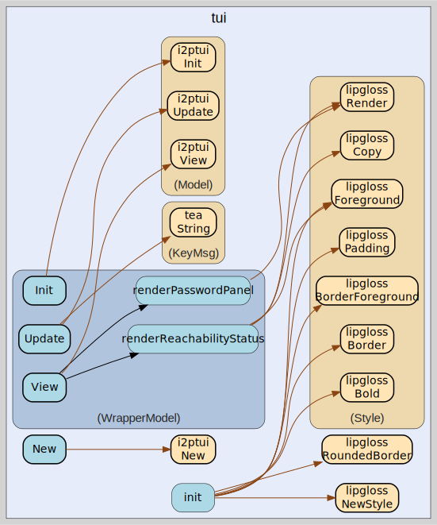

# tui
--
    import "github.com/go-i2p/go-i2p/lib/tui"



Package tui provides a text-based user interface for the go-i2p router.

## Usage

#### type ReachabilityState

```go
type ReachabilityState string
```

ReachabilityState describes the router's current network reachability.

```go
const (
	// ReachabilityUnknown is the default state before the router has determined its reachability.
	ReachabilityUnknown ReachabilityState = "Unknown"
	// ReachabilityHidden means the router is in hidden mode: no published addresses.
	ReachabilityHidden ReachabilityState = "Hidden"
	// ReachabilityFirewalled means the router is behind NAT and is using introducers.
	ReachabilityFirewalled ReachabilityState = "Firewalled+Introducers"
	// ReachabilityIPv4 means the router has a publicly reachable IPv4 address.
	ReachabilityIPv4 ReachabilityState = "Reachable IPv4"
	// ReachabilityIPv6 means the router has a publicly reachable IPv6 address.
	ReachabilityIPv6 ReachabilityState = "Reachable IPv6"
)
```

#### type ReachabilityStatusMsg

```go
type ReachabilityStatusMsg struct {
	State ReachabilityState
}
```

ReachabilityStatusMsg is a tea.Msg that updates the displayed reachability
state.

#### type WrapperModel

```go
type WrapperModel struct {
}
```

WrapperModel wraps the i2ptui Model and adds a password reveal panel so that
other applications can discover the I2PControl credentials, and a reachability
status line showing the router's network state.

#### func  New

```go
func New(password, address string, opts ...i2ptui.Option) WrapperModel
```
New creates a WrapperModel that embeds the i2ptui TUI with the given options and
stores the password/address for the reveal panel.

#### func (WrapperModel) Init

```go
func (m WrapperModel) Init() tea.Cmd
```
Init implements tea.Model.

#### func (WrapperModel) Update

```go
func (m WrapperModel) Update(msg tea.Msg) (tea.Model, tea.Cmd)
```
Update implements tea.Model.

#### func (WrapperModel) View

```go
func (m WrapperModel) View() string
```
View implements tea.Model.


tui 

github.com/go-i2p/go-i2p/lib/tui

[go-i2p template file](template.md)
