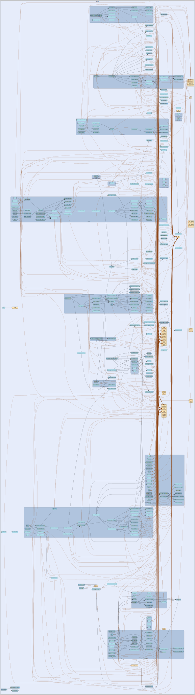

# tunnel
--
    import "github.com/go-i2p/go-i2p/lib/tunnel"



Package tunnel provides I2P tunnel management functionality.

Package tunnel implements I2P tunnel creation, management, and message routing.

# Overview

Tunnels are the core anonymity mechanism in I2P. This package handles:

    - Tunnel building with encrypted build records
    - Tunnel pool management (inbound and outbound)
    - Message routing through tunnel hops
    - Layered encryption/decryption at each hop
    - Fragment handling for large messages

# Tunnel Architecture

Tunnels are unidirectional paths through the I2P network:

    - Outbound tunnels: Local → Hop1 → Hop2 → ... → Endpoint
    - Inbound tunnels: Gateway → Hop1 → Hop2 → ... → Local

Each tunnel has multiple hops (typically 3) for anonymity.

# Tunnel Roles

Routers can perform three roles in tunnel operation:

    - Gateway: Receives messages from the network and forwards them into
      the tunnel with the first layer of encryption.

    - Participant: Acts as an intermediate hop, removing one layer of
      encryption and forwarding to the next hop. The Participant.Process()
      method handles decryption and extraction of next hop information.

    - Endpoint: Receives messages from the tunnel, removes the final
      encryption layer, and delivers to the destination or local router.

# Thread Safety

TunnelPool is safe for concurrent access:

    - Tunnel list protected by mutex
    - Builder operations are atomic
    - Pool management runs in background goroutine

# Usage Example

    // Create tunnel pool with peer selector
    pool := tunnel.NewTunnelPool(peerSelector)

    // Start maintenance (builds tunnels automatically)
    if err := pool.StartMaintenance(); err != nil {
        log.Printf("Failed to start maintenance: %v", err)
    }

    // Select an active tunnel for sending
    outTunnel := pool.SelectTunnel()
    if outTunnel == nil {
        log.Printf("No active tunnels available")
    }

    // For message routing, use Gateway.Send() with an I2NP message
    // gateway := tunnel.NewGateway(tunnelID, nextHopID, encryption)
    // encryptedMsg, err := gateway.Send(i2npMessageBytes)

# Cryptography

Each tunnel hop uses:

    - AES256 for layer encryption
    - HMAC-SHA256 for integrity
    - ElGamal or ECIES for build record encryption

See github.com/go-i2p/crypto for cryptographic primitives.

Package tunnel provides I2P tunnel management functionality.

## Usage

```go
const (
	FlagIBGW = 0x80 // Inbound Gateway: allow messages from anyone
	FlagOBEP = 0x40 // Outbound Endpoint: allow messages to anyone
)
```
Build record flag bits per I2P spec §tunnel-creation: Bit 7 (0x80): IBGW — if
set, allow messages from anyone (inbound gateway) Bit 6 (0x40): OBEP — if set,
allow messages to anyone (outbound endpoint)

```go
const (
	// DTLocal indicates delivery to the local router context.
	DTLocal = iota
	DTTunnel
	DTRouter
	DTUnused
)
```

```go
const (
	// FirstFragment marks the first fragment in a message sequence.
	FirstFragment = iota
	FollowOnFragment
)
```

```go
const (
	// FlagSize is the size in bytes of a fragment flag field.
	FlagSize               = 1
	TunnelIDSize           = 4
	HashSize               = 32
	DelaySize              = 1
	MessageIDSize          = 4
	ExtendedOptionsMinSize = 2
	SizeFieldSize          = 2
)
```

```go
const (
	BuildReplyCodeAccepted            = 0  // Tunnel accepted
	BuildReplyCodeProbabilisticReject = 10 // Rejected: probabilistic reject
	BuildReplyCodeTransientOverload   = 20 // Rejected: transient overload
	BuildReplyCodeBandwidth           = 30 // Rejected: bandwidth limit (used for most rejections)
	BuildReplyCodeCritical            = 50 // Rejected: critical (router shutdown, etc.)
)
```
Build reply codes per I2P specification (TUNNEL-CREATION)

```go
const (

	// BuildTimeout is the exported form of tunnelBuildTimeout for packages
	// that need to schedule operations relative to the build deadline
	// (e.g. the startup reachability check in the router).
	BuildTimeout = tunnelBuildTimeout
)
```

```go
const DefaultIdleTimeout = 2 * time.Minute
```
DefaultIdleTimeout is the default duration after which an idle tunnel is
dropped. This helps mitigate resource exhaustion attacks where attackers request
excessive tunnels but send no data through them.

```go
var (
	// ErrNilDecryption is returned when decryption is nil
	ErrNilDecryption = errors.New("decryption tunnel cannot be nil")
	// ErrNilHandler is returned when message handler is nil
	ErrNilHandler = errors.New("message handler cannot be nil")
	// ErrInvalidTunnelData is returned when tunnel data is malformed
	ErrInvalidTunnelData = errors.New("invalid tunnel data")
	// ErrChecksumMismatch is returned when checksum validation fails
	ErrChecksumMismatch = errors.New("tunnel message checksum mismatch")
	// ErrTooManyFragments is returned when fragment number exceeds maximum
	ErrTooManyFragments = errors.New("too many fragments: maximum 63")
	// ErrDuplicateFragment is returned when a fragment is received twice
	ErrDuplicateFragment = errors.New("duplicate fragment received")
)
```

```go
var (
	// ErrNilEncryption is returned when encryption is nil
	ErrNilEncryption = errors.New("encryption tunnel cannot be nil")
	// ErrMessageTooLarge is returned when a message exceeds maximum size
	ErrMessageTooLarge = errors.New("message too large for tunnel")
	// ErrInvalidMessage is returned when message data is invalid
	ErrInvalidMessage = errors.New("invalid I2NP message data")
)
```

```go
var (
	// ErrNilParticipantDecryption is returned when participant decryption is nil.
	ErrNilParticipantDecryption = errors.New("participant decryption cannot be nil")

	// ErrInvalidParticipantData is returned when tunnel data is malformed
	ErrInvalidParticipantData = errors.New("invalid participant tunnel data")
)
```

#### func  HashSetToSlice

```go
func HashSetToSlice(set map[common.Hash]struct{}) []common.Hash
```
HashSetToSlice converts a hash set to a slice. Exported for use by other
selector implementations.

#### type AnyFilter

```go
type AnyFilter struct {
}
```

AnyFilter combines multiple filters with OR logic. A peer passes if ANY filter
accepts it.

#### func  NewAnyFilter

```go
func NewAnyFilter(name string, filters ...PeerFilter) *AnyFilter
```
NewAnyFilter creates a composite OR filter.

#### func (*AnyFilter) Accept

```go
func (f *AnyFilter) Accept(ri router_info.RouterInfo) bool
```
Accept returns true if any inner filter accepts the peer. Returns true if there
are no filters (empty OR = accept all).

#### func (*AnyFilter) Name

```go
func (f *AnyFilter) Name() string
```
Name returns the filter name.

#### type BuildRequestRecord

```go
type BuildRequestRecord struct {
	ReceiveTunnel TunnelID
	OurIdent      common.Hash
	NextTunnel    TunnelID
	NextIdent     common.Hash
	LayerKey      session_key.SessionKey
	IVKey         session_key.SessionKey
	ReplyKey      session_key.SessionKey
	ReplyIV       [16]byte
	Flag          int
	RequestTime   time.Time
	SendMessageID int
	Padding       [29]byte
}
```

BuildRequestRecord contains all the data for a single tunnel hop build request.
This is the cleartext version before encryption. It maps to the I2NP
BuildRequestRecord structure but is defined here to avoid import cycles.

#### type BuildResponse

```go
type BuildResponse struct {
	HopIndex int    // Index of the hop that responded
	Success  bool   // Whether the hop accepted the tunnel
	Reply    []byte // Raw response data
}
```

BuildResponse represents a response from a tunnel hop

#### type BuildTunnelRequest

```go
type BuildTunnelRequest struct {
	HopCount                  int           // Number of hops in the tunnel (1-8)
	IsInbound                 bool          // True for inbound tunnel, false for outbound
	IsClientTunnel            bool          // True for I2CP session-scoped client pools (vs exploratory router pools)
	OurIdentity               common.Hash   // Our router identity hash
	ExcludePeers              []common.Hash // Peers to exclude from selection
	ReplyTunnelID             TunnelID      // Tunnel ID for receiving build replies (0 for outbound)
	ReplyGateway              common.Hash   // Gateway hash for build replies (empty for outbound)
	UseShortBuild             bool          // Use Short Tunnel Build (STBM - modern, default true)
	RequireDirectConnectivity bool          // Only select peers with direct NTCP2 connectivity (set true in production)
}
```

BuildTunnelRequest contains the parameters needed to build a tunnel.

FIX: Added RequireDirectConnectivity to enable pre-filtering of introducer-only
peers. This prevents session establishment failures by only selecting peers with
direct NTCP2 addresses. Set to true in production; tests may leave false to test
with mock peers.

#### type BuildTunnelResult

```go
type BuildTunnelResult struct {
	TunnelID   TunnelID      // The assigned tunnel ID (0 on failure)
	PeerHashes []common.Hash // Hashes of peers selected for this build attempt
}
```

BuildTunnelResult contains the result of a tunnel build attempt. It provides the
generated tunnel ID and the hashes of the peers that were selected for this
build, enabling callers to track which peers participated in failed builds for
exclusion on retry.

#### type BuilderInterface

```go
type BuilderInterface interface {
	// BuildTunnel initiates building a new tunnel with the specified parameters.
	// Returns a BuildTunnelResult containing the tunnel ID and selected peer hashes.
	BuildTunnel(req BuildTunnelRequest) (*BuildTunnelResult, error)
}
```

BuilderInterface defines interface for building tunnels

#### type CompositeFilter

```go
type CompositeFilter struct {
}
```

CompositeFilter combines multiple filters with AND logic. A peer must pass ALL
filters to be accepted.

#### func  NewCompositeFilter

```go
func NewCompositeFilter(name string, filters ...PeerFilter) *CompositeFilter
```
NewCompositeFilter creates a composite AND filter.

#### func (*CompositeFilter) Accept

```go
func (f *CompositeFilter) Accept(ri router_info.RouterInfo) bool
```
Accept returns true only if all inner filters accept the peer.

#### func (*CompositeFilter) Name

```go
func (f *CompositeFilter) Name() string
```
Name returns the filter name.

#### type CongestionAwarePeerSelector

```go
type CongestionAwarePeerSelector interface {
	// SelectPeersWithCongestionAwareness selects peers, filtering/derating by congestion.
	// Excludes G-flagged peers and applies capacity multipliers to D/E peers.
	SelectPeersWithCongestionAwareness(count int, exclude []common.Hash) ([]router_info.RouterInfo, error)

	// ShouldExcludePeer returns true if peer should be completely excluded (G flag).
	ShouldExcludePeer(ri router_info.RouterInfo) bool

	// GetCapacityMultiplier returns a capacity multiplier for peer derating (0.0-1.0).
	// Returns 1.0 for non-congested peers, 0.0 for G-flagged peers.
	GetCapacityMultiplier(ri router_info.RouterInfo) float64
}
```

CongestionAwarePeerSelector adjusts peer selection based on congestion flags.
Implements PROP_162 peer selection rules:

    - G flag: Exclude from selection entirely
    - E flag: Apply severe capacity multiplier (0.1x default)
    - D flag: Apply moderate capacity multiplier (0.5x default)
    - Stale E flag (>15min): Treat as D flag

#### type CongestionAwareSelectorOption

```go
type CongestionAwareSelectorOption func(*DefaultCongestionAwarePeerSelector)
```

CongestionAwareSelectorOption is a functional option for configuring the
selector.

#### func  WithMaxRetries

```go
func WithMaxRetries(n int) CongestionAwareSelectorOption
```
WithMaxRetries sets the maximum number of retries when replacing G-flagged
peers.

#### func  WithRetryDelay

```go
func WithRetryDelay(d time.Duration) CongestionAwareSelectorOption
```
WithRetryDelay sets the delay between retries (useful for testing).

#### type CongestionFilter

```go
type CongestionFilter struct {
}
```

CongestionFilter is a PeerFilter that excludes G-flagged peers. Use with
FilteringPeerSelector for composable congestion filtering.

#### func  NewCongestionFilter

```go
func NewCongestionFilter(congestionInfo CongestionInfoProvider) *CongestionFilter
```
NewCongestionFilter creates a filter that excludes G-flagged peers.

#### func (*CongestionFilter) Accept

```go
func (f *CongestionFilter) Accept(ri router_info.RouterInfo) bool
```
Accept returns true if the given peer should be considered for tunnel
participation, rejecting peers with a G congestion flag.

#### func (*CongestionFilter) Name

```go
func (f *CongestionFilter) Name() string
```
Name returns the name of the CongestionFilter.

#### type CongestionInfoProvider

```go
type CongestionInfoProvider interface {
	// GetEffectiveCongestionFlag returns the effective congestion flag for a peer.
	// Handles stale E flag → D downgrade automatically.
	GetEffectiveCongestionFlag(hash common.Hash) config.CongestionFlag
}
```

CongestionInfoProvider provides congestion information about peers. This is a
subset of netdb.PeerCongestionInfo to avoid import cycles.

#### type CongestionScorer

```go
type CongestionScorer struct {
}
```

CongestionScorer is a PeerScorer that derates peers based on congestion flags.
Use with ScoringPeerSelector for composable congestion scoring.

#### func  NewCongestionScorer

```go
func NewCongestionScorer(congestionInfo CongestionInfoProvider, cfg config.CongestionDefaults) *CongestionScorer
```
NewCongestionScorer creates a scorer that derates congested peers.

#### func (*CongestionScorer) Name

```go
func (s *CongestionScorer) Name() string
```
Name returns the name of the CongestionScorer.

#### func (*CongestionScorer) Score

```go
func (s *CongestionScorer) Score(ri router_info.RouterInfo) float64
```
Score returns a score between 0.0 and 1.0 for the given peer based on its
congestion flag, with lower scores indicating higher congestion.

#### type DecryptedTunnelMessage

```go
type DecryptedTunnelMessage [1028]byte
```

DecryptedTunnelMessage represents a decrypted 1028-byte I2P tunnel message
containing a TunnelID, IV, checksum, and delivery instructions.

#### func (DecryptedTunnelMessage) Checksum

```go
func (dtm DecryptedTunnelMessage) Checksum() []byte
```
Checksum returns the 4-byte checksum from the decrypted tunnel message, located
after the TunnelID and IV fields.

#### func (DecryptedTunnelMessage) DeliveryInstructionsWithFragments

```go
func (dtm DecryptedTunnelMessage) DeliveryInstructionsWithFragments() ([]DeliveryInstructionsWithFragment, error)
```
DeliveryInstructionsWithFragments returns a slice of
DeliveryInstructionWithFragment structures, which all of the Delivery
Instructions in the tunnel message and their corresponding MessageFragment
structures. Also returns an error if any delivery instructions could not be
fully parsed; in that case the returned slice contains any successfully parsed
entries.

#### func (DecryptedTunnelMessage) ID

```go
func (dtm DecryptedTunnelMessage) ID() TunnelID
```
ID returns the TunnelID from the first 4 bytes of the decrypted tunnel message.

#### func (DecryptedTunnelMessage) IV

```go
func (dtm DecryptedTunnelMessage) IV() tunnel.TunnelIV
```
IV returns the 16-byte initialization vector from the decrypted tunnel message.

#### type DefaultCongestionAwarePeerSelector

```go
type DefaultCongestionAwarePeerSelector struct {
}
```

DefaultCongestionAwarePeerSelector implements CongestionAwarePeerSelector. It
wraps an underlying peer selector and applies congestion-based filtering.

#### func  NewCongestionAwarePeerSelector

```go
func NewCongestionAwarePeerSelector(
	underlying NetDBSelector,
	congestionInfo CongestionInfoProvider,
	cfg config.CongestionDefaults,
	opts ...CongestionAwareSelectorOption,
) (*DefaultCongestionAwarePeerSelector, error)
```
NewCongestionAwarePeerSelector creates a new congestion-aware peer selector. The
underlying selector provides base peer selection, and congestionInfo provides
congestion flags for filtering decisions.

#### func (*DefaultCongestionAwarePeerSelector) GetCapacityMultiplier

```go
func (s *DefaultCongestionAwarePeerSelector) GetCapacityMultiplier(ri router_info.RouterInfo) float64
```
GetCapacityMultiplier returns the capacity multiplier for a peer. Returns:

    - 1.0 for non-congested peers
    - 0.5 for D-flagged peers (configurable)
    - 0.1 for E-flagged peers (configurable)
    - 0.5 for stale E-flagged peers (treated as D)
    - 0.0 for G-flagged peers (should be excluded entirely)

#### func (*DefaultCongestionAwarePeerSelector) GetSelectionMetrics

```go
func (s *DefaultCongestionAwarePeerSelector) GetSelectionMetrics() SelectionMetrics
```
GetSelectionMetrics returns current selection metrics for monitoring.

#### func (*DefaultCongestionAwarePeerSelector) ResetSelectionMetrics

```go
func (s *DefaultCongestionAwarePeerSelector) ResetSelectionMetrics()
```
ResetSelectionMetrics resets all selection metrics to zero.

#### func (*DefaultCongestionAwarePeerSelector) SelectPeersWithCongestionAwareness

```go
func (s *DefaultCongestionAwarePeerSelector) SelectPeersWithCongestionAwareness(
	count int,
	exclude []common.Hash,
) ([]router_info.RouterInfo, error)
```
SelectPeersWithCongestionAwareness selects peers with congestion awareness. It
excludes G-flagged peers and may request additional peers to replace them.

#### func (*DefaultCongestionAwarePeerSelector) ShouldExcludePeer

```go
func (s *DefaultCongestionAwarePeerSelector) ShouldExcludePeer(ri router_info.RouterInfo) bool
```
ShouldExcludePeer returns true if the peer should be excluded due to G flag.

#### type DefaultPeerSelector

```go
type DefaultPeerSelector struct {
}
```

DefaultPeerSelector is a simple implementation of PeerSelector that delegates
peer selection to a NetDB-like component (for example lib/netdb.StdNetDB). It
performs basic argument validation and propagates errors from the underlying
selector.

#### func  NewDefaultPeerSelector

```go
func NewDefaultPeerSelector(db NetDBSelector) (*DefaultPeerSelector, error)
```
NewDefaultPeerSelector creates a new DefaultPeerSelector backed by the provided
db. The db must implement SelectPeers with the same signature. Returns an error
if db is nil.

#### func (*DefaultPeerSelector) SelectPeers

```go
func (s *DefaultPeerSelector) SelectPeers(count int, exclude []common.Hash) ([]router_info.RouterInfo, error)
```
SelectPeers selects peers by delegating to the underlying db selector. Returns
an error for invalid arguments or if the underlying selector fails.

#### type DelayFactor

```go
type DelayFactor byte
```

DelayFactor represents a delay factor byte for tunnel message delivery
instructions.

#### type DeliveryConfig

```go
type DeliveryConfig struct {
	// DeliveryType: DTLocal (0), DTTunnel (1), or DTRouter (2)
	DeliveryType byte
	// TunnelID is the destination tunnel ID (required for DTTunnel)
	TunnelID uint32
	// Hash is the gateway router hash (DTTunnel) or destination router hash (DTRouter)
	Hash [32]byte
}
```

DeliveryConfig specifies the delivery type and addressing for a tunnel message.

#### func  LocalDelivery

```go
func LocalDelivery() DeliveryConfig
```
LocalDelivery returns a DeliveryConfig for DTLocal delivery.

#### func  RouterDelivery

```go
func RouterDelivery(routerHash [32]byte) DeliveryConfig
```
RouterDelivery returns a DeliveryConfig for DTRouter delivery.

#### func  TunnelDelivery

```go
func TunnelDelivery(tunnelID uint32, gatewayHash [32]byte) DeliveryConfig
```
TunnelDelivery returns a DeliveryConfig for DTTunnel delivery.

#### type DeliveryInstructions

```go
type DeliveryInstructions struct {
}
```

DeliveryInstructions represents I2P tunnel message delivery instructions

#### func  NewDeliveryInstructions

```go
func NewDeliveryInstructions(bytes []byte) (*DeliveryInstructions, error)
```
NewDeliveryInstructions creates a new DeliveryInstructions from raw bytes

#### func  NewLocalDeliveryInstructions

```go
func NewLocalDeliveryInstructions(fragmentSize uint16) *DeliveryInstructions
```
NewLocalDeliveryInstructions creates delivery instructions for LOCAL delivery.
LOCAL delivery means the message should be processed locally by the current
router. This is used for both inbound tunnels (standard) and outbound tunnels
(when message arrives at the final hop).

Parameters:

    - fragmentSize: The size of the message fragment to deliver

Returns:

    - *DeliveryInstructions: A new delivery instruction configured for LOCAL delivery

The resulting instruction will have:

    - deliveryType: DTLocal
    - fragmentType: FirstFragment
    - fragmented: false (unfragmented message)
    - hasDelay: false
    - hasExtOptions: false

#### func  NewRouterDeliveryInstructions

```go
func NewRouterDeliveryInstructions(routerHash [32]byte, fragmentSize uint16) *DeliveryInstructions
```
NewRouterDeliveryInstructions creates delivery instructions for ROUTER delivery.
ROUTER delivery sends the message directly to a specific router (not through a
tunnel).

Parameters:

    - routerHash: SHA-256 hash of the destination router's identity
    - fragmentSize: The size of the message fragment

Returns:

    - *DeliveryInstructions: A new delivery instruction configured for ROUTER delivery

#### func  NewTunnelDeliveryInstructions

```go
func NewTunnelDeliveryInstructions(tunnelID uint32, gatewayHash [32]byte, fragmentSize uint16) *DeliveryInstructions
```
NewTunnelDeliveryInstructions creates delivery instructions for TUNNEL delivery.
TUNNEL delivery routes the message to a specific tunnel on a gateway router.

Parameters:

    - tunnelID: The destination tunnel ID
    - gatewayHash: SHA-256 hash of the gateway router's identity
    - fragmentSize: The size of the message fragment

Returns:

    - *DeliveryInstructions: A new delivery instruction configured for TUNNEL delivery

#### func (*DeliveryInstructions) Bytes

```go
func (di *DeliveryInstructions) Bytes() ([]byte, error)
```
Bytes serializes the DeliveryInstructions to bytes

#### func (*DeliveryInstructions) Delay

```go
func (di *DeliveryInstructions) Delay() (delayFactor DelayFactor, err error)
```
Delay returns the delay factor for these DeliveryInstructions, or an error if
the instructions are not a FirstFragment or have no delay set.

#### func (*DeliveryInstructions) DeliveryType

```go
func (di *DeliveryInstructions) DeliveryType() (byte, error)
```
DeliveryType returns the delivery type for these DeliveryInstructions, can be of
type DTLocal, DTTunnel, DTRouter, or DTUnused.

#### func (*DeliveryInstructions) ExtendedOptions

```go
func (di *DeliveryInstructions) ExtendedOptions() (data []byte, err error)
```
ExtendedOptions returns the Extended Options data if present, or an error if not
present. Extended Options is unimplemented in the Java router and the presence
of extended options will generate a warning.

#### func (*DeliveryInstructions) FragmentNumber

```go
func (di *DeliveryInstructions) FragmentNumber() (int, error)
```
FragmentNumber reads the integer stored in the 6-1 bits of a FollowOnFragment's
flag, indicating the fragment number.

#### func (*DeliveryInstructions) FragmentSize

```go
func (di *DeliveryInstructions) FragmentSize() (fragSize uint16, err error)
```
FragmentSize returns the size of the associated I2NP fragment and an error if
the data is unavailable.

#### func (*DeliveryInstructions) Fragmented

```go
func (di *DeliveryInstructions) Fragmented() (bool, error)
```
Fragmented returns true if the Delivery Instructions are fragmented or false if
the following data contains the entire message

#### func (*DeliveryInstructions) HasDelay

```go
func (di *DeliveryInstructions) HasDelay() (bool, error)
```
HasDelay checks if the delay bit is set. This feature is unimplemented in the
Java router.

#### func (*DeliveryInstructions) HasExtendedOptions

```go
func (di *DeliveryInstructions) HasExtendedOptions() (bool, error)
```
HasExtendedOptions checks if the extended options bit is set. This feature is
unimplemented in the Java router.

#### func (*DeliveryInstructions) HasHash

```go
func (di *DeliveryInstructions) HasHash() (bool, error)
```
HasHash returns true if the DeliveryInstructions contain a hash field, which is
present for DTTunnel and DTRouter delivery types.

#### func (*DeliveryInstructions) HasTunnelID

```go
func (di *DeliveryInstructions) HasTunnelID() (bool, error)
```
HasTunnelID checks if the DeliveryInstructions is of type DTTunnel.

#### func (*DeliveryInstructions) Hash

```go
func (di *DeliveryInstructions) Hash() (hash common.Hash, err error)
```
Hash returns the hash for these DeliveryInstructions, which varies by hash type.

    If the type is DTTunnel, hash is the SHA256 of the gateway router, if
    the type is DTRouter it is the SHA256 of the router.

#### func (*DeliveryInstructions) LastFollowOnFragment

```go
func (di *DeliveryInstructions) LastFollowOnFragment() (bool, error)
```
LastFollowOnFragment reads the value of the 0 bit of a FollowOnFragment, which
is set to 1 to indicate the last fragment.

#### func (*DeliveryInstructions) MessageID

```go
func (di *DeliveryInstructions) MessageID() (msgid uint32, err error)
```
MessageID returns the I2NP Message ID or 0 and an error if the data is not
available for this DeliveryInstructions.

#### func (*DeliveryInstructions) TunnelID

```go
func (di *DeliveryInstructions) TunnelID() (tunnelID uint32, err error)
```
TunnelID returns the tunnel ID in this DeliveryInstructions or 0 and an error if
the DeliveryInstructions are not of type DTTunnel.

#### func (*DeliveryInstructions) Type

```go
func (di *DeliveryInstructions) Type() (int, error)
```
Type returns if the DeliveryInstructions are of type FirstFragment or
FollowOnFragment.

#### type DeliveryInstructionsWithFragment

```go
type DeliveryInstructionsWithFragment struct {
	DeliveryInstructions *DeliveryInstructions
	MessageFragment      []byte
}
```

DeliveryInstructionsWithFragment pairs a set of DeliveryInstructions with the
corresponding message fragment payload.

#### type EncryptedTunnelMessage

```go
type EncryptedTunnelMessage tunnel.TunnelData
```

EncryptedTunnelMessage represents an encrypted I2P tunnel message consisting of
a TunnelID, IV, and encrypted data.

#### func (EncryptedTunnelMessage) Data

```go
func (tm EncryptedTunnelMessage) Data() ([]byte, error)
```
Data returns the encrypted data portion of the tunnel message (1008 bytes). The
encrypted message format is: [TunnelID (4)] [IV (16)] [EncryptedData (1008)].
There is no checksum field in the encrypted format; checksum exists only in the
decrypted format.

#### func (EncryptedTunnelMessage) ID

```go
func (tm EncryptedTunnelMessage) ID() (tid TunnelID, err error)
```
ID returns the TunnelID from the first 4 bytes of the encrypted tunnel message.

#### func (EncryptedTunnelMessage) IV

```go
func (tm EncryptedTunnelMessage) IV() (tunnel.TunnelIV, error)
```
IV returns the 16-byte initialization vector from the encrypted tunnel message.

#### type Endpoint

```go
type Endpoint struct {
}
```

Endpoint handles receiving encrypted tunnel messages, decrypting them, and
extracting I2NP messages.

Design decisions: - Simple callback-based message delivery - Works with raw
bytes to avoid import cycles - Uses crypto/tunnel package with ECIES-X25519-AEAD
(ChaCha20/Poly1305) by default - Supports both modern ECIES and legacy
AES-256-CBC for compatibility - Handles fragment reassembly for large messages -
Automatic cleanup of stale fragments (default: 60 seconds) - Thread-safe for
concurrent message processing - Clear error handling and logging - Routes
DTTunnel and DTRouter messages via MessageForwarder

#### func  NewEndpoint

```go
func NewEndpoint(tunnelID TunnelID, decryption tunnel.TunnelEncryptor, handler MessageHandler) (*Endpoint, error)
```
NewEndpoint creates a new tunnel endpoint.

Parameters: - tunnelID: the ID of this tunnel - decryption: the tunnel
decryption object for layered decryption - handler: callback function to process
received I2NP messages

Returns an error if decryption or handler is nil. Starts a background goroutine
to clean up stale fragments.

#### func (*Endpoint) ClearFragments

```go
func (e *Endpoint) ClearFragments()
```
ClearFragments clears all accumulated fragments (useful for cleanup)

#### func (*Endpoint) Receive

```go
func (e *Endpoint) Receive(encryptedData []byte) error
```
Receive processes an encrypted tunnel message.

Process: 1. Decrypt the tunnel message 2. Validate checksum 3. Parse delivery
instructions 4. Extract message fragments 5. Reassemble if fragmented 6. Deliver
to handler

Thread-safe: protects fragment map access with mutex. Returns an error if
processing fails at any step.

#### func (*Endpoint) SetForwarder

```go
func (e *Endpoint) SetForwarder(forwarder MessageForwarder)
```
SetForwarder sets the message forwarder for routing DTTunnel and DTRouter
messages. If not set, non-local messages will be logged and dropped (backward
compatible).

#### func (*Endpoint) Stop

```go
func (e *Endpoint) Stop()
```
Stop gracefully shuts down the endpoint and stops the cleanup goroutine. Safe to
call multiple times — subsequent calls are no-ops. Should be called when the
endpoint is no longer needed to prevent resource leaks.

#### func (*Endpoint) TunnelID

```go
func (e *Endpoint) TunnelID() TunnelID
```
TunnelID returns the ID of this endpoint's tunnel

#### type FilteringPeerSelector

```go
type FilteringPeerSelector struct {
}
```

FilteringPeerSelector wraps an underlying selector and applies filters. It
implements PeerSelector, enabling stacking of multiple filtering layers.

#### func  NewFilteringPeerSelector

```go
func NewFilteringPeerSelector(
	underlying PeerSelector,
	opts ...FilteringPeerSelectorOption,
) (*FilteringPeerSelector, error)
```
NewFilteringPeerSelector creates a new filtering peer selector. The underlying
selector provides candidates, filters determine acceptance.

#### func (*FilteringPeerSelector) AddFilter

```go
func (s *FilteringPeerSelector) AddFilter(filter PeerFilter)
```
AddFilter adds a filter to the selector chain.

#### func (*FilteringPeerSelector) SelectPeers

```go
func (s *FilteringPeerSelector) SelectPeers(count int, exclude []common.Hash) ([]router_info.RouterInfo, error)
```
SelectPeers implements PeerSelector by filtering candidates from the underlying
selector.

#### type FilteringPeerSelectorOption

```go
type FilteringPeerSelectorOption func(*FilteringPeerSelector)
```

FilteringPeerSelectorOption is a functional option for FilteringPeerSelector.

#### func  WithFilterMaxRetries

```go
func WithFilterMaxRetries(n int) FilteringPeerSelectorOption
```
WithFilterMaxRetries sets the maximum retry count for finding acceptable peers.

#### func  WithFilterName

```go
func WithFilterName(name string) FilteringPeerSelectorOption
```
WithFilterName sets a descriptive name for logging.

#### func  WithFilters

```go
func WithFilters(filters ...PeerFilter) FilteringPeerSelectorOption
```
WithFilters adds filters to the selector.

#### type FuncFilter

```go
type FuncFilter struct {
}
```

FuncFilter wraps a simple function as a PeerFilter. Useful for quick inline
filters.

#### func  NewFuncFilter

```go
func NewFuncFilter(name string, acceptFn func(ri router_info.RouterInfo) bool) *FuncFilter
```
NewFuncFilter creates a filter from a function.

#### func (*FuncFilter) Accept

```go
func (f *FuncFilter) Accept(ri router_info.RouterInfo) bool
```
Accept returns whether the peer passes the filter function.

#### func (*FuncFilter) Name

```go
func (f *FuncFilter) Name() string
```
Name returns the filter name.

#### type Gateway

```go
type Gateway struct {
}
```

Gateway handles sending I2NP messages through a tunnel by wrapping them in
tunnel messages and applying encryption.

Design decisions: - Works with raw bytes to avoid import cycles with i2np
package - Uses crypto/tunnel package with ECIES-X25519-AEAD (ChaCha20/Poly1305)
by default - Supports both modern ECIES and legacy AES-256-CBC for compatibility
- Simple interface focused on core functionality - Error handling at each step
with clear error messages - Supports DTLocal, DTTunnel, and DTRouter delivery
types - Fragments oversized messages across multiple tunnel messages

#### func  NewGateway

```go
func NewGateway(tunnelID TunnelID, encryption tunnel.TunnelEncryptor, nextHopID TunnelID) (*Gateway, error)
```
NewGateway creates a new tunnel gateway.

Parameters: - tunnelID: the ID of this tunnel - encryption: the tunnel
encryption object for layered encryption - nextHopID: the tunnel ID to use when
forwarding to the next hop

Returns an error if encryption is nil.

#### func (*Gateway) NextHopID

```go
func (g *Gateway) NextHopID() TunnelID
```
NextHopID returns the tunnel ID used for the next hop

#### func (*Gateway) Send

```go
func (g *Gateway) Send(msgBytes []byte) ([]byte, error)
```
Send wraps an I2NP message (as bytes) in tunnel format and encrypts it.

Parameters: - msgBytes: the serialized I2NP message to send

Process: 1. Validate message size 2. Create delivery instructions 3. Build
tunnel message with padding 4. Calculate checksum 5. Apply encryption

Returns the encrypted tunnel message ready for transmission, or an error.

#### func (*Gateway) SendWithDelivery

```go
func (g *Gateway) SendWithDelivery(msgBytes []byte, dc DeliveryConfig) ([][]byte, error)
```
SendWithDelivery sends an I2NP message with the specified delivery type.
Supports DTLocal, DTTunnel, and DTRouter delivery types. Automatically fragments
messages that exceed the tunnel payload limit.

Returns a slice of encrypted tunnel messages (one per fragment), or an error.

#### func (*Gateway) TunnelID

```go
func (g *Gateway) TunnelID() TunnelID
```
TunnelID returns the ID of this gateway's tunnel

#### type HealthCheckResult

```go
type HealthCheckResult struct {
	TotalTunnels     int
	ReadyTunnels     int
	TestedTunnels    int
	HealthyTunnels   int
	UnhealthyTunnels int
	AverageLatency   time.Duration
	Results          []TunnelTestResult
}
```

HealthCheckResult summarizes the health of the tunnel pool.

#### type InvertFilter

```go
type InvertFilter struct {
}
```

InvertFilter negates another filter's result.

#### func  NewInvertFilter

```go
func NewInvertFilter(inner PeerFilter) *InvertFilter
```
NewInvertFilter creates a filter that inverts another filter.

#### func (*InvertFilter) Accept

```go
func (f *InvertFilter) Accept(ri router_info.RouterInfo) bool
```
Accept returns the opposite of the inner filter's result.

#### func (*InvertFilter) Name

```go
func (f *InvertFilter) Name() string
```
Name returns a descriptive name indicating the negation.

#### type Manager

```go
type Manager struct {
}
```

Manager coordinates all tunnel operations including participant tracking. It
manages the lifecycle of tunnels where this router acts as an intermediate hop.

Design decisions: - Separate tracking for participants (where we relay) vs owned
tunnels (where we originate) - Automatic cleanup of expired participant tunnels
- Thread-safe concurrent access - Simple map-based storage for O(1) lookup -
Configurable participation limits to protect against resource exhaustion -
Per-source rate limiting to prevent single-source flooding

#### func  NewManager

```go
func NewManager() *Manager
```
NewManager creates a new tunnel manager with default configuration. Starts a
background goroutine to clean up expired participants. For custom limits, use
NewManagerWithConfig instead.

#### func  NewManagerWithConfig

```go
func NewManagerWithConfig(cfg config.TunnelDefaults) *Manager
```
NewManagerWithConfig creates a new tunnel manager with the specified
configuration. This allows customizing participation limits and other tunnel
settings.

Parameters: - cfg: TunnelDefaults containing limit configuration

The manager will start a background cleanup goroutine automatically. If
per-source rate limiting is enabled, a SourceLimiter will also be created.

#### func (*Manager) AddParticipant

```go
func (m *Manager) AddParticipant(p *Participant) error
```
AddParticipant registers a new participant tunnel. This is called when this
router accepts a tunnel build request and agrees to relay traffic as an
intermediate hop.

Parameters: - p: the participant tunnel to track

Returns an error if the participant is nil or already exists.

#### func (*Manager) CanAcceptParticipant

```go
func (m *Manager) CanAcceptParticipant() (bool, string)
```
CanAcceptParticipant checks if we can accept a new participating tunnel. This
implements a two-tier rejection system: 1. Soft limit (50% of max):
probabilistic rejection starts, increasing toward hard limit 2. Hard limit
(max): always reject

The probabilistic rejection uses dynamic scaling: - From soft limit to critical
threshold (last 100): 50% → 90% rejection - In critical zone (last 100 tunnels):
90% → 100% rejection

Returns: - canAccept: true if the tunnel build request should be accepted -
reason: human-readable reason if rejected (empty string if accepted)

#### func (*Manager) GetLimitConfig

```go
func (m *Manager) GetLimitConfig() (maxParticipants, softLimit int, limitsEnabled bool)
```
GetLimitConfig returns the current participation limit configuration. Returns
maxParticipants, softLimit, and whether limits are enabled.

#### func (*Manager) GetLimitStats

```go
func (m *Manager) GetLimitStats() TunnelLimitStats
```
GetLimitStats returns comprehensive statistics about all protection mechanisms.

#### func (*Manager) GetParticipant

```go
func (m *Manager) GetParticipant(tunnelID TunnelID) *Participant
```
GetParticipant retrieves a participant tunnel by its ID. Returns nil if no
participant exists with the given ID.

This is used when processing incoming TunnelData messages to find the
appropriate participant to handle decryption and forwarding.

#### func (*Manager) GetRejectStats

```go
func (m *Manager) GetRejectStats() (total, recent uint64)
```
GetRejectStats returns the current rejection statistics. Returns total
rejections and recent rejections since last reset.

#### func (*Manager) GetSourceLimiterStats

```go
func (m *Manager) GetSourceLimiterStats() *SourceLimiterStats
```
GetSourceLimiterStats returns statistics about per-source rate limiting. Returns
nil if source limiting is not enabled.

#### func (*Manager) MaxParticipants

```go
func (m *Manager) MaxParticipants() int
```
MaxParticipants returns the maximum allowed number of participant tunnels. This
is the hard limit used for congestion monitoring (PROP_162).

#### func (*Manager) ParticipantCount

```go
func (m *Manager) ParticipantCount() int
```
ParticipantCount returns the current number of participant tunnels. This is
useful for monitoring and statistics.

#### func (*Manager) ProcessBuildRequest

```go
func (m *Manager) ProcessBuildRequest(sourceHash common.Hash) (accepted bool, rejectCode byte, reason string)
```
ProcessBuildRequest validates a tunnel build request against all limits. This
should be called before accepting any participating tunnel.

Parameters: - sourceHash: The router hash of the requester (from
BuildRequestRecord.OurIdent)

Returns: - accepted: Whether the request should be accepted - rejectCode:
I2P-compliant rejection code if not accepted (0 if accepted) - reason:
Human-readable reason for logging (empty if accepted)

Note: Per I2P specification, we use BuildReplyCodeBandwidth (30) for most
rejections to hide the specific rejection reason from peers.

#### func (*Manager) RefuseAllTransit

```go
func (m *Manager) RefuseAllTransit() bool
```
RefuseAllTransit reports whether the manager is currently rejecting all incoming
tunnel build requests.

#### func (*Manager) RegisterParticipant

```go
func (m *Manager) RegisterParticipant(tunnelID TunnelID, sourceHash common.Hash, expiry time.Time, layerKey, ivKey session_key.SessionKey) error
```
RegisterParticipant creates and registers a new participating tunnel. This is
called after ProcessBuildRequest returns accepted=true.

Parameters: - tunnelID: The tunnel ID for the participating tunnel - sourceHash:
The router hash of the requester (used for tracking) - expiry: When the tunnel
participation expires

Returns an error if registration fails.

The layerKey and ivKey are extracted from the BuildRequestRecord and used to
create the AES encryptor for tunnel layer decryption.

#### func (*Manager) RemoveParticipant

```go
func (m *Manager) RemoveParticipant(tunnelID TunnelID) bool
```
RemoveParticipant removes a participant tunnel by its tunnel ID. This is called
when a tunnel expires or is no longer needed.

Returns true if the participant was found and removed, false otherwise.

#### func (*Manager) ResetRecentRejectCount

```go
func (m *Manager) ResetRecentRejectCount()
```
ResetRecentRejectCount resets the recent rejection counter. This is typically
called periodically for monitoring purposes.

#### func (*Manager) SetRefuseAllTransit

```go
func (m *Manager) SetRefuseAllTransit(refuse bool)
```
SetRefuseAllTransit toggles unconditional rejection of incoming tunnel build
requests. When true, ProcessBuildRequest rejects every request before any other
limit check. Used by hidden-mode operation and by AcceptTunnels=false to ensure
the router never serves as a transit hop.

#### func (*Manager) Stop

```go
func (m *Manager) Stop()
```
Stop gracefully stops the tunnel manager. Waits for background goroutines to
finish. Also stops the source limiter if it was enabled.

This should be called during router shutdown.

#### type MessageForwarder

```go
type MessageForwarder interface {
	// ForwardToTunnel sends a message to a specific tunnel on a gateway router.
	// Parameters:
	//   - tunnelID: the destination tunnel ID
	//   - gatewayHash: the hash of the gateway router
	//   - msgBytes: the message payload
	ForwardToTunnel(tunnelID uint32, gatewayHash [32]byte, msgBytes []byte) error

	// ForwardToRouter sends a message directly to a router.
	// Parameters:
	//   - routerHash: the hash of the destination router
	//   - msgBytes: the message payload
	ForwardToRouter(routerHash [32]byte, msgBytes []byte) error
}
```

MessageForwarder handles routing messages to non-local delivery targets. When
the tunnel endpoint receives a message with DTTunnel or DTRouter delivery type,
it delegates to this interface for proper forwarding.

#### type MessageHandler

```go
type MessageHandler func(msgBytes []byte) error
```

MessageHandler is a callback function for processing received I2NP messages. It
receives the unwrapped message bytes and returns an error if processing fails.

#### type NetDBSelector

```go
type NetDBSelector interface {
	SelectPeers(count int, exclude []common.Hash) ([]router_info.RouterInfo, error)
}
```

NetDBSelector is a minimal interface used by DefaultPeerSelector to delegate
peer selection. Any component that implements SelectPeers(count int, exclude
[]common.Hash) ([]router_info.RouterInfo, error) can be used. This avoids a hard
dependency on a concrete netdb type.

#### type NetDBSelectorAdapter

```go
type NetDBSelectorAdapter struct {
}
```

NetDBSelectorAdapter wraps a NetDBSelector to implement PeerSelector. This
allows NetDBSelector to be used with composable selectors.

#### func  NewNetDBSelectorAdapter

```go
func NewNetDBSelectorAdapter(db NetDBSelector) (*NetDBSelectorAdapter, error)
```
NewNetDBSelectorAdapter creates an adapter from NetDBSelector to PeerSelector.

#### func (*NetDBSelectorAdapter) SelectPeers

```go
func (a *NetDBSelectorAdapter) SelectPeers(count int, exclude []common.Hash) ([]router_info.RouterInfo, error)
```
SelectPeers delegates to the underlying NetDBSelector.

#### type Participant

```go
type Participant struct {
}
```

Participant represents an intermediate hop in an I2P tunnel. It receives
encrypted tunnel messages, decrypts one layer, and forwards them to the next
hop.

Design decisions: - Simple relay logic: decrypt and forward - Uses crypto/tunnel
with ECIES-X25519-AEAD (ChaCha20/Poly1305) by default - Supports both modern
ECIES and legacy AES-256-CBC for compatibility - No message inspection
(maintains tunnel privacy) - Stateless processing for better performance -
Tracks creation time and expiration (tunnels typically last 10 minutes) - Tracks
last activity to detect idle tunnels (protection against resource exhaustion
attacks) - Thread-safe: lastActivity is protected by a mutex

#### func  NewParticipant

```go
func NewParticipant(tunnelID TunnelID, decryption tunnel.TunnelEncryptor) (*Participant, error)
```
NewParticipant creates a new tunnel participant.

Parameters: - tunnelID: the tunnel ID for this participant hop - decryption: the
tunnel decryption object for removing one encryption layer

Returns an error if decryption is nil.

Design note: We use TunnelEncryptor interface even though it's called
"decryption" because the interface supports both encrypt and decrypt operations.
The crypto/tunnel package uses the same interface for both directions. The
participant is created with a default lifetime of 10 minutes (standard I2P
tunnel lifetime) and an idle timeout of 2 minutes to protect against resource
exhaustion attacks.

#### func (*Participant) CreatedAt

```go
func (p *Participant) CreatedAt() time.Time
```
CreatedAt returns when this participant tunnel was created.

#### func (*Participant) IsExpired

```go
func (p *Participant) IsExpired(now time.Time) bool
```
IsExpired checks if this participant tunnel has expired. Returns true if the
current time is past createdAt + lifetime.

Parameters: - now: the current time to check against

This is used by the tunnel manager to clean up expired participants.
Thread-safe: protected by mutex.

#### func (*Participant) IsIdle

```go
func (p *Participant) IsIdle(now time.Time) bool
```
IsIdle checks if this participant tunnel has been idle for too long. Returns
true if no data has been processed within the idle timeout period. This helps
detect tunnels that may be part of a resource exhaustion attack where attackers
request excessive tunnels but send no data through them. Thread-safe: protected
by mutex.

Parameters: - now: the current time to check against

This is used by the tunnel manager to clean up idle participants.

#### func (*Participant) LastActivity

```go
func (p *Participant) LastActivity() time.Time
```
LastActivity returns when data was last processed through this tunnel.
Thread-safe: protected by mutex.

#### func (*Participant) Process

```go
func (p *Participant) Process(encryptedData []byte) (nextHopID TunnelID, decryptedData []byte, err error)
```
Process handles an incoming encrypted tunnel message.

This function implements the core participant functionality: 1. Validate the
tunnel message format 2. Decrypt one layer of encryption 3. Extract the next hop
tunnel ID 4. Return the partially-decrypted message ready for forwarding

Parameters: - encryptedData: the 1028-byte encrypted tunnel message

Returns: - nextHopID: the tunnel ID for the next hop - decryptedData: the
message with one layer removed (still encrypted for next hops) - error: any
processing error

Design notes: - This is a stateless operation - no state is maintained between
messages - The participant doesn't inspect message contents (privacy by design)
- The tunnel ID in the message header specifies the next hop, not this hop - All
1028 bytes are returned; the next hop will decrypt further

#### func (*Participant) SetIdleTimeout

```go
func (p *Participant) SetIdleTimeout(timeout time.Duration)
```
SetIdleTimeout updates the idle timeout for this participant tunnel. This allows
customization beyond the default 2 minutes if needed. Thread-safe: protected by
mutex.

#### func (*Participant) SetLifetime

```go
func (p *Participant) SetLifetime(lifetime time.Duration)
```
SetLifetime updates the lifetime for this participant tunnel. This allows
customization beyond the default 10 minutes if needed. Thread-safe: protected by
mutex.

#### func (*Participant) TunnelID

```go
func (p *Participant) TunnelID() TunnelID
```
TunnelID returns this participant's tunnel ID

#### type PeerEvaluator

```go
type PeerEvaluator func(ri router_info.RouterInfo, hash common.Hash) bool
```

PeerEvaluator evaluates whether a peer should be selected. Returns true if the
peer should be included, false otherwise.

#### type PeerFilter

```go
type PeerFilter interface {
	// Name returns a descriptive name for this filter (for logging/debugging).
	Name() string

	// Accept returns true if the peer should be included in the selection.
	// Returning false excludes the peer from this selection round.
	Accept(ri router_info.RouterInfo) bool
}
```

PeerFilter defines a filter that can accept or reject peers during selection.
Filters can be stacked to create composite selection logic.

#### type PeerScorer

```go
type PeerScorer interface {
	// Name returns a descriptive name for this scorer.
	Name() string

	// Score returns a score for the peer (higher = better, 0.0-1.0 normalized).
	// A score of 0.0 means the peer should be avoided if possible.
	Score(ri router_info.RouterInfo) float64
}
```

PeerScorer provides a score or weight for peer selection prioritization. Higher
scores indicate more preferred peers.

#### type PeerSelector

```go
type PeerSelector interface {
	SelectPeers(count int, exclude []common.Hash) ([]router_info.RouterInfo, error)
}
```

PeerSelector defines interface for selecting peers for tunnel building

#### func  NewCongestionAwareScoringStack

```go
func NewCongestionAwareScoringStack(
	db NetDBSelector,
	congestionInfo CongestionInfoProvider,
	cfg config.CongestionDefaults,
) (PeerSelector, error)
```
NewCongestionAwareScoringStack creates a stacked selector with both congestion
filtering (excludes G) and scoring (derates D/E).

#### func  NewCongestionAwareStack

```go
func NewCongestionAwareStack(
	db NetDBSelector,
	congestionInfo CongestionInfoProvider,
) (PeerSelector, error)
```
NewCongestionAwareStack creates a stacked selector with congestion filtering.
This is equivalent to:

    FromNetDB(db).WithFilter(NewCongestionFilter(info)).Build()

For more complex stacking, use PeerSelectorStack directly.

#### type PeerSelectorStack

```go
type PeerSelectorStack struct {
}
```

PeerSelectorStack provides a fluent builder for composing peer selectors.

#### func  FromNetDB

```go
func FromNetDB(db NetDBSelector) *PeerSelectorStack
```
FromNetDB starts a stack from a NetDBSelector.

#### func  NewPeerSelectorStack

```go
func NewPeerSelectorStack(base PeerSelector) *PeerSelectorStack
```
NewPeerSelectorStack starts building a selector stack from a base selector.

#### func (*PeerSelectorStack) Build

```go
func (s *PeerSelectorStack) Build() (PeerSelector, error)
```
Build returns the final composed selector, or an error if any step failed.

#### func (*PeerSelectorStack) MustBuild

```go
func (s *PeerSelectorStack) MustBuild() PeerSelector
```
MustBuild returns the selector or panics on error (for initialization).

#### func (*PeerSelectorStack) WithFilter

```go
func (s *PeerSelectorStack) WithFilter(filters ...PeerFilter) *PeerSelectorStack
```
WithFilter adds a filtering layer to the stack.

#### func (*PeerSelectorStack) WithScoring

```go
func (s *PeerSelectorStack) WithScoring(scorers ...PeerScorer) *PeerSelectorStack
```
WithScoring adds a scoring layer to the stack.

#### func (*PeerSelectorStack) WithThreshold

```go
func (s *PeerSelectorStack) WithThreshold(threshold float64, scorers ...PeerScorer) *PeerSelectorStack
```
WithThreshold adds scoring with a minimum threshold.

#### type PeerTracker

```go
type PeerTracker interface {
	RecordFailure(hash common.Hash, reason string)
	RecordSuccess(hash common.Hash, responseTimeMs int64)
}
```

PeerTracker interface for recording peer connection outcomes. This allows Pool
to report connection results to NetDB for reputation tracking.

#### type Pool

```go
type Pool struct {
}
```

Pool manages a collection of tunnels with automatic maintenance

#### func  NewTunnelPool

```go
func NewTunnelPool(selector PeerSelector) *Pool
```
NewTunnelPool creates a new tunnel pool with the given peer selector and default
configuration

#### func  NewTunnelPoolWithConfig

```go
func NewTunnelPoolWithConfig(selector PeerSelector, config PoolConfig) *Pool
```
NewTunnelPoolWithConfig creates a new tunnel pool with custom configuration

#### func (*Pool) AddTunnel

```go
func (p *Pool) AddTunnel(tunnel *TunnelState)
```
AddTunnel adds a new tunnel to the pool

#### func (*Pool) CleanupExpiredTunnels

```go
func (p *Pool) CleanupExpiredTunnels(maxAge time.Duration)
```
CleanupExpiredTunnels removes tunnels that have been building for too long

#### func (*Pool) CleanupFailedPeers

```go
func (p *Pool) CleanupFailedPeers()
```
CleanupFailedPeers removes failed peer entries that have exceeded the cooldown
period. Should be called periodically as part of pool maintenance.

#### func (*Pool) GetActiveTunnels

```go
func (p *Pool) GetActiveTunnels() []*TunnelState
```
GetActiveTunnels returns all active tunnels

#### func (*Pool) GetFailedPeers

```go
func (p *Pool) GetFailedPeers() []common.Hash
```
GetFailedPeers returns a list of peer hashes currently marked as failed. This is
used to exclude failed peers from tunnel building attempts.

#### func (*Pool) GetPoolStats

```go
func (p *Pool) GetPoolStats() PoolStats
```
GetPoolStats returns statistics about the pool

#### func (*Pool) GetTunnel

```go
func (p *Pool) GetTunnel(id TunnelID) (*TunnelState, bool)
```
GetTunnel retrieves a tunnel by ID

#### func (*Pool) HopCount

```go
func (p *Pool) HopCount() int
```
HopCount returns the configured hop count for this pool.

#### func (*Pool) IsPeerFailed

```go
func (p *Pool) IsPeerFailed(peerHash common.Hash) bool
```
IsPeerFailed checks if a peer is currently in the failed state. Returns true if
the peer failed recently and is still in cooldown.

#### func (*Pool) MarkPeerFailed

```go
func (p *Pool) MarkPeerFailed(peerHash common.Hash)
```
MarkPeerFailed records that a peer failed to establish a connection. This peer
will be avoided for a cooldown period to prevent wasted retry attempts. If a
PeerTracker is configured, the failure is also reported for reputation tracking.

#### func (*Pool) RecordInboundBuildTimeout

```go
func (p *Pool) RecordInboundBuildTimeout()
```
RecordInboundBuildTimeout is called by TunnelManager whenever an inbound tunnel
build times out. It increments the in-flight expired counter and triggers
checkAutoFallback when the threshold is reached. This is the authoritative
notification path: pool.cleanupExpiredTunnelsLocked cannot reliably observe
TunnelFailed state because TunnelManager removes those tunnels from the pool
within ~1 s of marking them failed — well inside the 30-second pool-maintenance
interval. No-op for client pools: client tunnel hop counts are
application-specified and must never be reduced by the auto-fallback mechanism.

#### func (*Pool) RecordOutboundBuildTimeout

```go
func (p *Pool) RecordOutboundBuildTimeout()
```
RecordOutboundBuildTimeout is called by TunnelManager whenever an outbound
tunnel build times out. After autoFallbackThreshold consecutive timeouts with no
public address, the pool falls back to 1-hop outbound tunnels so that the single
OBEP (which we just dialled) can reply via the existing session. No-op for
client pools: client tunnel hop counts are application-specified and must never
be reduced by the auto-fallback mechanism.

#### func (*Pool) RemoveTunnel

```go
func (p *Pool) RemoveTunnel(id TunnelID)
```
RemoveTunnel removes a tunnel from the pool

#### func (*Pool) RetryTunnelBuild

```go
func (p *Pool) RetryTunnelBuild(tunnelID TunnelID, isInbound bool, hopCount int) error
```
RetryTunnelBuild retries building a tunnel that previously timed out. This
method is called by the ReplyProcessor when a tunnel build times out and
automatic retry is configured.

Parameters:

    - tunnelID: The ID of the tunnel that timed out (for logging correlation)
    - isInbound: Direction of the tunnel (true=inbound, false=outbound)
    - hopCount: Number of hops for the tunnel

Returns error if the tunnel cannot be built (e.g., peer selection fails).

#### func (*Pool) RunMaintenanceNow

```go
func (p *Pool) RunMaintenanceNow()
```
RunMaintenanceNow triggers an immediate pool maintenance cycle outside the
normal 30-second ticker interval. It is intended for use by startup logic that
needs tunnels to be built without waiting for the next scheduled tick, for
example after switching to zero-hop mode via TriggerAutoFallbackCheck.

#### func (*Pool) SelectTunnel

```go
func (p *Pool) SelectTunnel() *TunnelState
```
SelectTunnel selects a tunnel from the pool using round-robin strategy. Returns
nil if no active tunnels are available.

#### func (*Pool) SetAutoFallbackCheck

```go
func (p *Pool) SetAutoFallbackCheck(fn func() bool)
```
SetAutoFallbackCheck registers a callback that the pool calls when
autoFallbackThreshold consecutive inbound build timeouts have occurred. The
callback should return true when the router has no publicly-reachable address,
which is the condition under which 0-hop inbound tunnels make sense. Passing nil
disables auto-fallback.

#### func (*Pool) SetHopCount

```go
func (p *Pool) SetHopCount(hopCount int) error
```
SetHopCount overrides the configured per-tunnel hop count for this pool.
HopCount=0 is only permitted on inbound pools, where it requests a zero-hop
inbound tunnel (we are simultaneously gateway and endpoint). Returns an error if
hopCount is out of range or 0 is requested on an outbound pool.

#### func (*Pool) SetPeerTracker

```go
func (p *Pool) SetPeerTracker(tracker PeerTracker)
```
SetPeerTracker sets the peer tracker for NetDB integration. This allows the pool
to report connection results for reputation tracking.

#### func (*Pool) SetReplyTunnelProvider

```go
func (p *Pool) SetReplyTunnelProvider(fn func() (TunnelID, bool))
```
SetReplyTunnelProvider sets a function that the pool calls when building tunnel
requests to obtain an active inbound tunnel ID to use as the ReplyTunnelID. When
the provider returns a non-zero tunnel ID, build requests use TUNNEL delivery
mode (wrapping the reply in a TunnelGateway on the existing NTCP2 session)
rather than ROUTER delivery mode (direct type-26 to our router address, which
fails behind NAT). A nil provider (default) leaves ReplyTunnelID=0 (ROUTER
delivery).

#### func (*Pool) SetRouterHash

```go
func (p *Pool) SetRouterHash(hash common.Hash)
```
SetRouterHash sets our router's identity hash so it can be used as the
ReplyGateway field in outgoing tunnel build requests. This tells the last hop in
the build chain where to send the build reply.

#### func (*Pool) SetStartupGate

```go
func (p *Pool) SetStartupGate(gate <-chan struct{})
```
SetStartupGate sets a channel that maintenanceLoop waits on before executing its
first maintainPool() call. This allows the outbound pool to delay its initial
build attempt until the inbound pool has at least one active tunnel ready to
receive build replies (BUG-1 fix). The gate must be closed (not just sent to) to
unblock the loop. A nil channel means no gate — the initial build runs
immediately.

#### func (*Pool) SetTunnelBuilder

```go
func (p *Pool) SetTunnelBuilder(builder BuilderInterface)
```
SetTunnelBuilder sets the tunnel builder for this pool. Must be called before
starting pool maintenance.

#### func (*Pool) StartMaintenance

```go
func (p *Pool) StartMaintenance() error
```
StartMaintenance begins the pool maintenance goroutine. This monitors tunnel
health and builds new tunnels as needed.

#### func (*Pool) Stop

```go
func (p *Pool) Stop()
```
Stop gracefully stops the pool maintenance goroutine

#### func (*Pool) TriggerAutoFallbackCheck

```go
func (p *Pool) TriggerAutoFallbackCheck()
```
TriggerAutoFallbackCheck immediately evaluates the auto-fallback condition
against the registered callback (e.g. "do we have a public address?"). Unlike
the counter-based paths (RecordInboundBuildTimeout /
RecordOutboundBuildTimeout), this bypasses the threshold check and fires
unconditionally. It is intended for use by the router's startup goroutine so
that a firewalled router can switch to reduced hops after one build-timeout
period rather than waiting for autoFallbackThreshold consecutive failures. No-op
for client pools (their hop count is application-specified).

#### type PoolConfig

```go
type PoolConfig struct {
	// MinTunnels is the minimum number of tunnels to maintain
	MinTunnels int
	// MaxTunnels is the maximum number of tunnels to allow
	MaxTunnels int
	// TunnelLifetime is how long tunnels should live before expiring
	TunnelLifetime time.Duration
	// RebuildThreshold is when to start building replacement tunnels (before expiry)
	RebuildThreshold time.Duration
	// BuildRetryDelay is the initial delay before retrying failed builds
	BuildRetryDelay time.Duration
	// MaxBuildRetries is the maximum number of build retries before giving up
	MaxBuildRetries int
	// HopCount is the number of hops for tunnels in this pool
	HopCount int
	// IsInbound indicates if this pool manages inbound tunnels
	IsInbound bool
	// IsClientPool indicates this pool belongs to an I2CP client session (vs exploratory router pools).
	// When true, successful builds are counted as client tunnel successes for I2PControl stats.
	IsClientPool bool
}
```

PoolConfig defines configuration parameters for a tunnel pool

#### func  DefaultPoolConfig

```go
func DefaultPoolConfig() PoolConfig
```
DefaultPoolConfig returns a configuration with sensible defaults

#### type PoolStats

```go
type PoolStats struct {
	Total      int // Total tunnels in pool
	Active     int // Ready for use
	Building   int // Currently building
	Failed     int // Failed builds
	NearExpiry int // Active but near expiration
}
```

PoolStats contains statistics about a tunnel pool

#### type ScoringPeerSelector

```go
type ScoringPeerSelector struct {
}
```

ScoringPeerSelector selects peers based on scores from multiple scorers.
Higher-scoring peers are preferred but not guaranteed (allows for randomness).

#### func  NewScoringPeerSelector

```go
func NewScoringPeerSelector(
	underlying PeerSelector,
	opts ...ScoringPeerSelectorOption,
) (*ScoringPeerSelector, error)
```
NewScoringPeerSelector creates a scoring-based peer selector.

#### func (*ScoringPeerSelector) AddScorer

```go
func (s *ScoringPeerSelector) AddScorer(scorer PeerScorer)
```
AddScorer adds a scorer to the selector.

#### func (*ScoringPeerSelector) ComputeScore

```go
func (s *ScoringPeerSelector) ComputeScore(ri router_info.RouterInfo) float64
```
ComputeScore computes the multiplicative combined score for a peer from all
registered scorers.

#### func (*ScoringPeerSelector) SelectPeers

```go
func (s *ScoringPeerSelector) SelectPeers(count int, exclude []common.Hash) ([]router_info.RouterInfo, error)
```
SelectPeers implements PeerSelector with scoring logic.

#### type ScoringPeerSelectorOption

```go
type ScoringPeerSelectorOption func(*ScoringPeerSelector)
```

ScoringPeerSelectorOption is a functional option for ScoringPeerSelector.

#### func  WithScoreThreshold

```go
func WithScoreThreshold(threshold float64) ScoringPeerSelectorOption
```
WithScoreThreshold sets the minimum acceptable score.

#### func  WithScorers

```go
func WithScorers(scorers ...PeerScorer) ScoringPeerSelectorOption
```
WithScorers adds scorers to the selector.

#### func  WithScoringMaxRetries

```go
func WithScoringMaxRetries(n int) ScoringPeerSelectorOption
```
WithScoringMaxRetries sets the maximum retry count.

#### func  WithScoringName

```go
func WithScoringName(name string) ScoringPeerSelectorOption
```
WithScoringName sets the selector name for logging.

#### type SelectionMetrics

```go
type SelectionMetrics struct {
	TotalSelections   int64 // Total selection attempts
	GFlagExclusions   int64 // Peers excluded due to G flag
	DFlagDeratings    int64 // Peers selected with D flag derating
	EFlagDeratings    int64 // Peers selected with E flag derating
	StaleEDowngrades  int64 // E flags downgraded to D due to stale RI
	InsufficientPeers int64 // Times we couldn't find enough non-G peers
	SelectionFailures int64 // Total selection failures
	AverageRetries    float64
}
```

SelectionMetrics tracks peer selection statistics for monitoring.

#### type SourceLimiter

```go
type SourceLimiter struct {
}
```

SourceLimiter tracks tunnel build request rates per source router. It uses a
token bucket algorithm with per-source tracking and automatic cleanup to protect
against single-source tunnel flooding attacks.

Design decisions: - Token bucket allows short bursts while limiting sustained
rates - Automatic banning for sources that exceed limits excessively -
Background cleanup prevents memory exhaustion from tracking - Thread-safe for
concurrent access from multiple goroutines

#### func  NewSourceLimiter

```go
func NewSourceLimiter() *SourceLimiter
```
NewSourceLimiter creates a new per-source rate limiter with default
configuration. For custom configuration, use NewSourceLimiterWithConfig.

#### func  NewSourceLimiterWithConfig

```go
func NewSourceLimiterWithConfig(cfg config.TunnelDefaults) *SourceLimiter
```
NewSourceLimiterWithConfig creates a new per-source rate limiter with the
specified configuration.

Parameters: - cfg: TunnelDefaults containing rate limit configuration

The limiter will start a background cleanup goroutine automatically.

#### func (*SourceLimiter) AllowRequest

```go
func (sl *SourceLimiter) AllowRequest(sourceHash common.Hash) (bool, string)
```
AllowRequest checks if a tunnel build request from the given source should be
allowed. Uses token bucket algorithm: tokens replenish over time, each request
consumes one token.

Parameters: - sourceHash: The router hash of the tunnel build requester

Returns: - allowed: true if the request should be accepted - reason:
human-readable reason if rejected (empty string if accepted)

Side effects: - Creates tracking entry for new sources - Updates token counts
and timestamps - May auto-ban sources with excessive rejections (>10 rejections)

#### func (*SourceLimiter) GetSourceStats

```go
func (sl *SourceLimiter) GetSourceStats(sourceHash common.Hash) *SourceStats
```
GetSourceStats returns statistics for a specific source. Returns nil if the
source is not being tracked.

#### func (*SourceLimiter) GetStats

```go
func (sl *SourceLimiter) GetStats() SourceLimiterStats
```
GetStats returns statistics about source limiting. This is useful for monitoring
and debugging.

#### func (*SourceLimiter) IsBanned

```go
func (sl *SourceLimiter) IsBanned(sourceHash common.Hash) bool
```
IsBanned checks if a source is currently banned. This is a read-only check that
doesn't modify state.

#### func (*SourceLimiter) Stop

```go
func (sl *SourceLimiter) Stop()
```
Stop gracefully stops the source limiter. Waits for background goroutines to
finish.

#### type SourceLimiterStats

```go
type SourceLimiterStats struct {
	TrackedSources  int    // Number of sources currently being tracked
	BannedSources   int    // Number of sources currently banned
	TotalRequests   uint64 // Total requests processed
	TotalRejections uint64 // Total requests rejected
}
```

SourceLimiterStats contains statistics about the source limiter.

#### type SourceStats

```go
type SourceStats struct {
	RequestCount uint64    // Total requests from this source
	RejectCount  uint64    // Total rejections for this source
	Tokens       float64   // Current token count
	IsBanned     bool      // Whether the source is currently banned
	BannedUntil  time.Time // When the ban expires (zero if not banned)
	LastUpdate   time.Time // Last time this source was seen
}
```

SourceStats contains statistics for a specific source.

#### type TunnelBuildResult

```go
type TunnelBuildResult struct {
	TunnelID      TunnelID                 // The generated tunnel ID
	Hops          []router_info.RouterInfo // Selected router hops
	Records       []BuildRequestRecord     // Build records for each hop
	ReplyKeys     []session_key.SessionKey // Reply decryption keys for each hop
	ReplyIVs      [][16]byte               // Reply IVs for each hop
	NoiseHashes   [][32]byte               // Per-hop Noise transcript hashes (m_H) for STBM reply AEAD decryption
	UseShortBuild bool                     // True if using Short Tunnel Build (STBM), false for Variable Tunnel Build
	IsInbound     bool                     // True if this is an inbound tunnel
}
```

TunnelBuildResult contains the result of building a tunnel request.

#### type TunnelBuildState

```go
type TunnelBuildState int
```

TunnelBuildState represents different states during tunnel building

```go
const (
	// TunnelBuilding indicates that tunnel construction is currently in progress.
	TunnelBuilding TunnelBuildState = iota // Tunnel is being built
	TunnelReady                            // Tunnel is ready for use
	TunnelFailed                           // Tunnel build failed
)
```

#### type TunnelBuilder

```go
type TunnelBuilder struct {
}
```

TunnelBuilder handles the creation of tunnel build request messages. It
generates encrypted build records for each hop in a tunnel and constructs
VariableTunnelBuild messages for transmission over the I2P network.

#### func  NewTunnelBuilder

```go
func NewTunnelBuilder(selector PeerSelector) (*TunnelBuilder, error)
```
NewTunnelBuilder creates a new TunnelBuilder with the given peer selector. The
peer selector is used to choose routers for tunnel hops.

Returns an error if the peer selector is nil.

#### func (*TunnelBuilder) BuildTunnel

```go
func (tb *TunnelBuilder) BuildTunnel(req BuildTunnelRequest) (*BuildTunnelResult, error)
```
BuildTunnel implements BuilderInterface by invoking CreateBuildRequest and
converting the result to BuildTunnelResult. This enables TunnelBuilder to be
used directly by Pool without requiring a wrapper or mock in production.

Returns a BuildTunnelResult containing the tunnel ID and hashes of selected
peers, or an error if tunnel building fails.

#### func (*TunnelBuilder) CreateBuildRequest

```go
func (tb *TunnelBuilder) CreateBuildRequest(req BuildTunnelRequest) (*TunnelBuildResult, error)
```
CreateBuildRequest builds a tunnel by performing the following process: 1.
Select peers for tunnel hops using the peer selector 2. Generate a unique tunnel
ID for this tunnel 3. Create build request records for each hop with
cryptographic keys 4. Prepare reply decryption keys for processing build replies

Returns TunnelBuildResult with all necessary information, or an error if: -
HopCount is invalid (must be 1-8 for outbound, 0-8 for inbound) - Peer selection
fails - Cryptographic key generation fails

Special case: HopCount=0 with IsInbound=true produces a zero-hop inbound tunnel
where we are simultaneously the inbound gateway (IBGW) and inbound endpoint
(IBEP). No peers are selected, no build records are emitted, and no on-the-wire
build message will be sent. This matches Java I2P's hidden-mode fallback used
when the router has no public reachability. Outbound zero-hop is rejected
because the OBGW is always us — a 0-hop outbound tunnel has no path to the
network.

#### type TunnelID

```go
type TunnelID uint32
```

TunnelID represents a 4-byte tunnel identifier used to route messages through
I2P tunnels.

#### type TunnelLimitStats

```go
type TunnelLimitStats struct {
	// Global limits
	CurrentParticipants    int
	MaxParticipants        int
	SoftLimitParticipants  int // Always 50% of MaxParticipants
	GlobalRejectionsTotal  uint64
	GlobalRejectionsRecent uint64

	// Per-source limits (nil if not enabled)
	SourceLimiter *SourceLimiterStats

	// Health indicators
	AtSoftLimit bool
	AtHardLimit bool
}
```

TunnelLimitStats provides visibility into protection mechanisms.

#### type TunnelMessageSender

```go
type TunnelMessageSender interface {
	// SendTestMessage sends a DeliveryStatus test message through the specified tunnel.
	// Parameters:
	//   - tunnelID: the tunnel to test
	//   - messageID: unique identifier for the test message (used for response correlation)
	// Returns error if the message could not be sent.
	SendTestMessage(tunnelID TunnelID, messageID uint32) error
}
```

TunnelMessageSender defines the interface for sending test messages through
tunnels. This abstraction allows the TunnelTester to remain decoupled from the
transport layer. The router or a higher-level component provides the actual
implementation.

#### type TunnelState

```go
type TunnelState struct {
	ID            TunnelID
	Hops          []common.Hash    // Router hashes for each hop
	State         TunnelBuildState // Current build state
	CreatedAt     time.Time        // When tunnel building started
	ResponseCount int              // Number of responses received
	Responses     []BuildResponse  // Responses from each hop
	IsInbound     bool             // True if this is an inbound tunnel
}
```

TunnelState represents the current state of a tunnel during building

#### type TunnelTestResult

```go
type TunnelTestResult struct {
	TunnelID TunnelID
	Success  bool
	Latency  time.Duration
	Error    error
	TestedAt time.Time
}
```

TunnelTestResult contains the results of a tunnel test.

#### type TunnelTester

```go
type TunnelTester struct {
}
```

TunnelTester validates tunnel health and performance. It sends test messages
through tunnels and measures latency, enabling automatic detection of failed or
slow tunnels.

Design decisions: - Uses DeliveryStatus messages for echo-based testing -
Correlates responses using unique message IDs - Configurable timeout (default 5
seconds) - Latency tracking for tunnel selection optimization - Thread-safe for
concurrent testing of multiple tunnels

#### func  NewTunnelTester

```go
func NewTunnelTester(pool *Pool) *TunnelTester
```
NewTunnelTester creates a new tunnel tester for the given pool.

Parameters: - pool: the tunnel pool to test

The tester is created with a default 5-second timeout. Use SetTimeout to
customize. Use SetMessageSender to enable real I2NP-based testing.

#### func (*TunnelTester) HandleTestResponse

```go
func (tt *TunnelTester) HandleTestResponse(messageID uint32) bool
```
HandleTestResponse processes a DeliveryStatus response for a pending test. This
should be called by the message router when a DeliveryStatus message is received
that matches a pending test message ID.

Parameters: - messageID: the message ID from the DeliveryStatus response

Returns true if the message was for a pending test, false otherwise.

#### func (*TunnelTester) HealthCheck

```go
func (tt *TunnelTester) HealthCheck() HealthCheckResult
```
HealthCheck performs a comprehensive health check on the tunnel pool.

This tests all ready tunnels and provides statistics: - Total tunnel count -
Number of healthy vs unhealthy tunnels - Average latency across healthy tunnels
- Detailed per-tunnel results

Returns: - HealthCheckResult with complete health statistics

This is useful for: - Monitoring tunnel pool status - Deciding when to build
replacement tunnels - Diagnosing connectivity issues

#### func (*TunnelTester) ReplacementRecommendation

```go
func (tt *TunnelTester) ReplacementRecommendation(results []TunnelTestResult) []TunnelID
```
ReplacementRecommendation analyzes test results and recommends tunnel
replacements.

Returns: - slice of TunnelIDs that should be replaced - tunnels are recommended
for replacement if they:

    - Failed the test
    - Have high latency (>2 seconds)
    - Are near expiration

This is used by the pool maintenance system to proactively replace failing
tunnels before they impact service quality.

#### func (*TunnelTester) SetMessageSender

```go
func (tt *TunnelTester) SetMessageSender(sender TunnelMessageSender)
```
SetMessageSender configures the message sender for real tunnel testing. Without
a sender configured, tests will use age-based health estimation.

Parameters: - sender: implementation of TunnelMessageSender (typically provided
by router)

#### func (*TunnelTester) SetTimeout

```go
func (tt *TunnelTester) SetTimeout(timeout time.Duration)
```
SetTimeout configures the test timeout. Tests that don't complete within this
duration are marked as failed.

Parameters: - timeout: the maximum time to wait for a test response

#### func (*TunnelTester) TestAllTunnels

```go
func (tt *TunnelTester) TestAllTunnels() []TunnelTestResult
```
TestAllTunnels tests all ready tunnels in the pool.

Returns: - slice of TunnelTestResult for each tunnel tested - tunnels are tested
sequentially to avoid overwhelming the network

Use TestAllTunnelsAsync for concurrent testing.

#### func (*TunnelTester) TestAllTunnelsAsync

```go
func (tt *TunnelTester) TestAllTunnelsAsync() []TunnelTestResult
```
TestAllTunnelsAsync tests all ready tunnels in the pool concurrently. This
avoids the O(n * timeout) latency of sequential testing. The results are
collected and returned in no particular order.

#### func (*TunnelTester) TestTunnel

```go
func (tt *TunnelTester) TestTunnel(tunnelID TunnelID) TunnelTestResult
```
TestTunnel validates a single tunnel by sending a test message.

This function: 1. Generates a unique test message ID 2. Sends the test message
through the tunnel 3. Waits for an echo response (or timeout) 4. Measures
round-trip latency 5. Returns detailed test results

Parameters: - tunnelID: the ID of the tunnel to test

Returns: - TunnelTestResult with success status, latency, and any errors

Design notes: - This is a blocking call that waits for the test to complete -
For non-blocking tests, use TestTunnelAsync - Test messages are small (1024
bytes) to minimize overhead - Failed tests don't affect tunnel state (read-only
validation)


tunnel 

github.com/go-i2p/go-i2p/lib/tunnel

[go-i2p template file](template.md)
