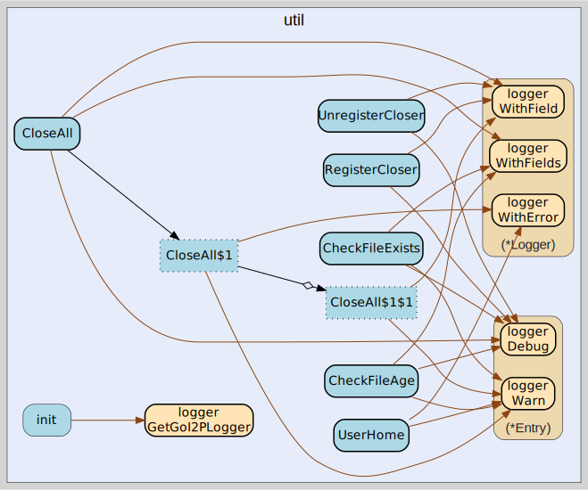

# util
--
    import "github.com/go-i2p/go-i2p/lib/util"



Package util provides general-purpose utility functions for the go-i2p router,
including file system checks and path helpers.

## Usage

#### func  CheckFileAge

```go
func CheckFileAge(fpath string, maxAge int) bool
```
CheckFileAge checks if a file is older than maxAge minutes. Returns false if the
file does not exist, on stat error, or if maxAge is negative. Returns true if
file exists and its modification time is older than maxAge minutes.

#### func  CheckFileExists

```go
func CheckFileExists(fpath string) bool
```
Check if a file exists and is readable etc returns false if not

#### func  CloseAll

```go
func CloseAll()
```
CloseAll closes all registered io.Closer instances in reverse (LIFO) order and
clears the list. LIFO ordering ensures resources are released in the opposite
order of their registration, which is important when later resources depend on
earlier ones. Each closer is protected by recover() to prevent one panicking
closer from aborting the remaining closers. This function is thread-safe.

#### func  Panicf

```go
func Panicf(format string, args ...interface{})
```
Panicf allows passing formated string to panic()

#### func  RegisterCloser

```go
func RegisterCloser(c io.Closer)
```
RegisterCloser registers an io.Closer to be closed during shutdown. Nil closers
are silently ignored to prevent panics in CloseAll. This function is
thread-safe.

#### func  UnregisterCloser

```go
func UnregisterCloser(c io.Closer)
```
UnregisterCloser removes a previously registered io.Closer, preventing
double-close when a resource is explicitly closed before shutdown. Uses
interface pointer equality for matching. Nil closers are silently ignored. This
function is thread-safe.

#### func  UserHome

```go
func UserHome() string
```
UserHome returns the current user's home directory. Falls back to $HOME
environment variable if os.UserHomeDir fails. As a last resort, uses the current
working directory rather than panicking, which allows operation in containerized
environments where $HOME may not be set.


util 

github.com/go-i2p/go-i2p/lib/util

[go-i2p template file](/template.md)
