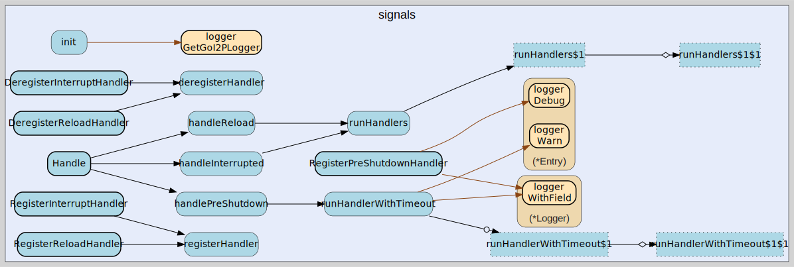

# signals
--
    import "github.com/go-i2p/go-i2p/lib/util/signals"



Package signals provides graceful shutdown handling for the go-i2p router,
responding to OS signals (SIGTERM, SIGINT) with ordered cleanup.

## Usage

#### func  DeregisterInterruptHandler

```go
func DeregisterInterruptHandler(id HandlerID)
```
DeregisterInterruptHandler removes a previously registered interrupt handler by
ID.

#### func  DeregisterPreShutdownHandler

```go
func DeregisterPreShutdownHandler(id HandlerID)
```
DeregisterPreShutdownHandler removes a previously registered pre-shutdown
handler by ID.

#### func  DeregisterReloadHandler

```go
func DeregisterReloadHandler(id HandlerID)
```
DeregisterReloadHandler removes a previously registered reload handler by ID.

#### func  Handle

```go
func Handle()
```

#### func  SetGracefulTimeout

```go
func SetGracefulTimeout(timeout time.Duration)
```
SetGracefulTimeout configures the maximum time to wait for pre-shutdown handlers
to complete. If zero or negative, defaults to 30 seconds.

#### func  StopHandle

```go
func StopHandle()
```
StopHandle closes the signal channel, causing Handle() to return. It first calls
signal.Stop to prevent signal delivery to the closed channel. Safe to call
multiple times; only the first call takes effect.

#### type Handler

```go
type Handler func()
```

Handler is a function called when a signal is received.

#### type HandlerID

```go
type HandlerID int
```

HandlerID is a unique identifier returned by registration functions, used to
deregister individual handlers.

#### func  RegisterInterruptHandler

```go
func RegisterInterruptHandler(f Handler) HandlerID
```
RegisterInterruptHandler registers a handler called on SIGINT/SIGTERM
(shutdown). Returns a HandlerID that can be passed to
DeregisterInterruptHandler. Nil handlers are silently ignored and return -1.

#### func  RegisterPreShutdownHandler

```go
func RegisterPreShutdownHandler(f Handler) HandlerID
```
RegisterPreShutdownHandler registers a handler that runs BEFORE the interrupt
handlers during graceful shutdown. This is the appropriate place to register
network announcement callbacks, such as sending a DatabaseStore message with
zero addresses to inform peers that this router is going offline.

Pre-shutdown handlers run in registration order (FIFO). Each handler is given an
individual timeout (total timeout / handler count) so that a single stuck
handler cannot block the entire shutdown chain.

Per the I2P specification (common-structures RouterInfo notes), a router MUST
send a DatabaseStore with zero addresses before disconnecting.

Returns a HandlerID that can be passed to DeregisterPreShutdownHandler. Nil
handlers are silently ignored and return -1.

#### func  RegisterReloadHandler

```go
func RegisterReloadHandler(f Handler) HandlerID
```
RegisterReloadHandler registers a handler called on SIGHUP (config reload).
Returns a HandlerID that can be passed to DeregisterReloadHandler. Nil handlers
are silently ignored and return -1.


signals 

github.com/go-i2p/go-i2p/lib/util/signals

[go-i2p template file](/template.md)
