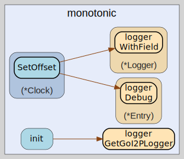

# monotonic
--
    import "github.com/go-i2p/go-i2p/lib/util/time/monotonic"



Package monotonic provides NTP-jump-safe time utilities for I2P router
operations.

Go's time.Now() includes a monotonic clock reading that is immune to wall clock
adjustments (NTP corrections, manual time changes). The time.Since() and
time.Until() functions use this monotonic reading when available. However, this
only works when both times were captured within the same process lifetime using
time.Now().

Timestamps loaded from disk or received over the network do NOT have monotonic
readings, so comparing them with time.Now() falls back to wall clock comparison,
which can produce incorrect results if the system clock jumps.

This package provides a Deadline type that captures the creation time via
time.Now() and checks expiration using time.Since(), ensuring monotonic safety.
It also provides a Clock interface for consistent monotonic time access
throughout the router.

Usage for tunnel expiration:

    deadline := monotonic.NewDeadline(10 * time.Minute)
    // ... later ...
    if deadline.IsExpired() {
        // Tunnel has expired, safe from NTP jumps
    }

Usage for lease expiration:

    deadline := monotonic.NewDeadline(leaseSet.GetExpiration())
    if remaining := deadline.Remaining(); remaining < rebuildThreshold {
        // Time to rebuild
    }

## Usage

#### func  IsExpiredAt

```go
func IsExpiredAt(startTime time.Time, lifetime time.Duration) bool
```
IsExpiredAt checks if a deadline created at startTime with the given lifetime
has expired. This is a stateless alternative to the Deadline type, useful when
the start time and lifetime are stored separately (e.g., in a database).

The startTime MUST have been captured via time.Now() within the same process
lifetime for the monotonic clock guarantee to hold. For timestamps loaded from
disk or network, use wall clock comparison instead.

#### func  TimeSinceCreation

```go
func TimeSinceCreation(created time.Time) time.Duration
```
TimeSinceCreation is a standalone helper that computes the elapsed duration from
a time.Time captured via time.Now(). It is equivalent to time.Since(t) and
exists to document the intent: using the monotonic clock for the calculation.

#### type Clock

```go
type Clock struct {
}
```

Clock provides monotonic-safe time operations for the I2P router. It uses
time.Now() internally, which includes a monotonic clock reading in Go, ensuring
that duration calculations are immune to wall clock jumps.

#### func  NewClock

```go
func NewClock() *Clock
```
NewClock creates a new monotonic Clock with zero offset.

#### func (*Clock) Now

```go
func (c *Clock) Now() time.Time
```
Now returns the current time adjusted by any NTP offset. The returned time.Time
retains Go's monotonic clock reading, so time.Since(clock.Now()) will use the
monotonic clock for the duration calculation.

#### func (*Clock) Offset

```go
func (c *Clock) Offset() time.Duration
```
Offset returns the current NTP time offset.

#### func (*Clock) SetOffset

```go
func (c *Clock) SetOffset(offset time.Duration)
```
SetOffset updates the NTP time offset. This is called when the SNTP subsystem
determines a new clock correction.

#### type Deadline

```go
type Deadline struct {
}
```

Deadline represents a point in time after which something has expired. It
captures the creation time using time.Now() (which includes a monotonic reading)
and checks expiration using time.Since(), ensuring that NTP clock jumps cannot
cause premature or delayed expiration.

Deadline is safe for concurrent use by multiple goroutines.

This is the recommended way to track tunnel lifetime, lease expiration, and any
other time-bounded operation in the I2P router.

#### func  NewDeadline

```go
func NewDeadline(lifetime time.Duration) *Deadline
```
NewDeadline creates a Deadline that expires after the given lifetime. The
creation time is captured immediately using time.Now(), which includes a
monotonic clock reading.

Panics if lifetime is negative.

#### func  NewDeadlineAt

```go
func NewDeadlineAt(startTime time.Time, lifetime time.Duration) *Deadline
```
NewDeadlineAt creates a Deadline that expires after the given lifetime, starting
from a specific time. The startTime should be a value obtained from time.Now()
to preserve the monotonic clock reading.

This is useful when the creation time was captured earlier (e.g., when a tunnel
build request was sent, not when the response arrived).

Panics if lifetime is negative.

#### func (*Deadline) CreatedAt

```go
func (d *Deadline) CreatedAt() time.Time
```
CreatedAt returns the wall clock time when this deadline was created. Note: for
duration calculations, always use Elapsed() or Remaining() instead of computing
time.Since(d.CreatedAt()), as the returned time may have its monotonic reading
stripped in some contexts.

#### func (*Deadline) Elapsed

```go
func (d *Deadline) Elapsed() time.Duration
```
Elapsed returns how much time has passed since the deadline was created. Uses
time.Since() for monotonic safety.

#### func (*Deadline) Extend

```go
func (d *Deadline) Extend(additional time.Duration)
```
Extend adds additional time to the deadline's lifetime. This is useful for lease
renewal or tunnel lifetime extension. The extension must be non-negative. This
method is safe for concurrent use.

#### func (*Deadline) IsExpired

```go
func (d *Deadline) IsExpired() bool
```
IsExpired returns true if the deadline has passed. It uses time.Since() which
relies on the monotonic clock reading, making it safe from NTP jumps.

#### func (*Deadline) Lifetime

```go
func (d *Deadline) Lifetime() time.Duration
```
Lifetime returns the total lifetime configured for this deadline.

#### func (*Deadline) Remaining

```go
func (d *Deadline) Remaining() time.Duration
```
Remaining returns the time remaining until the deadline expires. Returns zero if
already expired. Uses time.Since() for monotonic safety.


monotonic 

github.com/go-i2p/go-i2p/lib/util/time/monotonic

[go-i2p template file](/template.md)
