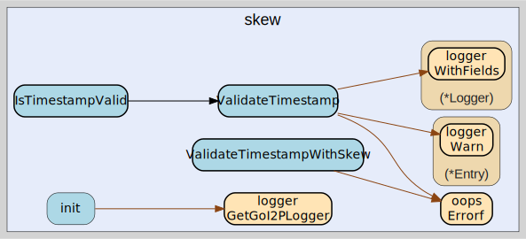

# skew
--
    import "github.com/go-i2p/go-i2p/lib/util/time/skew"



Package skew provides clock skew validation utilities for I2P router operations.

Per the I2P specification (common-structures RouterInfo notes), routers MUST
reject RouterInfo with a published timestamp more than 60 minutes in the future
or past relative to the router's NTP-synchronized clock. This package provides
centralized timestamp validation functions to enforce this requirement
consistently.

Usage:

    if err := skew.ValidateTimestamp(routerInfo.Published().Time()); err != nil {
        // Reject the RouterInfo
    }

## Usage

```go
const MaxClockSkew = 60 * time.Minute
```
MaxClockSkew is the maximum acceptable difference between a RouterInfo's
published timestamp and the current time. Per the I2P specification
(common-structures RouterInfo notes), routers MUST reject RouterInfo with a
published timestamp more than 60 minutes in the future or past.

#### func  IsTimestampValid

```go
func IsTimestampValid(published time.Time) bool
```
IsTimestampValid is a convenience wrapper around ValidateTimestamp that returns
a boolean instead of an error. It returns true if the timestamp is within the
acceptable clock skew window.

#### func  ValidateTimestamp

```go
func ValidateTimestamp(published time.Time) error
```
ValidateTimestamp checks whether the given timestamp is within the acceptable
clock skew window (±MaxClockSkew from the current time). It returns nil if the
timestamp is valid, or a descriptive error if it falls outside the window.

A zero-value time.Time is always rejected as invalid.

This implements the I2P spec requirement: "Router MUST reject RouterInfo with
published timestamp >60 minutes in the future or past."

#### func  ValidateTimestampWithSkew

```go
func ValidateTimestampWithSkew(published time.Time, maxSkew time.Duration) error
```
ValidateTimestampWithSkew checks whether the given timestamp is within a custom
clock skew window. This is useful for subsystems that need different tolerances
(e.g., NTCP2 handshake uses ±2 minutes).

A zero-value time.Time is always rejected. A non-positive maxSkew is rejected
with an error.


skew 

github.com/go-i2p/go-i2p/lib/util/time/skew

[go-i2p template file](/template.md)
