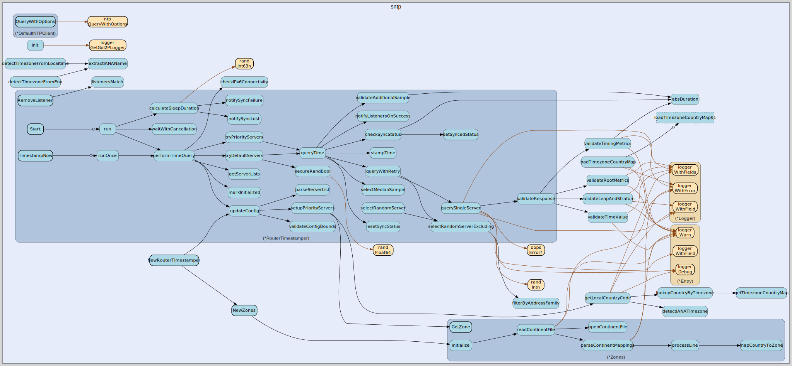

# sntp
--
    import "github.com/go-i2p/go-i2p/lib/util/time/sntp"



Package sntp provides Simple Network Time Protocol (SNTP) time synchronization
for the go-i2p router, used to maintain accurate clock for I2P protocol
operations.

## Usage

#### type DefaultNTPClient

```go
type DefaultNTPClient struct{}
```

DefaultNTPClient is the default NTPClient implementation that delegates to the
beevik/ntp library.

#### func (*DefaultNTPClient) QueryWithOptions

```go
func (c *DefaultNTPClient) QueryWithOptions(host string, options ntp.QueryOptions) (*ntp.Response, error)
```
QueryWithOptions queries the specified NTP host with the given options and
returns the response.

#### type ExtendedUpdateListener

```go
type ExtendedUpdateListener interface {
	UpdateListener
	// OnInitialized is called when the SNTP subsystem completes its first sync.
	OnInitialized()
	// OnSyncFailure is called when an NTP query cycle fails.
	OnSyncFailure(consecutiveFails int)
	// OnSyncLost is called when consecutive failures exceed the threshold.
	OnSyncLost()
}
```

ExtendedUpdateListener is an optional interface that listeners may implement to
receive additional notifications about NTP synchronization state changes.
Implementations are checked via type assertion; existing UpdateListener
implementations continue to work without modification.

#### type ListenerIdentifier

```go
type ListenerIdentifier interface {
	ListenerID() string
}
```

ListenerIdentifier is an optional interface that listeners may implement to
provide a stable identity for removal via RemoveListener. When implemented,
RemoveListener compares ListenerID() values instead of using pointer equality.

#### type NTPClient

```go
type NTPClient interface {
	QueryWithOptions(host string, options ntp.QueryOptions) (*ntp.Response, error)
}
```

NTPClient is the interface for querying NTP servers for time synchronization.

#### type RouterTimestamper

```go
type RouterTimestamper struct {
}
```

RouterTimestamper periodically queries NTP servers to determine the clock offset
between the local system time and network time, notifying registered listeners
of updates.

#### func  NewRouterTimestamper

```go
func NewRouterTimestamper(client NTPClient) *RouterTimestamper
```
NewRouterTimestamper creates a new RouterTimestamper using the provided
NTPClient for time queries.

#### func (*RouterTimestamper) AddListener

```go
func (rt *RouterTimestamper) AddListener(listener UpdateListener)
```
AddListener registers an UpdateListener to be notified of time offset changes.

#### func (*RouterTimestamper) GetCurrentTime

```go
func (rt *RouterTimestamper) GetCurrentTime() time.Time
```
GetCurrentTime returns the current time adjusted by the stored NTP offset. This
is a non-blocking operation that uses the most recent time offset from
background NTP synchronization. It does not trigger new NTP queries.

#### func (*RouterTimestamper) GetPriorityServers

```go
func (rt *RouterTimestamper) GetPriorityServers() [][]string
```
GetPriorityServers returns a copy of the current priority server lists safely

#### func (*RouterTimestamper) GetServers

```go
func (rt *RouterTimestamper) GetServers() []string
```
GetServers returns a copy of the current server list safely

#### func (*RouterTimestamper) RemoveListener

```go
func (rt *RouterTimestamper) RemoveListener(listener UpdateListener)
```
RemoveListener unregisters a previously added UpdateListener so it no longer
receives updates.

#### func (*RouterTimestamper) Start

```go
func (rt *RouterTimestamper) Start()
```
Start begins the periodic NTP querying process in a background goroutine.

#### func (*RouterTimestamper) Stop

```go
func (rt *RouterTimestamper) Stop()
```
Stop signals the background NTP query goroutine to stop and waits for it to
finish.

#### func (*RouterTimestamper) TimestampNow

```go
func (rt *RouterTimestamper) TimestampNow()
```
TimestampNow triggers an immediate NTP query if the timestamper is initialized
and running.

#### func (*RouterTimestamper) WaitForInitialization

```go
func (rt *RouterTimestamper) WaitForInitialization()
```
WaitForInitialization blocks until the first successful NTP query completes or a
timeout is reached.

#### type UpdateListener

```go
type UpdateListener interface {
	SetNow(now time.Time, stratum uint8)
}
```

UpdateListener is an interface that listeners must implement to receive time
updates.

#### type Zones

```go
type Zones struct {
}
```

Zones maps country and continent codes to their corresponding NTP pool zone
names.

#### func  NewZones

```go
func NewZones() *Zones
```
NewZones creates a new Zones instance populated with continent-to-zone and
country-to-zone mappings.

#### func (*Zones) GetZone

```go
func (z *Zones) GetZone(countryCode string) string
```
GetZone returns the NTP pool zone name for the given country code, or an empty
string if not found.


sntp 

github.com/go-i2p/go-i2p/lib/util/time/sntp

[go-i2p template file](template.md)
